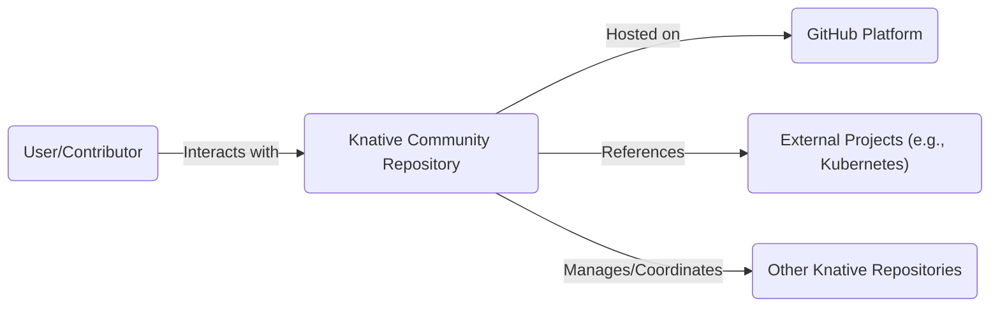
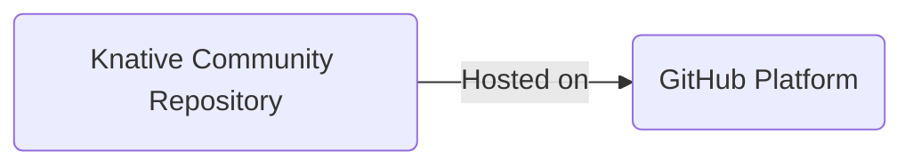
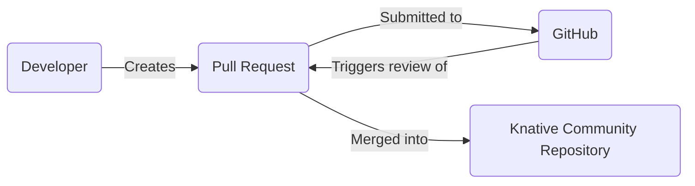

Okay, let's create a design document for the Knative Community repository.

# BUSINESS POSTURE

Knative is an open-source project, and the community repository serves as a central hub for collaboration, governance, and information sharing. The primary business goals are:

*   Foster a healthy and active open-source community.
*   Facilitate collaboration and contribution to the Knative project.
*   Ensure clear governance and decision-making processes.
*   Provide accessible and up-to-date information about Knative.
*   Promote the adoption and growth of Knative.

The most important business risks that need to be addressed are:

*   Lack of community engagement and contribution.
*   Unclear or inconsistent governance processes.
*   Outdated or inaccurate information about Knative.
*   Negative community interactions or conflicts.
*   Security vulnerabilities in community infrastructure or processes.
*   Reputational damage due to mismanagement or security incidents.

# SECURITY POSTURE

The Knative community repository, being hosted on GitHub, inherits many security controls from the GitHub platform itself.  The development lifecycle is largely managed through GitHub's features (pull requests, issues, etc.).

Existing security controls:

*   security control: GitHub platform security: GitHub provides a secure platform with features like two-factor authentication, access controls, audit logs, and vulnerability scanning. Implemented by GitHub.
*   security control: Code review process: All changes to the repository must go through a pull request review process, ensuring that multiple contributors examine the code before it is merged. Implemented through GitHub pull requests.
*   security control: Contributor License Agreement (CLA): Contributors must sign a CLA, ensuring that they have the right to contribute their code and that the project has the right to use it. Implemented through a CLA bot or similar mechanism.
*   security control: Code of Conduct: The community has a Code of Conduct to promote a positive and inclusive environment. Implemented through a `CODE_OF_CONDUCT.md` file in the repository.
*   security control: Static analysis: Some Knative repositories use static analysis tools to identify potential security vulnerabilities. Implemented through GitHub Actions or other CI/CD pipelines in related Knative project repositories, not directly in the community repo.
*   security control: Dependency management: Dependencies are managed using tools like Go modules, which help ensure that the project uses known and secure versions of libraries. Implemented in related Knative project repositories, not directly in the community repo.

Accepted risks:

*   accepted risk: Reliance on GitHub's security: The community repository is heavily reliant on GitHub's security posture. Any vulnerabilities or outages in GitHub could impact the repository.
*   accepted risk: Limited control over contributor actions: While the code review process mitigates some risks, the project has limited control over the actions of individual contributors outside of the repository.
*   accepted risk: Potential for human error: The governance and documentation processes rely on human contributors, and there is always a potential for errors or omissions.

Recommended security controls:

*   security control: Implement regular security audits of the repository and its associated infrastructure.
*   security control: Establish a clear security vulnerability reporting process.
*   security control: Consider implementing more automated security checks, such as static analysis, directly within the community repository's CI/CD pipeline (if applicable).
*   security control: Regularly review and update the Code of Conduct and other community guidelines.

Security Requirements:

*   Authentication: Not directly applicable to the community repository itself, as it primarily hosts documentation and governance information. Authentication is handled by GitHub for contributions.
*   Authorization: GitHub's access control mechanisms are used to manage permissions for contributors and maintainers. Different roles (e.g., member, maintainer) have different levels of access.
*   Input Validation: Not directly applicable to the community repository, as it does not process user input in the traditional sense. However, the content of documents and proposals should be reviewed for accuracy and clarity.
*   Cryptography: Not directly applicable to the community repository itself. Cryptography is relevant to the Knative project's code and deployment, but not to the community repository's content.

# DESIGN

The Knative community repository is a central hub for information, collaboration, and governance. It is structured to provide easy access to documentation, working group information, proposals, and community resources.

## C4 CONTEXT

Element Descriptions:

*   Element:
    *   Name: User/Contributor
    *   Type: Person
    *   Description: Individuals interacting with the Knative community, including users, contributors, and maintainers.
    *   Responsibilities: Accessing information, contributing code, participating in discussions, proposing changes.
    *   Security controls: GitHub authentication, two-factor authentication (optional but recommended).

*   Element:
    *   Name: Knative Community Repository
    *   Type: Software System
    *   Description: The central repository for Knative community information, governance, and collaboration.
    *   Responsibilities: Hosting documentation, managing proposals, facilitating communication, coordinating working groups.
    *   Security controls: GitHub platform security, code review process, CLA, Code of Conduct.

*   Element:
    *   Name: GitHub Platform
    *   Type: External System
    *   Description: The platform hosting the Knative Community repository.
    *   Responsibilities: Providing version control, issue tracking, pull request management, and other collaboration tools.
    *   Security controls: GitHub's built-in security features (authentication, access control, vulnerability scanning, etc.).

*   Element:
    *   Name: External Projects (e.g., Kubernetes)
    *   Type: External System
    *   Description: Projects that Knative interacts with or depends on.
    *   Responsibilities: Providing underlying infrastructure or functionality.
    *   Security controls: Managed by the respective projects.

*   Element:
    *   Name: Other Knative Repositories
    *   Type: Software System
    *   Description: Other repositories within the Knative organization, containing code, documentation, and other resources.
    *   Responsibilities: Developing and maintaining specific components of Knative.
    *   Security controls: GitHub platform security, code review process, CLA, Code of Conduct, static analysis, dependency management.

## C4 CONTAINER

Since the Knative Community repository is primarily a collection of documents and doesn't have distinct "containers" in the traditional software sense, the Container diagram is essentially the same as the Context diagram. It doesn't deploy any runnable code.

Element Descriptions:

The element descriptions are identical to those in the C4 Context diagram, as the repository itself acts as a single "container" of information.

## DEPLOYMENT

The Knative Community repository is deployed directly on GitHub. There isn't a separate deployment process in the traditional sense. Updates are made through Git commits and pull requests, which are automatically reflected on the GitHub website.

Possible deployment solutions:

1.  GitHub Pages (for rendering Markdown files as a website).
2.  Directly on GitHub (as a repository).

Chosen solution: Directly on GitHub.

Element Descriptions:

*   Element:
    *   Name: GitHub Platform
    *   Type: Infrastructure Node
    *   Description: The platform hosting the Knative Community repository.
    *   Responsibilities: Providing infrastructure for hosting the repository and serving its content.
    *   Security controls: GitHub's built-in security features.

*   Element:
    *   Name: Knative Community Repository
    *   Type: Software System
    *   Description: The repository itself, deployed on GitHub.
    *   Responsibilities: Storing and serving community-related content.
    *   Security controls: GitHub platform security, code review process, CLA, Code of Conduct.

## BUILD

The Knative Community repository doesn't have a traditional build process, as it primarily contains documentation and Markdown files. However, some aspects of the repository, such as generated documentation or website content, might involve automated steps.

Simplified build process:

1.  Developer makes changes to Markdown files or other content.
2.  Developer creates a pull request on GitHub.
3.  Reviewers review the changes.
4.  Upon approval, the pull request is merged.
5.  GitHub automatically updates the repository content.
6.  (Optional) If GitHub Pages is used, the website is automatically rebuilt.

Security controls in the build process:

*   security control: Code review: All changes go through a pull request review process.
*   security control: GitHub Actions (potentially): Could be used for automated checks, such as linting Markdown files or validating links.

# RISK ASSESSMENT

*   Critical business processes we are trying to protect:
    *   Community collaboration and contribution.
    *   Knative project governance and decision-making.
    *   Dissemination of accurate and up-to-date information about Knative.

*   Data we are trying to protect and their sensitivity:
    *   Community governance documents (e.g., proposals, working group charters): Medium sensitivity.
    *   Code of Conduct: Medium sensitivity.
    *   Contributor information (names, affiliations): Low sensitivity (publicly available on GitHub).
    *   Meeting minutes and notes: Low to medium sensitivity.
    *   Project documentation: Low sensitivity (publicly available).

# QUESTIONS & ASSUMPTIONS

*   Questions:
    *   Are there any specific compliance requirements (e.g., GDPR) that apply to the community repository?
    *   What is the process for handling security vulnerabilities reported in the community repository or its associated infrastructure?
    *   Are there any plans to use GitHub Actions or other automation tools for tasks within the community repository?

*   Assumptions:
    *   The GitHub platform provides adequate security for hosting the community repository.
    *   The code review process is effective in preventing malicious or accidental introduction of vulnerabilities.
    *   Contributors are aware of and adhere to the Code of Conduct.
    *   The community repository is primarily used for documentation and governance, not for running code or processing sensitive data.
    *   The Knative project has separate security measures in place for its code repositories and deployments.