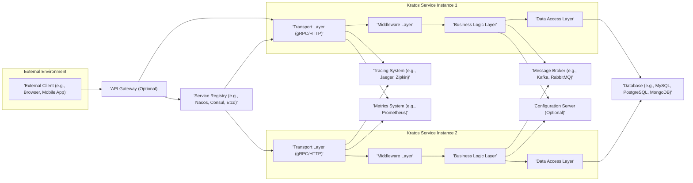
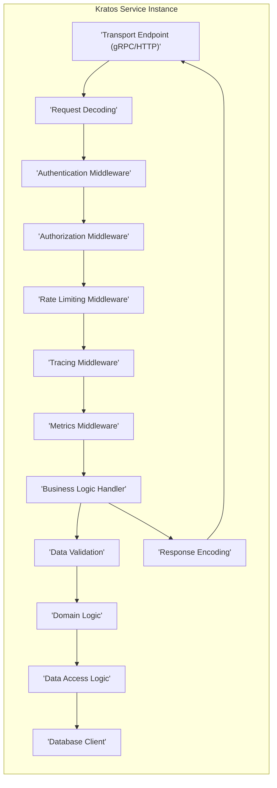

# Project Design Document: Go-Kratos Microservices Framework

**Version:** 1.1
**Date:** October 26, 2023
**Author:** AI Software Architect

## 1. Introduction

This document provides an enhanced architectural design of the Go-Kratos microservices framework, specifically tailored for threat modeling. It offers a detailed understanding of the framework's components, their interactions, and the overall system architecture, with a strong emphasis on security aspects. This document will serve as the foundation for identifying potential threats and vulnerabilities within systems built using Kratos.

## 2. Goals and Objectives

*   Clearly and comprehensively define the architecture of the Go-Kratos framework.
*   Identify key components and their responsibilities, highlighting security-relevant functions.
*   Illustrate the data flow within the framework, pinpointing potential points of vulnerability.
*   Explicitly highlight important security considerations and potential threats within the framework's design.
*   Provide a robust and detailed basis for identifying potential threats, vulnerabilities, and attack vectors.

## 3. System Architecture

The Go-Kratos framework is designed with a layered architecture, promoting separation of concerns and modularity. Its core principles emphasize convention over configuration and provide a rich set of tools and libraries for building resilient and secure microservices.

### 3.1. High-Level Architecture

### 3.2. Detailed Architecture of a Kratos Service Instance

## 4. Key Components

This section details the major components within the Go-Kratos framework, with a focus on their security implications.

*   **Transport Layer:**
    *   Handles communication protocols (gRPC, HTTP), acting as the entry point for requests.
    *   Security considerations: Vulnerable to attacks targeting the specific protocol (e.g., HTTP request smuggling, gRPC reflection attacks if not properly configured). Requires secure configuration (TLS).
*   **Middleware Layer:**
    *   A chain of interceptors for requests and responses, handling cross-cutting concerns.
    *   Security considerations:  The order of middleware is crucial. Improperly configured or vulnerable middleware can introduce security flaws (e.g., bypassing authentication).
        *   **Authentication Middleware:** Verifies user identity. Potential vulnerabilities include weak authentication schemes, insecure storage of credentials, and bypass vulnerabilities.
        *   **Authorization Middleware:** Enforces access control. Risks include overly permissive rules, insecure policy enforcement, and privilege escalation vulnerabilities.
        *   **Rate Limiting Middleware:** Protects against DoS attacks. Bypass vulnerabilities or insufficient rate limits can leave services vulnerable.
        *   **Tracing Middleware:** Adds tracing information. Care must be taken to avoid logging sensitive data.
        *   **Metrics Middleware:** Collects performance data. Ensure metrics endpoints are secured to prevent information disclosure.
*   **Business Logic Layer:**
    *   Contains the core application logic, processing requests and manipulating data.
    *   Security considerations:  Vulnerable to business logic flaws, such as insecure workflows or insufficient validation, leading to data manipulation or unauthorized actions.
*   **Data Access Layer:**
    *   Manages interactions with data sources.
    *   Security considerations:  Susceptible to injection attacks (SQL, NoSQL), insecure data handling, and exposure of sensitive information if not properly implemented.
*   **Service Registry:**
    *   Centralized repository for service discovery.
    *   Security considerations:  If compromised, attackers could redirect traffic to malicious services or disrupt communication. Requires access control and secure communication.
*   **API Gateway (Optional):**
    *   Single entry point for external clients.
    *   Security considerations:  A critical security component. Vulnerabilities here can expose the entire system. Requires robust authentication, authorization, and input validation.
*   **Message Broker (Optional):**
    *   Enables asynchronous communication.
    *   Security considerations:  Messages in transit and at rest need to be secured. Access control to topics/queues is essential.
*   **Configuration Server (Optional):**
    *   Centralized configuration management.
    *   Security considerations:  Sensitive configuration data (e.g., database credentials, API keys) must be encrypted and access strictly controlled.
*   **Tracing System (Optional):**
    *   Tracks requests across services.
    *   Security considerations:  Ensure sensitive data is not included in traces. Access to trace data should be controlled.
*   **Metrics System (Optional):**
    *   Collects and aggregates performance metrics.
    *   Security considerations:  Metrics endpoints should be secured to prevent information disclosure about system performance or internal workings.

## 5. Data Flow

Understanding the data flow is crucial for identifying potential attack vectors. A typical request flow within a Kratos service instance involves the following steps, with associated security considerations:

1. **Request Reception:** The Transport Layer receives an incoming request.
    *   Security Consideration:  Potential for network-level attacks, protocol vulnerabilities.
2. **Request Decoding:** The request is deserialized and parsed.
    *   Security Consideration:  Vulnerable to deserialization attacks if not handled carefully.
3. **Middleware Execution:** The request passes through the middleware chain.
    *   Security Consideration:  Each middleware component is a potential point of failure or vulnerability. Improperly configured middleware can be bypassed.
        *   **Authentication:** Identity verification. Failure can lead to unauthorized access.
        *   **Authorization:** Access control enforcement. Failure can lead to privilege escalation.
        *   **Rate Limiting:** Protection against abuse. Insufficient limits can lead to DoS.
4. **Business Logic Handling:** The request is processed by the appropriate handler.
    *   Security Consideration:  Business logic flaws can lead to data manipulation, unauthorized actions, or information disclosure.
5. **Data Validation:** Input data is validated.
    *   Security Consideration:  Insufficient validation can lead to injection attacks and other data integrity issues.
6. **Domain Logic Execution:** Core application logic is executed.
    *   Security Consideration:  Vulnerabilities in domain logic can have significant security implications.
7. **Data Access:** Interaction with data sources.
    *   Security Consideration:  Potential for injection attacks, data breaches if access is not properly controlled.
8. **Response Encoding:** The response is serialized and formatted.
    *   Security Consideration:  Ensure sensitive data is not inadvertently included in the response.
9. **Response Transmission:** The response is sent back to the client.
    *   Security Consideration:  Ensure secure transmission (TLS) to prevent eavesdropping or tampering.

For inter-service communication:

1. A service discovers the target service via the Service Registry.
    *   Security Consideration:  Compromised registry can lead to misdirection of traffic.
2. The source service makes a request to the target service (typically gRPC or HTTP).
    *   Security Consideration:  Inter-service communication should be secured with mTLS to ensure authenticity and confidentiality.
3. The request follows the same flow as described above within the target service.

## 6. Security Considerations and Potential Threats

This section expands on the security considerations, explicitly outlining potential threats associated with each area. This is crucial for effective threat modeling.

*   **Authentication:**
    *   Considerations: Choice of authentication mechanism (e.g., JWT, OAuth 2.0), secure storage of secrets, token management, session management.
    *   Potential Threats: Brute-force attacks, credential stuffing, session hijacking, insecure token storage, replay attacks, vulnerabilities in authentication libraries.
*   **Authorization:**
    *   Considerations: Granularity of permissions, role-based access control (RBAC), attribute-based access control (ABAC), policy enforcement points.
    *   Potential Threats: Privilege escalation, unauthorized access to resources, insecure direct object references, broken access control implementations.
*   **Transport Security:**
    *   Considerations: Use of TLS/SSL, certificate management, cipher suite selection, enforcement of HTTPS.
    *   Potential Threats: Man-in-the-middle attacks, eavesdropping, data tampering, downgrade attacks, expired or improperly configured certificates.
*   **Input Validation:**
    *   Considerations: Validation of all input data (request parameters, headers, body), sanitization of data, use of appropriate validation libraries.
    *   Potential Threats: Injection attacks (SQL, NoSQL, command injection, cross-site scripting), buffer overflows, format string vulnerabilities.
*   **Rate Limiting:**
    *   Considerations: Defining appropriate rate limits, handling burst traffic, identifying malicious actors.
    *   Potential Threats: Denial-of-service (DoS) attacks, distributed denial-of-service (DDoS) attacks, resource exhaustion.
*   **Data Protection:**
    *   Considerations: Encryption at rest and in transit, data masking, access control to sensitive data.
    *   Potential Threats: Data breaches, unauthorized access to sensitive information, data leaks, compliance violations.
*   **Dependency Management:**
    *   Considerations: Regularly scanning dependencies for vulnerabilities, keeping dependencies up-to-date, using dependency management tools.
    *   Potential Threats: Exploitation of known vulnerabilities in third-party libraries, supply chain attacks.
*   **Logging and Monitoring:**
    *   Considerations: Comprehensive logging of security-relevant events, secure storage of logs, real-time monitoring and alerting.
    *   Potential Threats: Failure to detect security incidents, delayed incident response, exposure of sensitive information in logs.
*   **Service Discovery Security:**
    *   Considerations: Access control to the service registry, secure communication with the registry.
    *   Potential Threats: Service registration hijacking, redirection of traffic to malicious services, denial of service against the registry.
*   **API Gateway Security (if used):**
    *   Considerations: Authentication and authorization at the gateway, input validation, rate limiting, protection against common web attacks.
    *   Potential Threats: All the threats listed above, as the gateway is a primary entry point.
*   **Configuration Management Security:**
    *   Considerations: Secure storage of configuration data, access control to configuration management systems, encryption of sensitive configuration values.
    *   Potential Threats: Exposure of sensitive credentials (database passwords, API keys), unauthorized modification of application behavior.

## 7. Deployment Considerations

Security considerations extend to the deployment environment.

*   **Containerization:**
    *   Security Considerations: Secure base images, vulnerability scanning of container images, proper container configuration.
    *   Potential Threats: Vulnerabilities in base images, container escape attacks, misconfigured containers.
*   **Orchestration (Kubernetes):**
    *   Security Considerations: Role-based access control (RBAC), network policies, pod security policies/admission controllers, secrets management.
    *   Potential Threats: Unauthorized access to Kubernetes API, container breaches, network segmentation issues.
*   **Service Mesh (Optional):**
    *   Security Considerations: Mutual TLS (mTLS), secure service-to-service communication, fine-grained access control.
    *   Potential Threats: Misconfigured mTLS, vulnerabilities in the service mesh implementation.

## 8. Future Considerations

*   **Enhanced Security Auditing:** Implement regular security audits and penetration testing.
*   **Security by Design Principles:** Emphasize security considerations throughout the development lifecycle.
*   **Integration with Security Tools:** Integrate with static and dynamic application security testing (SAST/DAST) tools.
*   **Threat Modeling as a Continuous Process:** Regularly update the threat model as the system evolves.

This enhanced design document provides a more detailed and security-focused view of the Go-Kratos framework, making it a more effective tool for threat modeling and security analysis. By explicitly outlining potential threats, it enables security professionals to proactively identify and mitigate risks in systems built using Kratos.
