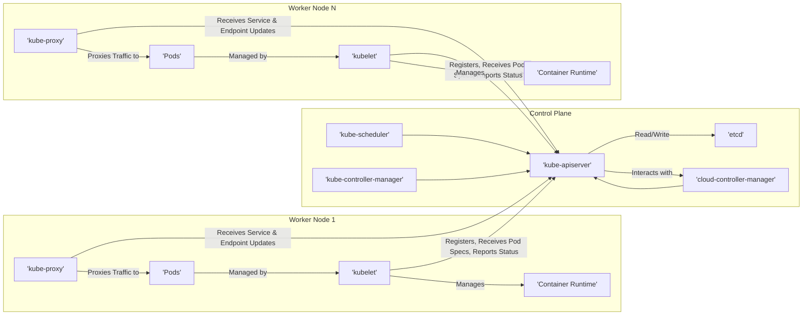

## Project Design Document: Kubernetes

**Project Repository:** https://github.com/kubernetes/kubernetes

**Version:** 1.1

**Date:** 2023-10-27

**Author:** AI Architecture Expert

**1. Introduction**

This document provides a high-level architectural overview of the Kubernetes system. It is intended to serve as a foundation for subsequent threat modeling activities. The document outlines the key components, their interactions, and the overall system architecture.

**2. Goals**

*   Provide a clear and concise description of the Kubernetes architecture.
*   Identify the major components and their responsibilities.
*   Illustrate the interactions between key components.
*   Serve as a basis for identifying potential security threats and vulnerabilities.

**3. Target Audience**

*   Security engineers
*   Software architects
*   Developers
*   Operations engineers

**4. System Overview**

Kubernetes is an open-source container orchestration platform that automates the deployment, scaling, and management of containerized applications. It provides a framework to run distributed systems resiliently, with built-in features for service discovery, load balancing, and self-healing.

**5. Architectural Components**

The Kubernetes architecture can be broadly divided into the control plane and the worker nodes.

**5.1. Control Plane Components:**

*   **kube-apiserver:**
    *   The central component of the control plane.
    *   Exposes the Kubernetes API, serving as the front-end for all interactions.
    *   Handles authentication, authorization, and admission control of API requests.
    *   Persists cluster state in etcd.
*   **etcd:**
    *   A consistent and highly-available key-value store.
    *   Serves as Kubernetes' backing store for all cluster data.
    *   Critical for cluster operation and data durability.
*   **kube-scheduler:**
    *   Watches for newly created Pods with no assigned node.
    *   Selects an optimal node for each Pod to run on based on resource requirements, constraints, and policies.
*   **kube-controller-manager:**
    *   Runs core control loops that regulate the state of the system.
    *   Includes controllers like:
        *   Node Controller: Manages node lifecycle.
        *   Replication Controller/ReplicaSet/Deployment Controller: Maintains the desired number of Pod replicas.
        *   Endpoint Controller: Populates the Endpoints object (used for service discovery).
        *   Service Account & Token Controllers: Manages service accounts and their API tokens.
*   **cloud-controller-manager (Optional):**
    *   Allows Kubernetes to interface with cloud provider-specific infrastructure.
    *   Includes controllers like:
        *   Node Controller (for cloud-specific node initialization).
        *   Route Controller (for setting up network routes).
        *   Service Controller (for managing cloud load balancers).

**5.2. Worker Node Components:**

*   **kubelet:**
    *   An agent that runs on each worker node.
    *   Registers the node with the control plane.
    *   Receives Pod specifications from the kube-apiserver.
    *   Manages the lifecycle of containers on the node.
    *   Reports the status of the node and its containers back to the control plane.
*   **kube-proxy:**
    *   A network proxy that runs on each worker node.
    *   Implements the Kubernetes Service concept.
    *   Maintains network rules on the node to forward traffic to the correct Pods.
    *   Performs load balancing across the Pods backing a service.
*   **Container Runtime (e.g., Docker, containerd):**
    *   Responsible for running containers.
    *   Pulls container images from registries.
    *   Manages container lifecycle (create, start, stop, delete).

**6. System Architecture Diagram**

**7. Component Interactions**

*   **User Interaction:** Users interact with the cluster by sending requests to the `kube-apiserver` via `kubectl` or other API clients.
*   **Pod Scheduling:** When a user creates a Pod, the `kube-apiserver` persists the request in `etcd`. The `kube-scheduler` watches for unscheduled Pods and assigns them to appropriate worker nodes.
*   **Pod Execution:** The `kubelet` on the assigned worker node receives the Pod specification from the `kube-apiserver` and instructs the container runtime to pull the necessary images and start the containers.
*   **Service Discovery and Load Balancing:** When a Service is created, the `kube-proxy` on each node configures network rules to forward traffic to the backing Pods. The `kube-controller-manager` ensures that the Endpoints object for the Service is updated with the IP addresses of the healthy Pods.
*   **State Management:** The `kube-controller-manager` continuously monitors the desired state of the system (e.g., the desired number of replicas for a Deployment) and takes actions to reconcile the current state with the desired state.
*   **Cloud Provider Integration:** The `cloud-controller-manager` interacts with the underlying cloud provider to manage resources like load balancers, persistent volumes, and network configurations.

**8. Data Flow**

*   **API Requests:** User requests flow through the `kube-apiserver` for authentication, authorization, and admission control before being processed.
*   **Cluster State:** The `kube-apiserver` reads and writes cluster state information to `etcd`.
*   **Pod Specifications:** Pod specifications are communicated from the `kube-apiserver` to the `kubelet` on worker nodes.
*   **Node and Pod Status:** `kubelet` reports the status of nodes and Pods back to the `kube-apiserver`.
*   **Service Traffic:** Network traffic destined for a Service is intercepted by `kube-proxy` and forwarded to the appropriate Pods.

**9. Security Considerations (High-Level)**

*   **Authentication and Authorization:** Securely authenticating users and services and enforcing granular authorization policies are crucial.
*   **API Server Security:** Protecting the `kube-apiserver` from unauthorized access is paramount.
*   **etcd Security:** Securing access to `etcd` is critical as it stores the cluster's sensitive data.
*   **Network Security:** Implementing network policies to control traffic flow between Pods and external networks is essential.
*   **Node Security:** Securing the worker nodes and the kubelet agent is important to prevent container escapes and node compromise.
*   **Container Image Security:** Ensuring the integrity and security of container images is vital.
*   **Secrets Management:** Securely managing sensitive information like passwords and API keys is necessary.

**10. Future Considerations**

*   More detailed diagrams for specific subsystems (e.g., networking, storage).
*   Inclusion of external components and integrations.
*   Detailed description of security mechanisms and best practices.

This document provides a foundational understanding of the Kubernetes architecture for threat modeling purposes. Subsequent activities will delve deeper into specific components and their potential vulnerabilities.
