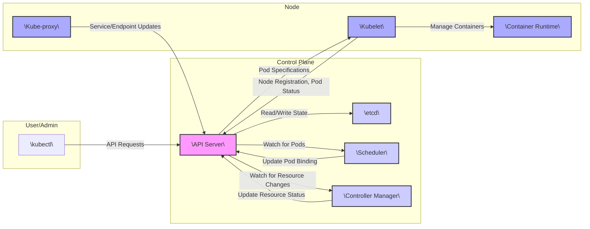
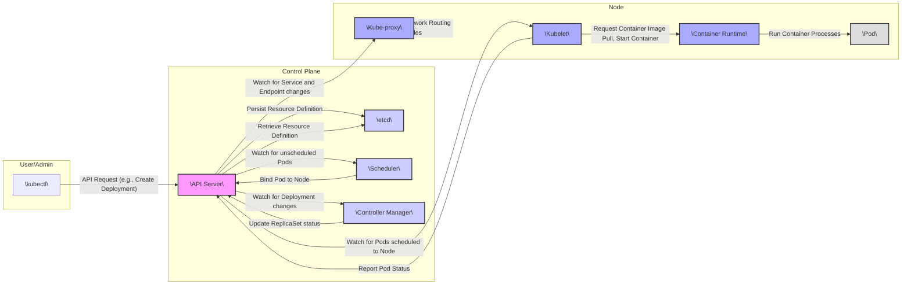

# Kubernetes Project Design Document for Threat Modeling

**Document Version:** 1.1
**Date:** October 26, 2023
**Author:** AI Software Architect
**Target Audience:** Security Engineers, Software Developers

## 1. Introduction

This document provides a detailed architectural overview of the Kubernetes project (as represented by the codebase at [https://github.com/kubernetes/kubernetes](https://github.com/kubernetes/kubernetes)). The primary purpose of this document is to serve as a foundational resource for subsequent threat modeling activities, enabling a comprehensive understanding of the system's security posture. It outlines the key components, their interactions, and the data flows within the system, focusing on identifying potential security boundaries and vulnerabilities. This document concentrates on the core control plane and essential node components relevant for understanding the attack surface.

## 2. Goals

* Provide a comprehensive architectural description of Kubernetes suitable for threat modeling.
* Identify key components and their responsibilities within the system.
* Illustrate the primary interactions and data flows between components, highlighting sensitive data paths.
* Establish a common understanding of the system architecture for security analysis and risk assessment.
* Facilitate the identification of potential vulnerabilities, attack vectors, and security boundaries.

## 3. Scope

This document covers the core components of the Kubernetes control plane and the essential node components that are fundamental for workload execution. Specifically, it includes:

* API Server (`kube-apiserver`)
* etcd
* Scheduler (`kube-scheduler`)
* Controller Manager (`kube-controller-manager`) including core controllers (e.g., Node Controller, Replication Controller, Endpoint Controller)
* Kubelet (`kubelet`)
* Kube-proxy (`kube-proxy`)
* Container Runtime Interface (CRI)

This document does not explicitly cover:

* Specific cloud provider integrations beyond general interaction patterns.
* Detailed configurations of external authentication and authorization providers (e.g., LDAP, OIDC), although their integration points with the API Server are noted.
* Advanced features like custom resource definitions (CRDs) beyond their basic interaction with the API Server for resource management.
* Specific implementations of network plugins (CNIs) beyond their role in providing network connectivity to Pods.
* Specific implementations of storage plugins (CSIs) beyond their role in providing persistent storage to Pods.
* The `kubeadm` or other cluster bootstrapping tools.
* Monitoring and logging subsystems in detail.

## 4. High-Level Architecture

## 5. Component Details

### 5.1 Control Plane Components

* **API Server (`kube-apiserver`):**
    * **Responsibility:** The central gateway and control plane component that exposes the Kubernetes API. It serves as the front-end for all RESTful interactions with the cluster. It handles authentication, authorization, admission control, and auditing of API requests. It exposes various API groups (e.g., `core/v1`, `apps/v1`, `networking.k8s.io/v1`).
    * **Interactions:**
        * Receives requests from `kubectl`, other control plane components, node components (Kubelet, Kube-proxy), and potentially external clients.
        * Authenticates clients using configured mechanisms (e.g., client certificates, bearer tokens, authentication webhooks).
        * Authorizes requests based on configured authorization modes (e.g., RBAC, ABAC, Webhook).
        * Enforces admission control policies (e.g., MutatingAdmissionWebhook, ValidatingAdmissionWebhook).
        * Persists and retrieves cluster state from `etcd`.
        * Publishes events and notifications about cluster state changes.
    * **Data Handled:**
        * Resource definitions (Pods, Services, Deployments, Secrets, ConfigMaps, etc.).
        * Cluster state information (node status, resource quotas, etc.).
        * Authentication credentials and authorization policies.
        * Audit logs of API interactions.

* **etcd:**
    * **Responsibility:** A distributed, consistent, and highly available key-value store that serves as Kubernetes' single source of truth for cluster state. It ensures data durability and consistency across the control plane. Access to etcd is critical and should be tightly controlled.
    * **Interactions:**
        * Receives write requests from the API Server to persist changes in cluster state.
        * Receives read requests from the API Server to retrieve the current cluster state.
        * Participates in leader election among etcd nodes to ensure a single writer.
        * Supports watchers that allow components to subscribe to changes in specific keys or prefixes.
    * **Data Handled:**
        * Serialized representations of all Kubernetes API objects.
        * Internal metadata related to cluster operation.

* **Scheduler (`kube-scheduler`):**
    * **Responsibility:**  Watches for newly created Pods that have no assigned node and selects an optimal node for them to run on. The scheduling process considers various factors like resource requirements, node availability, affinity and anti-affinity rules, taints and tolerations, and custom scheduling policies.
    * **Interactions:**
        * Connects to the API Server and watches for pending Pods (those with an empty `nodeName` field).
        * Queries the API Server for information about available nodes, including their resources, labels, and taints.
        * Applies scheduling algorithms and predicates to filter and score nodes.
        * Updates the Pod definition in the API Server with the selected `nodeName`.
    * **Data Handled:**
        * Pod specifications (resource requests, constraints).
        * Node specifications (capacity, allocatable resources, labels, taints).
        * Scheduling policies and configuration.

* **Controller Manager (`kube-controller-manager`):**
    * **Responsibility:**  Runs a suite of core control loops (controllers) that monitor the state of the cluster and work towards the desired state. Each controller is responsible for a specific aspect of the system (e.g., ensuring the desired number of Pods for a ReplicaSet are running, managing node lifecycle, handling service endpoints).
    * **Interactions:**
        * Connects to the API Server and watches for changes in resource states.
        * Takes actions to reconcile the current state with the desired state (e.g., creating, updating, or deleting resources).
        * Updates the status of managed resources in the API Server.
    * **Data Handled:**
        * Definitions of managed resources (Deployments, ReplicaSets, Services, Namespaces, etc.).
        * Current state and status of these resources.
        * Controller-specific configurations and parameters.
    * **Key Controllers:**
        * **Node Controller:** Manages the lifecycle of nodes, handling node registration, health checks, and marking nodes as unavailable.
        * **Replication Controller/ReplicaSet Controller:** Ensures the desired number of Pod replicas are running at all times.
        * **Endpoint Controller:** Populates the Endpoints object for Services, tracking the IP addresses of healthy Pods.
        * **Namespace Controller:** Manages the lifecycle of namespaces.
        * **Service Account Controller:** Manages service accounts and their tokens.

### 5.2 Node Components

* **Kubelet (`kubelet`):**
    * **Responsibility:** The primary agent that runs on each worker node. It is responsible for managing the lifecycle of Pods and their containers on that node. It receives Pod specifications from the API Server and ensures that the containers described in those specifications are running and healthy.
    * **Interactions:**
        * Registers the node with the API Server and periodically reports its status.
        * Receives Pod specifications assigned to its node from the API Server.
        * Instructs the Container Runtime (via the CRI) to pull container images, create, start, stop, and delete containers.
        * Monitors the health of containers and reports their status back to the API Server.
        * Manages volumes for Pods, mounting them into containers.
        * Manages secrets and ConfigMaps, making them available to containers.
        * May integrate with cAdvisor to collect resource usage statistics.
    * **Data Handled:**
        * Pod specifications.
        * Container image names and pull secrets.
        * Container status information (running, stopped, etc.).
        * Volume mount paths and configurations.
        * Secret and ConfigMap data.

* **Kube-proxy (`kube-proxy`):**
    * **Responsibility:** A network proxy that runs on each worker node. It implements the Kubernetes Service abstraction by maintaining network rules on the node that allow access to Pods from within or outside the cluster. It handles service discovery and load balancing.
    * **Interactions:**
        * Watches the API Server for Service and Endpoint updates.
        * Configures network rules (typically using `iptables`, `ipvs`, or other kernel-level mechanisms) to route traffic to the correct Pods backing a Service.
        * Informs the API Server of its status.
    * **Data Handled:**
        * Service definitions (including selectors, ports, and type).
        * Endpoint information (IP addresses and ports of Pods backing Services).
        * Network configuration rules.

* **Container Runtime Interface (CRI):**
    * **Responsibility:**  Provides an abstraction layer that enables Kubernetes to work with various container runtimes without needing to know the specifics of each. It defines a gRPC protocol for communication between the Kubelet and the container runtime.
    * **Interactions:**
        * The Kubelet uses the CRI to send requests to the container runtime to manage container lifecycles (pulling images, creating, starting, stopping, deleting containers).
        * The container runtime reports container status back to the Kubelet via the CRI.
    * **Data Handled:**
        * Container image names and configurations.
        * Container lifecycle commands (start, stop, etc.).
        * Container resource constraints.

## 6. Data Flow Diagram

## 7. Key Data Flows

* **User/Admin Interaction for Workload Deployment:** A user uses `kubectl` to send an API request (e.g., to create a Deployment) to the API Server. The API Server authenticates and authorizes the request, validates it, and persists the Deployment definition in `etcd`.
* **Pod Scheduling:** The Scheduler watches the API Server for newly created Pods without an assigned node. Upon finding such a Pod, it evaluates available nodes and updates the Pod definition in the API Server with the chosen node.
* **Workload Management by Controllers:** The Controller Manager watches for changes in resource states (e.g., a new Deployment). The Deployment controller creates ReplicaSets, and the ReplicaSet controller creates Pods to match the desired state. These changes are persisted in `etcd`.
* **Pod Execution on a Node:** The Kubelet on the assigned node watches the API Server for Pods scheduled to it. Upon receiving a Pod specification, it uses the CRI to instruct the Container Runtime to pull the necessary container images and start the containers.
* **Service Exposure:** When a Service is created, the Kube-proxy on each node watches the API Server for Service and Endpoint updates. Based on this information, it configures local network rules to route traffic to the backing Pods.
* **Status Reporting:** The Kubelet reports the status of Pods and the node itself back to the API Server. Controllers also update the status of the resources they manage in the API Server.

## 8. Security Considerations (Preliminary)

This section outlines key security considerations for the Kubernetes project, serving as a starting point for more detailed threat modeling.

* **Authentication and Authorization:**
    * **API Server Authentication:**  Mechanisms used to verify the identity of clients (users, service accounts, other components) interacting with the API Server (e.g., TLS client certificates, bearer tokens, OpenID Connect).
    * **API Server Authorization:**  Mechanisms used to determine if an authenticated client is allowed to perform a specific action on a resource (e.g., Role-Based Access Control (RBAC), Attribute-Based Access Control (ABAC), Webhook authorization).
* **API Server Security:**
    * **Secure Communication:** Ensuring all communication with the API Server is encrypted using TLS.
    * **Access Control:** Limiting access to the API Server to authorized entities and networks.
    * **Audit Logging:**  Recording API requests for auditing and security monitoring.
    * **Admission Controllers:**  Using admission controllers to enforce security policies before objects are persisted.
* **etcd Security:**
    * **Secure Access:** Restricting access to `etcd` to only authorized control plane components.
    * **Mutual TLS:**  Using mutual TLS for secure communication between the API Server and `etcd`.
    * **Encryption at Rest:** Encrypting `etcd` data at rest to protect sensitive information.
    * **Access Control Lists (ACLs):**  Utilizing `etcd`'s ACLs to further restrict access.
* **Node Security:**
    * **Kubelet Authentication/Authorization:** Securing communication between the API Server and the Kubelet.
    * **Container Isolation:**  Utilizing kernel features like namespaces and cgroups to isolate containers from each other and the host.
    * **Security Contexts:**  Configuring security settings for Pods and containers (e.g., user and group IDs, capabilities, SELinux/AppArmor profiles).
    * **Node OS Hardening:**  Securing the underlying operating system of worker nodes.
* **Container Security:**
    * **Image Security:**  Scanning container images for vulnerabilities and ensuring they come from trusted registries.
    * **Image Pull Secrets:**  Managing and securing credentials for accessing private container registries.
    * **Resource Limits:**  Setting resource limits for containers to prevent resource exhaustion.
* **Network Security:**
    * **Network Policies:**  Using Network Policies to control traffic flow between Pods and namespaces.
    * **CNI Security:**  Ensuring the security of the chosen Container Network Interface (CNI) plugin.
    * **Service Security:**  Securing access to Services, potentially using network policies or ingress controllers.
* **Supply Chain Security:**
    * **Code Integrity:** Verifying the integrity of Kubernetes binaries and dependencies.
    * **Image Provenance:**  Tracking the origin and build process of container images.
* **RBAC (Role-Based Access Control):**
    * **Principle of Least Privilege:**  Granting only the necessary permissions to users and service accounts.
    * **Role and RoleBinding Management:**  Properly defining and managing roles and role bindings.
* **Secrets Management:**
    * **Encryption at Rest:** Encrypting Kubernetes Secrets at rest in `etcd`.
    * **Secure Secret Distribution:**  Mechanisms for securely providing Secrets to Pods (e.g., mounted volumes).
    * **Secret Rotation:** Implementing strategies for rotating sensitive credentials.

## 9. Assumptions and Constraints

* This document assumes a standard, control-plane managed Kubernetes deployment.
* It assumes that components communicate over secure channels (e.g., TLS).
* Specific security configurations and hardening measures may vary depending on the deployment environment.
* The focus is on the core Kubernetes components; external integrations introduce their own security considerations.

## 10. Next Steps

The next step is to leverage this design document to perform a thorough threat modeling exercise. This will involve:

* **Identifying Threat Actors:** Defining potential adversaries and their motivations.
* **Analyzing Attack Surfaces:** Examining the entry points and potential weaknesses of each component and their interactions.
* **Identifying Threats:** Using methodologies like STRIDE or PASTA to systematically identify potential threats.
* **Assessing Risks:** Evaluating the likelihood and impact of identified threats.
* **Developing Mitigation Strategies:**  Defining security controls and countermeasures to address the identified risks.
