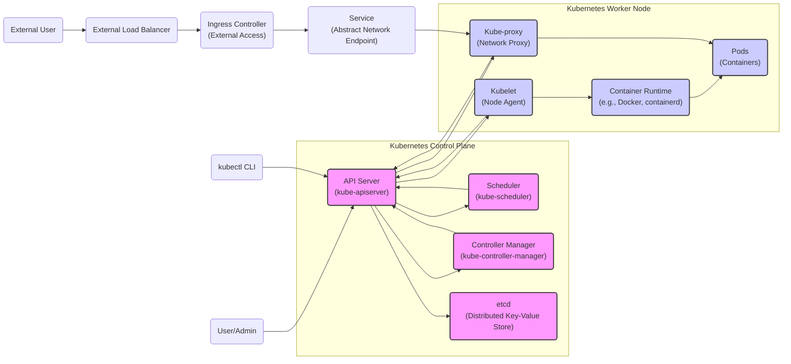
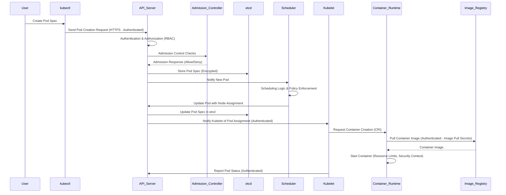

# Kubernetes Project Design Document for Threat Modeling (Improved)

## 1. Introduction

This document provides an enhanced, security-focused design overview of the Kubernetes project (https://github.com/kubernetes/kubernetes) specifically tailored for threat modeling activities. It details the critical components, their interactions, and data flows within a Kubernetes cluster, emphasizing security-relevant aspects. This document serves as a robust foundation for identifying potential security threats, vulnerabilities, and attack vectors within the Kubernetes ecosystem. It maintains a focus on core Kubernetes components and their interactions, abstracting away implementation specifics to offer a generalized yet detailed framework for effective threat modeling. The goal is to provide a clear and structured representation of Kubernetes architecture to facilitate a comprehensive security analysis.

## 2. System Overview

Kubernetes is a powerful open-source platform for container orchestration, automating the deployment, scaling, and management of containerized applications across a cluster of machines.  A Kubernetes cluster is fundamentally divided into:

*   **Control Plane:** The brain of the cluster, responsible for management, decision-making, and maintaining the desired state. It exposes the Kubernetes API and orchestrates all cluster operations.
*   **Worker Nodes (Nodes):** The workhorses of the cluster, executing workloads in containers. They are managed by the control plane and provide the runtime environment for applications.

The control plane components collectively manage the cluster's state, schedule workloads onto nodes, expose the Kubernetes API for user and component interaction, and ensure the cluster operates as intended. Worker nodes host the container runtime and the kubelet agent, which communicates with the control plane to execute commands and report node status.

The following diagram illustrates the high-level Kubernetes architecture, highlighting key components and their relationships:

## 3. Component Details (Security Focused)

This section provides detailed descriptions of each key Kubernetes component, emphasizing their roles and security implications for threat modeling.

### 3.1. Control Plane Components

*   **3.1.1. API Server (kube-apiserver):**
    *   **Role:** The gatekeeper and central interface to the Kubernetes control plane. It exposes the Kubernetes API (primarily via HTTPS) and handles all requests to manage the cluster. It's responsible for authentication, authorization, admission control, and audit logging.
    *   **Security Relevance:**
        *   **Authentication:** Enforces user and service account authentication using mechanisms like certificates, bearer tokens (including service account tokens and OIDC tokens), and potentially webhook token authentication. Weak or misconfigured authentication can lead to unauthorized access.
        *   **Authorization:** Implements Role-Based Access Control (RBAC), Attribute-Based Access Control (ABAC), and webhook authorization to control access to Kubernetes resources. Improperly configured authorization can lead to privilege escalation and unauthorized actions.
        *   **Admission Control:**  Executes a chain of admission controllers that intercept requests *after* authentication and authorization but *before* persistence. Admission controllers can enforce policies, mutate objects, or reject requests based on predefined rules (e.g., Pod Security Admission, resource quotas, network policies). Bypassing or misconfiguring admission controllers can weaken security posture.
        *   **API Exposure:** The API Server's public endpoint is a critical attack surface. Secure configuration, rate limiting, and intrusion detection are essential.
        *   **Audit Logging:** Logs all API requests, providing an audit trail for security monitoring, incident response, and compliance. Comprehensive and properly configured audit logging is crucial for detecting malicious activity.
        *   **TLS Termination:** Handles TLS termination for secure HTTPS communication, protecting API traffic confidentiality and integrity. Weak TLS configurations or vulnerabilities in TLS implementation can compromise security.

*   **3.1.2. etcd (Distributed Key-Value Store):**
    *   **Role:**  Kubernetes' highly consistent and available backing store. It stores the entire cluster state, including configurations, secrets, user accounts, and application metadata.
    *   **Security Relevance:**
        *   **Data Confidentiality and Integrity:** etcd holds all sensitive cluster data. Compromise of etcd is catastrophic, leading to complete cluster compromise, data breaches, and potential control of all workloads.
        *   **Access Control:** Access to etcd must be strictly limited to authorized control plane components (primarily the API Server). Unauthorized access can lead to data leaks, manipulation, and cluster takeover.
        *   **Encryption at Rest and in Transit:**  Encryption of etcd data at rest (using features like encryption providers) and in transit (using TLS for client-to-server and peer-to-peer communication) is paramount to protect sensitive information from unauthorized access and eavesdropping.
        *   **Backup and Recovery:** Regular, secure backups of etcd are critical for disaster recovery and maintaining cluster integrity. Compromised or unavailable backups can severely impact recovery efforts.
        *   **Quorum and Consensus:** etcd relies on a quorum-based consensus algorithm. Security considerations include preventing quorum disruption and ensuring the integrity of the consensus process.

*   **3.1.3. Scheduler (kube-scheduler):**
    *   **Role:**  Responsible for scheduling Pods onto worker nodes. It watches for unscheduled Pods and selects the most appropriate node based on resource requirements, constraints, policies, and affinity/anti-affinity rules.
    *   **Security Relevance:**
        *   **Resource Allocation and Fairness:**  Scheduler decisions impact resource allocation and fairness across workloads. Malicious actors could attempt to manipulate scheduling to cause resource exhaustion or denial of service for legitimate applications.
        *   **Node Selection Policies and Constraints:** Scheduling policies and node selectors can be used to enforce security constraints, such as placing sensitive workloads on dedicated, more secure nodes. Misconfigured policies can weaken isolation.
        *   **Pod Placement and Colocation:**  Careful consideration of Pod placement is needed to avoid co-locating sensitive workloads with potentially malicious or compromised workloads on the same node. Node affinity and anti-affinity rules are crucial for managing workload isolation.
        *   **Scheduler Extenders:**  Custom scheduler extenders can introduce security vulnerabilities if not properly vetted and secured.

*   **3.1.4. Controller Manager (kube-controller-manager):**
    *   **Role:** Runs a suite of controllers that continuously reconcile the desired state of the cluster with the current state. Controllers automate tasks like node management, replication, endpoint management, service account and token management, and more.
    *   **Security Relevance:**
        *   **Privileged Operations:** Controllers perform highly privileged operations to manage cluster resources and enforce policies. Compromise of the controller manager can grant broad control over the cluster.
        *   **Policy Enforcement:** Controllers are central to enforcing various Kubernetes policies, including RBAC, resource quotas, network policies, and Pod Security Policies (deprecated, replaced by Pod Security Admission). Vulnerabilities or misconfigurations in controllers can lead to policy bypasses.
        *   **Reconciliation Loops and State Management:** Controllers' continuous reconciliation loops are critical for maintaining security configurations and responding to security-relevant events. Failures in reconciliation or state management can lead to security drifts.
        *   **Service Account and Token Management:** Controllers like the Service Account Token Controller manage service account credentials, which are used for in-cluster authentication. Secure management and rotation of these credentials are vital.

### 3.2. Worker Node Components

*   **3.2.1. Kubelet (Node Agent):**
    *   **Role:** The primary agent running on each worker node. It registers the node with the cluster, receives Pod specifications from the API Server, manages the lifecycle of containers within Pods on the node, and reports node and Pod status back to the control plane.
    *   **Security Relevance:**
        *   **Node Security and Hardening:** Kubelet is a critical component running on each node and must be secured and hardened against attacks. Node-level security directly impacts the security of all workloads running on that node.
        *   **Container Management and Isolation:** Kubelet interacts with the container runtime to start, stop, and monitor containers. Vulnerabilities in kubelet or its interaction with the runtime can lead to container escapes, node compromise, or denial of service.
        *   **API Communication Security:** Kubelet communicates with the API Server over potentially insecure networks. Secure communication channels (TLS, authentication) are essential to prevent eavesdropping and man-in-the-middle attacks.
        *   **Credential Management on Nodes:** Kubelet manages credentials for accessing container images (image pull secrets), volumes, and other resources on the node. Secure storage and handling of these credentials are crucial.
        *   **Node Authorization:** Kubelet API (if enabled) should be secured with proper authorization mechanisms to prevent unauthorized node control.

*   **3.2.2. Kube-proxy (Network Proxy):**
    *   **Role:** Implements the Kubernetes Service abstraction, enabling network access to Pods. It maintains network rules on each node, routing traffic to backend Pods based on Service definitions and network policies.
    *   **Security Relevance:**
        *   **Network Policy Enforcement:** Kube-proxy (in conjunction with network plugins) can enforce Kubernetes Network Policies, controlling network traffic between Pods and namespaces. Properly configured network policies are essential for network segmentation and limiting lateral movement.
        *   **Service Exposure and Load Balancing:** Kube-proxy is responsible for exposing Services, which can be entry points for both internal and external attacks. Misconfigured Services or vulnerabilities in kube-proxy can expose applications to unintended risks.
        *   **Network Segmentation and Isolation:** Kube-proxy plays a key role in network segmentation within the cluster. Improper configuration can weaken network isolation and increase the attack surface.
        *   **IPTables/IPVS Rules Management:** Kube-proxy manages iptables or IPVS rules on nodes. Vulnerabilities in rule management or misconfigurations can lead to network bypasses or denial of service.

*   **3.2.3. Container Runtime (e.g., Docker, containerd):**
    *   **Role:** The underlying software responsible for running containers. Kubernetes supports various container runtimes that implement the Container Runtime Interface (CRI).
    *   **Security Relevance:**
        *   **Container Isolation and Security:** The container runtime is fundamentally responsible for isolating containers from each other and the host operating system. Vulnerabilities in the runtime are a primary source of container escapes and host compromise.
        *   **Image Security and Management:** The runtime handles pulling and managing container images. Image vulnerabilities (in base images or application dependencies) can be exploited within containers. Image scanning and vulnerability management are crucial.
        *   **Resource Limits and Control Groups (cgroups):** Runtimes enforce resource limits (CPU, memory, etc.) for containers using cgroups. Proper resource limits prevent resource exhaustion and denial of service. Misconfigurations in cgroup settings can lead to security issues.
        *   **Seccomp and AppArmor/SELinux:** Runtimes can enforce security profiles like seccomp and AppArmor/SELinux to restrict container syscalls and capabilities, reducing the attack surface within containers.

### 3.3. Other Important Components (from a Security Perspective)

*   **3.3.1. Ingress Controller:**
    *   **Role:** Provides external access to Services within the cluster, typically for HTTP/HTTPS traffic. Acts as a reverse proxy, load balancer, and TLS terminator for external requests.
    *   **Security Relevance:**
        *   **External Attack Surface:** Ingress controllers are a major entry point for external attacks targeting applications running in the cluster. They must be hardened and secured against web application attacks, DDoS, and other threats.
        *   **TLS Termination and Certificate Management:** Ingress controllers often handle TLS termination. Secure certificate management, proper TLS configuration, and protection of private keys are essential.
        *   **Web Application Firewall (WAF) Integration:** Integrating Ingress controllers with WAFs is a best practice to protect against common web application vulnerabilities (OWASP Top 10).
        *   **Rate Limiting and Access Control:** Ingress controllers should implement rate limiting and access control mechanisms to prevent abuse and unauthorized access.

*   **3.3.2. Service Mesh (e.g., Istio, Linkerd):**
    *   **Role:** An optional infrastructure layer for managing service-to-service communication within the cluster. Provides features like traffic management, security (mTLS, authorization), observability, and resilience.
    *   **Security Relevance:**
        *   **Mutual TLS (mTLS) for Service-to-Service Communication:** Service meshes enforce mTLS, encrypting and authenticating service-to-service traffic, enhancing confidentiality and preventing man-in-the-middle attacks.
        *   **Fine-grained Authorization Policies:** Service meshes offer advanced authorization policies (beyond RBAC) to control service access based on identity, context, and attributes.
        *   **Traffic Control and Security Policies:** Service meshes can implement security policies like rate limiting, circuit breaking, and request routing based on security context.
        *   **Centralized Security Management:** Service meshes can centralize security policies and enforcement for service-to-service communication, simplifying security management.

*   **3.3.3. Network Plugins (CNI - Container Network Interface):**
    *   **Role:** Responsible for setting up the container network in a Kubernetes cluster. Different CNI plugins provide various networking models (overlay, routed, etc.) and features.
    *   **Security Relevance:**
        *   **Network Segmentation and Isolation:** CNI plugins are fundamental to network segmentation and isolation within the cluster. The choice of CNI plugin and its configuration directly impacts network security.
        *   **Network Policy Support:**  CNI plugins must support Kubernetes Network Policies to enable network segmentation and access control between Pods.
        *   **Overlay Network Security:** If using overlay networks, security considerations include encryption of overlay traffic and potential performance overhead.
        *   **IP Address Management (IPAM):** Secure and efficient IP address management is important for network stability and security.

*   **3.3.4. Storage Plugins (CSI - Container Storage Interface):**
    *   **Role:** Enables Kubernetes to integrate with various storage systems (cloud providers, on-premise storage). CSI plugins allow Kubernetes to provision and manage persistent volumes.
    *   **Security Relevance:**
        *   **Data Security at Rest:** CSI plugins should support encryption at rest for persistent volumes to protect sensitive data stored in volumes.
        *   **Access Control to Storage:** Proper access control mechanisms are needed to restrict access to persistent volumes and prevent unauthorized data access.
        *   **Data Backup and Recovery for Persistent Data:** CSI plugins should facilitate secure and reliable data backup and recovery strategies for persistent volumes.
        *   **Volume Snapshotting and Cloning Security:** Security considerations for volume snapshotting and cloning include access control and data protection during these operations.

## 4. Data Flow (Security Perspective)

Understanding data flows, especially those involving sensitive data and control plane operations, is crucial for threat modeling. This section highlights key data flows with a security lens.

*   **User Interaction (kubectl) Data Flow:**
    *   `kubectl` CLI communicates with the API Server over HTTPS, ensuring confidentiality and integrity of commands and responses.
    *   Authentication (e.g., using client certificates, bearer tokens) and authorization (RBAC) are performed by the API Server before processing any request.
    *   Successful requests are processed by the API Server, potentially leading to changes in etcd, scheduling decisions, or actions on worker nodes.
    *   Audit logs record all API requests, providing a security audit trail.

*   **Pod Deployment Data Flow:**
    *   User submits a Pod specification via `kubectl` or other API clients to the API Server (HTTPS).
    *   API Server authenticates and authorizes the request.
    *   Admission controllers validate and potentially mutate the Pod specification.
    *   API Server persists the Pod specification in etcd (encrypted at rest and in transit).
    *   Scheduler watches for unscheduled Pods and selects a suitable node based on scheduling policies.
    *   Scheduler updates the Pod specification in etcd with the assigned node.
    *   API Server notifies the Kubelet on the assigned node about the new Pod.
    *   Kubelet authenticates with the API Server to receive Pod details.
    *   Kubelet instructs the Container Runtime (via CRI) to pull container images (image pull secrets are used for authentication if required) and start containers.
    *   Container Runtime pulls images from registries (image registry authentication and authorization are important).
    *   Kubelet reports Pod status updates to the API Server (authenticated communication).

*   **Service Access Data Flow:**
    *   Client (internal or external) attempts to access a Service.
    *   DNS resolution (kube-dns or CoreDNS) resolves the Service name to a ClusterIP.
    *   Network traffic is routed to the ClusterIP.
    *   Kube-proxy on the node intercepts traffic destined for the ClusterIP.
    *   Kube-proxy, based on Service configuration and network rules (potentially Network Policies), load balances traffic to backend Pods.
    *   Ingress Controller, if used, routes external traffic to Services based on configured HTTP/HTTPS rules (TLS termination may occur at the Ingress Controller).

*   **Control Plane Internal Communication Data Flow:**
    *   Control plane components (API Server, Scheduler, Controller Manager) communicate with each other and etcd over internal networks.
    *   All control plane communication should be secured with TLS to ensure confidentiality and integrity.
    *   Authentication and authorization mechanisms are used for inter-component communication within the control plane.

The following sequence diagram illustrates the Pod deployment data flow, highlighting security-relevant steps:

## 5. Trust Boundaries (Security Domains)

Identifying trust boundaries is essential for threat modeling. In Kubernetes, key trust boundaries exist between:

*   **External Users/Administrators and the Control Plane (API Server):**  Authentication and authorization are enforced at this boundary. Compromise here grants external access to cluster management.
*   **Control Plane Components and etcd:** etcd is the highest trust component. Access is strictly limited to control plane components. Compromise of etcd is a full cluster compromise.
*   **Control Plane and Worker Nodes (Kubelet):**  Control plane instructs worker nodes via Kubelet. Secure, authenticated communication is critical. Compromise here allows control plane instructions to be manipulated or worker nodes to be compromised.
*   **Worker Nodes and Container Runtime:** Container runtime is responsible for container isolation on worker nodes. Compromise here leads to container escapes and node compromise.
*   **Containers and Host Node:** Container isolation is a critical security boundary. Container escapes are a major threat.
*   **Containers within the same Pod:** Containers in a Pod share network and resources, reducing isolation. This is a weaker trust boundary.
*   **Pods in the same Namespace:** Namespaces provide logical isolation, but network policies are needed for strong network segmentation. This is a logical trust boundary, enforced by network policies.
*   **Cluster Network and External Networks (Ingress, Services of type LoadBalancer):**  Ingress controllers and Services expose applications to external networks. This is a significant trust boundary where external threats can enter the cluster.
*   **Service Mesh Control Plane and Data Plane:** In service mesh deployments, the control plane manages the data plane proxies. Trust boundaries exist between these components, especially regarding policy distribution and enforcement.

## 6. Security Considerations for Threat Modeling (Categorized)

Based on the architecture and component details, here are security considerations categorized for structured threat modeling (implicitly using STRIDE categories):

**Spoofing (Identity and Authentication):**

*   **API Server Authentication Bypass:** Exploiting vulnerabilities to bypass API Server authentication mechanisms (e.g., certificate vulnerabilities, token theft).
*   **Service Account Token Compromise:** Stealing or misusing service account tokens to gain unauthorized access to cluster resources.
*   **Kubelet Authentication Bypass:** Bypassing Kubelet authentication to gain unauthorized control over worker nodes.
*   **Image Registry Authentication Weakness:** Weak or compromised authentication to container image registries, leading to unauthorized image pulls or pushes.

**Tampering (Integrity):**

*   **etcd Data Tampering:** Unauthorized modification of data in etcd, leading to cluster instability or malicious configuration changes.
*   **Container Image Tampering:** Using compromised or malicious container images, injecting malicious code into applications.
*   **Admission Controller Bypass/Tampering:** Bypassing or tampering with admission controllers to deploy insecure or malicious workloads.
*   **Network Policy Bypass:** Circumventing network policies to gain unauthorized network access within the cluster.
*   **Audit Log Tampering:** Modifying or deleting audit logs to hide malicious activity.

**Repudiation (Auditability):**

*   **Insufficient Audit Logging:** Lack of comprehensive audit logging, hindering incident detection and response.
*   **Audit Log Storage Vulnerabilities:** Insecure storage or access control for audit logs, allowing for tampering or deletion.
*   **Lack of Monitoring and Alerting:** Insufficient monitoring and alerting on security-relevant events, delaying incident detection.

**Information Disclosure (Confidentiality):**

*   **etcd Data Breach:** Unauthorized access to etcd data, exposing sensitive cluster information, secrets, and application data.
*   **API Server Information Leakage:** Exploiting API Server vulnerabilities to leak sensitive information through API endpoints.
*   **Container Escape Information Disclosure:** Container escapes leading to access to sensitive host node data or neighboring container data.
*   **Secret Exposure:** Unintentional exposure of secrets in container configurations, environment variables, or logs.
*   **Insecure Communication Channels:** Lack of encryption (TLS) for communication between components, leading to eavesdropping and data interception.

**Denial of Service (Availability):**

*   **API Server Denial of Service:** Overloading or crashing the API Server, disrupting cluster operations.
*   **etcd Denial of Service:** Disrupting etcd availability, leading to cluster failure.
*   **Kubelet Denial of Service:** Crashing or overloading Kubelet, impacting node availability and workload execution.
*   **Container Runtime Denial of Service:** Exploiting runtime vulnerabilities to cause container or node crashes.
*   **Resource Exhaustion:** Resource exhaustion attacks targeting nodes or containers, leading to application downtime.
*   **Network Flooding:** Network-based denial of service attacks targeting cluster services or infrastructure.

**Elevation of Privilege:**

*   **RBAC Misconfiguration:** Misconfigured RBAC policies granting excessive privileges to users or service accounts.
*   **Privilege Escalation Attacks:** Exploiting vulnerabilities to escalate privileges within containers or on nodes.
*   **Container Escape Privilege Escalation:** Container escapes leading to root access on the host node.
*   **Admission Controller Bypass for Privilege Escalation:** Bypassing admission controllers to deploy privileged containers or escalate privileges.

**Supply Chain Security:**

*   **Compromised Base Images:** Using base container images with known vulnerabilities or backdoors.
*   **Vulnerable Dependencies:** Vulnerabilities in application dependencies within container images.
*   **Malicious Image Registries:** Pulling images from untrusted or compromised image registries.
*   **Software Supply Chain Attacks:** Attacks targeting the software supply chain of Kubernetes components or dependencies.

**Secrets Management:**

*   **Insecure Secret Storage:** Storing secrets unencrypted in etcd or container configurations.
*   **Weak Secret Management Practices:** Lack of secret rotation, insecure secret distribution, or hardcoded secrets.
*   **Unauthorized Secret Access:** RBAC misconfigurations or vulnerabilities allowing unauthorized access to secrets.

## 7. Next Steps for Threat Modeling

This design document provides a comprehensive foundation for threat modeling Kubernetes. The next steps to conduct a thorough threat model are:

1.  **Threat Modeling Workshops:** Organize workshops with security experts, Kubernetes administrators, developers, and operations teams. Utilize this design document as a basis for discussion and brainstorming.
    *   **Output:**  A prioritized list of potential threats, vulnerabilities, and attack vectors specific to the target Kubernetes environment.

2.  **Attack Tree/Diagram Development:** Create attack trees or diagrams based on the identified threats. Visualize attack paths, dependencies, and potential impact.
    *   **Output:** Visual representations of attack scenarios, illustrating how attackers could exploit vulnerabilities to achieve their goals.

3.  **Risk Assessment and Prioritization:** Assess the likelihood and impact of each identified threat. Prioritize threats based on risk level (e.g., using a risk matrix).
    *   **Output:** A prioritized risk register outlining identified threats, their likelihood, impact, and overall risk level.

4.  **Security Controls and Mitigation Strategy Definition:** For each prioritized threat, define appropriate security controls and mitigation strategies. Consider preventative, detective, and corrective controls.
    *   **Output:** A detailed mitigation plan outlining specific security controls to implement, including technical and procedural measures.

5.  **Security Testing and Validation:** Conduct security testing activities, such as penetration testing, vulnerability scanning, and configuration reviews, to validate the effectiveness of existing security controls and identify weaknesses.
    *   **Output:** Security testing reports highlighting vulnerabilities, misconfigurations, and areas for improvement.

6.  **Continuous Security Monitoring, Incident Response Planning, and Improvement:** Implement continuous security monitoring and logging to detect and respond to security incidents. Develop an incident response plan specific to Kubernetes. Continuously review and improve the security posture based on threat intelligence, vulnerability disclosures, and lessons learned.
    *   **Output:**  A security monitoring dashboard, an incident response plan, and a continuous security improvement process.

This improved design document, combined with these next steps, will enable a robust and effective threat modeling process for Kubernetes, leading to a more secure and resilient container orchestration platform.