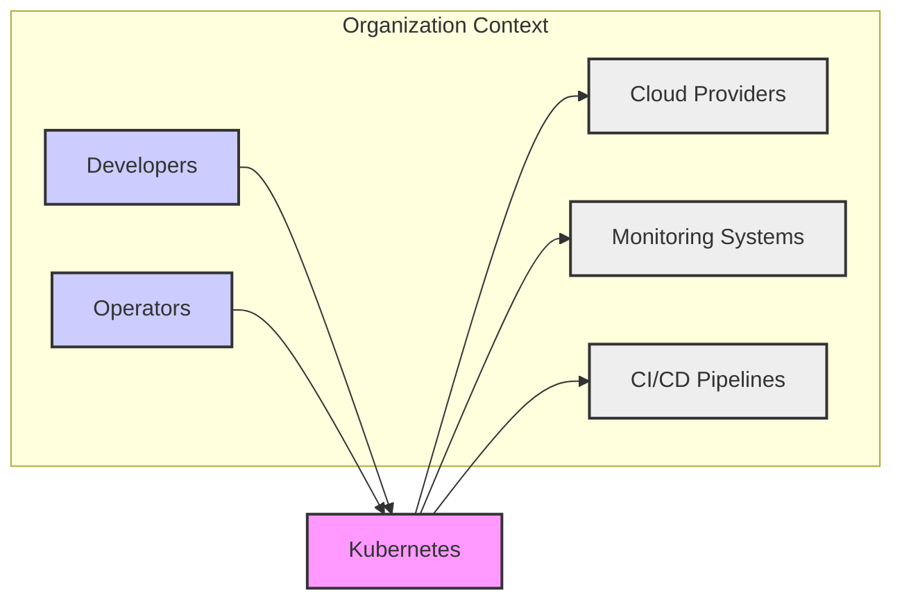
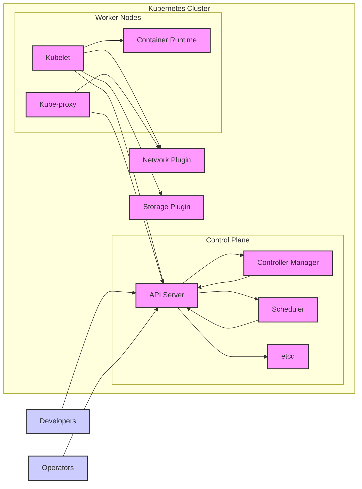
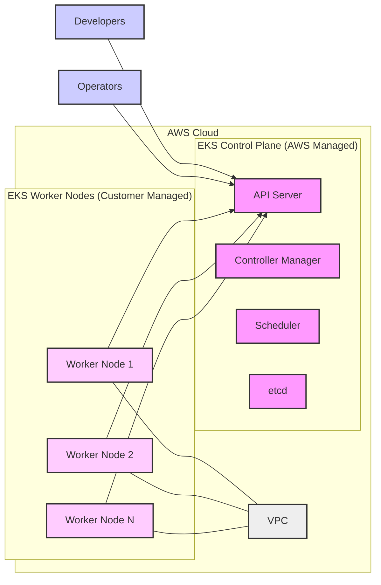

# BUSINESS POSTURE

- Business Priorities and Goals:
  - Kubernetes aims to provide a platform for automating deployment, scaling, and operations of application containers across clusters of hosts.
  - The primary business priority is to enable users to reliably and efficiently run containerized applications at scale.
  - Key goals include:
    - Simplifying application deployment and management.
    - Improving resource utilization and infrastructure efficiency.
    - Enabling microservices architectures and cloud-native applications.
    - Providing a consistent platform across different infrastructure environments (on-premises, cloud, hybrid).

- Business Risks:
  - Availability and resilience of the platform itself, impacting all applications running on it.
  - Data integrity and consistency, especially for stateful applications.
  - Confidentiality of application data and Kubernetes secrets.
  - Compliance with various regulatory requirements depending on the applications and data being managed.
  - Complexity of configuration and operation leading to misconfigurations and security vulnerabilities.
  - Security vulnerabilities in Kubernetes components or dependencies that could be exploited.

# SECURITY POSTURE

- Existing Security Controls:
  - security control: Role-Based Access Control (RBAC) - Implemented within the Kubernetes API Server to control access to Kubernetes resources.
  - security control: Network Policies - Implemented by network plugins to control network traffic between pods and namespaces.
  - security control: Pod Security Admission - Implemented within the Kubernetes API Server to enforce security policies on pods at the namespace level.
  - security control: Secrets Management - Implemented within the Kubernetes API Server to securely store and manage sensitive information like passwords and API keys.
  - security control: Image Security Scanning - Often integrated with container registries and admission controllers to scan container images for vulnerabilities.
  - security control: Audit Logging - Implemented within the Kubernetes API Server to record API requests for auditing and security monitoring.
  - security control: TLS Encryption - Used for communication between Kubernetes components and for external access to the API server.

- Accepted Risks:
  - accepted risk: Complexity of Kubernetes configuration can lead to misconfigurations that introduce security vulnerabilities.
  - accepted risk: Reliance on third-party container images and dependencies introduces supply chain risks.
  - accepted risk: Zero-day vulnerabilities in Kubernetes components or dependencies may exist and could be exploited before patches are available.
  - accepted risk: Misuse of overly permissive RBAC roles can lead to unauthorized access and privilege escalation.

- Recommended Security Controls:
  - security control: Implement a Secure Software Development Lifecycle (SSDLC) for Kubernetes development, including security requirements, threat modeling, secure coding practices, and security testing.
  - security control: Conduct regular security testing, including static application security testing (SAST), dynamic application security testing (DAST), and penetration testing, to identify and remediate vulnerabilities.
  - security control: Implement a robust vulnerability management program to track, prioritize, and remediate vulnerabilities in Kubernetes components and dependencies.
  - security control: Enhance supply chain security by using signed container images, verifying dependencies, and securing the build pipeline.
  - security control: Implement security monitoring and incident response capabilities to detect and respond to security incidents in Kubernetes environments.

- Security Requirements:
  - Authentication:
    - Requirement: Securely authenticate users (human users and service accounts) accessing the Kubernetes API server.
    - Requirement: Support multiple authentication methods, including certificate-based authentication, token-based authentication, and OIDC.
  - Authorization:
    - Requirement: Implement fine-grained authorization using RBAC to control access to Kubernetes resources based on the principle of least privilege.
    - Requirement: Enforce authorization policies consistently across all Kubernetes components.
  - Input Validation:
    - Requirement: Validate all inputs to the Kubernetes API server to prevent injection attacks and other input-related vulnerabilities.
    - Requirement: Validate configuration parameters and user-provided data to ensure they are within expected ranges and formats.
  - Cryptography:
    - Requirement: Use strong cryptography to protect sensitive data at rest and in transit.
    - Requirement: Encrypt Kubernetes secrets stored in etcd.
    - Requirement: Enforce TLS encryption for all communication between Kubernetes components and for external access to the API server.
    - Requirement: Properly manage and rotate cryptographic keys.

# DESIGN

- C4 CONTEXT

  - Context Diagram Elements:
    - - Name: Developers
      - Type: Person
      - Description: Software developers who build and deploy applications on Kubernetes.
      - Responsibilities: Develop and package applications as containers, define application deployments and configurations for Kubernetes.
      - Security controls: Authentication to access Kubernetes clusters, authorization to deploy and manage applications within their namespaces.
    - - Name: Operators
      - Type: Person
      - Description: System administrators and operations teams who manage and maintain Kubernetes clusters.
      - Responsibilities: Install, configure, and maintain Kubernetes clusters, monitor cluster health and performance, manage user access and security policies.
      - Security controls: Strong authentication and authorization to manage the Kubernetes control plane, audit logging of administrative actions.
    - - Name: Cloud Providers
      - Type: External System
      - Description: Cloud infrastructure providers (e.g., AWS, Azure, GCP) that provide the underlying infrastructure for managed Kubernetes services or self-managed clusters in the cloud.
      - Responsibilities: Provide compute, storage, and networking resources for Kubernetes clusters, manage the underlying infrastructure security.
      - Security controls: Cloud provider security controls for infrastructure, network security groups, access control to cloud resources.
    - - Name: Monitoring Systems
      - Type: External System
      - Description: Monitoring and logging systems used to collect metrics, logs, and events from Kubernetes clusters and applications for performance monitoring, troubleshooting, and security analysis.
      - Responsibilities: Collect and aggregate monitoring data, provide dashboards and alerts, enable security monitoring and incident detection.
      - Security controls: Secure data transmission and storage, access control to monitoring data, integration with security information and event management (SIEM) systems.
    - - Name: CI/CD Pipelines
      - Type: External System
      - Description: Continuous Integration and Continuous Delivery pipelines used to build, test, and deploy applications to Kubernetes clusters.
      - Responsibilities: Automate the build, test, and deployment process, integrate security scanning and testing into the pipeline.
      - Security controls: Secure access to Kubernetes clusters for deployment, secure storage of credentials and configuration, pipeline security hardening.
    - - Name: Kubernetes
      - Type: System
      - Description: The Kubernetes container orchestration platform itself.
      - Responsibilities: Orchestrate containerized applications, manage resources, provide networking and storage abstractions, enforce security policies.
      - Security controls: RBAC, Network Policies, Pod Security Admission, Secrets Management, Audit Logging, TLS Encryption, Image Security Scanning.

- C4 CONTAINER

  - Container Diagram Elements:
    - - Name: API Server
      - Type: Container
      - Description: The central component of the Kubernetes control plane, exposing the Kubernetes API.
      - Responsibilities: Receives API requests from users and other components, authenticates and authorizes requests, validates requests, and updates etcd.
      - Security controls: Authentication and authorization mechanisms, input validation, audit logging, TLS encryption for API communication.
    - - Name: Controller Manager
      - Type: Container
      - Description: Runs core Kubernetes controllers that manage the state of the cluster, such as node controller, replication controller, and endpoint controller.
      - Responsibilities: Observe the state of the cluster through the API server and make changes to bring the current state closer to the desired state.
      - Security controls: RBAC to control access to Kubernetes resources, secure communication with the API server.
    - - Name: Scheduler
      - Type: Container
      - Description: Schedules pods to run on worker nodes based on resource requirements, constraints, and policies.
      - Responsibilities: Selects the best node for each pod to run on, taking into account resource availability, node affinity, and other factors.
      - Security controls: RBAC to control access to node and pod information, secure communication with the API server.
    - - Name: etcd
      - Type: Container
      - Description: A distributed key-value store used as Kubernetes' backing store for cluster data.
      - Responsibilities: Persistently store Kubernetes cluster state, including configuration, secrets, and metadata.
      - Security controls: Access control to etcd data, encryption of data at rest and in transit, secure configuration and operation of etcd.
    - - Name: Kubelet
      - Type: Container
      - Description: An agent that runs on each worker node and is responsible for managing pods and containers on that node.
      - Responsibilities: Registers the node with the API server, starts and stops containers, reports node and pod status to the API server.
      - Security controls: Node-level security controls, container runtime security, secure communication with the API server, enforcement of pod security policies.
    - - Name: Kube-proxy
      - Type: Container
      - Description: A network proxy that runs on each worker node and implements Kubernetes networking services.
      - Responsibilities: Implements service abstraction, load balancing, and network policies.
      - Security controls: Network policy enforcement, secure communication with the API server.
    - - Name: Container Runtime
      - Type: Container
      - Description: The software that is responsible for running containers, such as Docker, containerd, or CRI-O.
      - Responsibilities: Pull container images, start and stop containers, manage container resources, provide container isolation.
      - Security controls: Container isolation mechanisms (namespaces, cgroups), image security scanning, runtime security hardening.
    - - Name: Network Plugin
      - Type: Container
      - Description: Provides network connectivity for pods and services within the Kubernetes cluster, such as Calico, Flannel, or Cilium.
      - Responsibilities: Implements network policies, provides network routing and addressing for pods.
      - Security controls: Network policy enforcement, network segmentation, secure network configuration.
    - - Name: Storage Plugin
      - Type: Container
      - Description: Provides persistent storage for pods, allowing them to access and store data across restarts, such as cloud provider storage or network file systems.
      - Responsibilities: Provision persistent volumes, mount storage volumes to pods, manage storage access control.
      - Security controls: Storage access control mechanisms, encryption of data at rest, secure storage configuration.

- DEPLOYMENT

- Deployment Options:
  - Managed Kubernetes Services (e.g., EKS, GKE, AKS): Cloud providers manage the control plane and underlying infrastructure, simplifying deployment and operations.
  - Self-Managed Kubernetes on Cloud: Deploying Kubernetes on cloud provider VMs, providing more control but requiring more operational overhead.
  - On-Premises Kubernetes: Deploying Kubernetes in an organization's own data center, offering maximum control but requiring significant infrastructure and operational expertise.

- Selected Deployment Architecture: Managed Kubernetes Service (e.g., AWS EKS)

  - Deployment Diagram Elements:
    - - Name: EKS Control Plane (AWS Managed)
      - Type: Deployment Node (Managed Service)
      - Description: The Kubernetes control plane components (API Server, Controller Manager, Scheduler, etcd) are managed and operated by AWS as part of the EKS service.
      - Responsibilities: AWS is responsible for the availability, scalability, and security of the control plane.
      - Security controls: AWS security controls for managed services, including infrastructure security, access control, and monitoring.
    - - Name: EKS Worker Nodes (Customer Managed)
      - Type: Deployment Node (Virtual Machines)
      - Description: Worker nodes are EC2 instances managed by the customer, running Kubelet and Kube-proxy.
      - Responsibilities: Customer is responsible for managing and securing the worker nodes, including OS patching, security hardening, and node configuration.
      - Security controls: EC2 instance security groups, IAM roles for worker nodes, OS-level security controls, node security hardening.
    - - Name: VPC
      - Type: Deployment Node (Network)
      - Description: Amazon Virtual Private Cloud (VPC) provides a private network for the EKS cluster, isolating it from the public internet and other networks.
      - Responsibilities: Network isolation, network routing, security group enforcement.
      - Security controls: VPC network security groups, network access control lists (NACLs), subnet isolation.

- BUILD

```mermaid
graph LR
    subgraph "Developer Workstation"
        B1["Developer"]:::person
        B2["Code Changes"]
    end
    subgraph "GitHub"
        B3["GitHub Repository"]
        B4["GitHub Actions"]:::ci_cd
    end
    subgraph "Build Environment"
        B5["Build Agents"]:::build_agent
        B6["Build Artifacts"]
        B7["Container Registry"]:::container_registry
    end
    B1 --> B2 --> B3
    B3 --> B4
    B4 --> B5
    B5 --> B6
    B6 --> B7
    style B4 fill:#ccf,stroke:#333,stroke-width:2px
    style B5 fill:#fcf,stroke:#333,stroke-width:2px
    style B7 fill:#fcf,stroke:#333,stroke-width:2px
    classDef person fill:#ccf,stroke:#333,stroke-width:2px
    classDef ci_cd fill:#ccf,stroke:#333,stroke-width:2px
    classDef build_agent fill:#fcf,stroke:#333,stroke-width:2px
    classDef container_registry fill:#fcf,stroke:#333,stroke-width:2px
```

  - Build Process:
    - Developer makes code changes on their workstation (B1, B2).
    - Code changes are committed and pushed to the GitHub repository (B3).
    - GitHub Actions (B4) are triggered by code changes (e.g., push, pull request).
    - GitHub Actions orchestrates the build process on build agents (B5).
    - Build agents compile code, run tests, build container images, and perform security checks (SAST, linters, vulnerability scanning).
    - Build artifacts (B6), including container images and binaries, are generated.
    - Container images are pushed to a container registry (B7).

  - Build Security Controls:
    - security control: Secure Build Environment: Use hardened build agents and secure build infrastructure.
    - security control: Build Automation: Automate the build process using CI/CD pipelines to ensure consistency and repeatability.
    - security control: Source Code Management Security: Secure access to the GitHub repository and use branch protection rules.
    - security control: Dependency Management: Use dependency scanning and vulnerability checks to manage dependencies securely.
    - security control: Static Application Security Testing (SAST): Integrate SAST tools into the build pipeline to detect code vulnerabilities.
    - security control: Container Image Scanning: Scan container images for vulnerabilities during the build process and before pushing to the registry.
    - security control: Code Signing and Verification: Sign build artifacts and container images to ensure integrity and authenticity.
    - security control: Access Control for Build Artifacts: Control access to build artifacts and container registry to prevent unauthorized access.
    - security control: Audit Logging of Build Process: Log build activities for auditing and security monitoring.

# RISK ASSESSMENT

- Critical Business Process:
  - Orchestrating and running containerized applications reliably and securely is the critical business process. Any disruption or security breach in Kubernetes can impact all applications running on it.

- Data to Protect and Sensitivity:
  - Kubernetes manages various types of data, including:
    - Application Data: Data processed and stored by applications running on Kubernetes. Sensitivity varies depending on the application.
    - Kubernetes Configuration: YAML manifests, RBAC policies, network policies, etc. Sensitive as misconfiguration can lead to security issues.
    - Kubernetes Secrets: Credentials, API keys, certificates stored as Kubernetes secrets. Highly sensitive and require strong protection.
    - Audit Logs: Logs of API requests and events in Kubernetes. Sensitive as they can contain information about user activities and security events.
    - Container Images: Application code and dependencies packaged as container images. Sensitive as they contain application logic and potential vulnerabilities.

  - Data Sensitivity Levels:
    - Kubernetes Secrets: Highly Sensitive (Confidentiality, Integrity, Availability)
    - Application Data: Sensitivity varies (Confidentiality, Integrity, Availability, Compliance)
    - Kubernetes Configuration: Sensitive (Integrity, Availability)
    - Audit Logs: Sensitive (Confidentiality, Integrity, Availability, Compliance)
    - Container Images: Sensitive (Integrity, Availability)

# QUESTIONS & ASSUMPTIONS

- Questions:
  - What is the specific use case for Kubernetes in this context? (e.g., development environment, production environment, specific industry)
  - What are the specific security compliance requirements that need to be met? (e.g., PCI DSS, HIPAA, GDPR)
  - What is the organization's risk appetite and security maturity level?
  - What is the intended scale and performance requirements for the Kubernetes deployment?
  - What is the budget and resources available for security implementation and operations?

- Assumptions:
  - General enterprise use case for Kubernetes, supporting a variety of applications.
  - Deployment environment is a managed Kubernetes service in the cloud (e.g., AWS EKS).
  - Focus on general security best practices and principles rather than specific compliance frameworks.
  - Assume a medium risk appetite and a need for a reasonably secure Kubernetes environment.
  - Assume a need for a scalable and performant Kubernetes deployment.