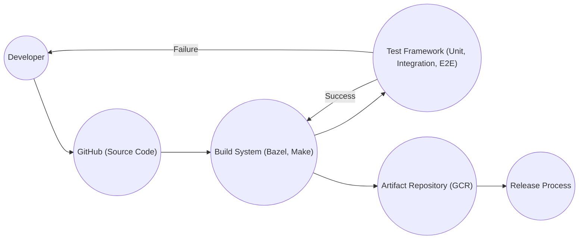

Okay, let's create a design document for the Kubernetes project, keeping in mind its scale and complexity, and focusing on aspects relevant to threat modeling.

# BUSINESS POSTURE

Kubernetes is an open-source container orchestration system for automating software deployment, scaling, and management.  It's become a foundational technology for cloud-native applications and microservices architectures.  Given its widespread adoption, the business posture focuses on several key areas:

*   Priorities:
    *   Reliability and Availability:  Ensuring Kubernetes clusters remain operational and accessible, even in the face of failures.  This is paramount for businesses running critical applications.
    *   Scalability:  Supporting the dynamic scaling of applications and infrastructure to meet fluctuating demands.
    *   Security:  Protecting the cluster and its workloads from unauthorized access, data breaches, and other security threats.
    *   Extensibility:  Allowing users to customize and extend Kubernetes functionality through APIs, plugins, and operators.
    *   Usability:  Providing a user-friendly experience for developers and operators, despite the inherent complexity of the system.
    *   Community and Ecosystem:  Maintaining a vibrant and active open-source community to drive innovation and support.
    *   Portability: Enable applications to be easily moved between different cloud providers and on-premises environments.

*   Goals:
    *   Become the standard platform for container orchestration.
    *   Enable efficient and reliable deployment of cloud-native applications.
    *   Foster a large and diverse ecosystem of tools and integrations.
    *   Provide a secure and robust foundation for modern infrastructure.

*   Business Risks:
    *   Cluster Compromise:  Unauthorized access to the cluster could lead to data breaches, service disruption, and reputational damage.  This is the most significant risk.
    *   Resource Exhaustion:  Misconfigured or malicious workloads could consume excessive resources, impacting the performance and availability of other applications.
    *   Supply Chain Attacks:  Vulnerabilities in container images or third-party components could be exploited to compromise the cluster.
    *   Configuration Errors:  Incorrectly configured security policies, network settings, or resource limits could create vulnerabilities or lead to instability.
    *   Denial of Service:  Attacks targeting the control plane or worker nodes could disrupt cluster operations.
    *   Data Loss: Failure of persistent storage or improper backup procedures could result in data loss.

# SECURITY POSTURE

Kubernetes has a comprehensive security model, but its complexity requires careful configuration and ongoing management.

*   Existing Security Controls:
    *   security control: Role-Based Access Control (RBAC):  Controls access to Kubernetes API resources based on user roles and permissions. Described in Kubernetes documentation and implemented in the API server.
    *   security control: Network Policies:  Define how pods can communicate with each other and with external networks. Described in Kubernetes documentation and implemented by network plugins.
    *   security control: Pod Security Policies (deprecated, replaced by Pod Security Admission):  Define security-related constraints on pod creation and execution. Described in Kubernetes documentation and implemented by admission controllers.
    *   security control: Pod Security Admission: Enforces predefined security profiles (baseline, restricted) on pods. Described in Kubernetes documentation and implemented by admission controllers.
    *   security control: Secrets Management:  Provides a mechanism for storing and managing sensitive information, such as passwords and API keys. Described in Kubernetes documentation and implemented in the API server and etcd.
    *   security control: Authentication: Supports multiple authentication methods, including X.509 client certificates, service account tokens, and external identity providers. Described in Kubernetes documentation and implemented in the API server.
    *   security control: Audit Logging:  Records API requests for security auditing and analysis. Described in Kubernetes documentation and implemented in the API server.
    *   security control: Resource Quotas:  Limit resource consumption by namespaces and pods. Described in Kubernetes documentation and implemented in the API server.
    *   security control: Image Security Scanning:  Integration with container image scanning tools to identify vulnerabilities. Implemented through third-party integrations and CI/CD pipelines.
    *   security control: Runtime Security Monitoring: Integration with runtime security tools to detect and respond to malicious activity within containers. Implemented through third-party integrations.

*   Accepted Risks:
    *   accepted risk: Complexity:  The inherent complexity of Kubernetes increases the risk of misconfiguration and security vulnerabilities.
    *   accepted risk: Third-Party Components:  Reliance on third-party components, such as container runtimes and network plugins, introduces potential supply chain risks.
    *   accepted risk: Rapid Evolution:  The rapid pace of development and new feature releases can introduce new security challenges.
    *   accepted risk: Default Configurations: Some default configurations may not be secure for all environments, requiring careful review and customization.

*   Recommended Security Controls:
    *   Implement a robust vulnerability management program, including regular security scanning of container images and Kubernetes components.
    *   Enforce least privilege access using RBAC and network policies.
    *   Enable audit logging and integrate it with a security information and event management (SIEM) system.
    *   Implement strong authentication and authorization mechanisms.
    *   Regularly review and update Kubernetes configurations to address security best practices.
    *   Use a dedicated secrets management solution (e.g., HashiCorp Vault) for enhanced security.
    *   Implement runtime security monitoring and intrusion detection.
    *   Consider using a service mesh (e.g., Istio, Linkerd) for enhanced security and observability.

*   Security Requirements:
    *   Authentication: All users and service accounts must be authenticated before accessing the Kubernetes API. Support for multi-factor authentication should be considered.
    *   Authorization: Access to API resources must be controlled through RBAC, with least privilege principles enforced.
    *   Input Validation: The API server must validate all input to prevent injection attacks and other vulnerabilities.
    *   Cryptography: All sensitive data, both in transit and at rest, must be encrypted using strong cryptographic algorithms. TLS should be used for all API communication. Secrets should be stored encrypted in etcd.
    *   Network Segmentation: Network policies should be used to isolate workloads and limit network access.
    *   Regular Security Audits: Conduct regular security audits and penetration testing to identify and address vulnerabilities.

# DESIGN

## C4 CONTEXT

```mermaid
graph LR
    subgraph Kubernetes Cluster
        kube-apiserver("Kubernetes API Server")
    end

    User(("User (DevOps, SRE)")) --> kube-apiserver
    ExternalSystem(("External Systems (CI/CD, Monitoring, Logging)")) --> kube-apiserver
    CloudProvider(("Cloud Provider (AWS, GCP, Azure)")) -.-> Kubernetes Cluster
    ContainerRegistry(("Container Registry")) <-- kube-apiserver
    ExternalDNS(("External DNS")) <-- kube-apiserver
    ExternalLB(("External Load Balancer")) <-- kube-apiserver
```

*   Elements Description:

    *   Name: User (DevOps, SRE)
        *   Type: Person
        *   Description: Individuals responsible for managing and operating the Kubernetes cluster.
        *   Responsibilities: Deploying applications, configuring the cluster, monitoring performance, and troubleshooting issues.
        *   Security controls: RBAC, Authentication (MFA, SSO), Audit Logging.

    *   Name: External Systems (CI/CD, Monitoring, Logging)
        *   Type: System
        *   Description: External systems that interact with the Kubernetes cluster.
        *   Responsibilities: Automating deployments, collecting metrics and logs, and providing alerting.
        *   Security controls: API Authentication, Network Policies, Audit Logging.

    *   Name: Cloud Provider (AWS, GCP, Azure)
        *   Type: System
        *   Description: The underlying infrastructure provider for the Kubernetes cluster.
        *   Responsibilities: Providing compute, storage, and networking resources.
        *   Security controls: Cloud provider's security controls (IAM, VPC, etc.).

    *   Name: Kubernetes API Server
        *   Type: System
        *   Description: The central control plane component that exposes the Kubernetes API.
        *   Responsibilities: Handling API requests, authenticating users, authorizing access, and managing cluster state.
        *   Security controls: RBAC, Authentication, Audit Logging, Input Validation, TLS Encryption.

    *   Name: Container Registry
        *   Type: System
        *   Description: Stores and serves container images.
        *   Responsibilities: Providing container images to the cluster.
        *   Security controls: Image Scanning, Authentication, Authorization.

    *   Name: External DNS
        *   Type: System
        *   Description: Manages DNS records for services running in the cluster.
        *   Responsibilities: Resolving external domain names to Kubernetes services.
        *   Security controls: DNSSEC, Secure communication with the Kubernetes API.

    *   Name: External Load Balancer
        *   Type: System
        *   Description: Distributes external traffic to services running in the cluster.
        *   Responsibilities: Providing external access to applications.
        *   Security controls: TLS termination, DDoS protection.

## C4 CONTAINER

```mermaid
graph LR
    subgraph Kubernetes Cluster
        subgraph Control Plane
            kube-apiserver("API Server")
            kube-scheduler("Scheduler")
            kube-controller-manager("Controller Manager")
            etcd("etcd")
        end
        subgraph Worker Nodes
            kubelet("Kubelet")
            kube-proxy("Kube Proxy")
            container-runtime("Container Runtime")
            Pods(("Pods"))
        end
    end

    User(("User (DevOps, SRE)")) --> kube-apiserver
    ExternalSystem(("External Systems (CI/CD, Monitoring, Logging)")) --> kube-apiserver
    CloudProvider(("Cloud Provider")) -.-> Control Plane
    CloudProvider(("Cloud Provider")) -.-> Worker Nodes
    ContainerRegistry(("Container Registry")) <-- kubelet
```

*   Elements Description:

    *   Name: API Server
        *   Type: Container
        *   Description: The central control plane component that exposes the Kubernetes API.
        *   Responsibilities: Handling API requests, authenticating users, authorizing access, and managing cluster state.
        *   Security controls: RBAC, Authentication, Audit Logging, Input Validation, TLS Encryption.

    *   Name: Scheduler
        *   Type: Container
        *   Description: Assigns pods to worker nodes.
        *   Responsibilities: Determining the optimal placement of pods based on resource availability and constraints.
        *   Security controls: RBAC, Resource Quotas.

    *   Name: Controller Manager
        *   Type: Container
        *   Description: Runs various controller processes that manage the state of the cluster.
        *   Responsibilities: Ensuring that the desired state of the cluster matches the actual state.
        *   Security controls: RBAC.

    *   Name: etcd
        *   Type: Container
        *   Description: A distributed key-value store that stores the cluster's configuration and state.
        *   Responsibilities: Providing a consistent and reliable data store for the control plane.
        *   Security controls: TLS Encryption, Authentication, Data Encryption at Rest.

    *   Name: Kubelet
        *   Type: Container
        *   Description: An agent that runs on each worker node and manages the pods.
        *   Responsibilities: Starting, stopping, and monitoring containers.
        *   Security controls: RBAC, TLS Encryption.

    *   Name: Kube Proxy
        *   Type: Container
        *   Description: Maintains network rules on worker nodes to enable communication between pods and services.
        *   Responsibilities: Implementing service discovery and load balancing.
        *   Security controls: Network Policies.

    *   Name: Container Runtime
        *   Type: Container
        *   Description: The software that runs containers (e.g., Docker, containerd, CRI-O).
        *   Responsibilities: Managing the lifecycle of containers.
        *   Security controls: Container Isolation, Seccomp, AppArmor.

    *   Name: Pods
        *   Type: Group of Containers
        *   Description: The smallest deployable units in Kubernetes, containing one or more containers.
        *   Responsibilities: Running application workloads.
        *   Security controls: Pod Security Policies/Admission, Network Policies, Secrets Management.

    *   Name: User (DevOps, SRE)
        *   Type: Person
        *   Description: Individuals responsible for managing and operating the Kubernetes cluster.
        *   Responsibilities: Deploying applications, configuring the cluster, monitoring performance, and troubleshooting issues.
        *   Security controls: RBAC, Authentication (MFA, SSO), Audit Logging.

    *   Name: External Systems (CI/CD, Monitoring, Logging)
        *   Type: System
        *   Description: External systems that interact with the Kubernetes cluster.
        *   Responsibilities: Automating deployments, collecting metrics and logs, and providing alerting.
        *   Security controls: API Authentication, Network Policies, Audit Logging.

    *   Name: Cloud Provider
        *   Type: System
        *   Description: The underlying infrastructure provider for the Kubernetes cluster.
        *   Responsibilities: Providing compute, storage, and networking resources.
        *   Security controls: Cloud provider's security controls (IAM, VPC, etc.).

    *   Name: Container Registry
        *   Type: System
        *   Description: Stores and serves container images.
        *   Responsibilities: Providing container images to the cluster.
        *   Security controls: Image Scanning, Authentication, Authorization.

## DEPLOYMENT

Kubernetes can be deployed in various ways:

1.  Self-Managed:  Deploying and managing all Kubernetes components on your own infrastructure (bare metal, VMs).
2.  Managed Kubernetes Services:  Using a cloud provider's managed Kubernetes offering (e.g., Amazon EKS, Google GKE, Azure AKS).
3.  Kubernetes Distributions:  Using a pre-packaged Kubernetes distribution (e.g., Rancher, OpenShift, VMware Tanzu).

We'll describe a deployment using a managed Kubernetes service (e.g., GKE) as it's a common and recommended approach.

```mermaid
graph LR
    subgraph Google Cloud Platform
        subgraph GKE Cluster
            subgraph Control Plane Node
                kube-apiserver("API Server")
                kube-scheduler("Scheduler")
                kube-controller-manager("Controller Manager")
                etcd("etcd")
            end
            subgraph Worker Node Pool 1
                WorkerNode1("Worker Node 1")
                WorkerNode2("Worker Node 2")
            end
            subgraph Worker Node Pool 2
                WorkerNode3("Worker Node 3")
            end
        end
        CloudLoadBalancer("Cloud Load Balancer") --> GKE Cluster
        CloudDNS("Cloud DNS") --> CloudLoadBalancer
    end
    Internet(("Internet")) --> CloudDNS
```

*   Elements Description:

    *   Name: Internet
        *   Type: External Network
        *   Description: The public internet.
        *   Responsibilities: Providing external access to the cluster.
        *   Security controls: Firewall, DDoS protection.

    *   Name: Cloud DNS
        *   Type: Managed Service
        *   Description: Google Cloud DNS service.
        *   Responsibilities: Resolving external domain names to the Cloud Load Balancer.
        *   Security controls: DNSSEC.

    *   Name: Cloud Load Balancer
        *   Type: Managed Service
        *   Description: Google Cloud Load Balancer.
        *   Responsibilities: Distributing external traffic to the worker nodes.
        *   Security controls: TLS termination, DDoS protection.

    *   Name: GKE Cluster
        *   Type: Managed Kubernetes Cluster
        *   Description: A Google Kubernetes Engine cluster.
        *   Responsibilities: Running containerized applications.
        *   Security controls: GKE's built-in security features, RBAC, Network Policies, etc.

    *   Name: Control Plane Node
        *   Type: Virtual Machine
        *   Description: Managed by GKE, runs the Kubernetes control plane components.
        *   Responsibilities: Managing the cluster state, scheduling pods, etc.
        *   Security controls: Managed by GKE, including OS hardening, vulnerability patching, etc.

    *   Name: API Server, Scheduler, Controller Manager, etcd
        *   Type: Containers
        *   Description: Kubernetes control plane components.
        *   Responsibilities: See Container diagram.
        *   Security controls: See Container diagram.

    *   Name: Worker Node Pool 1 & 2
        *   Type: Node Pool
        *   Description: Groups of worker nodes with the same configuration.
        *   Responsibilities: Running application pods.
        *   Security controls: Node-level security settings, OS hardening, etc.

    *   Name: Worker Node 1, 2 & 3
        *   Type: Virtual Machine
        *   Description: Individual worker nodes.
        *   Responsibilities: Running application pods.
        *   Security controls: Node-level security settings, OS hardening, etc.

## BUILD

Kubernetes itself is built using a complex, automated process. The following describes a simplified, high-level view, focusing on security aspects.



*   Build Process Description:

    1.  Developers contribute code changes to the Kubernetes GitHub repository.
    2.  A pull request triggers automated builds and tests using tools like Bazel and Make.
    3.  The build system compiles the code and runs various tests (unit, integration, end-to-end).
    4.  If tests pass, build artifacts (container images, binaries) are created.
    5.  Artifacts are pushed to a container registry (e.g., Google Container Registry).
    6.  A release process publishes the artifacts and updates documentation.

*   Security Controls:

    *   Code Review: All code changes undergo mandatory code review by multiple maintainers.
    *   Static Analysis: Static analysis tools are used to identify potential security vulnerabilities in the code.
    *   Dependency Management: Dependencies are carefully managed and scanned for vulnerabilities.
    *   Automated Testing: Extensive automated testing helps ensure the quality and security of the code.
    *   Signed Releases: Kubernetes releases are digitally signed to verify their authenticity.
    *   Supply Chain Security: Efforts are underway to improve supply chain security, such as using SBOMs (Software Bill of Materials) and in-toto attestations.

# RISK ASSESSMENT

*   Critical Business Processes:
    *   Application Deployment and Management: Kubernetes is critical for deploying, scaling, and managing applications.  Disruption of these processes directly impacts business operations.
    *   Service Availability:  Kubernetes ensures the availability of applications and services.  Outages can lead to financial losses and reputational damage.
    *   Data Management: Kubernetes interacts with persistent storage and manages sensitive data. Data breaches or loss can have severe consequences.

*   Data Sensitivity:
    *   Application Data: The sensitivity of application data varies widely depending on the specific workloads running in the cluster. This can range from publicly available information to highly confidential data (PII, financial data, etc.).
    *   Kubernetes Configuration Data:  Stored in etcd, this includes secrets, configuration files, and other sensitive information.  Compromise of etcd can lead to full cluster compromise.
    *   Audit Logs:  Contain information about API requests, which may include sensitive data.
    *   Service Account Tokens:  Used by pods to access the Kubernetes API.  Compromise of a service account token can grant unauthorized access to cluster resources.

# QUESTIONS & ASSUMPTIONS

*   Questions:
    *   What specific compliance requirements (e.g., PCI DSS, HIPAA) apply to applications running on Kubernetes?
    *   What is the organization's risk tolerance for downtime and data loss?
    *   What are the existing security monitoring and incident response capabilities?
    *   What is the level of expertise of the team managing the Kubernetes cluster?
    *   Are there any specific security concerns related to the applications being deployed?

*   Assumptions:
    *   The organization has a basic understanding of Kubernetes concepts and security best practices.
    *   A managed Kubernetes service (like GKE, EKS, or AKS) will be used for deployment.
    *   The organization has a process for managing container images and scanning them for vulnerabilities.
    *   Basic network security controls (firewalls, etc.) are in place at the infrastructure level.
    *   The organization has a process for incident response and disaster recovery.
    *   The organization will follow least privilege access.