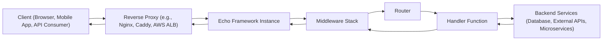
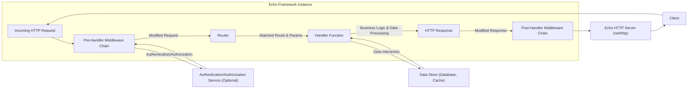

# Project Design Document: Echo Web Framework

**Version:** 1.1
**Date:** October 26, 2023
**Author:** Gemini (AI Language Model)
**Project:** Echo Web Framework (Based on https://github.com/labstack/echo)

## 1. Introduction

This document provides an enhanced design overview of the Echo web framework, building upon the previous version with greater detail and clarity. It outlines the key architectural components, data flow, and important considerations for security and deployment, specifically tailored for threat modeling activities.

## 2. Goals

*   Provide a comprehensive and detailed understanding of the Echo framework's architecture, suitable for security analysis.
*   Clearly identify key components, their specific responsibilities, and their interactions.
*   Elaborate on the typical request/response lifecycle with finer granularity.
*   Explicitly highlight areas of security concern and potential vulnerabilities for effective threat identification.

## 3. Target Audience

This document is intended for:

*   Security engineers and architects responsible for threat modeling and security assessments.
*   Developers building, maintaining, or extending applications using the Echo framework.
*   Operations and DevOps teams involved in deploying, managing, and securing Echo-based applications.

## 4. System Overview

Echo is a high-performance, extensible, minimalist Go web framework optimized for building robust and scalable web applications and RESTful APIs. Its design emphasizes simplicity, speed, and developer productivity.

## 5. Detailed Design

### 5.1. Core Components (Detailed Breakdown)

*   **Server (Underlying `net/http`):**
    *   Listens for incoming network connections on a specified port and address.
    *   Manages the lifecycle of HTTP connections (accepting, reading requests, sending responses, closing).
    *   Echo leverages the standard Go `net/http` package, providing flexibility but also inheriting its characteristics and potential vulnerabilities.
*   **Router (Dynamic Tree-based):**
    *   Receives the incoming request path and HTTP method.
    *   Efficiently matches the request to a registered route definition using a prefix tree (Trie) structure.
    *   Supports route parameters (e.g., `/users/:id`) and wildcard routes.
    *   Responsible for extracting route parameters and making them available to the handler.
    *   Potential vulnerability: Incorrectly defined or overly broad routes can lead to unintended handler execution.
*   **Handler Function (`echo.HandlerFunc`):**
    *   Contains the core business logic for processing a specific request.
    *   Receives an `echo.Context` object providing access to request details and response methods.
    *   Responsible for interacting with backend services, performing data processing, and generating the response.
    *   Security critical: This is where input validation, authorization checks, and secure coding practices must be implemented.
*   **Context (`echo.Context`):**
    *   Provides a unified interface to access request and response information.
    *   Offers methods to:
        *   Read request headers, query parameters, and request body.
        *   Set response headers, status codes, and response body.
        *   Access route parameters.
        *   Store and retrieve request-scoped data.
        *   Bind request data to Go structs.
        *   Render responses in various formats.
    *   Crucial for security: Improper handling of data within the context can lead to vulnerabilities.
*   **Middleware (`echo.MiddlewareFunc`):**
    *   Functions that intercept and process requests and responses.
    *   Executed in a defined order, forming a chain of responsibility.
    *   Can perform tasks such as:
        *   Logging requests.
        *   Authenticating users.
        *   Authorizing access.
        *   Modifying request or response data.
        *   Handling errors.
        *   Setting security headers.
    *   Security implications: Vulnerabilities in middleware can affect all routes it applies to. Incorrectly ordered middleware can bypass security checks.
*   **Renderer (`echo.Renderer`):**
    *   An interface for rendering responses in different formats (JSON, HTML, XML, etc.).
    *   Helps separate presentation logic from handler logic.
    *   Echo provides default renderers and allows for custom implementations.
    *   Security concern: Improper encoding or escaping of data during rendering can lead to XSS vulnerabilities.
*   **Binder (`echo.Binder`):**
    *   Responsible for parsing request data (query parameters, form data, request body) and mapping it to Go structs.
    *   Supports various content types (JSON, XML, form data).
    *   Security implications:  Vulnerabilities in the binder can lead to denial-of-service or unexpected behavior if malformed data is processed. Lack of input sanitization during binding can be problematic.
*   **Validator (`echo.Validator`):**
    *   An interface for validating the structure and content of request data.
    *   Often used in conjunction with the Binder to ensure data integrity.
    *   Echo allows integration with various validation libraries.
    *   Critical for security: Proper validation prevents invalid or malicious data from reaching the handler.
*   **Logger (`echo.Logger`):**
    *   Provides a standardized way to log events within the framework.
    *   Supports different log levels (debug, info, warning, error).
    *   Important for security auditing and incident response. Ensure sensitive information is not logged.
*   **HTTP Error Handler (`echo.HTTPErrorHandler`):**
    *   A function that handles errors occurring during request processing.
    *   Allows customization of error responses based on the error type and context.
    *   Security concern:  Excessive error details in responses can leak sensitive information.

### 5.2. Request/Response Lifecycle (Granular View)

1. **Client Initiates Request:** The client (browser, API consumer) sends an HTTP request targeting a specific resource on the server.
2. **Reverse Proxy Handles Connection (Optional):** The reverse proxy intercepts the request, potentially performing TLS termination, load balancing, request routing, and caching.
3. **Echo Server Receives Request:** The underlying Go HTTP server within the Echo instance accepts the connection and reads the incoming request.
4. **Request Context Creation:** Echo creates an `echo.Context` object associated with the current request, encapsulating request details and providing response utilities.
5. **Pre-Handler Middleware Execution:** The configured middleware stack is executed sequentially. Each middleware function receives the `echo.Context` and can:
    *   Inspect and modify the request.
    *   Perform authentication or authorization checks.
    *   Set request-scoped data.
    *   Terminate the request early by sending a response.
6. **Routing Decision:** The Router analyzes the request method and path.
7. **Route Matching:** The Router attempts to find a matching route definition based on the request path and method.
8. **Parameter Extraction:** If a match is found, path parameters defined in the route are extracted from the URL.
9. **Handler Invocation:** The handler function associated with the matched route is invoked, receiving the `echo.Context`.
10. **Handler Logic Execution:** The handler function performs the core application logic:
    *   Accessing request data from the `echo.Context`.
    *   Interacting with backend services (databases, external APIs).
    *   Performing business logic.
11. **Response Generation (within Handler):** The handler generates the HTTP response:
    *   Setting response headers using `c.Response().Header().Set()`.
    *   Setting the HTTP status code using `c.Response().WriteHeader()`.
    *   Writing the response body using methods like `c.String()`, `c.JSON()`, `c.Render()`.
12. **Post-Handler Middleware Execution:** The middleware stack is executed in reverse order. Each middleware function can:
    *   Inspect and modify the response.
    *   Add or modify response headers.
    *   Perform logging or cleanup tasks.
13. **Response Transmission:** The Echo server sends the constructed HTTP response back to the client, potentially through the reverse proxy.

### 5.3. Data Flow Diagram (Enhanced)

### 5.4. Key Interfaces and Abstractions

*   `echo.HandlerFunc`:  Defines the signature for handler functions that process incoming requests.
*   `echo.MiddlewareFunc`: Defines the signature for middleware functions that intercept requests and responses.
*   `echo.Group`: Allows grouping routes under a common path prefix and applying middleware specifically to that group. Enhances organization and security policy enforcement.
*   `echo.Binder`:  Interface responsible for binding request data to Go structs. Implementations handle different content types.
*   `echo.Renderer`: Interface for rendering responses in various formats. Enables separation of concerns and content negotiation.
*   `echo.Logger`: Interface for logging framework events. Allows customization of logging output and destinations.
*   `echo.Validator`: Interface for validating request data. Integrates with external validation libraries for robust input validation.
*   `echo.HTTPErrorHandler`: Interface for customizing how HTTP errors are handled and presented to the client.

## 6. Security Considerations (Detailed and Actionable)

This section provides a more detailed breakdown of security considerations relevant for threat modeling, linking them to potential vulnerabilities and mitigation strategies.

*   **Input Validation Vulnerabilities:**
    *   **Risk:** Injection attacks (SQL, command, OS command, header injection), cross-site scripting (XSS), path traversal, denial-of-service (DoS) through oversized payloads.
    *   **Mitigation:** Implement robust input validation within handler functions or dedicated validation middleware using the `echo.Validator` interface or external libraries. Sanitize and escape user-provided data before using it in queries or rendering it in responses.
*   **Authentication and Authorization Flaws:**
    *   **Risk:** Unauthorized access to resources, privilege escalation, data breaches.
    *   **Mitigation:** Implement strong authentication mechanisms (e.g., JWT, OAuth 2.0) using dedicated middleware. Enforce the principle of least privilege through fine-grained authorization checks based on roles or permissions. Avoid relying solely on client-side validation.
*   **Session Management Weaknesses:**
    *   **Risk:** Session hijacking, session fixation, replay attacks.
    *   **Mitigation:** Use secure session management techniques (e.g., HTTP-only, Secure flags on cookies). Implement session timeouts and regular session rotation. Consider using a secure session store (e.g., Redis, database).
*   **Cross-Site Scripting (XSS) Vulnerabilities:**
    *   **Risk:** Malicious scripts injected into web pages, leading to data theft, session hijacking, and defacement.
    *   **Mitigation:**  Properly escape and sanitize user-generated content before rendering it in HTML responses. Utilize Content Security Policy (CSP) headers to restrict the sources of content the browser is allowed to load.
*   **Cross-Site Request Forgery (CSRF) Vulnerabilities:**
    *   **Risk:**  Unauthorized actions performed on behalf of an authenticated user.
    *   **Mitigation:** Implement CSRF protection mechanisms, such as synchronizer tokens or the SameSite cookie attribute.
*   **HTTP Header Security Misconfigurations:**
    *   **Risk:** Vulnerabilities exploitable due to missing or misconfigured security headers.
    *   **Mitigation:**  Set appropriate security headers (e.g., `Content-Security-Policy`, `Strict-Transport-Security`, `X-Frame-Options`, `X-Content-Type-Options`, `Referrer-Policy`) using middleware.
*   **Error Handling and Information Disclosure:**
    *   **Risk:** Sensitive information about the application's internal workings leaked through error messages.
    *   **Mitigation:** Implement custom error handling logic that logs detailed errors internally but returns generic error messages to the client in production environments.
*   **Dependency Vulnerabilities:**
    *   **Risk:** Security flaws in third-party libraries used by the application.
    *   **Mitigation:** Regularly audit and update dependencies to their latest secure versions. Use dependency management tools to track and manage dependencies.
*   **Rate Limiting and Abuse Prevention Deficiencies:**
    *   **Risk:** Denial-of-service attacks, brute-force attacks, API abuse.
    *   **Mitigation:** Implement rate limiting middleware to restrict the number of requests from a single IP address or user within a given timeframe.
*   **TLS Configuration Issues:**
    *   **Risk:** Man-in-the-middle attacks, eavesdropping.
    *   **Mitigation:** Ensure proper TLS configuration on the reverse proxy or the Echo server itself, using strong ciphers and up-to-date certificates. Enforce HTTPS and use HSTS headers.
*   **Middleware Security Flaws:**
    *   **Risk:** Vulnerabilities introduced by custom or third-party middleware components.
    *   **Mitigation:** Thoroughly review and test all middleware components for potential security issues. Follow secure coding practices when developing custom middleware.

## 7. Deployment Considerations (Security Focused)

*   **Secure Reverse Proxy Configuration:** Ensure the reverse proxy is configured securely, including proper TLS settings, request filtering, and protection against common web attacks.
*   **Container Security:** When using containers, follow security best practices for container image building and runtime configuration. Scan container images for vulnerabilities.
*   **Network Segmentation:** Isolate the Echo application within a secure network segment, limiting access from untrusted networks.
*   **Secrets Management:** Securely manage sensitive information like API keys, database credentials, and TLS certificates using dedicated secrets management solutions. Avoid hardcoding secrets in the application code.
*   **Regular Security Audits and Penetration Testing:** Conduct periodic security assessments and penetration testing to identify and address potential vulnerabilities in the application and its infrastructure.
*   **Monitoring and Security Logging:** Implement comprehensive monitoring and logging to detect and respond to security incidents. Forward logs to a centralized security information and event management (SIEM) system.

## 8. Conclusion

This enhanced design document provides a more granular and security-focused overview of the Echo web framework. By detailing the components, request lifecycle, and security considerations, it aims to equip security engineers and developers with the necessary information for effective threat modeling and the development of secure web applications. Continuous review and updates to this document are recommended as the framework and its ecosystem evolve.