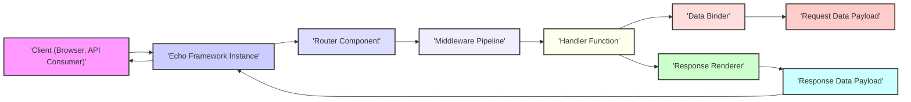
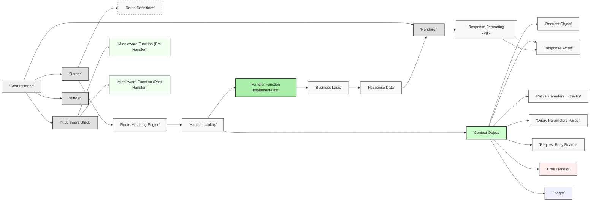

# Project Design Document: Echo Web Framework

**Version:** 1.1
**Date:** October 26, 2023
**Author:** AI Software Architect

## 1. Introduction

This document provides an enhanced architectural design of the [Echo](https://github.com/labstack/echo) web framework, specifically tailored for threat modeling. Building upon the initial design, this version offers greater detail and clarity regarding the framework's components, interactions, and potential security implications. This document will serve as a robust foundation for identifying and mitigating potential threats.

## 2. Goals and Objectives

The primary goal of this document remains to provide a clear and comprehensive architectural overview of the Echo framework, optimized for threat modeling. Specific objectives include:

*   Clearly identifying and describing the core components of the Echo framework and their responsibilities.
*   Illustrating the interactions and data flow between these components with enhanced detail.
*   Providing a comprehensive understanding of the request/response lifecycle within Echo, highlighting potential interception points.
*   Detailing key data flows, data transformation processes, and data handling mechanisms.
*   Establishing a strong foundation for identifying potential security threats, vulnerabilities, and attack vectors within the Echo framework.

## 3. System Architecture

### 3.1. High-Level Architecture

The Echo framework orchestrates the handling of HTTP requests through a series of interconnected components. This diagram illustrates the fundamental flow of a request through the framework.

*   **Client (Browser, API Consumer):**  Any entity initiating an HTTP request to the Echo application. This could be a web browser, a mobile application, or another backend service.
*   **Echo Framework Instance:** The central runtime environment of the Echo framework, managing request processing and component interactions.
*   **Router Component:** Responsible for mapping incoming request URLs and HTTP methods to specific handler functions based on defined routes.
*   **Middleware Pipeline:** An ordered sequence of functions that intercept and process requests before they reach the handler, or responses before they are sent to the client. Middleware can perform tasks like authentication, logging, request modification, and security checks.
*   **Handler Function:** The application-specific code that processes the request, interacts with business logic, and generates the response data.
*   **Data Binder:**  A component that facilitates the mapping of request data (e.g., query parameters, request body) into Go data structures for use within the handler function.
*   **Request Data Payload:** The raw data transmitted by the client as part of the HTTP request.
*   **Response Renderer:**  Responsible for formatting the response data into a specific content type (e.g., JSON, XML, HTML) before sending it back to the client.
*   **Response Data Payload:** The data generated by the handler function that will be sent back to the client in the HTTP response.

### 3.2. Detailed Component Architecture

This diagram provides a more granular view of the internal components within the Echo framework and their interactions during the request lifecycle.

*   **Echo Instance:** The central orchestrator of the framework, managing the lifecycle and interactions of its components.
*   **Router:**  Manages the mapping of incoming requests to their corresponding handler functions.
    *   **Route Definitions:** The set of configured routes, specifying URL patterns, HTTP methods, and associated handler functions. This is a critical area for security misconfigurations.
    *   **Route Matching Engine:** The logic responsible for comparing the incoming request URL against the defined route patterns to find a match. Vulnerabilities here could lead to unintended route access.
*   **Middleware Stack:** An ordered collection of middleware functions executed during the request/response lifecycle.
    *   **Middleware Function (Pre-Handler):** Middleware executed *before* the handler function. Examples include authentication, authorization, logging, and request modification.
    *   **Middleware Function (Post-Handler):** Middleware executed *after* the handler function, but before the response is sent. Examples include adding security headers or performing final logging.
*   **Renderer:**  Handles the serialization of response data into a specific format.
*   **Binder:**  Facilitates the deserialization of request data into Go data structures.
*   **Context Object:** A per-request object that carries request-specific information and utility methods. It provides access to the request, response writer, path parameters, query parameters, and more.
    *   **Request Object:**  Represents the incoming HTTP request, providing access to headers, body, and other request details.
    *   **Response Writer:** An interface for writing the HTTP response, including headers and body.
    *   **Path Parameters Extractor:** Extracts values from the URL path based on route definitions.
    *   **Query Parameters Parser:** Parses query parameters from the URL.
    *   **Request Body Reader:** Provides access to the data sent in the request body.
    *   **Error Handler:**  A component responsible for handling errors that occur during request processing. Custom error handlers can be defined.
    *   **Logger:**  Provides a mechanism for logging events and information within the framework.
*   **Handler Lookup:** The process of identifying the appropriate handler function based on the matched route.
*   **Handler Function Implementation:** The application-specific code that contains the core business logic for processing the request.
*   **Business Logic:** The specific operations and computations performed within the handler function.
*   **Response Data:** The data generated by the handler function to be sent back to the client.
*   **Response Formatting Logic:** The process within the Renderer of converting the response data into the desired format.

## 4. Data Flow

The journey of an HTTP request through the Echo framework can be broken down into the following steps:

1. **Client Initiates Request:** A client sends an HTTP request to the Echo application.
2. **Request Reception:** The Echo framework receives the incoming request via the `net/http` package.
3. **Routing Decision:** The **Router** component analyzes the request's URL path and HTTP method. The **Route Matching Engine** compares this information against the configured **Route Definitions**.
4. **Middleware Execution (Pre-Handler):** If a matching route is found, the **Middleware Stack** begins execution. **Middleware Functions (Pre-Handler)** are executed sequentially, allowing for request inspection, modification, or early termination.
5. **Handler Invocation:** Once the pre-handler middleware has completed, the **Handler Lookup** identifies the appropriate **Handler Function Implementation** based on the matched route. The **Context Object** is created and passed to the handler, providing access to request information.
6. **Data Binding:** Within the handler, the **Binder** component can be used to populate Go data structures with data extracted by the **Path Parameters Extractor**, **Query Parameters Parser**, and **Request Body Reader**.
7. **Business Logic Execution:** The **Handler Function Implementation** executes the **Business Logic**, potentially interacting with databases, external services, or other components.
8. **Response Generation:** The handler generates the **Response Data**.
9. **Middleware Execution (Post-Handler):** After the handler function completes, **Middleware Functions (Post-Handler)** are executed. This allows for actions like adding security headers, logging the response, or modifying the response before it's sent.
10. **Response Rendering:** The **Renderer** component takes the **Response Data** and applies the **Response Formatting Logic** to convert it into the desired content type (e.g., JSON, HTML).
11. **Response Transmission:** The formatted response is written to the **Response Writer** and sent back to the client.
12. **Error Handling (If Applicable):** If an error occurs at any point in the process, the **Error Handler** is invoked to manage the error and generate an appropriate error response. The **Logger** may record details of the error.

## 5. Security Considerations

This section outlines potential security considerations based on the architectural components and data flow.

*   **Router Component:**
    *   **Route Hijacking:**  Vulnerabilities in the **Route Matching Engine** could allow attackers to access unintended routes.
    *   **Exposed Debug Routes:**  Accidental exposure of debugging or administrative routes can provide attackers with sensitive information or control.
*   **Middleware Stack:**
    *   **Authentication and Authorization Bypass:** Improperly implemented or configured authentication/authorization middleware can lead to unauthorized access.
    *   **Injection Vulnerabilities in Middleware:** Middleware that manipulates request data without proper sanitization could introduce injection flaws.
    *   **Information Disclosure via Logging Middleware:** Overly verbose logging middleware might expose sensitive data.
    *   **CORS Misconfiguration:** Incorrectly configured CORS middleware can allow malicious websites to access resources.
*   **Handler Function Implementation:**
    *   **Input Validation Failures:** Lack of proper input validation within the handler can lead to various injection attacks (SQL, command, etc.).
    *   **Business Logic Flaws:** Vulnerabilities in the application's core logic can be exploited.
    *   **Data Exposure:**  Handlers might unintentionally expose sensitive data in responses.
*   **Data Binder:**
    *   **Mass Assignment Vulnerabilities:**  If the binder automatically maps all request parameters to data structures, attackers might be able to modify unintended fields.
    *   **Type Coercion Issues:**  Incorrect handling of data type conversions during binding can lead to unexpected behavior or vulnerabilities.
*   **Renderer:**
    *   **Cross-Site Scripting (XSS):** If the renderer doesn't properly escape user-provided data when generating HTML, it can lead to XSS vulnerabilities.
    *   **Server-Side Template Injection (SSTI):** If template engines are used and user input is directly embedded in templates, SSTI vulnerabilities can arise.
*   **Context Object:**
    *   **Information Leakage:**  Improper handling of the context object might inadvertently leak sensitive information.
*   **Error Handler:**
    *   **Information Disclosure via Error Messages:**  Detailed error messages exposed to clients can reveal sensitive information about the application's internal workings.
*   **Logger:**
    *   **Sensitive Data Logging:**  Accidentally logging sensitive information can create security risks.
    *   **Log Injection:**  If user input is directly included in log messages without sanitization, attackers might be able to inject malicious log entries.

## 6. Deployment Considerations

The security posture of an Echo application can be significantly influenced by its deployment environment.

*   **Bare Metal/Virtual Machines:**
    *   **Security Hardening:** Requires manual configuration and maintenance of server security.
    *   **Network Security:**  Firewall rules and network segmentation are crucial.
*   **Containerization (Docker):**
    *   **Image Security:**  Ensuring the base image and application image are free of vulnerabilities is essential.
    *   **Container Runtime Security:**  Properly configuring the container runtime environment is important.
    *   **Orchestration Security (Kubernetes):**  Securing the container orchestration platform is critical.
*   **Cloud Platforms (AWS, Azure, GCP):**
    *   **Cloud Service Configuration:**  Properly configuring cloud services (e.g., load balancers, firewalls, IAM roles) is crucial.
    *   **Shared Responsibility Model:** Understanding the security responsibilities of the cloud provider and the application owner is vital.
*   **Reverse Proxies (Nginx, Apache):**
    *   **SSL/TLS Termination:**  Properly configuring SSL/TLS certificates and settings is essential for secure communication.
    *   **Security Header Management:** Reverse proxies can be used to enforce security headers.
    *   **Web Application Firewall (WAF):**  Integrating a WAF can provide an additional layer of security against common web attacks.

## 7. Technologies Used

*   **Go Programming Language:** The foundation of the Echo framework, its security best practices should be followed.
*   **net/http package (Go Standard Library):** Understanding the security implications of the underlying HTTP handling mechanisms is important.
*   **Third-party Libraries:**  The security of any third-party libraries used by the application needs to be considered and regularly updated.

## 8. Future Considerations

*   Detailed threat modeling sessions focusing on specific components and data flows identified in this document.
*   Security code reviews to identify potential vulnerabilities in handler implementations and custom middleware.
*   Penetration testing to validate the effectiveness of security controls.
*   Implementation of security best practices and secure coding guidelines throughout the development lifecycle.

This enhanced design document provides a more comprehensive and detailed understanding of the Echo web framework's architecture, specifically for the purpose of threat modeling. The detailed component breakdown, data flow analysis, and expanded security considerations offer a strong foundation for identifying and mitigating potential security risks.