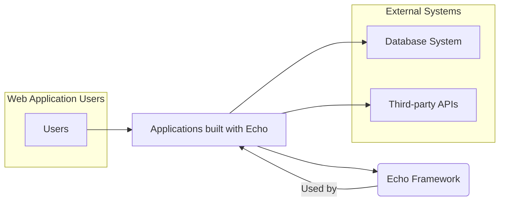
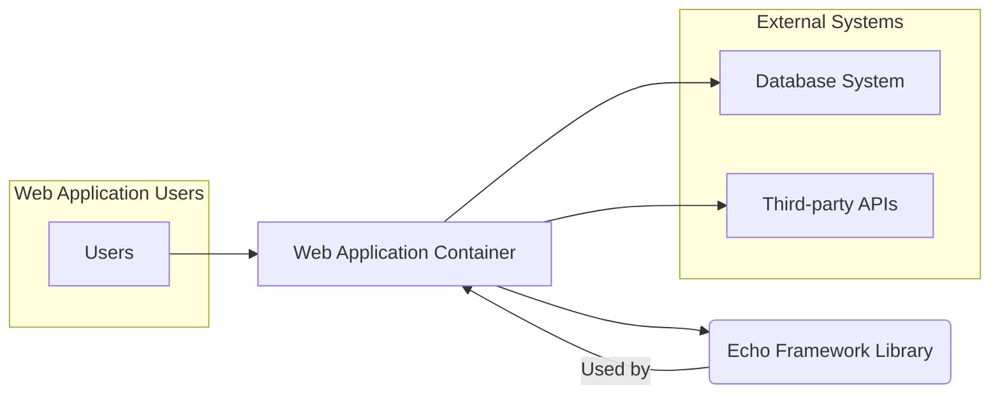
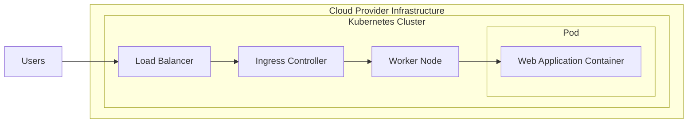

# BUSINESS POSTURE

This project, represented by the GitHub repository 'labstack/echo', is a high-performance, extensible, minimalist Go web framework.

- Business priorities and goals:
  - Provide a fast and efficient web framework for Go developers.
  - Offer a simple and easy-to-use API to accelerate web application development.
  - Enable extensibility through middleware and plugins to cater to diverse needs.
  - Foster a vibrant community and ecosystem around the framework.
  - Ensure stability and reliability for production use.

- Most important business risks:
  - Security vulnerabilities in the framework could compromise applications built upon it, leading to data breaches, service disruption, or reputational damage.
  - Performance bottlenecks in the framework could negatively impact application performance and user experience.
  - Lack of adoption or community support could lead to project stagnation and reduced value for users.
  - Breaking changes in new releases could disrupt existing applications and increase maintenance overhead.
  - Inadequate documentation or examples could hinder adoption and developer productivity.

# SECURITY POSTURE

- Existing security controls:
  - security control: Input validation is expected to be implemented by developers using the framework within their applications.
  - security control: Protection against common web vulnerabilities (e.g., XSS, CSRF) is expected to be handled by developers using the framework and potentially through provided middleware.
  - security control: Dependency management is handled by Go modules, which helps in tracking and updating dependencies, but security scanning of dependencies is not explicitly mentioned as part of the framework itself.
  - security control: Secure coding practices are expected to be followed by the framework developers, although no specific security audit reports or secure development lifecycle documentation are publicly available in the repository.
  - accepted risk: Lack of built-in security features beyond basic routing and middleware capabilities. Security is largely the responsibility of the developers using the framework.
  - accepted risk: Reliance on community contributions for security-related middleware and best practices. The quality and security of these contributions may vary.
  - accepted risk: No explicit security testing or vulnerability scanning process is documented as part of the framework's development lifecycle.

- Recommended security controls:
  - security control: Implement automated security scanning (SAST/DAST) in the framework's CI/CD pipeline to identify potential vulnerabilities early in the development process.
  - security control: Conduct regular security audits and penetration testing of the framework by external security experts.
  - security control: Establish a clear vulnerability disclosure and response process to handle security issues reported by the community or identified internally.
  - security control: Provide secure defaults and guidance for developers on implementing common security features in their applications (e.g., rate limiting, input sanitization, output encoding).
  - security control: Offer security-focused middleware components for common security tasks (e.g., CORS, Helmet, rate limiting) as part of the framework or as officially recommended extensions.

- Security requirements:
  - Authentication:
    - Applications built with the framework will likely require authentication mechanisms.
    - The framework should provide flexible mechanisms to integrate various authentication strategies (e.g., JWT, OAuth 2.0, session-based authentication) through middleware.
    - Security control: Developers are responsible for implementing authentication logic within their applications, leveraging framework's middleware capabilities.
  - Authorization:
    - Applications will need authorization to control access to resources based on user roles or permissions.
    - The framework should facilitate the implementation of authorization logic, possibly through middleware or helper functions.
    - Security control: Developers are responsible for implementing authorization logic within their applications, potentially using middleware for role-based access control or policy enforcement.
  - Input validation:
    - The framework must provide mechanisms for developers to easily validate user inputs to prevent injection attacks and data integrity issues.
    - This includes validating request parameters, headers, and body data.
    - Security control: Developers are responsible for implementing input validation in their handlers and middleware, using framework's request context and validation libraries.
  - Cryptography:
    - Applications may require cryptographic operations for data protection, such as encryption, hashing, and digital signatures.
    - The framework should not impose specific cryptographic libraries but should be compatible with standard Go crypto libraries.
    - Security control: Developers are responsible for implementing cryptographic operations using Go's standard libraries or other crypto libraries as needed within their applications.

# DESIGN

## C4 CONTEXT



- Context Diagram Elements:
  - - Name: Users
    - Type: Person
    - Description: End-users who interact with web applications built using the Echo framework.
    - Responsibilities: Accessing and using web applications.
    - Security controls: User authentication and authorization implemented in applications.
  - - Name: Database System
    - Type: External System
    - Description: Databases used by applications built with Echo to store and retrieve data. Examples include PostgreSQL, MySQL, MongoDB.
    - Responsibilities: Data persistence, storage, and retrieval for applications.
    - Security controls: Database access controls, encryption at rest and in transit, database firewalls, managed by database administrators or cloud providers.
  - - Name: Third-party APIs
    - Type: External System
    - Description: External services and APIs that applications built with Echo may integrate with, such as payment gateways, social media platforms, or other microservices.
    - Responsibilities: Providing external functionalities and data to applications.
    - Security controls: API authentication and authorization (API keys, OAuth), secure communication protocols (HTTPS), rate limiting, managed by third-party API providers.
  - - Name: Echo Framework
    - Type: Software System
    - Description: The 'labstack/echo' Go web framework, providing core functionalities for building web applications.
    - Responsibilities: Routing HTTP requests, handling middleware, providing context and utilities for web development.
    - Security controls: Secure coding practices in framework development, input validation mechanisms provided to developers, dependency management.
  - - Name: Applications built with Echo
    - Type: Software System
    - Description: Web applications developed by developers using the Echo framework. These are the systems that directly interact with users and external systems.
    - Responsibilities: Implementing specific business logic, handling user requests, interacting with databases and external APIs, providing user interfaces.
    - Security controls: Authentication, authorization, input validation, output encoding, secure session management, vulnerability scanning, implemented by application developers.

## C4 CONTAINER



- Container Diagram Elements:
  - - Name: Web Application Container
    - Type: Application Runtime Container
    - Description: Represents the runtime environment where applications built with Echo are deployed. This could be a Docker container, a virtual machine, or a server instance. It hosts the application code and the Echo framework library.
    - Responsibilities: Running the application, handling HTTP requests, managing application dependencies, providing runtime environment.
    - Security controls: Container image scanning, runtime security monitoring, network policies, resource limits, operating system hardening, managed by DevOps/SRE teams or cloud providers.
  - - Name: Echo Framework Library
    - Type: Library
    - Description: The 'labstack/echo' Go library, which is included as a dependency in web applications. It provides the core functionalities of the framework.
    - Responsibilities: Providing routing, middleware support, context handling, and other web framework features to the application.
    - Security controls: Secure coding practices in library development, vulnerability scanning of dependencies, code reviews, managed by framework developers.

## DEPLOYMENT

Deployment Architecture: Containerized Cloud Deployment



- Deployment Diagram Elements:
  - - Name: Load Balancer
    - Type: Infrastructure
    - Description: Cloud provider's load balancer distributing incoming traffic across multiple Ingress Controllers.
    - Responsibilities: Traffic distribution, high availability, SSL termination.
    - Security controls: DDoS protection, SSL/TLS configuration, access control lists, managed by cloud provider.
  - - Name: Ingress Controller
    - Type: Application
    - Description: Kubernetes Ingress Controller routing external HTTP/HTTPS traffic to the appropriate services within the cluster.
    - Responsibilities: Routing, path-based routing, SSL termination, load balancing within the cluster.
    - Security controls: Ingress controller configuration, rate limiting, WAF integration, managed by DevOps/SRE teams.
  - - Name: Worker Node
    - Type: Infrastructure
    - Description: Kubernetes worker nodes hosting pods and containers.
    - Responsibilities: Running containers, providing compute resources, network connectivity.
    - Security controls: Operating system hardening, security patching, network segmentation, node security monitoring, managed by DevOps/SRE teams or cloud providers.
  - - Name: Web Application Container
    - Type: Container
    - Description: Docker container running the web application built with Echo framework.
    - Responsibilities: Serving web application, handling requests, application logic execution.
    - Security controls: Container image scanning, runtime security policies, resource limits, application-level security controls, managed by DevOps/SRE teams and application developers.

## BUILD

```mermaid
flowchart LR
    A[Developer] --> B{Code Changes};
    B --> C[Version Control System (GitHub)];
    C --> D[CI/CD Pipeline (GitHub Actions)];
    D --> E{Build Stage};
    E --> F{Test Stage};
    F --> G{Security Scan Stage (SAST, Dependency Check)};
    G --> H[Artifact Repository (Container Registry)];
    H --> I[Deployment Environment];
```

- Build Process Elements:
  - - Name: Developer
    - Type: Person
    - Description: Software developer writing and modifying code for applications built with Echo.
    - Responsibilities: Writing secure code, committing code changes, participating in code reviews.
    - Security controls: Secure development training, code review process, IDE security plugins.
  - - Name: Version Control System (GitHub)
    - Type: Tool
    - Description: GitHub repository hosting the source code of the application.
    - Responsibilities: Source code management, version control, collaboration, code review.
    - Security controls: Access control, branch protection, audit logs, managed by development team and GitHub.
  - - Name: CI/CD Pipeline (GitHub Actions)
    - Type: Tool
    - Description: Automated CI/CD pipeline using GitHub Actions to build, test, and deploy the application.
    - Responsibilities: Build automation, testing, security scanning, deployment automation.
    - Security controls: Pipeline configuration as code, secret management, access control, audit logs, managed by DevOps/SRE teams.
  - - Name: Build Stage
    - Type: Process
    - Description: Compilation and packaging of the application code into build artifacts (e.g., Docker image).
    - Responsibilities: Code compilation, dependency resolution, artifact creation.
    - Security controls: Build environment hardening, dependency management, build process integrity.
  - - Name: Test Stage
    - Type: Process
    - Description: Automated testing of the built application artifacts (e.g., unit tests, integration tests).
    - Responsibilities: Ensuring code quality, identifying functional defects.
    - Security controls: Test case coverage, test environment security.
  - - Name: Security Scan Stage (SAST, Dependency Check)
    - Type: Process
    - Description: Automated security scanning of the code and dependencies for vulnerabilities using SAST tools and dependency checkers.
    - Responsibilities: Identifying potential security vulnerabilities in code and dependencies.
    - Security controls: SAST tool configuration, dependency vulnerability database updates, vulnerability reporting.
  - - Name: Artifact Repository (Container Registry)
    - Type: Tool
    - Description: Container registry storing built Docker images.
    - Responsibilities: Storing and managing container images, image versioning.
    - Security controls: Access control, image signing, vulnerability scanning of stored images, managed by DevOps/SRE teams or cloud providers.
  - - Name: Deployment Environment
    - Type: Environment
    - Description: Target environment where the application is deployed (e.g., Kubernetes cluster).
    - Responsibilities: Running application instances, serving user requests.
    - Security controls: Deployment environment security controls as described in the DEPLOYMENT section.

# RISK ASSESSMENT

- Critical business process: Development and operation of web applications using the Echo framework. Disruption or compromise of these applications can impact business operations, customer services, and data integrity.

- Data to protect and sensitivity:
  - Framework source code: Sensitive intellectual property. Confidentiality and integrity are important to maintain the framework's value and prevent unauthorized modifications.
  - Application code built with Echo: Sensitivity depends on the application. Could include sensitive business logic, user data, and credentials. Confidentiality, integrity, and availability are critical.
  - User data processed by applications: Sensitivity varies greatly depending on the application. Could include personal identifiable information (PII), financial data, health records, etc. Confidentiality, integrity, and availability are paramount, often subject to regulatory compliance (e.g., GDPR, HIPAA).
  - Infrastructure and configuration data: Sensitive information about the deployment environment, including credentials, network configurations, and access policies. Confidentiality and integrity are crucial to prevent unauthorized access and system compromise.

# QUESTIONS & ASSUMPTIONS

- Questions:
  - What are the primary use cases and target audience for applications built with the Echo framework? (e.g., public-facing websites, internal APIs, microservices)
  - What are the typical deployment environments for applications built with Echo? (e.g., cloud providers, on-premises data centers, serverless platforms)
  - What are the specific security requirements and compliance obligations for applications built with Echo? (e.g., GDPR, PCI DSS, HIPAA)
  - Is there an existing security policy or framework that the project should adhere to?
  - Are there any specific threat actors or attack vectors that are of particular concern?

- Assumptions:
  - BUSINESS POSTURE: The primary business goal is to provide a general-purpose, high-performance web framework for Go developers.
  - SECURITY POSTURE: Security is a shared responsibility between the framework developers and application developers. The framework provides basic building blocks, but application developers are responsible for implementing comprehensive security measures. No specific security audits or certifications are currently in place for the framework itself.
  - DESIGN: Applications built with Echo are typically deployed in containerized environments, often using Kubernetes in cloud environments. The build process involves standard Go tooling and CI/CD practices.