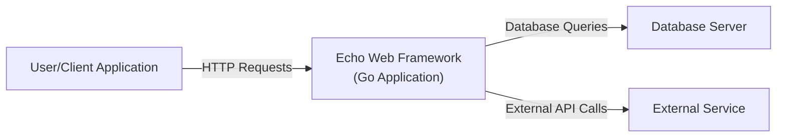
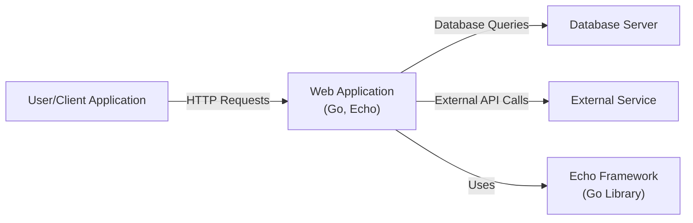
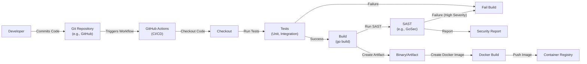

# BUSINESS POSTURE

Business Priorities and Goals:

*   Provide a high-performance, extensible, minimalist web framework for Go.
*   Offer a fast and efficient HTTP router.
*   Simplify common web development tasks like handling requests, responses, middleware, and context.
*   Maintain a small and easy-to-understand codebase.
*   Enable developers to quickly build robust and scalable web applications and APIs.
*   Provide good documentation and examples.
*   Foster a community around the project.

Business Risks:

*   Vulnerabilities in the framework could lead to widespread exploitation of applications built using it.
*   Performance bottlenecks could impact the scalability and responsiveness of applications.
*   Lack of essential features could limit adoption.
*   Poor documentation or support could hinder developer productivity.
*   Competition from other Go web frameworks could reduce market share.
*   Inability to adapt to evolving web development trends.

# SECURITY POSTURE

Existing Security Controls:

*   security control: Middleware support for common security practices (e.g., CORS, CSRF protection, XSS protection, etc.). Implemented in the framework's middleware components.
*   security control: Context handling to manage request-scoped data securely. Implemented in the framework's context management.
*   security control: Secure defaults (where applicable). Implemented throughout the framework's design.
*   security control: Regular updates and security patches. Described in the project's release cycle and vulnerability reporting guidelines.
*   security control: Community contributions and scrutiny. Described in the project's contribution guidelines and open-source nature.

Accepted Risks:

*   accepted risk: The framework itself does not handle all aspects of application security. Developers are responsible for implementing appropriate security measures within their applications.
*   accepted risk: The framework relies on third-party dependencies, which may have their own vulnerabilities.
*   accepted risk: The framework's performance optimizations might introduce subtle security risks if not carefully implemented.

Recommended Security Controls:

*   security control: Integrate with static analysis tools (e.g., GoSec) to automatically detect potential vulnerabilities during development.
*   security control: Provide built-in support for input validation and sanitization.
*   security control: Offer detailed security documentation and best practices guides.
*   security control: Implement a robust security vulnerability disclosure program.
*   security control: Regularly conduct security audits and penetration testing.
*   security control: Provide options for secure session management.
*   security control: Consider adding built-in support for rate limiting and other anti-abuse measures.

Security Requirements:

*   Authentication: The framework should provide mechanisms or integration points for implementing various authentication schemes (e.g., API keys, JWT, OAuth 2.0).
*   Authorization: The framework should facilitate the implementation of authorization logic to control access to resources.
*   Input Validation: The framework should encourage or provide utilities for validating and sanitizing all user inputs to prevent injection attacks.
*   Cryptography: The framework should provide or recommend secure cryptographic practices for handling sensitive data (e.g., password hashing, encryption).
*   Output Encoding: The framework should provide or recommend output encoding to prevent XSS.

# DESIGN

## C4 CONTEXT

C4 Context Element List:

*   Element:
    *   Name: User/Client Application
    *   Type: External Entity (User/System)
    *   Description: Represents any user or client application interacting with the web application built using the Echo framework.
    *   Responsibilities: Initiates HTTP requests to the Echo framework.
    *   Security controls: Implements client-side security measures (e.g., browser security, secure coding practices).

*   Element:
    *   Name: Echo Web Framework (Go Application)
    *   Type: System
    *   Description: The core web application built using the Echo framework.
    *   Responsibilities: Handles HTTP requests, processes business logic, interacts with databases and external services, and returns HTTP responses.
    *   Security controls: Implements server-side security measures (e.g., input validation, authentication, authorization, output encoding, middleware for security headers).

*   Element:
    *   Name: Database Server
    *   Type: External System
    *   Description: Represents a database server used by the Echo application.
    *   Responsibilities: Stores and retrieves data for the application.
    *   Security controls: Implements database security measures (e.g., access control, encryption, auditing).

*   Element:
    *   Name: External Service
    *   Type: External System
    *   Description: Represents any external service that the Echo application interacts with.
    *   Responsibilities: Provides specific functionalities or data to the application.
    *   Security controls: Implements security measures specific to the external service.

## C4 CONTAINER

C4 Container Element List:

*   Element:
    *   Name: User/Client Application
    *   Type: External Entity (User/System)
    *   Description: Represents any user or client application interacting with the web application.
    *   Responsibilities: Initiates HTTP requests to the web application.
    *   Security controls: Implements client-side security measures.

*   Element:
    *   Name: Web Application (Go, Echo)
    *   Type: Container (Application)
    *   Description: The main web application built using the Echo framework. This container encapsulates the application's logic.
    *   Responsibilities: Handles HTTP requests, processes business logic, interacts with the database and external services, and returns HTTP responses.
    *   Security controls: Implements server-side security measures (input validation, authentication, authorization, output encoding, middleware).

*   Element:
    *   Name: Database Server
    *   Type: Container (Database)
    *   Description: The database server used by the web application.
    *   Responsibilities: Stores and retrieves data.
    *   Security controls: Implements database security measures (access control, encryption, auditing).

*   Element:
    *   Name: External Service
    *   Type: Container (External System)
    *   Description: Any external service the web application interacts with.
    *   Responsibilities: Provides specific functionalities or data.
    *   Security controls: Implements security measures specific to the external service.

*   Element:
    *   Name: Echo Framework (Go Library)
    *   Type: Container (Library)
    *   Description: The Echo framework itself, a Go library used by the web application.
    *   Responsibilities: Provides core web framework functionalities (routing, middleware, context handling, etc.).
    *   Security controls: Provides built-in security features and middleware.

## DEPLOYMENT

Possible Deployment Solutions:

1.  Traditional Server Deployment: Deploy the compiled Go binary to a physical or virtual server.
2.  Containerized Deployment (Docker): Package the application and its dependencies into a Docker container and deploy it to a container orchestration platform (e.g., Kubernetes, Docker Swarm).
3.  Platform as a Service (PaaS): Deploy the application to a PaaS provider (e.g., Heroku, Google App Engine, AWS Elastic Beanstalk).
4.  Serverless Deployment: Deploy the application as serverless functions (e.g., AWS Lambda, Google Cloud Functions, Azure Functions).

Chosen Solution: Containerized Deployment (Docker with Kubernetes)

```mermaid
graph LR
    Developer["Developer"] -- "Commits Code" --> GitRepo["Git Repository"]
    GitRepo -- "Triggers Build" --> CI["CI/CD Pipeline\n(e.g., GitHub Actions)"]
    CI -- "Builds Docker Image" --> DockerImage["Docker Image"]
    DockerImage -- "Pushed to" --> ContainerRegistry["Container Registry\n(e.g., Docker Hub, ECR)"]
    ContainerRegistry -- "Pulled by" --> KubernetesCluster["Kubernetes Cluster"]
    KubernetesCluster -- "Runs" --> Pod["Pod\n(Echo Application)"]
    Pod -- "Exposes" --> Service["Kubernetes Service"]
    Service -- "Routes Traffic" --> Ingress["Ingress Controller"]
    Ingress -- "External Access" --> User["User/Client"]
    Pod -- "Connects to" --> Database["Database\n(e.g., PostgreSQL)"]

```

Deployment Element List:

*   Element:
    *   Name: Developer
    *   Type: External Entity (User)
    *   Description: The developer who writes and commits code.
    *   Responsibilities: Develops and maintains the application code.
    *   Security controls: Follows secure coding practices.

*   Element:
    *   Name: Git Repository
    *   Type: System
    *   Description: The source code repository (e.g., GitHub, GitLab).
    *   Responsibilities: Stores the application's source code.
    *   Security controls: Access control, branch protection rules.

*   Element:
    *   Name: CI/CD Pipeline (e.g., GitHub Actions)
    *   Type: System
    *   Description: The continuous integration and continuous deployment pipeline.
    *   Responsibilities: Automates the build, test, and deployment process.
    *   Security controls: Secure configuration, secrets management, SAST/DAST integration.

*   Element:
    *   Name: Docker Image
    *   Type: Artifact
    *   Description: The packaged application and its dependencies.
    *   Responsibilities: Provides a consistent and reproducible runtime environment.
    *   Security controls: Image scanning, minimal base image.

*   Element:
    *   Name: Container Registry (e.g., Docker Hub, ECR)
    *   Type: System
    *   Description: Stores and manages Docker images.
    *   Responsibilities: Provides a central repository for application images.
    *   Security controls: Access control, image signing.

*   Element:
    *   Name: Kubernetes Cluster
    *   Type: System
    *   Description: The container orchestration platform.
    *   Responsibilities: Manages the deployment and scaling of application containers.
    *   Security controls: Network policies, RBAC, pod security policies.

*   Element:
    *   Name: Pod (Echo Application)
    *   Type: Runtime Instance
    *   Description: A running instance of the Echo application container.
    *   Responsibilities: Handles incoming requests.
    *   Security controls: Resource limits, security context.

*   Element:
    *   Name: Kubernetes Service
    *   Type: Abstraction
    *   Description: Provides a stable endpoint for accessing the application pods.
    *   Responsibilities: Load balances traffic across pods.
    *   Security controls: Network policies.

*   Element:
    *   Name: Ingress Controller
    *   Type: System
    *   Description: Manages external access to the Kubernetes services.
    *   Responsibilities: Routes external traffic to the appropriate services.
    *   Security controls: TLS termination, access control.

*   Element:
    *   Name: User/Client
    *   Type: External Entity (User/System)
    *   Description: The user or client application accessing the deployed application.
    *   Responsibilities: Initiates requests to the application.
    *   Security controls: Client-side security measures.

*   Element:
    *   Name: Database (e.g., PostgreSQL)
    *   Type: System
    *   Description: The database used by the application. Could be managed within or outside the Kubernetes cluster.
    *   Responsibilities: Stores and retrieves data.
    *   Security controls: Database security measures (access control, encryption, auditing).

## BUILD

Build Process Description:

1.  Developer commits code to the Git repository (e.g., GitHub).
2.  The commit triggers a GitHub Actions workflow (CI/CD pipeline).
3.  The workflow checks out the code.
4.  The workflow runs unit and integration tests.
5.  If tests fail, the build fails.
6.  If tests pass, the workflow builds the Go application (go build).
7.  A Static Application Security Testing (SAST) tool (e.g., GoSec) is run against the code.
8.  The SAST tool generates a security report.
9.  If the SAST tool finds high-severity vulnerabilities, the build fails.
10. If the build is successful, a Docker image is created.
11. The Docker image is pushed to a container registry.

Build Security Controls:

*   security control: Automated build process using GitHub Actions.
*   security control: Unit and integration tests to ensure code quality and prevent regressions.
*   security control: SAST (GoSec) integration to identify potential vulnerabilities.
*   security control: Build failure on high-severity SAST findings.
*   security control: Docker image creation for consistent and reproducible deployments.
*   security control: Use of a container registry for secure image storage and management.

# RISK ASSESSMENT

Critical Business Processes:

*   Serving web requests and API endpoints.
*   Processing user data.
*   Interacting with databases and external services.

Data to Protect and Sensitivity:

*   User data (potentially including PII, credentials, financial information): High sensitivity.
*   Application data (business logic data, configuration data): Variable sensitivity, depending on the specific application.
*   Session data: High sensitivity.
*   API keys and secrets: High sensitivity.

# QUESTIONS & ASSUMPTIONS

Questions:

*   What specific types of user data will be handled by applications built with Echo?
*   What are the specific external services that applications built with Echo will commonly interact with?
*   What are the expected traffic patterns and scalability requirements for applications built with Echo?
*   What is the preferred method for managing secrets (e.g., environment variables, secrets management service)?
*   Are there any specific compliance requirements (e.g., GDPR, HIPAA, PCI DSS) that need to be considered?
*   What level of logging and monitoring is required?
*   What is the expected deployment environment (cloud provider, on-premise, etc.)?

Assumptions:

*   BUSINESS POSTURE: The primary goal is to provide a fast and efficient web framework. Security is a high priority, but performance should not be significantly sacrificed.
*   SECURITY POSTURE: Developers using Echo are responsible for implementing application-specific security measures. The framework provides building blocks and secure defaults, but it's not a "security out of the box" solution.
*   DESIGN: The deployment environment will be containerized using Docker and Kubernetes. The build process will be automated using GitHub Actions. The application will likely interact with a database and potentially other external services.