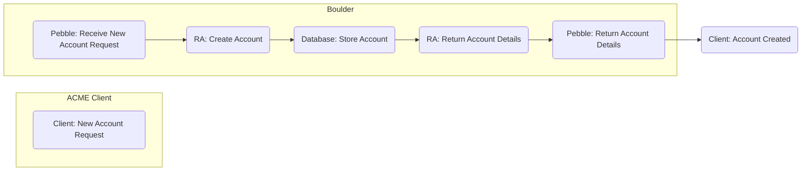
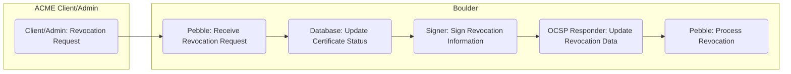
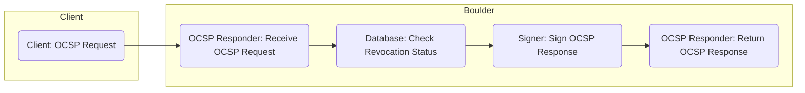

# Project Design Document: Boulder ACME Certificate Authority

**Version:** 1.1
**Date:** October 26, 2023
**Author:** AI Software Architect

## 1. Introduction

This document provides an enhanced architectural design of the Boulder project, the ACME Certificate Authority (CA) server developed by Let's Encrypt. This revised document aims to provide a more granular understanding of the system's components, their interactions, and the overall architecture, specifically tailored for subsequent threat modeling activities.

This design is based on the publicly available source code repository: [https://github.com/letsencrypt/boulder](https://github.com/letsencrypt/boulder).

## 2. Goals and Objectives

The primary goals of the Boulder project are:

* **Automated Certificate Management:** Implement the Automated Certificate Management Environment (ACME) protocol (RFC 8555) to automate the process of obtaining and renewing TLS/SSL certificates.
* **Scalability and Reliability:** Design a system capable of handling a large volume of certificate requests and maintaining high availability with minimal downtime.
* **Security:** Ensure the security and integrity of the certificate issuance process, the private keys involved, and the confidentiality of user data.
* **Compliance:** Adhere to relevant industry standards and best practices for certificate authorities, including those defined by the CA/Browser Forum.
* **Open Source:** Provide a transparent and auditable implementation of an ACME CA, fostering community trust and scrutiny.

## 3. High-Level Architecture

Boulder employs a microservices-oriented architecture, with well-defined components responsible for specific functionalities. These components communicate via APIs and rely on a shared database for persistent storage.

* **Key Components:**
    * **`va` (Validation Authority):**  The component responsible for executing and verifying domain control validation (DCV) challenges.
    * **`pebble` (ACME Server):** The central ACME protocol endpoint, responsible for handling client requests, managing state, and orchestrating the certificate issuance lifecycle.
    * **`ra` (Registration Authority):** Manages ACME account registration, key management, and associated account metadata.
    * **`caa-responder`:**  Handles Certificate Authority Authorization (CAA) record lookups to ensure certificate issuance complies with domain owner policies.
    * **`signer`:**  Performs the critical cryptographic signing operations for issuing certificates, Certificate Revocation Lists (CRLs), and OCSP responses.
    * **`ocsp-responder`:** Provides Online Certificate Status Protocol (OCSP) responses, allowing clients to check the revocation status of certificates in real-time.
    * **Database:** A persistent storage layer for accounts, authorizations, orders, certificates, and revocation information.
    * **Metrics and Monitoring:** Components responsible for collecting, aggregating, and exposing system metrics for operational monitoring and alerting.

* **External Interactions:**
    * **ACME Clients:** Software agents running on web servers or other systems that interact with Boulder via the ACME protocol to request and manage certificates.
    * **DNS Servers:** Used by `va` for DNS-based validation and by `caa-responder` for CAA record lookups.
    * **Certificate Transparency (CT) Logs:** Publicly auditable append-only logs where issued certificates are submitted for transparency and accountability.

## 4. Component Details

This section provides a more detailed description of each key component within the Boulder architecture, focusing on aspects relevant to security and threat modeling.

### 4.1. `va` (Validation Authority)

* **Purpose:** To independently verify domain control, ensuring that the entity requesting a certificate for a domain actually controls that domain.
* **Functionality:**
    * Receives challenge requests from `pebble`, specifying the validation method (HTTP, DNS-01, TLS-ALPN-01) and associated data.
    * Performs validation checks by attempting to access specific resources or querying DNS records.
    * Updates the status of authorizations in the database based on the validation outcome (valid, invalid, pending).
* **Data Handled:**
    * Challenge types and associated values (e.g., tokens, DNS records).
    * Target domain names and IP addresses.
    * Validation attempt logs and results.
* **Security Considerations:**
    * **Spoofing Attacks:**  Vulnerable to DNS spoofing or manipulation if DNS lookups are not performed securely.
    * **Replay Attacks:**  Needs to ensure challenges cannot be reused for unauthorized validation.
    * **Information Disclosure:**  Validation logs might contain sensitive information if not handled properly.
* **Key Interactions:**
    * Receives validation requests and reports results to `pebble`.
    * Queries DNS servers for DNS-01 validation.
    * Makes HTTP/HTTPS requests to target web servers for HTTP-01 and TLS-ALPN-01 validation.

### 4.2. `pebble` (ACME Server)

* **Purpose:** To implement the ACME protocol, acting as the central point of interaction for ACME clients and orchestrating the certificate issuance process.
* **Functionality:**
    * Handles all ACME protocol requests from clients (e.g., `new-nonce`, `new-account`, `new-order`, `finalize-order`, `revoke-cert`).
    * Manages the lifecycle of accounts, orders, and authorizations, storing their state in the database.
    * Enforces ACME protocol rules and constraints.
    * Coordinates with `va` for domain validation.
    * Communicates with `signer` to request certificate signing.
    * Interacts with `caa-responder` to perform CAA checks.
* **Data Handled:**
    * Raw ACME protocol messages (typically JSON).
    * Account details (identifiers, key URLs, contact information).
    * Order details (identifiers, associated domains, validity periods).
    * Authorization details (identifiers, challenges, status, validation attempts).
    * Certificate Signing Requests (CSRs) submitted by clients.
* **Security Considerations:**
    * **Authentication Bypass:** Vulnerable if authentication mechanisms for client requests are flawed.
    * **Authorization Issues:**  Needs to correctly authorize actions based on account ownership and authorization status.
    * **Input Validation Vulnerabilities:** Susceptible to attacks if ACME messages are not properly validated.
    * **State Management Issues:** Incorrect state transitions could lead to invalid certificate issuance.
* **Key Interactions:**
    * Receives and responds to ACME client requests.
    * Interacts with `ra` for account creation and management.
    * Sends validation requests to and receives results from `va`.
    * Sends signing requests to and receives signed certificates from `signer`.
    * Queries `caa-responder` for CAA policy checks.
    * Interacts extensively with the database for persistent storage and retrieval of state.

### 4.3. `ra` (Registration Authority)

* **Purpose:** To manage the registration and lifecycle of ACME accounts, including key management.
* **Functionality:**
    * Creates new ACME accounts based on client requests.
    * Stores account public keys, which are used for authenticating subsequent requests.
    * Handles key rollover and recovery mechanisms (if implemented).
    * Potentially manages account metadata (e.g., contact information, agreements).
* **Data Handled:**
    * Account identifiers (URLs).
    * Account public keys (JWKs).
    * Account metadata (e.g., contact details, creation timestamps).
* **Security Considerations:**
    * **Account Takeover:** Vulnerable if account key management is insecure or if there are flaws in the account recovery process.
    * **Key Compromise:**  The security of stored account public keys is crucial for authenticating client requests.
    * **Data Privacy:**  Account metadata needs to be handled according to privacy regulations.
* **Key Interactions:**
    * Receives account creation and management requests from `pebble`.
    * Interacts with the database to store and retrieve account information.

### 4.4. `caa-responder`

* **Purpose:** To enforce Certificate Authority Authorization (CAA) policies, ensuring that only authorized CAs can issue certificates for a given domain.
* **Functionality:**
    * Receives domain names from `pebble` before certificate issuance.
    * Queries authoritative DNS servers for CAA records associated with the domain.
    * Parses and interprets the CAA records to determine if the current CA is authorized to issue.
    * Returns the CAA check results to `pebble`.
* **Data Handled:**
    * Domain names for which CAA checks are requested.
    * Raw CAA records retrieved from DNS.
    * Parsed CAA policy information (e.g., allowed CAs, issue/issuewild flags).
* **Security Considerations:**
    * **DNS Spoofing:** Vulnerable to DNS spoofing attacks if DNS queries are not performed securely, potentially leading to incorrect CAA results.
    * **Record Interpretation Errors:**  Incorrect parsing or interpretation of CAA records could lead to policy bypass.
* **Key Interactions:**
    * Receives domain names from `pebble`.
    * Queries DNS servers for CAA records.
    * Returns CAA check results to `pebble`.

### 4.5. `signer`

* **Purpose:** To perform the critical cryptographic signing operations required for certificate issuance and revocation, using the CA's private key.
* **Functionality:**
    * Receives Certificate Signing Requests (CSRs) from `pebble`.
    * Verifies the CSR signature and other parameters.
    * Signs the CSR using the CA's private key to generate the final certificate.
    * Signs Certificate Revocation Lists (CRLs) and OCSP responses.
* **Data Handled:**
    * Certificate Signing Requests (CSRs).
    * Certificate data to be signed.
    * Revocation information for CRLs and OCSP responses.
* **Security Considerations:**
    * **Private Key Compromise:** The `signer` component and the storage of the CA's private key are the most critical security targets. Strict access control and secure storage (e.g., HSM) are essential.
    * **Signing Process Vulnerabilities:** Flaws in the signing process could lead to the issuance of invalid or malicious certificates.
    * **Key Management Errors:** Improper key rotation or management could lead to security breaches.
* **Key Interactions:**
    * Receives CSRs and revocation requests from `pebble`.
    * Returns signed certificates, CRLs, and OCSP responses.
    * May interact with a Hardware Security Module (HSM) for secure key storage and signing operations.
    * Interacts with CT log servers to submit issued certificates.

### 4.6. `ocsp-responder`

* **Purpose:** To provide real-time certificate revocation status information via the Online Certificate Status Protocol (OCSP).
* **Functionality:**
    * Receives OCSP requests containing certificate identifiers.
    * Queries the database to determine the revocation status of the requested certificate.
    * Constructs and signs OCSP responses indicating the certificate's status (good, revoked, unknown).
* **Data Handled:**
    * OCSP request data (certificate serial numbers or identifiers).
    * Certificate revocation status information (revocation date, reason).
    * Signed OCSP responses.
* **Security Considerations:**
    * **Replay Attacks:**  Needs to prevent the replay of valid OCSP responses for revoked certificates.
    * **Information Disclosure:**  OCSP responses reveal the revocation status of certificates, which might be sensitive in some cases.
    * **Denial of Service:**  Susceptible to DoS attacks if not properly protected.
* **Key Interactions:**
    * Receives OCSP requests from clients.
    * Queries the database for certificate revocation information.
    * Interacts with the `signer` to sign OCSP responses.

### 4.7. Database

* **Purpose:** To provide persistent storage for all critical data within the Boulder system, ensuring data durability and consistency.
* **Functionality:**
    * Stores account information, including keys and metadata.
    * Stores the state of orders and authorizations.
    * Stores issued certificates and their associated metadata.
    * Stores certificate revocation information.
    * May store audit logs and other operational data.
* **Data Handled:**  All data managed by the other components, including sensitive information like account keys and certificate details.
* **Security Considerations:**
    * **Data Breaches:** The database is a prime target for attackers seeking to compromise certificates or account information. Strong encryption at rest and in transit is crucial.
    * **Integrity Attacks:**  Mechanisms are needed to ensure the integrity of the data stored in the database.
    * **Access Control:** Strict access control is required to limit which components can access and modify data.
* **Key Interactions:**  All core components interact with the database for reading and writing data.

### 4.8. Metrics and Monitoring

* **Purpose:** To collect, aggregate, and expose system metrics for operational monitoring, alerting, and performance analysis.
* **Functionality:**
    * Collects metrics from various components (e.g., request rates, error rates, latency, resource utilization).
    * Aggregates and processes metrics data.
    * Exposes metrics in a format suitable for monitoring systems (e.g., Prometheus).
    * May generate alerts based on predefined thresholds.
* **Data Handled:**  Operational metrics related to system performance and health.
* **Security Considerations:**
    * **Information Disclosure:**  Metrics data might inadvertently reveal sensitive information about system usage or internal operations.
    * **Tampering:**  Compromised metrics could lead to a delayed detection of security incidents.
* **Key Interactions:**  Metrics are collected from other components and exposed through an API or other mechanism. Monitoring systems consume these metrics.

## 5. Data Flow Diagrams

This section illustrates the key data flows within the Boulder system using updated Mermaid diagrams with quoted node names.

### 5.1. Account Registration

### 5.2. Order Creation and Certificate Issuance

```mermaid
graph LR
    subgraph "ACME Client"
        H("Client: New Order Request")
        I("Client: Respond to Challenge")
        J("Client: Finalize Order (CSR)")
        K("Client: Download Certificate")
    end
    subgraph "Boulder"
        L("Pebble: Receive New Order Request") --> M("Database: Store Order");
        M --> N("Pebble: Request Authorizations");
        N --> O("VA: Perform Validation");
        O -- "Validation Success" --> P("Pebble: Authorization Validated");
        P --> Q("Pebble: Query CAA");
        Q --> R("CAA Responder: Lookup CAA");
        R --> S("Pebble: Enforce CAA Policy");
        S --> T("Pebble: Issue Certificate Request");
        T --> U("Signer: Sign Certificate");
        U --> V("Pebble: Store Certificate");
        V --> W("Pebble: Submit to CT Logs");
        W --> X("Pebble: Return Certificate URL");
    end
    H --> L
    L --> N
    N --> O
    I --> O
    J --> T
    X --> K
```

### 5.3. Certificate Revocation

### 5.4. OCSP Request

## 6. Security Considerations

This section provides a more detailed overview of security considerations, expanding on potential threats and vulnerabilities.

* **Private Key Protection:** The CA's private key managed by the `signer` is the most critical asset.
    * **Threats:** Key compromise leading to unauthorized certificate issuance.
    * **Mitigations:** Hardware Security Modules (HSMs), strict access control, regular auditing.
* **Authentication and Authorization:** Securely verifying the identity and permissions of clients and internal components.
    * **Threats:** Unauthorized access to resources, account takeover, privilege escalation.
    * **Mitigations:** Strong cryptographic authentication (e.g., using account keys), role-based access control, principle of least privilege.
* **Input Validation:** Thoroughly validating all inputs to prevent injection attacks and other vulnerabilities.
    * **Threats:** SQL injection, command injection, cross-site scripting (less relevant in backend services but important for any UI).
    * **Mitigations:** Input sanitization, parameterized queries, using secure coding practices.
* **Data Integrity:** Ensuring the accuracy and consistency of data stored and transmitted.
    * **Threats:** Data corruption, man-in-the-middle attacks altering data.
    * **Mitigations:** Cryptographic checksums, TLS encryption for all communication, database transaction management.
* **Denial of Service (DoS) Protection:** Protecting the system from attacks that aim to exhaust resources and make it unavailable.
    * **Threats:** High-volume request floods, resource exhaustion attacks.
    * **Mitigations:** Rate limiting, request queuing, resource monitoring and scaling, CAPTCHA for certain endpoints.
* **Certificate Revocation:** Ensuring a secure and reliable process for revoking compromised certificates.
    * **Threats:** Failure to revoke compromised certificates, delays in revocation propagation.
    * **Mitigations:** Secure revocation API, timely generation and distribution of CRLs, reliable OCSP service.
* **Certificate Transparency:** Leveraging CT logs for public auditability.
    * **Threats:** Failure to submit certificates to CT logs, manipulation of CT log data (external to Boulder but important to consider).
    * **Mitigations:** Mandatory CT submission, monitoring CT logs for unexpected entries.
* **Secure Communication:** Encrypting all communication channels.
    * **Threats:** Eavesdropping, man-in-the-middle attacks.
    * **Mitigations:** TLS encryption for all internal and external communication, mutual TLS for inter-service communication.
* **Logging and Auditing:** Maintaining comprehensive logs for security monitoring and incident response.
    * **Threats:** Lack of visibility into security events, difficulty in investigating incidents.
    * **Mitigations:** Centralized logging, secure log storage, regular log analysis and alerting.
* **Dependency Management:** Securely managing and updating third-party libraries and dependencies.
    * **Threats:** Vulnerabilities in dependencies being exploited.
    * **Mitigations:** Using dependency management tools, regular security scanning of dependencies, timely updates.

## 7. Deployment Considerations

Boulder's deployment architecture significantly impacts its security posture.

* **Scalability and High Availability:**  Distributed deployment across multiple availability zones enhances resilience but introduces new attack surfaces.
    * **Security Implications:** Secure inter-service communication becomes even more critical.
* **Containerization (Docker) and Orchestration (Kubernetes):** While providing benefits, these technologies also introduce their own security considerations.
    * **Security Implications:** Secure container image management, Kubernetes security hardening (network policies, RBAC).
* **Network Segmentation:** Isolating components within different network segments can limit the impact of a breach.
    * **Security Implications:**  Strict firewall rules and network policies are essential.
* **Access Control:** Limiting access to infrastructure and services based on the principle of least privilege.
    * **Security Implications:**  Robust identity and access management (IAM) is crucial.
* **Secrets Management:** Securely storing and managing sensitive credentials (e.g., database passwords, API keys).
    * **Security Implications:**  Using dedicated secrets management solutions (e.g., HashiCorp Vault).
* **Monitoring and Alerting:**  Essential for detecting and responding to security incidents in the deployed environment.
    * **Security Implications:**  Security Information and Event Management (SIEM) integration.

## 8. Future Considerations

* **ACME v3 Support:** Adapting to potential future revisions of the ACME protocol.
* **Improved Revocation Mechanisms:** Exploring more efficient and scalable revocation distribution methods (e.g., short-lived certificates).
* **Enhanced Monitoring and Observability:**  Implementing more granular metrics and distributed tracing for better insights.
* **Integration with New Technologies:**  Adopting new cryptographic algorithms and security protocols as they emerge.
* **Formal Security Audits:**  Regular independent security assessments to identify potential vulnerabilities.

This enhanced document provides a more detailed and security-focused overview of the Boulder project's architecture, serving as a stronger foundation for subsequent threat modeling exercises.