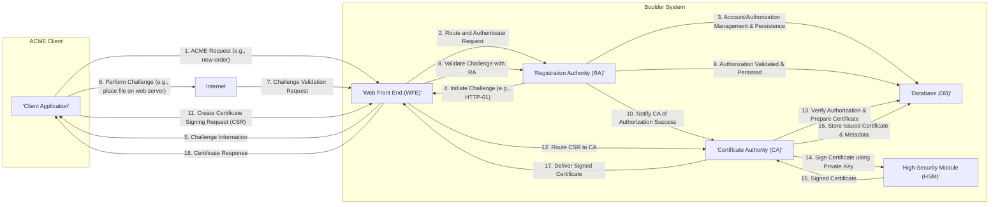

# Project Design Document: Boulder ACME Certificate Authority

**Version:** 1.1
**Date:** October 26, 2023
**Author:** AI Software Architect

## 1. Introduction

This document provides a detailed architectural design for the Boulder project, the ACME-compliant Certificate Authority (CA) server developed by Let's Encrypt. This design document will serve as the foundation for subsequent threat modeling activities, providing a clear understanding of the system's components, their interactions, and the overall data flow.

### 1.1. Purpose

The purpose of this document is to:

*   Clearly describe the architecture of the Boulder project.
*   Identify the key components and their responsibilities within the system.
*   Illustrate the interactions and data flow between these components.
*   Provide a robust basis for identifying potential security threats and vulnerabilities during threat modeling.
*   Serve as a comprehensive reference for developers, security analysts, and operations teams.

### 1.2. Scope

This document covers the high-level architecture and key functional components of the Boulder system relevant to certificate issuance and management using the ACME protocol. It focuses on the interactions and data flow between these components. While it mentions the HSM, detailed specifics of HSM implementation are outside the scope. Similarly, low-level operating system details and cryptographic library internals are not covered.

### 1.3. Target Audience

This document is intended for:

*   Security engineers and analysts responsible for threat modeling, security assessments, and penetration testing.
*   Software developers contributing to or integrating with the Boulder project.
*   System administrators responsible for the deployment, configuration, and maintenance of Boulder instances.
*   Product owners and stakeholders who need a technical overview of the system.

## 2. System Overview

Boulder is a software implementation of an ACME (Automated Certificate Management Environment) compliant Certificate Authority. It automates the process of obtaining, renewing, and managing TLS certificates, significantly enhancing the accessibility of HTTPS encryption. The core function of Boulder is to receive certificate requests from ACME clients, rigorously verify domain ownership, and issue digitally signed certificates upon successful validation.

### 2.1. Key Actors

*   **ACME Clients:** Software applications (often integrated into web servers or other network services) that require TLS certificates and communicate with Boulder using the standardized ACME protocol.
*   **Certificate Holders (End-entities):** The individuals or organizations who own or operate the domains for which TLS certificates are being requested and issued.
*   **Certificate Authority (Boulder):** The authoritative system responsible for the entire lifecycle of certificates, including issuance, renewal, and revocation.
*   **Administrators:** Individuals or teams responsible for the operational aspects of the Boulder system, including monitoring, maintenance, and configuration.

### 2.2. High-Level Architecture

The Boulder system is architected as a set of interconnected, specialized components that collaborate to deliver its core functionality. These components can be broadly categorized as follows:

*   **Web Front End (WFE):** The publicly accessible entry point for ACME clients, responsible for handling all incoming API requests and routing them to the appropriate internal components.
*   **Registration Authority (RA):** Manages the lifecycle of ACME accounts, including creation, updates, and revocation. It also handles the authorization process for identifiers (like domain names).
*   **Certificate Authority (CA):**  Performs the critical cryptographic operations necessary for signing and issuing X.509 certificates. It also manages certificate revocation.
*   **Database (DB):**  Provides persistent storage for all critical system data, including account information, authorizations, issued certificates, and revocation details.
*   **High-Security Module (HSM):** A dedicated, tamper-resistant hardware device responsible for the secure generation, storage, and usage of the CA's private key.

## 3. Detailed Design

This section provides a more granular description of the key components within the Boulder system, detailing their responsibilities, functions, and interfaces.

### 3.1. Web Front End (WFE)

*   **Description:** The WFE serves as the primary interaction point for external ACME clients. It is responsible for receiving, validating, and routing ACME API requests over secure HTTPS connections.
*   **Key Functions:**
    *   Receives and parses incoming ACME requests from clients.
    *   Performs initial validation of request syntax and semantics.
    *   Authenticates ACME clients based on their account keys.
    *   Enforces rate limiting policies to prevent abuse and ensure fair usage.
    *   Routes validated requests to the appropriate backend components (RA, CA) via internal APIs.
    *   Manages TLS connections and certificates for its public-facing interface.
*   **Interfaces:**
    *   ACME Clients (via HTTPS, adhering to the ACME protocol).
    *   Registration Authority (Internal API, typically RESTful).
    *   Certificate Authority (Internal API, typically RESTful).
    *   Database (for session management, rate limiting data persistence, and potentially caching).
*   **Security Considerations:**
    *   Must be highly resilient to various denial-of-service (DoS) and distributed denial-of-service (DDoS) attacks.
    *   Requires robust input validation and sanitization to prevent injection vulnerabilities (e.g., command injection, header injection).
    *   TLS configuration (cipher suites, protocol versions) must adhere to security best practices to ensure confidentiality and integrity of communication.
    *   Proper handling of client certificates and authentication credentials is critical.

### 3.2. Registration Authority (RA)

*   **Description:** The RA is responsible for managing the lifecycle of ACME accounts and the authorization process for requesting certificates for specific identifiers (e.g., domain names).
*   **Key Functions:**
    *   Handles the creation, updating, and deactivation of ACME accounts.
    *   Manages authorizations, which represent the link between an account and an identifier.
    *   Coordinates the challenge validation process, ensuring that the client proves control over the identifier.
    *   Tracks the status of authorizations (pending, valid, invalid, deactivated).
    *   Provides mechanisms for clients to manage their authorizations.
*   **Interfaces:**
    *   Web Front End (Internal API, typically RESTful).
    *   Database (for persistent storage of account and authorization data).
    *   Certificate Authority (Internal API, for notifying the CA upon successful authorization).
*   **Security Considerations:**
    *   Strong authentication and authorization mechanisms are crucial to prevent unauthorized access and modification of account and authorization data.
    *   The challenge validation logic must be meticulously designed and implemented to prevent attackers from fraudulently obtaining certificates for domains they do not control. This includes secure handling of different challenge types (HTTP-01, DNS-01, TLS-ALPN-01).
    *   Protection against account takeover and unauthorized modification of account details is essential.

### 3.3. Certificate Authority (CA)

*   **Description:** The CA is the core component responsible for the cryptographic operations of certificate issuance and revocation. It holds the private key used to sign certificates.
*   **Key Functions:**
    *   Generates and cryptographically signs X.509 certificates based on valid certificate signing requests (CSRs) and successful authorization.
    *   Manages the lifecycle of issued certificates.
    *   Generates and publishes Certificate Revocation Lists (CRLs) or supports Online Certificate Status Protocol (OCSP) for checking the revocation status of certificates.
    *   Enforces certificate issuance policies, including validity periods and allowed extensions.
*   **Interfaces:**
    *   Web Front End (Internal API, typically RESTful).
    *   Registration Authority (Internal API, for receiving notifications of successful authorizations).
    *   High-Security Module (secure API for requesting private key operations, such as signing).
    *   Database (for storing issued certificates, revocation information, and certificate metadata).
*   **Security Considerations:**
    *   The private key must be securely generated, stored, and managed exclusively within the HSM. Access to the HSM and its key material must be strictly controlled.
    *   The certificate signing process must be robust and auditable, ensuring that only authorized requests result in validly signed certificates.
    *   Revocation mechanisms (CRLs, OCSP) must be reliable, timely, and securely distributed.
    *   Protection against replay attacks and unauthorized signing attempts is critical.

### 3.4. Database (DB)

*   **Description:** The database provides persistent storage for all critical data within the Boulder system, ensuring data durability and consistency.
*   **Key Functions:**
    *   Stores ACME account information (e.g., contact details, public keys).
    *   Stores authorization information (e.g., identifiers, challenge details, validation status).
    *   Stores metadata and details of issued certificates.
    *   Stores certificate revocation information (CRLs, OCSP responses, revocation status).
    *   May store rate limiting information and session data.
*   **Interfaces:**
    *   Web Front End (direct database access or via data access layer).
    *   Registration Authority (direct database access or via data access layer).
    *   Certificate Authority (direct database access or via data access layer).
*   **Security Considerations:**
    *   Data at rest must be encrypted using strong encryption algorithms.
    *   Data in transit between Boulder components and the database must be encrypted (e.g., using TLS).
    *   Strict access control mechanisms must be enforced to prevent unauthorized access, modification, or deletion of data.
    *   Regular database backups and robust disaster recovery procedures are essential to ensure data availability and integrity.

### 3.5. High-Security Module (HSM)

*   **Description:** The HSM is a tamper-resistant hardware device specifically designed to securely store and manage cryptographic keys, particularly the CA's highly sensitive private key.
*   **Key Functions:**
    *   Securely generates and stores the CA's private key.
    *   Performs cryptographic signing operations on behalf of the CA, without exposing the private key material.
    *   Provides audit logging of key usage and access attempts.
*   **Interfaces:**
    *   Certificate Authority (via a secure, authenticated API for signing requests).
*   **Security Considerations:**
    *   Physical security of the HSM is paramount, including protection against tampering and unauthorized access.
    *   Access control to the HSM's functionalities and key material must be extremely restrictive and based on the principle of least privilege.
    *   Key generation, backup, and recovery procedures must be meticulously planned and executed to maintain the security and availability of the private key.

## 4. Data Flow

The following diagram illustrates the typical data flow for a certificate issuance request using the ACME protocol:

**Data Flow Description:**

1. The ACME client initiates the process by sending an ACME request (e.g., a `new-order` request) to the Boulder WFE.
2. The WFE receives the request, authenticates the client, and routes the request to the RA.
3. The RA manages the account and authorization process, interacting with the database to store and retrieve relevant information.
4. The RA initiates a challenge (e.g., an HTTP-01 challenge) to verify the client's control over the domain.
5. The WFE relays the challenge information back to the ACME client.
6. The ACME client performs the required action to satisfy the challenge (e.g., placing a specific file on the web server).
7. Boulder attempts to validate the challenge by making a request to the relevant resource on the target server.
8. The WFE forwards the validation request to the RA.
9. The RA validates the challenge and updates the authorization status in the database.
10. Upon successful validation, the RA notifies the CA that the authorization is complete.
11. The ACME client generates a Certificate Signing Request (CSR) and sends it to the WFE.
12. The WFE routes the CSR to the CA.
13. The CA verifies that a valid authorization exists for the requested domain and prepares the certificate for signing, potentially retrieving relevant information from the database.
14. The CA requests the HSM to sign the certificate using the CA's private key.
15. The HSM returns the digitally signed certificate to the CA.
16. The CA stores the issued certificate and its associated metadata in the database.
17. The CA delivers the signed certificate to the WFE.
18. The WFE sends the signed certificate back to the ACME client as the response to its request.

## 5. Security Considerations (Detailed)

This section expands on the initial security considerations, providing more specific concerns for each component. This will be further refined during the threat modeling process.

*   **Web Front End (WFE):**
    *   **DoS/DDoS Resilience:** Implement robust rate limiting, connection management, and potentially utilize a Content Delivery Network (CDN) for protection.
    *   **Input Validation:** Rigorously validate all input parameters to prevent injection attacks (SQL injection, command injection, cross-site scripting).
    *   **TLS Security:** Enforce strong TLS configurations, including the use of secure cipher suites and up-to-date protocol versions. Regularly audit TLS configurations.
    *   **Authentication and Authorization:** Securely authenticate ACME clients and authorize their actions based on their account and authorization status.
    *   **Header Security:** Implement security headers (e.g., Content Security Policy, HTTP Strict Transport Security) to mitigate various attacks.
*   **Registration Authority (RA):**
    *   **Account Security:** Implement strong password policies (if applicable), multi-factor authentication for administrative access, and account lockout mechanisms.
    *   **Authorization Security:** Ensure the integrity and confidentiality of authorization data. Prevent unauthorized modification or deletion of authorizations.
    *   **Challenge Validation Security:** Thoroughly validate challenge responses to prevent attackers from fraudulently obtaining certificates. Implement safeguards against replay attacks.
    *   **API Security:** Secure internal APIs using authentication and authorization mechanisms.
*   **Certificate Authority (CA):**
    *   **Private Key Security:** The HSM is the primary control. Implement strict access controls and audit logging for all HSM interactions. Implement secure key generation and backup procedures.
    *   **Signing Process Security:** Ensure only authorized requests result in certificate signing. Implement mechanisms to prevent unauthorized signing attempts.
    *   **Revocation Security:** Securely generate, store, and distribute CRLs or OCSP responses. Protect against unauthorized certificate revocation.
    *   **Policy Enforcement:** Ensure adherence to certificate issuance policies.
*   **Database (DB):**
    *   **Data Encryption:** Encrypt sensitive data at rest and in transit.
    *   **Access Control:** Implement strict role-based access control to limit access to sensitive data.
    *   **Database Security Hardening:** Follow database security best practices, including regular patching and secure configuration.
    *   **Backup and Recovery Security:** Securely store database backups and implement secure recovery procedures.
*   **High-Security Module (HSM):**
    *   **Physical Security:** Ensure the HSM is physically secured against unauthorized access and tampering.
    *   **Logical Security:** Implement strong authentication and authorization mechanisms for accessing the HSM.
    *   **Audit Logging:** Maintain comprehensive audit logs of all HSM activities.
    *   **Key Management Security:** Follow secure key lifecycle management practices.

## 6. Technology Stack

*   **Core Programming Language:** Go
*   **Database System:** Typically a relational database such as MySQL or PostgreSQL.
*   **Cryptographic Libraries:** Uses standard and well-vetted cryptographic libraries (e.g., Go's standard crypto library).
*   **Web Server/Framework:**  Likely utilizes Go's built-in HTTP capabilities or a lightweight web framework for the WFE.
*   **ACME Protocol Implementation:**  Adheres to the IETF ACME standard (RFC 8555).
*   **HSM Interface:**  Utilizes standard cryptographic interfaces (e.g., PKCS#11) for interacting with the HSM.
*   **Operating System:** Typically deployed on Linux-based operating systems.

## 7. Deployment Architecture (Considerations)

Boulder can be deployed in various architectures, each with its own security implications:

*   **Cloud-Native Deployment:** Utilizing containerization (e.g., Docker, Kubernetes) and cloud services (e.g., AWS, Azure, GCP) for scalability and resilience. Security considerations include container security, network segmentation, and cloud provider security best practices.
*   **On-Premise Deployment:** Deployed on physical or virtual machines within a private data center. Security considerations include physical security, network security, and operating system hardening.
*   **High-Availability Deployment:** Implementing redundancy and failover mechanisms for all critical components (WFE, RA, CA, DB) to ensure continuous operation. Security considerations include secure replication and failover procedures.
*   **Geographically Distributed Deployment:** Deploying instances across multiple geographic locations for increased resilience and performance. Security considerations include secure inter-site communication and data synchronization.

## 8. Assumptions and Constraints

*   The underlying network infrastructure is assumed to be reasonably secure and protected by firewalls and intrusion detection/prevention systems.
*   The HSM is a trusted component and provides the claimed level of security for key management.
*   This document describes the general architecture; specific implementation details may vary.
*   ACME clients are assumed to be implemented correctly and securely, adhering to the ACME protocol specifications.
*   Regular security patching and updates are applied to all components and dependencies.
*   Secure coding practices are followed during the development of Boulder.

This enhanced design document provides a more detailed and comprehensive overview of the Boulder ACME Certificate Authority architecture, serving as a strong foundation for subsequent threat modeling activities. The increased level of detail in component descriptions, data flow, and security considerations will enable a more thorough and effective identification of potential security risks.