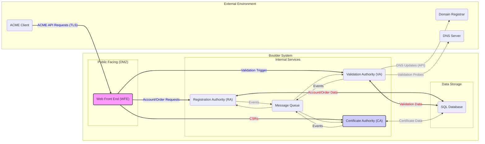

# Project Design Document: Boulder - ACME Certificate Authority

**Version:** 1.1
**Date:** October 26, 2023
**Author:** Gemini (AI Language Model)

## 1. Introduction

This document provides a detailed architectural design of the Boulder project, the open-source Certificate Authority (CA) server that powers Let's Encrypt. This document aims to provide a comprehensive understanding of Boulder's components, their interactions, and data flows, with a specific focus on aspects relevant to security analysis and threat modeling.

## 2. Goals

*   Clearly define the major components of the Boulder system and their specific responsibilities.
*   Describe the interactions and data flow between these components, highlighting trust boundaries.
*   Identify key data stores, their purpose, and sensitivity.
*   Provide a detailed overview of the system's architecture, suitable for security analysis.
*   Establish a solid basis for future threat modeling exercises by explicitly identifying potential attack surfaces.

## 3. Target Audience

This document is intended for:

*   Security architects and engineers involved in threat modeling, penetration testing, and security assessments of Boulder.
*   Developers working on or interacting with the Boulder project, particularly those involved in security-sensitive areas.
*   Operations teams responsible for deploying, configuring, and maintaining secure Boulder instances.

## 4. System Overview

Boulder is a complex, distributed system responsible for the entire lifecycle of issuing and managing TLS certificates using the Automated Certificate Management Environment (ACME) protocol. It interacts with external ACME clients, domain registrars, and potentially other external services, operating under strict security requirements to maintain the integrity of the certificate ecosystem.

## 5. Architectural Design

The Boulder architecture is composed of several distinct, interacting services. Each service has specific responsibilities and operates within defined trust boundaries.

### 5.1. Major Components

*   **Web Front End (WFE):**
    *   **Responsibility:**  The primary entry point for all external ACME API requests from clients.
    *   **Functionality:**
        *   Receives and parses ACME requests (JSON over HTTPS).
        *   Performs initial request validation (syntax, basic authorization).
        *   Authenticates ACME clients based on account keys.
        *   Statelessly routes requests to other internal services based on the request type.
        *   Terminates TLS connections.
        *   Does *not* directly access the main SQL database for persistent ACME object storage, relying on other services for this.
    *   **Potential Attack Surfaces:** API vulnerabilities, authentication bypass, denial of service.

*   **Registration Authority (RA):**
    *   **Responsibility:** Manages the lifecycle of ACME accounts.
    *   **Functionality:**
        *   Handles account creation, updates (e.g., contact information), and deactivations.
        *   Generates and manages account keys.
        *   Interacts directly with the SQL database to store and retrieve account information.
        *   May publish events to the message queue for account-related actions.
    *   **Potential Attack Surfaces:** Account takeover, unauthorized account modification.

*   **Validation Authority (VA):**
    *   **Responsibility:** Performs Domain Control Validation (DCV) to verify the requester's control over the domain names in a certificate request.
    *   **Functionality:**
        *   Receives authorization requests from the RA.
        *   Creates and manages challenges of various types (HTTP-01, DNS-01, TLS-ALPN-01).
        *   Interacts with external systems:
            *   Makes outbound HTTP requests to target web servers for HTTP-01 validation.
            *   Queries DNS servers for DNS-01 validation.
            *   Connects to target servers via TLS for TLS-ALPN-01 validation.
        *   Stores validation attempts, results, and challenge state in the SQL database.
        *   May interact with domain registrars for automated DNS updates (if configured).
    *   **Potential Attack Surfaces:**  Challenge manipulation, DNS spoofing, man-in-the-middle attacks during validation, SSRF (Server-Side Request Forgery) through validation probes.

*   **Certificate Authority (CA):**
    *   **Responsibility:**  The core component responsible for signing and issuing certificates.
    *   **Functionality:**
        *   Receives certificate signing requests (CSRs) from the WFE after successful validation.
        *   Verifies that all required authorizations are valid.
        *   Uses the CA's private key (securely stored, often in an HSM) to sign certificates.
        *   Stores issued certificates and related metadata in the SQL database.
        *   May publish events to the message queue upon certificate issuance.
    *   **Potential Attack Surfaces:** Private key compromise (the most critical risk), unauthorized certificate issuance.

*   **SQL Database:**
    *   **Responsibility:** The primary persistent data store for Boulder's operational data.
    *   **Functionality:**
        *   Stores ACME accounts, including keys and contact information.
        *   Stores orders, authorizations, and their current status.
        *   Stores challenge information and validation results.
        *   Stores issued certificates and their metadata (e.g., serial number, expiry).
        *   Critical for the integrity and availability of the entire system.
    *   **Potential Attack Surfaces:** SQL injection, data breaches, unauthorized access, data corruption.

*   **Pebble:**
    *   **Responsibility:** A lightweight, self-contained ACME CA implementation for testing and development.
    *   **Functionality:** Simulates the core functionality of Boulder but with simplified components and in-memory storage (typically).
    *   **Note:** Not intended for production use but crucial for client development and integration testing.

*   **Registrar Integration (Example: GoDaddy):**
    *   **Responsibility:**  Facilitates automated DNS record updates for DNS-01 challenges.
    *   **Functionality:** Interacts with registrar APIs to create, update, and delete DNS records on behalf of the ACME client.
    *   **Potential Attack Surfaces:** API key compromise, unauthorized DNS record manipulation.

*   **Message Queue (e.g., RabbitMQ):**
    *   **Responsibility:** Enables asynchronous communication and decoupling between Boulder services.
    *   **Functionality:** Transports messages related to various events (e.g., completed validations, certificate issuance).
    *   **Potential Attack Surfaces:** Message interception, message forgery, denial of service.

### 5.2. Data Flow (Detailed Certificate Issuance)

1. **Client Request (New Order):** An ACME client sends a `POST /new-order` request to the **WFE**.
2. **WFE Authentication & Routing:** The **WFE** authenticates the client using the provided account key and routes the request to the **RA**.
3. **Order Creation (RA):** The **RA** creates a new order record in the **SQL Database**.
4. **Authorization Request (RA):** The **RA** creates authorization requests for each domain name in the order and stores them in the **SQL Database**.
5. **Challenge Issuance (VA):** The **RA** signals the **VA** (potentially via the **Message Queue**) about the new authorizations. The **VA** retrieves the authorization details from the **SQL Database** and creates the necessary challenges, storing them in the **SQL Database**.
6. **Challenge Information to Client (WFE):** The **WFE** retrieves the challenge information from the **SQL Database** and returns it to the ACME client.
7. **Challenge Presentation (Client):** The client takes action to fulfill the challenge (e.g., placing a file on a web server for HTTP-01, creating a DNS record for DNS-01).
8. **Validation Request (Client):** The client sends a `POST /challenge/<id>/finalize` request to the **WFE**.
9. **WFE Routing:** The **WFE** routes the request to the **VA**.
10. **Validation Attempt (VA):** The **VA** attempts to validate the challenge by interacting with the target domain (e.g., making an HTTP request, querying DNS).
11. **Validation Result (VA):** The **VA** updates the authorization status in the **SQL Database** with the validation result.
12. **CSR Submission (Client):** Once all authorizations are valid, the client generates a Certificate Signing Request (CSR) and sends it in a `POST /order/<id>/finalize` request to the **WFE**.
13. **WFE Routing:** The **WFE** routes the CSR to the **CA**.
14. **Certificate Issuance (CA):** The **CA** retrieves the order and authorization details from the **SQL Database**, verifies the authorizations, signs the certificate using its private key, and stores the issued certificate in the **SQL Database**.
15. **Certificate Retrieval (WFE):** The **WFE** retrieves the issued certificate from the **SQL Database**.
16. **Certificate Download (Client):** The client sends a `GET /certificate/<id>` request to the **WFE** to download the issued certificate.

### 5.3. Component Interactions (Mermaid Diagram with Trust Boundaries)

## 6. Data Stores

*   **SQL Database:**
    *   **Content:** ACME accounts (keys, contact info), orders, authorizations, challenges, validation attempts, issued certificates, revocation information.
    *   **Sensitivity:** High - Contains sensitive information required for certificate issuance and management. Compromise could lead to unauthorized certificate issuance or revocation.
    *   **Access:** Primarily accessed by RA, VA, and CA.

## 7. Security Considerations (Detailed)

*   **Private Key Security (CA):** The CA's private key is the root of trust and must be protected with extreme rigor.
    *   **Mitigation:** Hardware Security Modules (HSMs) with strict access controls, strong key generation practices, regular auditing.
*   **Authentication and Authorization (WFE):** Securely authenticating ACME clients and authorizing their actions is critical to prevent unauthorized operations.
    *   **Mitigation:**  Strong cryptographic key management, robust authentication mechanisms based on ACME account keys, proper authorization checks for all API endpoints.
*   **Input Validation (WFE, RA, VA):** All external inputs, especially from ACME clients, must be thoroughly validated to prevent injection attacks and other vulnerabilities.
    *   **Mitigation:** Strict input validation on all API endpoints, sanitization of user-provided data, protection against SQL injection, command injection, and other injection vulnerabilities.
*   **Secure Communication (All Components):** Communication between Boulder components and with external entities should be secured using TLS/SSL with strong ciphers.
    *   **Mitigation:**  Mutual TLS authentication between internal services, enforcing HTTPS for external APIs, regular security audits of TLS configurations.
*   **Data Integrity (SQL Database):** Mechanisms should be in place to ensure the integrity of data stored in the database to prevent tampering or corruption.
    *   **Mitigation:** Database transaction management, integrity constraints, regular backups, audit logging of database changes.
*   **Availability (All Components):** The system should be designed for high availability to ensure continuous certificate issuance and prevent single points of failure.
    *   **Mitigation:** Redundancy for all critical components, load balancing, failover mechanisms, robust monitoring and alerting.
*   **Rate Limiting (WFE):** Implementing rate limits is essential to prevent abuse, denial of service attacks, and ensure fair usage of the service.
    *   **Mitigation:**  Rate limiting based on IP address, account, or other relevant criteria, with appropriate thresholds and blocking mechanisms.
*   **Domain Control Validation Security (VA):** The DCV process is a critical attack surface.
    *   **Mitigation:**  Secure implementation of challenge types, protection against DNS spoofing and hijacking, careful handling of redirects during HTTP-01 validation, preventing SSRF vulnerabilities in validation probes.
*   **Message Queue Security:** Secure the message queue to prevent unauthorized access, message interception, or forgery.
    *   **Mitigation:** Authentication and authorization for message queue access, encryption of messages in transit.

## 8. Deployment Considerations

*   Boulder is typically deployed as a set of microservices, often using containerization technologies like Docker and orchestration platforms like Kubernetes for scalability and resilience.
*   The SQL database is a critical stateful component requiring careful planning for high availability, backups, and disaster recovery.
*   Secure storage and management of the CA's private key are paramount, typically involving dedicated HSMs or secure key management services.
*   Network segmentation and firewall rules should be implemented to restrict communication between components and limit external access.
*   Comprehensive monitoring, logging, and alerting are essential for operational visibility, security auditing, and incident response.
*   Regular security assessments, including penetration testing, are crucial to identify and address potential vulnerabilities.

## 9. Future Considerations

*   Support for new ACME features and extensions as the protocol evolves.
*   Integration with additional domain registrars and other relevant services.
*   Improvements to performance, scalability, and resource utilization.
*   Enhanced monitoring, logging, and alerting capabilities with more granular metrics.
*   Exploration of alternative data storage solutions or optimizations.

## 10. Glossary

*   **ACME:** Automated Certificate Management Environment - a protocol for automating interactions between Certificate Authorities and their users' servers, allowing for the automated issuance and renewal of digital certificates.
*   **CA:** Certificate Authority - an entity that issues digital certificates.
*   **CSR:** Certificate Signing Request - a message sent from an applicant to a CA to apply for a digital certificate.
*   **DCV:** Domain Control Validation - the process of verifying that an applicant for a digital certificate controls the domain name(s) listed in the certificate.
*   **HSM:** Hardware Security Module - a physical computing device that safeguards and manages digital keys for strong authentication and provides cryptoprocessing.
*   **TLS:** Transport Layer Security - a cryptographic protocol designed to provide communications security over a computer network.
*   **SSL:** Secure Sockets Layer - a deprecated cryptographic protocol, the predecessor to TLS.
*   **API:** Application Programming Interface - a set of definitions and protocols used for building and integrating application software.
*   **SSRF:** Server-Side Request Forgery - a web security vulnerability that allows an attacker to induce the server-side application to make HTTP requests to an arbitrary location of the attacker's choosing.
*   **DMZ:** Demilitarized Zone - a physical or logical subnetwork that contains and exposes an organization's external-facing services to an untrusted network, usually the internet.

This document provides a more detailed and security-focused architectural design of the Boulder project. It serves as a valuable resource for understanding the system's components, interactions, and potential security considerations, forming a strong foundation for comprehensive threat modeling activities.