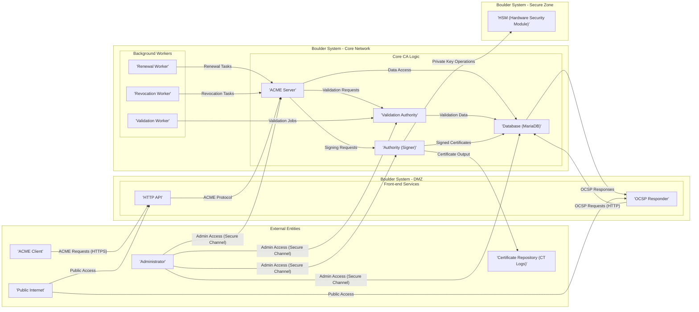

# Project Design Document: Boulder - Let's Encrypt CA Software

**Version:** 1.1
**Date:** October 26, 2023
**Author:** AI Expert

## 1. Introduction

This document provides an enhanced and more detailed design overview of Boulder, the open-source Certificate Authority (CA) software developed by Let's Encrypt. Building upon the previous version, this document further elaborates on the system architecture, component functionalities, data flows, and critically, security considerations. It is designed to be a robust foundation for threat modeling and comprehensive security analysis of the Boulder project.

Boulder's complexity stems from its mission to automate TLS/SSL certificate issuance at a massive scale while maintaining the highest security standards. This document aims to dissect this complexity, providing a clear understanding of the system's inner workings and potential vulnerabilities. It emphasizes the components and interactions most relevant to security, offering a valuable resource for security audits, penetration testing, and ongoing security enhancements.

## 2. Goals and Objectives

The core goals and objectives of Boulder's design remain as previously defined, with a stronger emphasis on security and operational robustness:

* **Automated, Mass-Scale Certificate Issuance:**  To provide a fully automated, highly scalable system capable of issuing and managing millions of TLS/SSL certificates efficiently.
* **Strict ACME Protocol Compliance:**  To rigorously adhere to the ACME protocol specification (RFC 8555) ensuring seamless interoperability with a wide range of ACME clients and ecosystem tools.
* **High Availability and Reliability:**  To achieve exceptional system uptime and resilience, minimizing disruptions to certificate issuance and revocation services, crucial for internet infrastructure.
* **Security as a Paramount Concern:**  To embed security at every layer of the design, with a focus on protecting private keys, ensuring data integrity, preventing unauthorized certificate issuance, and mitigating various attack vectors.
* **Open Source and Transparent Operation:**  To maintain full open-source availability and transparency, fostering community scrutiny, collaboration, and continuous security improvement through public review and contribution.
* **Modular, Extensible, and Maintainable Architecture:**  To design a modular and well-structured system that facilitates future extensions, simplifies maintenance, and allows for agile updates and security patching.
* **Performance and Efficiency:** To optimize performance for high throughput and low latency in certificate operations, ensuring a responsive and efficient service for clients globally.

## 3. System Architecture

Boulder's architecture is designed around a separation of concerns, dividing functionalities into distinct subsystems. This modular approach enhances security, maintainability, and scalability. The architecture diagram below provides a refined view, highlighting key components and their interactions:

**Refined Component Descriptions:**

* **HTTP API (Front-end - DMZ):**
    * **Function:**  The publicly accessible interface for ACME clients. Located in the DMZ for security isolation.
    * **Responsibilities:**
        * TLS termination (HTTPS).
        * Strict ACME request parsing and validation (input sanitization is critical here).
        * Rate limiting and abuse prevention (essential to protect against DDoS and resource exhaustion).
        * Request routing to the ACME Server in the core network.
        * Basic authentication and authorization (if needed for specific endpoints).
        * Logging of all incoming requests for audit trails.
* **OCSP Responder (Front-end - DMZ):**
    * **Function:**  Provides OCSP responses to certificate status queries. Also located in the DMZ.
    * **Responsibilities:**
        * Handling OCSP requests over HTTP.
        * Efficiently querying the database for certificate revocation status.
        * Generating and digitally signing OCSP responses.
        * Caching OCSP responses aggressively to minimize database load and improve response times.
        * Protection against OCSP denial-of-service attacks.
* **ACME Server (Core CA Logic - Core Network):**
    * **Function:**  The central brain of Boulder, implementing the core ACME protocol logic and orchestrating certificate operations. Resides in the core network, behind the DMZ.
    * **Responsibilities:**
        * Comprehensive ACME protocol state machine management (account, order, authorization lifecycles).
        * Account management (creation, updates, key rollover, secure key storage references).
        * Order management (creation, status tracking, error handling, retry mechanisms).
        * Authorization management (challenge issuance, validation orchestration, result processing).
        * Certificate issuance and revocation workflow management.
        * Database interaction for persistent storage and retrieval of all CA data.
        * Policy enforcement (certificate validity periods, allowed key types, etc.).
        * Internal authentication and authorization for interactions with other core components.
        * Audit logging of all significant operations.
* **Authority (Signer) (Core CA Logic - Core Network & Secure Zone):**
    * **Function:**  The cryptographic heart of the CA, responsible for all private key operations, especially certificate signing.  Critical components may reside in a secure zone with HSM integration.
    * **Responsibilities:**
        * Secure private key generation, storage, and lifecycle management, ideally within an HSM.
        * Certificate signing using the CA's private key.
        * OCSP response signing key management (potentially separate keys).
        * CRL generation (if implemented, though OCSP is preferred).
        * Strict access control to private keys and signing functions.
        * Key ceremony procedures for initial key generation and backup.
        * Audit logging of all key access and signing operations.
* **Validation Authority (Core CA Logic - Core Network):**
    * **Function:**  Performs domain control validation, ensuring the requester controls the domain for which a certificate is requested. Operates within the core network.
    * **Responsibilities:**
        * Orchestrating various validation methods (HTTP-01, DNS-01, TLS-ALPN-01).
        * Generating validation challenges and instructions.
        * Executing validation checks by interacting with external systems (web servers, DNS resolvers).
        * Aggregating validation results and reporting them to the ACME Server.
        * Handling transient validation failures and retry logic.
        * Secure communication channels for validation probes.
* **Database (MariaDB) (Core CA Logic - Core Network):**
    * **Function:**  Persistent, reliable, and performant storage for all CA data.  Deployed in the core network, often in a clustered configuration.
    * **Responsibilities:**
        * Secure storage of accounts, orders, authorizations, certificates, revocation information, audit logs, and configuration data.
        * Transactional integrity and data consistency.
        * Data replication and backup for disaster recovery.
        * Performance optimization for high read/write loads.
        * Database access control and auditing.
        * Encryption at rest and in transit for sensitive data.
* **Background Workers (Core CA Logic - Core Network):**
    * **Renewal Worker:**  Automates certificate renewal process before expiry.
    * **Revocation Worker:**  Processes certificate revocation requests and updates revocation status.
    * **Validation Worker:**  Asynchronously executes validation checks, decoupling validation from the main ACME request flow for improved responsiveness.
    * **Responsibilities:**
        * Performing scheduled tasks reliably and efficiently.
        * Handling failures and retries gracefully.
        * Minimizing resource consumption.
        * Logging worker activities for monitoring and debugging.
* **HSM (Hardware Security Module) (Secure Zone):**
    * **Function:**  Provides a highly secure environment for storing and managing the CA's private keys. Resides in a physically and logically secured zone.
    * **Responsibilities:**
        * Secure key generation and storage.
        * Cryptographic operations using the private keys (signing).
        * Tamper-proof and tamper-evident hardware.
        * Strong access control and authentication.
        * Audit logging of all key access and operations.
        * Physical security and environmental controls.
* **Administrator (External Entity):**
    * **Function:**  Human operator responsible for system administration, monitoring, and incident response.
    * **Responsibilities:**
        * System configuration and maintenance.
        * Monitoring system health and performance.
        * Security incident response and remediation.
        * Key ceremony participation (if applicable).
        * Access control management.
        * Audit log review.

## 4. Component Descriptions and Data Flows

*(Data flow diagrams from the previous version remain valid and accurately represent the core data flows. Refer to Section 4 of Version 1.0 for diagrams of ACME Server, Validation Authority, and Authority (Signer) data flows.)*

**Further Elaboration on Data Flows:**

* **ACME Request Flow:**  ACME clients initiate requests to the HTTP API. These requests are validated and routed to the ACME Server. The ACME Server orchestrates the entire process, interacting with the Database, Validation Authority, and Authority (Signer) as needed. Responses are formatted and returned to the client via the HTTP API.
* **Validation Flow:** The ACME Server delegates validation tasks to the Validation Authority. The Validation Authority performs the necessary checks (e.g., HTTP-01 probes, DNS record lookups) and reports the results back to the ACME Server.
* **Certificate Issuance Flow:** Upon successful validation and order finalization, the ACME Server requests certificate signing from the Authority (Signer). The Authority (Signer) uses the CA's private key (ideally from an HSM) to sign the certificate and returns the signed certificate to the ACME Server.
* **OCSP Request Flow:** OCSP clients send requests to the OCSP Responder. The OCSP Responder queries the database for the certificate's revocation status and generates a signed OCSP response, which is then returned to the client.
* **Renewal and Revocation Flows:** Background workers (Renewal Worker, Revocation Worker) periodically initiate renewal and revocation processes by interacting with the ACME Server.

## 5. Enhanced Security Considerations and Threat Model

This section expands on security considerations, outlining potential threats and suggested mitigations for each major component.

| Component          | Potential Threats                                      | Mitigations                                                                                                                               |
|----------------------|-------------------------------------------------------|-------------------------------------------------------------------------------------------------------------------------------------------|
| **HTTP API**         | DDoS attacks, Injection attacks (e.g., SQL, Command), ACME protocol vulnerabilities, Rate limiting bypass, Information disclosure, TLS vulnerabilities. | Rate limiting, Input validation (strict ACME parsing), WAF, Regular security patching, TLS hardening, Security audits, Penetration testing. |
| **OCSP Responder**   | DDoS attacks, OCSP request forgery, Information disclosure, Database injection (if complex queries), Cache poisoning.                                  | Rate limiting, Input validation, Secure coding practices, Output sanitization, Cache integrity checks, Regular security patching, Security audits. |
| **ACME Server**      | Logic flaws in ACME state machine, Authorization bypass, Privilege escalation, Database injection, Data integrity compromise, Denial of Service.        | Secure coding practices, Thorough testing, Input validation, Principle of least privilege, Database access control, Data integrity checks, Security audits, Penetration testing. |
| **Authority (Signer)**| Private key compromise, Unauthorized signing, Insider threat, Key management vulnerabilities, HSM bypass (if applicable).                               | HSM usage, Strong access control, Multi-person control (key ceremony), Audit logging, Physical security for HSM, Regular security audits, Key rotation. |
| **Validation Authority**| Validation bypass, Man-in-the-middle attacks during validation, DNS spoofing, HTTP redirect attacks, Injection vulnerabilities in validation probes. | Secure validation probes (HTTPS), DNSSEC validation, Input validation, Network segmentation, Regular security audits, Penetration testing. |
| **Database (MariaDB)** | SQL injection, Data breach, Data integrity compromise, Denial of Service, Privilege escalation, Backup compromise.                                    | SQL parameterization, Principle of least privilege, Database access control, Encryption at rest and in transit, Regular backups, Security audits, Penetration testing, Database hardening. |
| **Background Workers**| Job queue poisoning, Privilege escalation, Resource exhaustion, Logic flaws leading to incorrect operations (e.g., mass revocation).                   | Secure job queue management, Principle of least privilege, Input validation for worker tasks, Resource limits, Thorough testing, Code reviews. |
| **HSM**              | Physical compromise, Logical bypass, Firmware vulnerabilities, Side-channel attacks, Insider threat.                                                  | Physical security controls, Strong access control, Firmware updates, Tamper-evident hardware, Regular security audits, Vendor security assessments. |

## 6. Technologies Used

*(Technologies listed in the previous version remain accurate.)*

## 7. Enhanced Deployment Architecture

A robust Boulder deployment incorporates multiple layers of security and redundancy. A more detailed deployment architecture would include:

* **Network Segmentation:**
    * **DMZ (Demilitarized Zone):**  Publicly facing services (HTTP API, OCSP Responder) are placed in the DMZ, isolated from the internal network.
    * **Core Network:**  Core CA logic components (ACME Server, Authority, Validation Authority, Database, Background Workers) reside in the core network, behind firewalls.
    * **Secure Zone:**  The HSM and potentially the Authority (Signer) component are placed in a highly secured zone with strict access control, potentially physically separate.
* **Firewalls:**  Firewalls are deployed at network boundaries to control traffic flow between zones and to the external internet.  Strict firewall rules are essential to limit access to only necessary ports and services.
* **Intrusion Detection/Prevention Systems (IDS/IPS):**  IDS/IPS systems monitor network traffic for malicious activity and can automatically block or alert on suspicious events.
* **Load Balancers:**  Load balancers distribute traffic across multiple instances of front-end services (HTTP API, OCSP Responder) for high availability and scalability.
* **Web Application Firewall (WAF):**  A WAF protects the HTTP API from web-based attacks such as SQL injection, cross-site scripting (XSS), and other common web vulnerabilities.
* **Database Clustering and Replication:**  The MariaDB database is deployed in a clustered and replicated configuration for high availability and data redundancy.
* **Monitoring and Logging:**  Comprehensive monitoring and logging are crucial for security auditing, performance monitoring, and incident response. Logs should be securely stored and analyzed regularly. Centralized logging systems (SIEM) are highly recommended.
* **Security Information and Event Management (SIEM):**  A SIEM system aggregates logs from various sources, performs security analysis, and provides alerts for security incidents.
* **Regular Security Audits and Penetration Testing:**  Periodic security audits and penetration testing are essential to identify and remediate vulnerabilities in the system.
* **Incident Response Plan:**  A well-defined incident response plan is necessary to handle security incidents effectively and minimize damage.
* **Secure Configuration Management:**  Automated configuration management tools should be used to ensure consistent and secure configurations across all components.
* **Patch Management:**  A robust patch management process is critical to ensure that all systems are kept up-to-date with the latest security patches.

This enhanced design document provides a more comprehensive and security-focused overview of Boulder. It serves as a valuable resource for threat modeling, security assessments, and ongoing security efforts for the Let's Encrypt CA software. The detailed component descriptions, data flows, and expanded security considerations offer a deeper understanding of the system's architecture and potential vulnerabilities, facilitating proactive security measures and continuous improvement.