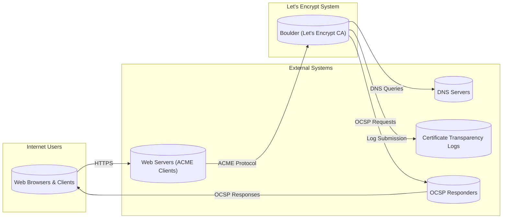
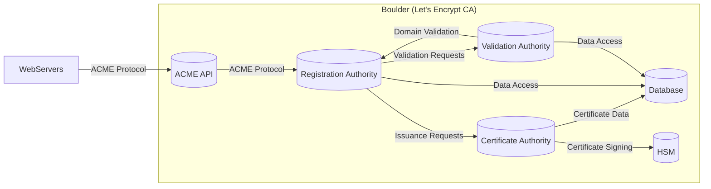
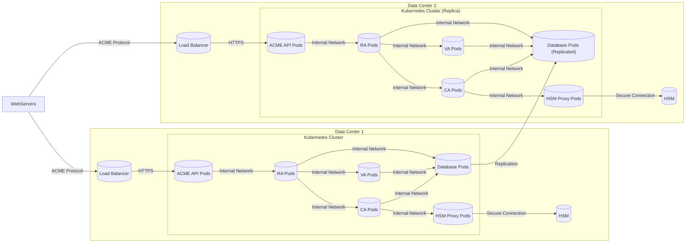
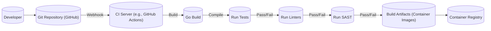

Okay, let's create a design document for the Boulder project from Let's Encrypt, focusing on aspects relevant to threat modeling.

# BUSINESS POSTURE

Let's Encrypt's Boulder is the software behind the Let's Encrypt Certificate Authority (CA).  Its primary business goal is to provide free, automated, and trusted TLS/SSL certificates to the public, thereby increasing the adoption of HTTPS across the web.  The project's success hinges on maintaining extremely high levels of trust, security, and availability.  It's a critical piece of internet infrastructure.  Given its role as a widely trusted CA, the risk appetite is extremely low.  Compromise of Boulder would have catastrophic consequences for the internet's security.

Priorities:

*   Maintain the integrity and confidentiality of the CA's private keys.
*   Ensure the availability and reliability of the certificate issuance and revocation services.
*   Maintain the public's trust in the Let's Encrypt CA.
*   Comply with relevant industry standards and audits (e.g., WebTrust for CAs, CA/Browser Forum Baseline Requirements).
*   Prevent the issuance of fraudulent certificates.
*   Provide transparency and auditability of operations.

Business Risks:

*   Compromise of the CA's private keys, leading to widespread issuance of malicious certificates. This is the highest risk.
*   Denial-of-service attacks disrupting certificate issuance or revocation.
*   Software vulnerabilities in Boulder leading to unauthorized access or control.
*   Insider threats (malicious or negligent employees).
*   Failure to comply with CA/Browser Forum Baseline Requirements, leading to distrust by browsers.
*   Supply chain attacks targeting Boulder's dependencies or build process.
*   Data breaches exposing sensitive information (although Boulder minimizes the personal data it handles).

# SECURITY POSTURE

Existing Security Controls (based on the GitHub repository and public information about Let's Encrypt):

*   security control: Hardware Security Modules (HSMs) to protect private keys. (Implied, critical for any CA).
*   security control: Strict access controls and multi-factor authentication for all sensitive systems. (Implied, industry standard).
*   security control: Extensive logging and auditing. (Visible in the code and documentation).
*   security control: Regular security audits and penetration testing. (Publicly stated by Let's Encrypt).
*   security control: Code reviews and a well-defined development process. (Visible in the GitHub repository).
*   security control: Use of memory-safe languages (Go) to reduce vulnerabilities. (Choice of Go as the primary language).
*   security control: Network segmentation and firewalls to isolate critical systems. (Implied, best practice).
*   security control: Regular vulnerability scanning and patching. (Implied, best practice).
*   security control: Incident response plan. (Implied, industry standard).
*   security control: Compliance with WebTrust for CAs and CA/Browser Forum Baseline Requirements. (Publicly stated).
*   security control: Use of short-lived certificates to minimize the impact of key compromise. (Let's Encrypt's core model).
*   security control: Certificate Transparency (CT) logging for all issued certificates. (Let's Encrypt's core model).
*   security control: Automated issuance and renewal process to minimize human error. (Boulder's primary function).
*   security control: OCSP stapling to improve performance and privacy. (Supported by Boulder).
*   security control: Multiple geographically distributed data centers for high availability and disaster recovery. (Publicly stated).
*   security control: Strict separation of duties. (Implied, industry standard).

Accepted Risks:

*   accepted risk: Reliance on third-party dependencies (Go modules, operating system libraries). This is mitigated by careful dependency management and vulnerability scanning.
*   accepted risk: Potential for zero-day vulnerabilities in Boulder or its dependencies. This is mitigated by rapid response capabilities and the use of short-lived certificates.
*   accepted risk: The inherent complexity of a CA system. This is mitigated by rigorous testing, code reviews, and a modular design.

Recommended Security Controls:

*   Implement a Software Bill of Materials (SBOM) for all builds to improve supply chain security.
*   Formalize and enhance the existing fuzzing infrastructure.
*   Consider implementing a bug bounty program to incentivize external security researchers.

Security Requirements:

*   Authentication:
    *   All administrative access to Boulder must require multi-factor authentication.
    *   API access must be authenticated using strong, regularly rotated API keys or mutual TLS.
    *   Issuance requests must be authenticated using the ACME protocol, verifying control of the domain.

*   Authorization:
    *   Access to sensitive functions (e.g., key management, certificate signing) must be strictly controlled based on the principle of least privilege.
    *   All actions must be logged and auditable.
    *   Rate limiting must be implemented to prevent abuse and denial-of-service attacks.

*   Input Validation:
    *   All inputs from external sources (e.g., ACME requests, API calls) must be rigorously validated to prevent injection attacks and other vulnerabilities.
    *   Strict adherence to the ACME protocol specification.
    *   Sanitize all data before using it in database queries or other sensitive operations.

*   Cryptography:
    *   All private keys must be stored and managed within FIPS 140-2 Level 3 (or higher) certified HSMs.
    *   Use only strong, industry-standard cryptographic algorithms and key lengths.
    *   Implement robust key rotation procedures.
    *   Ensure proper handling of cryptographic operations to prevent timing attacks and other side-channel vulnerabilities.

# DESIGN

## C4 CONTEXT

Context Diagram Element List:

*   Element:
    *   Name: Internet Users
    *   Type: External Users
    *   Description: Users accessing websites and services secured by Let's Encrypt certificates.
    *   Responsibilities: Initiating HTTPS connections to websites. Receiving and validating certificates.
    *   Security controls: Browser security features (certificate validation, HSTS, etc.).

*   Element:
    *   Name: Boulder (Let's Encrypt CA)
    *   Type: System
    *   Description: The core software system that implements the Let's Encrypt Certificate Authority.
    *   Responsibilities: Issuing, renewing, and revoking TLS/SSL certificates. Managing private keys. Interacting with ACME clients. Logging to Certificate Transparency logs.
    *   Security controls: HSMs, access controls, auditing, code reviews, vulnerability scanning, etc. (as listed in the Security Posture section).

*   Element:
    *   Name: DNS Servers
    *   Type: External System
    *   Description: Authoritative DNS servers for domains requesting certificates.
    *   Responsibilities: Providing DNS records, including those used for ACME DNS-01 challenges.
    *   Security controls: DNSSEC (ideally), standard DNS security practices.

*   Element:
    *   Name: Certificate Transparency Logs
    *   Type: External System
    *   Description: Publicly auditable logs of all issued certificates.
    *   Responsibilities: Recording certificate issuance events. Providing transparency and allowing for monitoring of mis-issuance.
    *   Security controls: Strong security and integrity controls for the CT log infrastructure.

*   Element:
    *   Name: OCSP Responders
    *   Type: External System
    *   Description: Servers that provide Online Certificate Status Protocol (OCSP) responses.
    *   Responsibilities: Providing real-time information about the revocation status of certificates.
    *   Security controls: Secure infrastructure, signed OCSP responses.

*   Element:
    *   Name: Web Servers (ACME Clients)
    *   Type: External System
    *   Description: Web servers hosting websites that use Let's Encrypt certificates. These servers run ACME clients to automate certificate issuance and renewal.
    *   Responsibilities: Implementing the ACME protocol. Responding to ACME challenges. Installing and using issued certificates.
    *   Security controls: Secure web server configuration, proper handling of private keys, regular updates.

## C4 CONTAINER

Container Diagram Element List:

*   Element:
    *   Name: ACME API
    *   Type: Container (API Endpoint)
    *   Description: The public-facing API endpoint that handles ACME protocol requests.
    *   Responsibilities: Receiving and parsing ACME requests. Validating request signatures. Forwarding requests to the Registration Authority.
    *   Security controls: Input validation, rate limiting, TLS termination, authentication of ACME clients.

*   Element:
    *   Name: Registration Authority (RA)
    *   Type: Container (Application Component)
    *   Description: Handles account management and authorization for ACME clients.
    *   Responsibilities: Creating and managing ACME accounts. Verifying authorization for certificate requests. Managing orders and challenges.
    *   Security controls: Access controls, authorization checks, auditing.

*   Element:
    *   Name: Validation Authority (VA)
    *   Type: Container (Application Component)
    *   Description: Performs domain validation challenges (HTTP-01, DNS-01, TLS-ALPN-01).
    *   Responsibilities: Initiating and verifying domain validation challenges. Communicating with external systems (DNS servers, web servers) as needed.
    *   Security controls: Input validation, secure communication with external systems, protection against DNS spoofing.

*   Element:
    *   Name: Certificate Authority (CA)
    *   Type: Container (Application Component)
    *   Description: The core CA component responsible for signing certificates.
    *   Responsibilities: Receiving certificate signing requests (CSRs). Validating CSRs. Signing certificates using the private key stored in the HSM.
    *   Security controls: Strict access controls, interaction with HSM only for signing operations.

*   Element:
    *   Name: Database
    *   Type: Container (Database)
    *   Description: Stores persistent data, such as ACME account information, order details, and issued certificates.
    *   Responsibilities: Providing data persistence and retrieval.
    *   Security controls: Database access controls, encryption at rest (ideally), regular backups.

*   Element:
    *   Name: HSM
    *   Type: Container (Hardware Security Module)
    *   Description: A tamper-resistant hardware device that securely stores and manages the CA's private keys.
    *   Responsibilities: Generating and storing private keys. Performing cryptographic operations (signing) on behalf of the CA.
    *   Security controls: Physical security, strict access controls, audit logging within the HSM.

## DEPLOYMENT

Possible Deployment Solutions:

1.  Kubernetes-based deployment: Boulder could be deployed as a set of containers within a Kubernetes cluster. This would provide scalability, resilience, and automated management.
2.  Traditional VM-based deployment: Boulder could be deployed on virtual machines within a cloud environment (e.g., AWS, Google Cloud, Azure) or on-premises infrastructure.
3.  Hybrid deployment: A combination of the above, potentially with some components (e.g., the HSMs) on-premises and others in the cloud.

Chosen Solution (for detailed description): Kubernetes-based deployment.

Deployment Diagram Element List:

*   Element:
    *   Name: Data Center 1 & 2
    *   Type: Deployment Environment
    *   Description: Geographically separate data centers for high availability and disaster recovery.
    *   Responsibilities: Providing the physical and network infrastructure for the deployment.
    *   Security controls: Physical security, network segmentation, firewalls.

*   Element:
    *   Name: Kubernetes Cluster (and Replica)
    *   Type: Container Orchestration Platform
    *   Description: Manages the deployment and scaling of the Boulder containers.
    *   Responsibilities: Scheduling containers, monitoring their health, providing networking and service discovery.
    *   Security controls: Kubernetes RBAC, network policies, pod security policies.

*   Element:
    *   Name: ACME API Pods, RA Pods, VA Pods, CA Pods, Database Pods, HSM Proxy Pods
    *   Type: Kubernetes Pods (running containers)
    *   Description: Instances of the Boulder containers, managed by Kubernetes.
    *   Responsibilities: (Same as the corresponding containers in the Container diagram).
    *   Security controls: (Same as the corresponding containers, plus Kubernetes-specific controls).

*   Element:
    *   Name: HSM
    *   Type: Hardware Security Module
    *   Description: (Same as in the Container diagram).
    *   Responsibilities: (Same as in the Container diagram).
    *   Security controls: (Same as in the Container diagram).

*   Element:
    *   Name: HSM Proxy Pods
    *   Type: Kubernetes Pod
    *   Description: Pods that act as a proxy between the CA pods and the HSM, enforcing access control and potentially providing connection pooling.
    *   Responsibilities: Securely communicating with the HSM. Enforcing access control policies.
    *   Security controls: Strong authentication and authorization, secure communication with the HSM.

*   Element:
    *   Name: Load Balancer
    *   Type: Load Balancer
    *   Description: Distributes incoming ACME requests across the ACME API pods.
    *   Responsibilities: Load balancing, TLS termination (potentially), health checks.
    *   Security controls: Secure configuration, regular updates, protection against DDoS attacks.

*   Element:
    *   Name: Database Pods (Replicated)
    *   Type: Kubernetes Pods
    *   Description: Instances of database, with replication between data centers.
    *   Responsibilities: Providing data persistence and retrieval.
    *   Security controls: Database access controls, encryption at rest (ideally), regular backups.

## BUILD

The Boulder build process is primarily managed through Makefiles and shell scripts, with Go as the primary language. There's evidence of testing and linting, but further enhancements are recommended.

Build Process Description:

1.  Developer commits code to the Git repository (GitHub).
2.  A webhook triggers the CI server (likely GitHub Actions, though not explicitly stated in the repo).
3.  The CI server checks out the code and starts the build process.
4.  `Go Build` compiles the Go code.
5.  Unit tests and integration tests are run.
6.  Linters (e.g., `go vet`, `staticcheck`) are run to check for code style and potential errors.
7.  Static Application Security Testing (SAST) tools (e.g., `gosec`) *should* be run to identify potential security vulnerabilities.  This is a recommended enhancement.
8.  If all tests and checks pass, build artifacts (container images) are created.
9.  The container images are pushed to a container registry.

Security Controls in the Build Process:

*   security control: Code reviews (through GitHub pull requests).
*   security control: Automated testing (unit tests, integration tests).
*   security control: Linting (to enforce code style and identify potential errors).
*   security control: Use of a memory-safe language (Go).
*   security control: Dependency management (using Go modules).

Recommended Enhancements:

*   Integrate SAST tools (e.g., `gosec`, Semgrep) into the CI pipeline.
*   Implement Software Bill of Materials (SBOM) generation during the build process.
*   Use signed commits and tags in Git.
*   Implement automated vulnerability scanning of container images before pushing them to the registry.
*   Consider using a dedicated CI/CD system (e.g., Jenkins, GitLab CI) for more fine-grained control and auditing of the build process.

# RISK ASSESSMENT

Critical Business Processes:

*   Certificate Issuance: The process of issuing new TLS/SSL certificates. This is the core function of Let's Encrypt.
*   Certificate Renewal: The process of automatically renewing existing certificates before they expire.
*   Certificate Revocation: The process of revoking certificates that are compromised or no longer valid.
*   Key Management: The secure generation, storage, and use of the CA's private keys.
*   OCSP Response Handling: Providing timely and accurate OCSP responses to verify certificate status.

Data Sensitivity:

*   Private Keys (Highest Sensitivity): The CA's private keys are the most sensitive data. Compromise would be catastrophic.
*   Issued Certificates (High Sensitivity): While publicly logged, the collection of issued certificates represents a valuable dataset.
*   ACME Account Data (Medium Sensitivity): Includes information about registered accounts and their associated domains.  Let's Encrypt minimizes the personal data collected.
*   Logs (Medium Sensitivity): Audit logs contain information about all CA operations.  These logs must be protected from unauthorized access and modification.
*   Configuration Data (Medium Sensitivity): Configuration files and settings for the Boulder software.

# QUESTIONS & ASSUMPTIONS

Questions:

*   What specific HSM models are used?
*   What are the exact details of the network segmentation and firewall rules?
*   What is the specific CI/CD system used (if any, beyond GitHub Actions)?
*   What are the specific procedures for key rotation and disaster recovery?
*   What are the details of the incident response plan?
*   What are the specific database technologies and configurations used?
*   What is the process for managing and updating third-party dependencies?
*   Are there any specific compliance requirements beyond WebTrust and CA/Browser Forum Baseline Requirements?

Assumptions:

*   BUSINESS POSTURE: Let's Encrypt operates with an extremely low risk appetite due to its critical role in internet security.
*   SECURITY POSTURE: Standard security best practices for a CA are followed, including HSM usage, multi-factor authentication, and regular audits.
*   DESIGN: The system is designed for high availability and resilience, with multiple geographically distributed data centers. The deployment is assumed to be Kubernetes-based for this document. The build process is assumed to use GitHub Actions, but this could be a different CI/CD system.