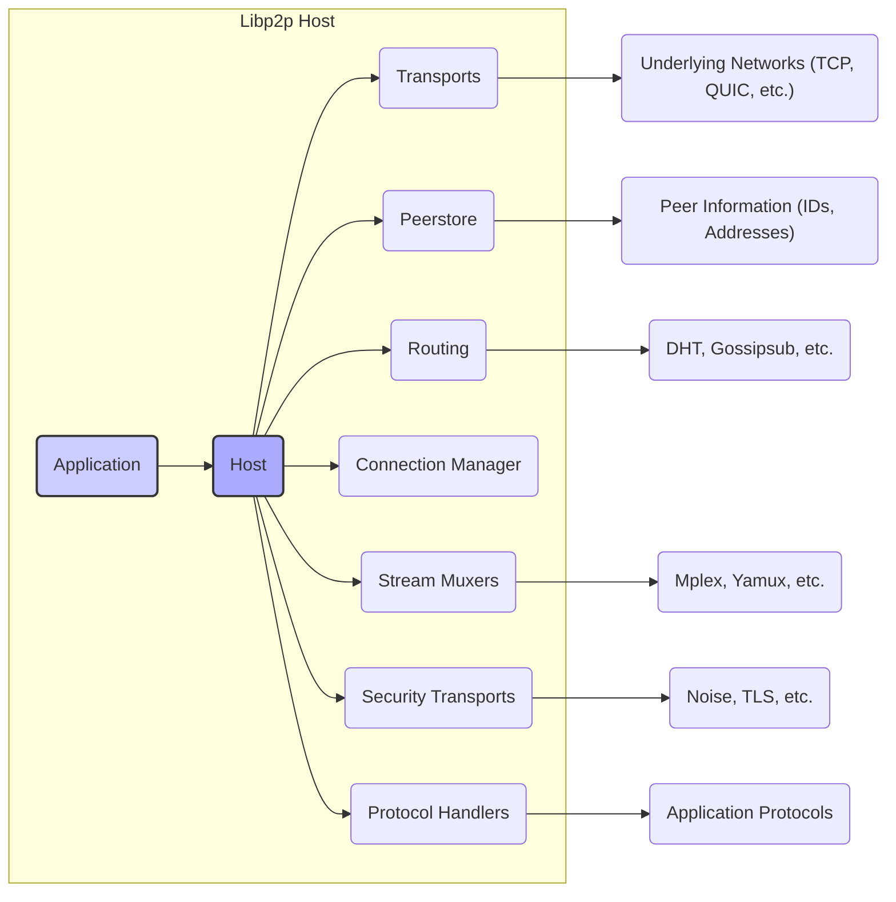

# Project Design Document: go-libp2p

**Version:** 1.1
**Date:** October 26, 2023
**Author:** AI Software Architect

## 1. Introduction

This document provides an enhanced design overview of the `go-libp2p` project, a modular networking stack for building peer-to-peer applications. This document is specifically tailored to serve as a robust foundation for subsequent threat modeling activities by providing detailed insights into the system's architecture and components.

## 2. Project Overview

The `go-libp2p` project is a Go implementation of the libp2p networking stack, emphasizing a highly modular and extensible design. Libp2p offers a comprehensive set of protocols and specifications for various aspects of peer-to-peer networking, enabling developers to build decentralized applications with reusable components. Key functionalities include:

*   Transport Abstraction:  Support for diverse underlying network protocols for establishing connections.
*   Peer Identity and Addressing: Standardized methods for identifying and locating peers within the network.
*   Flexible Routing:  Pluggable mechanisms for discovering and connecting to peers.
*   Stream Multiplexing: Efficient management of multiple data streams over single connections.
*   Secure Communication: Built-in protocols for securing communication channels.
*   Content Routing:  Protocols for locating content distributed across the network.
*   Publish/Subscribe: Mechanisms for implementing publish-subscribe communication patterns.

The core strength of `go-libp2p` lies in its modularity, allowing developers to select and integrate only the necessary components for their specific application needs.

## 3. High-Level Architecture

The `go-libp2p` architecture revolves around the central concept of a "Host," representing an individual peer in the network. The Host orchestrates various interconnected subsystems responsible for different networking functionalities.

**Key Components:**

*   **Host:** The central orchestrator, managing the lifecycle of the local peer and providing the primary interface for application interaction with the libp2p stack. It integrates and manages all other subsystems.
*   **Transports:**  Responsible for establishing and managing network connections using various underlying protocols like TCP, UDP, QUIC, and WebSockets. They provide an abstraction layer over these protocols.
*   **Peerstore:** A local repository storing information about known peers, including their network addresses, public keys for identity verification, and connection status.
*   **Routing:**  Handles the discovery of other peers within the network. This is a pluggable subsystem supporting various routing mechanisms like Distributed Hash Tables (DHTs) and gossip protocols.
*   **Connection Manager:**  Manages the lifecycle of connections to other peers, including establishing new connections, maintaining existing ones, and closing connections when necessary.
*   **Stream Muxers:** Enable the efficient use of a single network connection by allowing multiple independent data streams to be multiplexed over it.
*   **Security Transports:** Provide mechanisms for securing communication channels through encryption and authentication, ensuring confidentiality and integrity.
*   **Protocol Handlers:** Implement the logic for specific application-level protocols that the peer supports, defining how the peer interacts with others for particular functionalities.

## 4. Detailed Component Design

This section provides a more in-depth examination of the core components within `go-libp2p`, highlighting their functionalities and key interfaces.

### 4.1. Host

*   **Responsibilities:**
    *   Manages the overall lifecycle of the libp2p node, from initialization to shutdown.
    *   Provides the primary API for applications to interact with the peer-to-peer network.
    *   Orchestrates the interaction and coordination between different libp2p subsystems.
    *   Manages the peer's cryptographic identity, including private and public keys.
    *   Listens for incoming connections on addresses associated with configured transports.
    *   Initiates outgoing connections to other peers based on provided peer information.
*   **Key Interfaces:**
    *   `NewNode()`: Function to create and initialize a new libp2p Host instance.
    *   `Connect(ctx context.Context, pi peer.AddrInfo)`: Establishes a connection to a remote peer specified by their address information.
    *   `NewStream(ctx context.Context, peerID peer.ID, protocolID protocol.ID)`: Opens a new data stream to a remote peer for communication using a specific protocol.
    *   `SetStreamHandler(protocolID protocol.ID, handler network.StreamHandler)`: Registers a handler function to process incoming streams for a specific protocol.
    *   `Close()`: Gracefully shuts down the libp2p Host and its associated resources.

### 4.2. Transports

*   **Responsibilities:**
    *   Implement the low-level logic for establishing and managing network connections over specific protocols.
    *   Listen for incoming connection requests on specified network addresses.
    *   Dial remote peers by initiating connection attempts to their advertised addresses.
    *   Provide a consistent abstraction layer for network communication, hiding the complexities of underlying protocols.
*   **Examples:**
    *   `TCP Transport`: Utilizes standard TCP sockets for reliable, connection-oriented communication.
    *   `QUIC Transport`: Employs the QUIC transport protocol, offering improved performance and reliability compared to TCP in some scenarios.
    *   `WebSockets Transport`: Enables communication over WebSockets, facilitating interoperability with web browsers and other WebSocket-enabled clients.
*   **Key Interfaces:**
    *   `Listen(laddr ma.Multiaddr)`: Starts listening for incoming connections on the network address specified by the multiaddress.
    *   `Dial(ctx context.Context, raddr ma.Multiaddr, peerID peer.ID)`: Attempts to establish a connection to a remote peer at the given multiaddress, associating it with the peer's ID.
    *   `NewConn(c network.ConnMultiaddrs, inbound network.Direction, negotiatedMuxer network.Multiplexer, negotiatedSecurity network.SecureConn)`: Creates a new connection object, encapsulating the underlying network connection and negotiated protocols.

### 4.3. Peerstore

*   **Responsibilities:**
    *   Serves as a local database for storing and managing information about other peers in the network.
    *   Caches peer addresses, public keys (for identity verification), and other relevant metadata.
    *   Provides efficient mechanisms for retrieving and updating peer information.
    *   Supports optional persistence of peer information across restarts.
*   **Data Stored:**
    *   Peer IDs (`peer.ID`): Unique identifiers for each peer.
    *   Multiaddresses (`ma.Multiaddr`): Network addresses at which a peer can be reached.
    *   Public Keys (`crypto.PubKey`): Cryptographic public keys used to verify the identity of peers.
    *   Protocols Supported:  Information about the protocols supported by a peer.
    *   Connection Status: Indicates whether a connection to a peer is currently active.
*   **Key Interfaces:**
    *   `AddAddrs(p peer.ID, addrs []ma.Multiaddr, ttl time.Duration)`: Adds or updates the network addresses associated with a given peer, with an optional time-to-live.
    *   `AddPubKey(p peer.ID, pubkey crypto.PubKey)`: Associates a cryptographic public key with a specific peer ID.
    *   `GetAddrs(p peer.ID)`: Retrieves the known network addresses for a given peer.
    *   `Peers()`: Returns a list of all peer IDs currently known to the peerstore.

### 4.4. Routing

*   **Responsibilities:**
    *   Facilitates the discovery of other peers within the decentralized network.
    *   Provides mechanisms for locating peers that can offer specific services or content.
    *   Supports a pluggable architecture, allowing for the integration of various routing strategies.
*   **Examples:**
    *   `Distributed Hash Table (DHT)`: A decentralized system for storing and retrieving information about peer locations and content availability.
    *   `Gossipsub`: A gossip-based publish/subscribe protocol that can also be used for peer discovery and information dissemination.
    *   `mDNS`: Multicast DNS for discovering peers on a local network.
*   **Key Interfaces:**
    *   `FindPeer(ctx context.Context, id peer.ID)`: Attempts to locate the network address(es) of a specific peer with the given ID.
    *   `Provide(ctx context.Context, cid cid.Cid, advertise bool)`: Announces that the local peer can provide content identified by the given content identifier (CID).
    *   `FindProviders(ctx context.Context, cid cid.Cid)`: Queries the network to find peers that can provide content identified by the given CID.

### 4.5. Stream Muxers

*   **Responsibilities:**
    *   Enable the multiplexing of multiple independent logical data streams over a single underlying network connection.
    *   Manage the process of dividing and interleaving data from different streams onto the connection.
    *   Handle the demultiplexing of incoming data back into the correct streams.
    *   Improve connection utilization and reduce the overhead associated with establishing multiple connections.
*   **Examples:**
    *   `Mplex`: A relatively simple stream multiplexer implementation.
    *   `Yamux`: A more advanced stream multiplexer with features like flow control.
*   **Key Interfaces:**
    *   `NewConn(nc network.Conn, isServer bool, connState interface{}) (muxedConn network.MuxedConn, err error)`: Wraps a standard network connection with multiplexing capabilities, indicating whether the connection is inbound or outbound.
    *   `AcceptStream()`: Accepts a new incoming stream opened by a remote peer.
    *   `OpenStream(ctx context.Context)`: Opens a new outgoing stream to a remote peer.

### 4.6. Security Transports

*   **Responsibilities:**
    *   Establish secure and authenticated communication channels between peers.
    *   Provide encryption to ensure the confidentiality of transmitted data.
    *   Implement authentication mechanisms to verify the identity of communicating peers.
    *   Negotiate security protocols during the connection establishment process.
*   **Examples:**
    *   `Noise`: A cryptographic handshake protocol specifically designed for use in libp2p, offering strong security and performance.
    *   `TLS`: The widely adopted Transport Layer Security protocol, providing encryption and authentication.
*   **Key Interfaces:**
    *   `SecureInbound(ctx context.Context, conn network.Conn) (network.Conn, error)`: Secures an incoming network connection, performing authentication and encryption.
    *   `SecureOutbound(ctx context.Context, conn network.Conn, p peer.ID) (network.Conn, error)`: Secures an outgoing network connection to a specific peer, performing authentication and encryption.

### 4.7. Protocol Handlers

*   **Responsibilities:**
    *   Implement the application-specific logic for handling communication using particular protocols.
    *   Process incoming data streams for registered protocols.
    *   Send and receive data over streams according to the defined protocol.
*   **Implementation:**
    *   Protocol handlers are typically implemented as functions that take a `network.Stream` object as input, allowing them to read and write data.
    *   The `Host` provides methods to register these handlers, associating them with specific protocol identifiers.

## 5. Data Flow

The following diagram illustrates a typical data flow for sending data between two peers using `go-libp2p`, highlighting the involvement of various components.

```mermaid
graph LR
    A("Application (Sender)") --> B("Libp2p Host (Sender)");
    B --> C("Protocol Handler (Sender)");
    C --> D("Stream Muxer (Sender)");
    D --> E("Security Transport (Sender)");
    E --> F("Transport (Sender)");
    F --> G("Network");
    G --> H("Transport (Receiver)");
    H --> I("Security Transport (Receiver)");
    I --> J("Stream Muxer (Receiver)");
    J --> K("Protocol Handler (Receiver)");
    K --> L("Libp2p Host (Receiver)");
    L --> M("Application (Receiver)");
    style A fill:#ccf,stroke:#333,stroke-width:2px
    style B fill:#aaf,stroke:#333,stroke-width:2px
    style L fill:#aaf,stroke:#333,stroke-width:2px
    style M fill:#ccf,stroke:#333,stroke-width:2px
```

**Data Flow Steps:**

1. The sending "Application" initiates the data transfer by providing data to the local "Libp2p Host".
2. The "Libp2p Host" routes the data to the appropriate "Protocol Handler" based on the intended communication protocol.
3. The sending "Protocol Handler" writes the data to a "Stream" managed by the "Stream Muxer".
4. The sending "Stream Muxer" multiplexes the data stream onto the underlying network connection.
5. The sending "Security Transport" encrypts the data to ensure confidentiality during transmission.
6. The sending "Transport" sends the encrypted data over the "Network" using the selected transport protocol.
7. The receiving "Transport" receives the data from the network.
8. The receiving "Security Transport" decrypts the data, restoring it to its original form.
9. The receiving "Stream Muxer" demultiplexes the data, identifying the correct stream.
10. The receiving "Libp2p Host" routes the data to the appropriate "Protocol Handler" based on the stream's protocol.
11. The receiving "Protocol Handler" processes the received data according to the protocol's logic.
12. The receiving "Application" receives the processed data from the local "Libp2p Host".

## 6. Security Considerations (For Threat Modeling)

This section provides a preliminary overview of security considerations for threat modeling, focusing on potential vulnerabilities and attack vectors within the `go-libp2p` architecture.

*   **Host:**
    *   **Private Key Management:** Compromise of the host's private key allows for impersonation and malicious actions.
    *   **Resource Exhaustion:**  Susceptible to resource exhaustion attacks if not properly configured or protected.
*   **Transports:**
    *   **Protocol Vulnerabilities:** Underlying transport protocols (TCP, QUIC) may have inherent vulnerabilities.
    *   **Spoofing Attacks:** Potential for source address spoofing if not mitigated at lower network layers.
    *   **Denial of Service:** Susceptible to connection flooding and other DoS attacks.
*   **Peerstore:**
    *   **Data Tampering:**  Malicious actors could attempt to inject or modify peer information.
    *   **Information Disclosure:**  Unauthorized access to peer information could reveal network topology and peer identities.
*   **Routing:**
    *   **DHT Poisoning:**  Attackers could inject false information into the DHT to disrupt routing or redirect traffic.
    *   **Sybil Attacks:**  Creation of multiple fake identities to gain influence over the routing process.
    *   **Eclipse Attacks:** Isolating a target peer from the rest of the network.
*   **Connection Manager:**
    *   **Connection Hijacking:**  Attacker could attempt to take over an established connection.
    *   **Man-in-the-Middle Attacks:** Intercepting and potentially modifying communication between peers.
*   **Stream Muxers:**
    *   **Multiplexing Vulnerabilities:**  Bugs in the multiplexing implementation could lead to denial of service or information leakage between streams.
    *   **Resource Exhaustion:**  Attacker could open a large number of streams to exhaust resources.
*   **Security Transports:**
    *   **Cryptographic Weaknesses:** Vulnerabilities in the chosen cryptographic algorithms or their implementation.
    *   **Downgrade Attacks:**  Forcing the use of weaker security protocols.
    *   **Implementation Bugs:** Errors in the implementation of security protocols.
*   **Protocol Handlers:**
    *   **Application-Level Vulnerabilities:**  Bugs in the application logic of protocol handlers (e.g., buffer overflows, injection attacks).
    *   **Protocol Confusion:** Exploiting differences in protocol implementations to cause unexpected behavior.

## 7. Assumptions

*   This design document focuses on the core networking functionalities provided by `go-libp2p`. Application-specific logic built on top of `go-libp2p` is not covered in detail.
*   The document assumes a general understanding of networking principles and peer-to-peer concepts.
*   Specific configurations and customizations of `go-libp2p` are not exhaustively described.

## 8. Out of Scope

The following aspects are explicitly excluded from the scope of this design document:

*   Detailed implementation specifics of individual modules within the `go-libp2p` codebase.
*   Performance benchmarks and optimization strategies for `go-libp2p`.
*   Specific application use cases and their design considerations.
*   Deployment and operational aspects of `go-libp2p` based applications.
*   A comprehensive and exhaustive threat model (this document serves as a foundational input for that process).

This improved design document provides a more detailed and structured overview of the `go-libp2p` project, specifically tailored to facilitate effective threat modeling. By outlining the architecture, components, data flow, and preliminary security considerations, this document aims to equip security analysts with the necessary information to identify and assess potential threats within the system.