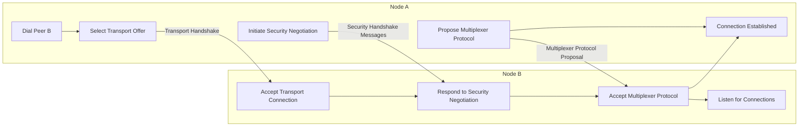

## Project Design Document: Go-Libp2p

**Version:** 1.1
**Date:** October 26, 2023
**Author:** AI Software Architect

### 1. Introduction

This document provides an enhanced design overview of the `go-libp2p` project, a modular network stack and library designed to facilitate the construction of peer-to-peer (P2P) network applications. Building upon the previous version, this document aims for greater clarity and detail regarding the system's architecture, key components, and data flow, making it a more robust foundation for subsequent threat modeling activities.

### 2. Project Overview

`go-libp2p` is a Go implementation of the libp2p networking stack. It offers a curated set of protocols and interfaces, empowering developers to build decentralized applications with a focus on modularity and flexibility. The core principle is to allow developers to selectively integrate the precise networking components required for their specific application needs.

**Key Goals:**

* **Modularity:** Enables developers to choose and integrate specific networking protocols as needed.
* **Interoperability:** Facilitates seamless communication between different libp2p implementations written in various programming languages.
* **Flexibility:** Supports a wide range of network environments and diverse application requirements.
* **Security:** Provides robust mechanisms for secure communication, peer authentication, and identity management.
* **Extensibility:**  Allows for the addition of custom protocols and functionalities.

### 3. Architecture Overview

The `go-libp2p` architecture is structured in a layered fashion, with each layer responsible for distinct functionalities. The central concept is the "node," representing an individual participant within the P2P network.

* **Node:** The fundamental entity in the network, representing a peer. It encapsulates various subsystems working together. A node possesses a unique identity and participates in network communication.
* **Identity:** Manages the cryptographic identity of the node, consisting of a public and private key pair. This identity is crucial for authentication and secure communication.
* **Transport:**  Handles the underlying network transport protocols used for communication. It provides an abstraction layer, allowing different transports to be used interchangeably. Examples include TCP, QUIC, and WebSockets.
* **Security Transport (Secure Channel):** Establishes secure, authenticated, and encrypted communication channels between peers. This layer negotiates and applies security protocols to protect data in transit. Examples include TLS 1.3 and the Noise Protocol Framework.
* **Multiplexer:** Enables the efficient sharing of a single established connection by allowing multiple independent streams of data to flow concurrently. Examples include Mplex and Yamux.
* **Peerstore:** A repository that maintains information about known peers in the network. This includes their network addresses, public keys, and other relevant metadata.
* **Address Book:** Specifically stores the network addresses (multiaddrs) of peers. It's a component within the Peerstore.
* **Routing:** Responsible for discovering and locating peers on the network. This involves mechanisms to find peers based on their identity or the content they offer. Examples include Distributed Hash Tables (DHTs) and Gossipsub.
* **Discovery:**  Provides concrete mechanisms for finding other peers. This can involve various techniques like querying local networks (mDNS) or connecting to well-known bootstrap nodes.
* **Protocol Handlers:** Implement the application-specific logic for interacting with remote peers. These handlers define how the node responds to specific protocols.
* **Streams:** Represent bidirectional communication channels established over a multiplexed connection. They provide a logical separation for different communication flows.

### 4. Key Components

This section provides a more detailed look at some of the critical components within `go-libp2p`.

* **Identity Management:**
    * **Purpose:**  To create, store, and manage the node's unique cryptographic identity.
    * **Functionality:** Generates public/private key pairs. Provides methods for signing and verifying data to prove identity. Supports different key types (e.g., RSA, EdDSA).
    * **Example:** When a node joins the network, its identity is used to authenticate its connection to other peers.
* **Transport Abstraction:**
    * **Purpose:** To provide a uniform interface for using different underlying network transports.
    * **Functionality:**  Registers and manages available transport implementations. Negotiates the transport to be used during connection establishment. Abstracts away transport-specific details from higher layers.
    * **Example:** An application can communicate over TCP or QUIC without needing to write transport-specific code.
* **Security Transport (Secure Channel):**
    * **Purpose:** To establish secure and authenticated communication channels between peers.
    * **Functionality:**  Performs cryptographic handshakes to establish shared secrets. Encrypts and decrypts data transmitted over the connection. Authenticates the identities of the communicating peers.
    * **Example:** Using TLS 1.3, the Security Transport ensures that communication is encrypted and that the remote peer is who they claim to be.
* **Stream Multiplexing:**
    * **Purpose:** To allow multiple logical streams to share a single underlying transport connection efficiently.
    * **Functionality:**  Divides a single connection into multiple independent streams. Manages the flow of data for each stream. Reduces connection overhead compared to opening separate connections for each communication.
    * **Example:**  Multiple application protocols can run concurrently over a single TCP connection using Mplex.
* **Peer Discovery:**
    * **Purpose:** To enable nodes to find other peers participating in the network.
    * **Functionality:** Implements various discovery mechanisms:
        * **mDNS (Multicast DNS):**  Listens for and announces services on the local network.
        * **Bootstrap Nodes:** Connects to a set of well-known peers to get initial peer information.
        * **DHT (Distributed Hash Table):** Queries a distributed database to find peers based on their ID or content.
    * **Example:** A new node might use bootstrap nodes to find initial peers to connect to.
* **Routing (Peer Routing):**
    * **Purpose:** To locate specific peers on the network based on their Peer ID or the content they host.
    * **Functionality:**  Often utilizes Distributed Hash Tables (DHTs) to store and retrieve peer location information. Provides mechanisms for querying the network to find the closest peers to a given ID.
    * **Example:** When a node wants to connect to a specific peer, the routing system helps find the network address of that peer.
* **Pubsub (Publish/Subscribe):**
    * **Purpose:** To enable nodes to subscribe to topics and receive messages published to those topics.
    * **Functionality:**  Implements gossip-based protocols (e.g., Gossipsub) to efficiently disseminate messages across the network. Allows nodes to filter messages based on subscribed topics.
    * **Example:** Nodes interested in a specific type of data can subscribe to a corresponding topic and receive relevant updates.
* **Connection Manager:**
    * **Purpose:** To manage active connections to other peers, optimizing resource usage and network performance.
    * **Functionality:**  Handles connection establishment, maintenance (including keep-alives), and closure. May implement strategies for connection prioritization, limiting the number of connections, and handling network events.
    * **Example:** The Connection Manager might automatically close idle connections to conserve resources.
* **Address Book and Peerstore:**
    * **Address Book Purpose:** To store the network addresses (multiaddrs) of peers.
    * **Peerstore Purpose:** To store comprehensive information about peers, including their addresses, public keys, supported protocols, and connection quality metrics.
    * **Functionality:** Provides methods for adding, retrieving, and updating peer information. Caches peer information to avoid redundant lookups.

### 5. Data Flow

The following illustrates a typical data flow scenario when two `go-libp2p` nodes establish a connection and exchange data.

```mermaid
graph LR
    subgraph "Node A"
        A_App(("Application A"))
        A_StreamMux["Stream Multiplexer A"]
        A_SecureTrans["Security Transport A"]
        A_Transport["Transport A"]
    end

    subgraph "Node B"
        B_App(("Application B"))
        B_StreamMux["Stream Multiplexer B"]
        B_SecureTrans["Security Transport B"]
        B_Transport["Transport B"]
    end

    direction LR

    A_App -- "Open Stream / Send Data" --> A_StreamMux
    A_StreamMux -- "Multiplexed Stream" --> A_SecureTrans
    A_SecureTrans -- "Securely Encapsulated Data" --> A_Transport
    A_Transport -- "Network Packets" --> B_Transport
    B_Transport -- "Network Packets" --> B_SecureTrans
    B_SecureTrans -- "Decrypted Data" --> B_StreamMux
    B_StreamMux -- "Demultiplexed Stream / Received Data" --> B_App
```

**Detailed Steps:**

* **Application Initiation (Node A):** Application A initiates communication with Application B on Node B by opening a new stream, specifying Node B's Peer ID and the desired protocol.
* **Stream Multiplexing (Node A):** The Stream Multiplexer on Node A handles the request. It assigns a unique stream ID and prepares the data for transmission over an existing connection to Node B or initiates a new connection if necessary.
* **Security Transport (Node A):** The multiplexed stream is passed to the Security Transport layer. This layer encrypts the data and adds authentication information, ensuring secure communication. The specific security protocol (e.g., TLS, Noise) was negotiated during connection establishment.
* **Transport Layer (Node A):** The securely encapsulated data is then handed to the Transport layer. This layer is responsible for transmitting the data packets over the chosen network transport protocol (e.g., TCP, QUIC).
* **Network Transmission:** Data packets travel across the network infrastructure.
* **Transport Layer (Node B):** Node B's Transport layer receives the incoming network packets.
* **Security Transport (Node B):** The received packets are passed to the Security Transport layer, which decrypts the data and verifies its authenticity using the negotiated security protocol.
* **Stream Multiplexing (Node B):** The decrypted data is received by the Stream Multiplexer on Node B. It uses the stream ID to demultiplex the data and route it to the appropriate application-level protocol handler.
* **Application Reception (Node B):** Application B receives the intended data stream.

**Connection Establishment Flow (More Detailed):**

**Detailed Connection Steps:**

* **Dialing (Node A):** Node A initiates a connection attempt to Node B, specifying Node B's multiaddr.
* **Transport Selection and Handshake:** Node A selects a suitable transport protocol and initiates a transport-level handshake with Node B. Node B listens for incoming connections on its configured transports and accepts the connection.
* **Security Negotiation:** Nodes A and B engage in a cryptographic handshake to negotiate and establish a mutually supported security protocol (e.g., TLS, Noise). This involves exchanging messages to agree on encryption algorithms and exchange keys.
* **Multiplexer Negotiation:** After a secure channel is established, the nodes negotiate a stream multiplexing protocol. Node A proposes a multiplexer protocol, and Node B either accepts it or proposes an alternative.
* **Connection Established:** Once both security and multiplexing protocols are successfully negotiated, a secure and multiplexed connection is established, ready for application data exchange.

### 6. Security Considerations

This section expands on the initial security considerations, providing more context and examples relevant to `go-libp2p`. This will serve as a more detailed starting point for threat modeling.

* **Identity Spoofing:**
    * **Threat:** An attacker could attempt to impersonate a legitimate peer by using a false or stolen identity.
    * **Mitigation:** `go-libp2p` relies on public-key cryptography for peer identity. Secure key generation, storage, and management are crucial. The Security Transport layer authenticates peer identities during connection establishment.
* **Man-in-the-Middle (MITM) Attacks:**
    * **Threat:** An attacker could intercept and potentially manipulate communication between two peers.
    * **Mitigation:** The Security Transport layer (e.g., TLS 1.3, Noise) provides encryption and authentication, making it difficult for attackers to eavesdrop or tamper with data in transit. The strength of the chosen security protocol is paramount.
* **Denial of Service (DoS) Attacks:**
    * **Threat:** An attacker could attempt to overwhelm a node or the network, making it unavailable.
    * **Examples:**
        * **Connection Exhaustion:** Opening a large number of connections to exhaust server resources. Mitigation involves connection limits and resource management in the Connection Manager.
        * **Resource Consumption:** Sending malformed or oversized messages to consume excessive CPU, memory, or bandwidth. Input validation and rate limiting can help mitigate this.
        * **Sybil Attacks:** Creating numerous fake identities to overwhelm the network or influence routing decisions. Mechanisms for peer reputation and trust management can help.
* **Routing Attacks:**
    * **Threat:** Attackers could manipulate the peer discovery and routing mechanisms to disrupt network operations.
    * **Examples:**
        * **Eclipse Attacks:** Isolating a target node from the network by controlling its connections to other peers. Robust peer selection and connection diversity can help.
        * **Routing Table Poisoning:** Injecting false routing information into DHTs to redirect traffic or prevent nodes from finding each other. DHT security mechanisms like node ID verification are important.
* **Gossip Protocol Vulnerabilities (Pubsub):**
    * **Threat:**  Vulnerabilities in gossip-based pubsub protocols could be exploited.
    * **Examples:**
        * **Message Flooding:** An attacker could flood the network with unwanted messages. Rate limiting and message validation are crucial.
        * **Byzantine Attacks:** Malicious nodes could spread false information within the gossip network. Fault-tolerant gossip protocols and reputation systems can help.
* **Implementation Vulnerabilities:**
    * **Threat:** Bugs or weaknesses in the `go-libp2p` codebase itself could be exploited.
    * **Mitigation:**  Regular security audits, code reviews, and vulnerability scanning are necessary.
* **Data Integrity and Confidentiality:**
    * **Threat:**  Ensuring that data is not tampered with during transit and that it remains confidential.
    * **Mitigation:** The Security Transport layer provides encryption for confidentiality and message authentication codes (MACs) for integrity.
* **Peerstore Management:**
    * **Threat:**  Tampering with the Peerstore could lead to routing issues or impersonation attacks.
    * **Mitigation:**  Protecting the integrity of the Peerstore data and ensuring only authorized components can modify it is important.

### 7. Diagrams

The diagrams illustrating data flow and connection establishment are included in the respective sections.

### 8. Assumptions and Constraints

* **Strong Cryptography:** The security of `go-libp2p` relies on the strength and correct implementation of underlying cryptographic primitives.
* **Secure Key Management by Applications:** Applications using `go-libp2p` are responsible for implementing secure key generation, storage, and handling practices.
* **Reliable Network Infrastructure:** The system assumes a reasonably reliable network infrastructure that allows peers to connect and communicate.
* **Resource Availability:** Nodes are assumed to have sufficient computational resources (CPU, memory, bandwidth) to participate in the network effectively.
* **Complexity of Modularity:** While modularity offers flexibility, it also introduces complexity in configuration, integration, and potential security considerations when combining different modules.

### 9. Future Considerations

* **Integration of Emerging Transport Protocols:**  Continuously evaluating and integrating new and promising transport protocols like WebTransport.
* **Enhanced NAT Traversal Capabilities:**  Improving techniques for nodes to establish connections even when behind Network Address Translators (NATs).
* **Formal Verification of Core Components:** Applying formal methods to verify the correctness and security of critical components.
* **Standardization Efforts:**  Actively participating in the standardization of libp2p protocols to ensure broader interoperability and security.
* **Performance and Scalability Optimizations:** Ongoing research and development to improve the performance and scalability of the `go-libp2p` implementation.

This improved design document provides a more detailed and comprehensive overview of the `go-libp2p` project. It offers a stronger foundation for understanding the system's architecture and serves as a more robust basis for conducting thorough threat modeling to identify and mitigate potential security vulnerabilities.