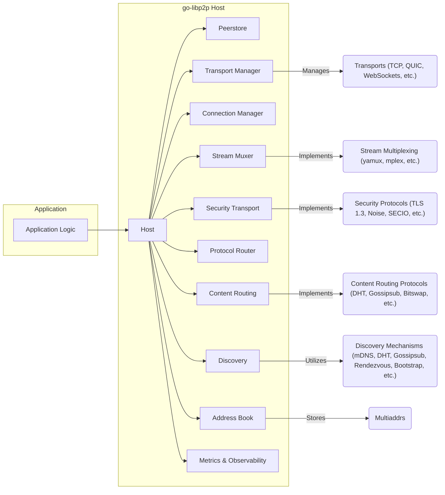
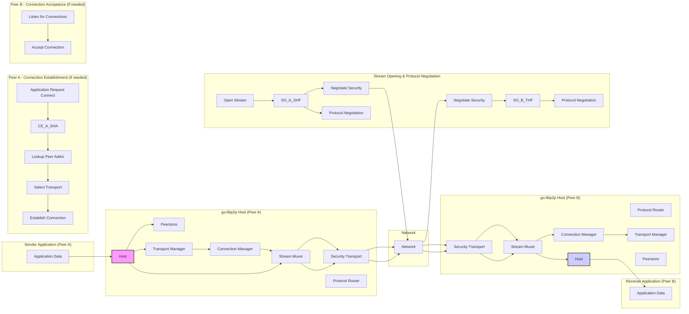

# Project Design Document: go-libp2p

**Version:** 1.1
**Date:** October 26, 2023
**Author:** AI Software Architect

## 1. Introduction

This document provides an enhanced and more detailed design overview of the `go-libp2p` project, a modular networking stack for building peer-to-peer applications. This revised document aims to provide a clearer and more comprehensive articulation of the architecture, key components, and data flow within `go-libp2p`, specifically tailored for subsequent threat modeling activities. We have expanded on descriptions and added more context for security considerations.

## 2. Project Overview

`go-libp2p` is a robust Go implementation of the libp2p networking stack. It offers a curated set of protocols and well-defined interfaces, empowering developers to construct decentralized and resilient applications. The fundamental design principles underpinning `go-libp2p` are:

- **Modular Design:** Components are meticulously crafted to be independent, interchangeable, and reusable, fostering flexibility and maintainability.
- **Protocol Agnosticism:**  The stack is designed to seamlessly support a diverse range of transport protocols, security protocols, and discovery mechanisms, allowing for adaptation to various network environments.
- **Extensibility and Customization:**  `go-libp2p` provides well-defined extension points, enabling developers to integrate custom protocols and functionalities, tailoring the stack to specific application needs.
- **Network Resilience:**  The architecture is inherently designed to gracefully handle network partitions, transient failures, and dynamic network conditions, ensuring application robustness.

## 3. High-Level Architecture

The following diagram illustrates the high-level architecture of a `go-libp2p` node, highlighting the key modules and their interactions:

**Key Components:**

- **Application Logic:** The custom code developed by the user that leverages the `go-libp2p` library to implement specific peer-to-peer networking functionalities.
- **Host:** The central orchestrator and entry point for interacting with the `go-libp2p` stack. It manages the lifecycle of the node and provides the primary API for applications.
- **Peerstore:** A persistent and in-memory database that stores comprehensive information about known peers, including their unique Peer IDs, associated network addresses (multiaddrs), public keys, and observed connection quality.
- **Transport Manager:** Responsible for the management and selection of available transport protocols. It handles dialing remote peers and listening for incoming connections on configured transports.
- **Connection Manager:** Oversees the lifecycle of active connections to other peers, enforcing connection limits, managing resource allocation, and handling connection upgrades (security and multiplexing).
- **Stream Muxer:** Enables the efficient multiplexing of multiple independent, logical streams over a single underlying network connection, reducing overhead and improving performance.
- **Security Transport:** Handles the crucial process of secure negotiation, authentication, and encryption of connections, ensuring confidentiality and integrity of communication.
- **Protocol Router:**  Directs incoming streams to the appropriate protocol handler based on the negotiated protocol ID, facilitating protocol negotiation and management.
- **Content Routing:** Provides mechanisms for discovering peers that possess specific content or offer particular services, enabling content retrieval and service discovery in a decentralized manner.
- **Discovery:**  Enables a node to dynamically find other peers participating in the network, utilizing various discovery mechanisms.
- **Address Book:** A component within the Peerstore that specifically manages and stores the network addresses (multiaddrs) associated with known peers.
- **Metrics & Observability:** Provides instrumentation and hooks for monitoring the health and performance of the `go-libp2p` node, enabling observability and debugging.
- **Transports (TCP, QUIC, WebSockets, etc.):**  The concrete implementations of the underlying network protocols used for transmitting data.
- **Security Protocols (TLS 1.3, Noise, SECIO, etc.):**  Specific protocols employed to secure the communication channel, providing encryption and authentication.
- **Stream Multiplexing (yamux, mplex, etc.):** Implementations of different stream multiplexing protocols, each with its own performance characteristics.
- **Discovery Mechanisms (mDNS, DHT, Gossipsub, Rendezvous, Bootstrap, etc.):**  Various methods and protocols used for discovering peers on the network.
- **Content Routing Protocols (DHT, Gossipsub, Bitswap, etc.):** Protocols used for locating and retrieving content or discovering services offered by peers.
- **Multiaddrs:** A standardized way of representing network addresses, encapsulating the transport protocol and address information.

## 4. Detailed Component Description

This section provides a more granular examination of key components within `go-libp2p`:

- **Host:**
    - Acts as the central control plane for the `go-libp2p` node.
    - Manages the initialization, operation, and shutdown of the node.
    - Provides the primary API for applications to establish connections, listen for incoming connections, manage protocols, and interact with other `go-libp2p` functionalities.
    - Holds references to and coordinates the operation of other core components like the Peerstore, Transport Manager, Connection Manager, and Protocol Router.
    - Facilitates protocol negotiation with remote peers.
    - Emits events related to peer connection and disconnection.

- **Peerstore:**
    - Serves as a central repository for information about known peers.
    - Stores peer information indexed by their unique Peer ID (a cryptographic hash of their public key).
    - Maintains a record of multiaddrs associated with each peer, allowing for connection attempts over various network interfaces and protocols.
    - Caches public keys, enabling verification of peer identities.
    - Tracks connection attempts and observed connection quality (latency, success rate).
    - Provides mechanisms for applications and other components to query, update, and subscribe to changes in peer information.

- **Transport Manager:**
    - Maintains a registry of available and configured transport protocols (e.g., TCP, QUIC, WebSockets).
    - When dialing a remote peer, it selects a suitable transport protocol based on the available transports and the remote peer's advertised addresses.
    - Listens for incoming connections on the configured transport protocols and ports.
    - Abstracts away the complexities of individual transport implementations, providing a consistent interface for the rest of the stack.
    - Handles transport-specific error conditions and connection management.

- **Connection Manager:**
    - Responsible for establishing, maintaining, and closing connections to other peers.
    - Enforces configured connection limits (e.g., maximum number of connections, connections per peer).
    - Manages resource allocation associated with active connections.
    - Orchestrates the upgrade of raw transport connections to secure and multiplexed connections by invoking the Security Transport and Stream Muxer.
    - Monitors the health of connections and handles disconnections, potentially attempting to re-establish connections.

- **Stream Muxer:**
    - Implements the logic for multiplexing multiple logical streams over a single underlying transport connection.
    - Provides an API for opening new streams, sending and receiving data on streams, and closing streams.
    - Handles stream flow control and prioritization.
    - Common implementations like yamux and mplex offer different performance trade-offs.

- **Security Transport:**
    - Responsible for establishing secure, authenticated, and encrypted communication channels with remote peers.
    - Supports various security protocols, allowing for negotiation of the most appropriate protocol.
    - Handles cryptographic key exchange and session management.
    - Ensures the confidentiality (preventing eavesdropping) and integrity (preventing tampering) of data transmitted over the connection.
    - Authenticates the identity of the remote peer.

- **Protocol Router:**
    - Routes incoming streams to the appropriate protocol handler based on the negotiated protocol ID.
    - Utilizes a protocol negotiation mechanism (typically multistream-select) at the beginning of a new stream to determine the intended application-level protocol.
    - Allows applications to register handlers for specific protocol IDs.
    - Provides a mechanism for versioning and managing different versions of protocols.

- **Discovery:**
    - Enables nodes to discover the network addresses of other peers.
    - Supports a variety of discovery mechanisms, each with its own characteristics and trade-offs:
        - **mDNS (Multicast DNS):** For discovering peers on the local network.
        - **DHT (Distributed Hash Table):** A distributed database for peer discovery across a wider network.
        - **Gossipsub:** A pub/sub protocol that can also be used for peer discovery.
        - **Rendezvous:**  Using a central point (rendezvous point) to facilitate peer discovery.
        - **Bootstrap Nodes:**  A list of known, stable peers that can be used to join the network initially.

- **Address Book:**
    - A dedicated component within the Peerstore responsible for managing and storing the network addresses (multiaddrs) associated with each peer.
    - Allows for efficient retrieval of addresses for a given peer.
    - May implement logic for prioritizing or selecting addresses based on reachability or other factors.

## 5. Data Flow

The following diagram illustrates a more detailed data flow for sending data from one application to another using `go-libp2p`, highlighting the involvement of various components:

**Data Flow Steps:**

1. **Sender Application (Peer A) wants to send data and interacts with the local `go-libp2p` Host.**
2. **Host checks the Peerstore for information about the recipient peer (Peer B).**
3. **If a connection to Peer B doesn't exist, the Host uses the Transport Manager to select an appropriate transport protocol and the Connection Manager to establish a connection.** This involves looking up Peer B's addresses in the Peerstore.
4. **Once a connection is established, the Sender's Host requests the Stream Muxer to open a new stream over the connection.**
5. **The Stream Muxer initiates protocol negotiation with the remote peer's Stream Muxer via the Security Transport.**
6. **The Security Transport encrypts the protocol negotiation messages.**
7. **After successful protocol negotiation, the Sender's Protocol Router is informed of the agreed-upon protocol.**
8. **The Sender Application provides the data to be sent to the local Host.**
9. **The Host passes the data to the Stream Muxer.**
10. **The Stream Muxer segments the data into frames for transmission.**
11. **The Security Transport encrypts the data frames.**
12. **The encrypted data frames are transmitted over the network using the selected transport protocol.**
13. **On the receiving side (Peer B), the Security Transport decrypts the incoming data frames.**
14. **The Stream Muxer on Peer B reassembles the data frames into the original data stream.**
15. **The Protocol Router on Peer B identifies the intended protocol for the stream.**
16. **The Host on Peer B routes the stream to the appropriate protocol handler.**
17. **The data is delivered to the Receiver Application (Peer B).**

## 6. Security Considerations

This section provides a more detailed breakdown of security considerations, categorized by component, to facilitate threat modeling:

- **Host:**
    - **Threat:**  Compromise of the Host could lead to complete control over the `go-libp2p` node.
    - **Considerations:** Secure key management for the node's identity, protection against unauthorized access to the Host's API.
- **Peerstore:**
    - **Threat:** Information leakage of peer addresses or identities, manipulation of peer information (e.g., poisoning attacks).
    - **Considerations:** Access control to the Peerstore, secure storage of sensitive peer data, validation of peer information updates.
- **Transport Manager:**
    - **Threat:**  Vulnerabilities in specific transport implementations, manipulation of transport selection to force use of weaker protocols.
    - **Considerations:** Regular updates of transport libraries, secure configuration of allowed transports.
- **Connection Manager:**
    - **Threat:**  DoS attacks by exhausting connection limits, manipulation of connection lifecycle.
    - **Considerations:** Robust connection management policies, rate limiting of connection attempts, secure handling of connection upgrades.
- **Stream Muxer:**
    - **Threat:**  Vulnerabilities in multiplexing implementations leading to stream interference or denial of service.
    - **Considerations:**  Careful selection and validation of stream muxer implementations, protection against resource exhaustion on streams.
- **Security Transport:**
    - **Threat:**  Weaknesses in negotiated security protocols, vulnerabilities in security protocol implementations, man-in-the-middle attacks.
    - **Considerations:**  Enforcement of strong security protocols, proper key exchange mechanisms, regular updates of security libraries.
- **Protocol Router:**
    - **Threat:**  Exploitation of vulnerabilities in protocol negotiation, routing streams to malicious handlers.
    - **Considerations:**  Secure implementation of protocol negotiation, access control for registering protocol handlers.
- **Discovery:**
    - **Threat:**  Eclipse attacks, Sybil attacks, information leakage through discovery mechanisms.
    - **Considerations:**  Secure validation of discovered peer information, use of authenticated discovery mechanisms where possible.
- **Address Book:**
    - **Threat:**  Manipulation of stored addresses to redirect connections to malicious peers.
    - **Considerations:**  Integrity checks on stored addresses, secure updates to the address book.
- **Metrics & Observability:**
    - **Threat:**  Exposure of sensitive information through metrics endpoints, manipulation of metrics to hide malicious activity.
    - **Considerations:**  Secure access control to metrics endpoints, careful selection of exposed metrics.

## 7. Assumptions and Constraints

- This design document provides a general overview of `go-libp2p`. Specific application-level protocols built on top of `go-libp2p` are not detailed here.
- The document assumes a foundational understanding of networking principles and peer-to-peer concepts.
- The diagrams presented are high-level representations and may not encompass all intricate implementation details.
- Security considerations are intended as a starting point for threat modeling and require further in-depth analysis.
- Error handling mechanisms and specific configuration options are not exhaustively covered in this document but are important aspects for a complete understanding.

## 8. Future Considerations

- Development of more detailed design documents for individual components, including specific transport, security, and multiplexing implementations.
- In-depth analysis of error handling strategies and resilience patterns within `go-libp2p`.
- Comprehensive documentation of configuration options and their security implications.
- Performance benchmarking and optimization strategies for various use cases.
- Exploration of integration points with other relevant technologies and platforms.