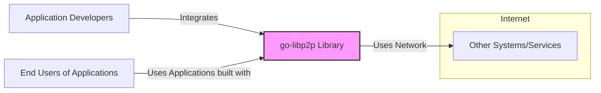
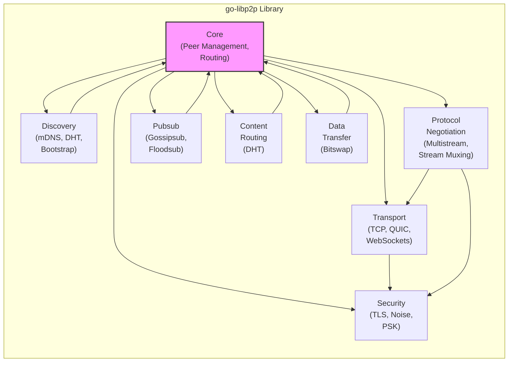
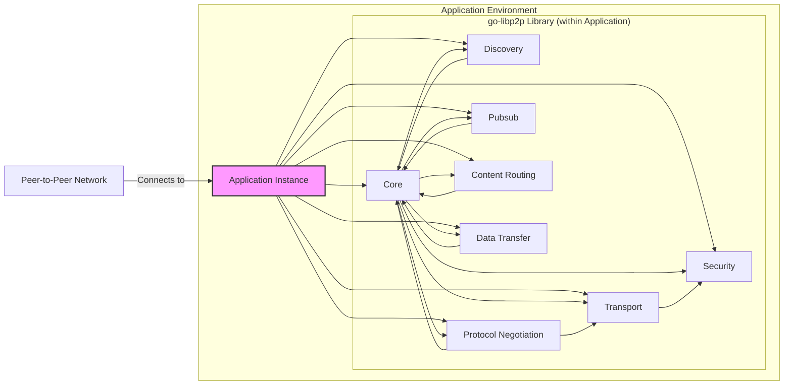
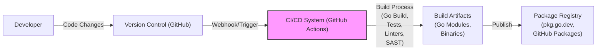

# BUSINESS POSTURE

- Business Priorities and Goals
  - Goal: To provide a modular, extensible, and robust networking stack for building peer-to-peer applications.
  - Priority: Interoperability and standardization across different implementations of libp2p in various programming languages.
  - Priority: Performance and efficiency to support high-throughput and low-latency peer-to-peer communication.
  - Priority: Security and resilience against attacks targeting peer-to-peer networks.
  - Priority: Community adoption and contribution to ensure the long-term sustainability and evolution of the library.

- Business Risks
  - Risk: Security vulnerabilities in the library could be exploited by malicious actors, compromising applications built on top of libp2p and the wider peer-to-peer network.
  - Risk: Performance bottlenecks or inefficiencies could limit the scalability and usability of applications using libp2p.
  - Risk: Lack of interoperability with other libp2p implementations or networking technologies could fragment the peer-to-peer ecosystem.
  - Risk: Insufficient community support or contribution could lead to stagnation and lack of maintenance, making the library less attractive over time.
  - Risk: Changes in the underlying network landscape or emerging technologies could render parts of libp2p obsolete or require significant refactoring.

# SECURITY POSTURE

- Existing Security Controls
  - security control: Code is publicly available on GitHub, allowing for community review and identification of potential vulnerabilities. (Implemented: GitHub Repository)
  - security control:  Go language's built-in security features, such as memory safety and garbage collection, mitigate certain classes of vulnerabilities. (Implemented: Go Language)
  - security control: Usage of established cryptographic libraries within Go ecosystem for secure communication protocols. (Implemented: Codebase)
  - security control:  Project follows open source development practices, encouraging community contributions and security audits. (Implemented: Development Process)
  - accepted risk: Reliance on users and application developers to correctly implement and configure libp2p security features in their applications.
  - accepted risk: Potential vulnerabilities might be introduced through community contributions and may not be immediately identified.
  - accepted risk:  Complexity of peer-to-peer networking protocols can make comprehensive security analysis challenging.

- Recommended Security Controls
  - security control: Implement automated security scanning (SAST/DAST) in the CI/CD pipeline to detect potential vulnerabilities early in the development process.
  - security control: Conduct regular security audits and penetration testing by external security experts to identify and address vulnerabilities.
  - security control: Establish a clear vulnerability disclosure and response process to handle security issues effectively.
  - security control: Provide security guidelines and best practices documentation for developers using libp2p to build secure applications.
  - security control: Implement fuzz testing to identify potential crashes and vulnerabilities in network protocol implementations.

- Security Requirements
  - Authentication:
    - Requirement: Support for mutual authentication between peers to ensure only authorized peers can communicate.
    - Requirement: Pluggable authentication mechanisms to allow applications to choose appropriate authentication methods.
    - Requirement: Protection of authentication credentials and secrets during storage and transmission.
  - Authorization:
    - Requirement: Mechanisms to control access to resources and functionalities based on peer identity or roles.
    - Requirement: Policy enforcement points to ensure authorization decisions are consistently applied.
    - Requirement: Ability to define granular authorization policies to meet diverse application needs.
  - Input Validation:
    - Requirement: Robust input validation for all data received from network peers to prevent injection attacks and protocol manipulation.
    - Requirement: Input validation should be applied at multiple layers of the networking stack.
    - Requirement: Clear error handling and logging for invalid inputs to aid in debugging and security monitoring.
  - Cryptography:
    - Requirement: Use of strong and up-to-date cryptographic algorithms and libraries for encryption, signing, and hashing.
    - Requirement: Proper key management practices, including secure key generation, storage, and rotation.
    - Requirement: Implementation of cryptographic protocols should follow security best practices to avoid common pitfalls.
    - Requirement: Support for forward secrecy to protect past communication even if long-term keys are compromised.

# DESIGN

- C4 CONTEXT

- C4 CONTEXT Elements
  - - Name: go-libp2p Library
    - Type: Software System
    - Description: A modular networking stack for building peer-to-peer applications in Go. Provides core functionalities for peer discovery, routing, transport, and security.
    - Responsibilities:
      - Establishing and managing peer-to-peer connections.
      - Routing messages between peers.
      - Providing secure communication channels.
      - Offering a modular and extensible architecture for customization.
    - Security controls:
      - Security controls are implemented within the library's components (see Container Diagram).
      - Relies on application developers to use the library securely and configure security features appropriately.

  - - Name: Application Developers
    - Type: Person
    - Description: Software developers who use the go-libp2p library to build decentralized applications.
    - Responsibilities:
      - Integrating the go-libp2p library into their applications.
      - Configuring and utilizing libp2p's features, including security settings.
      - Developing application-specific logic and protocols on top of libp2p.
    - Security controls:
      - Responsible for secure coding practices in their applications.
      - Must understand and correctly utilize libp2p's security features.
      - Should follow security guidelines provided by the libp2p project.

  - - Name: End Users of Applications
    - Type: Person
    - Description: Users who interact with applications built using the go-libp2p library.
    - Responsibilities:
      - Using applications built with libp2p for various peer-to-peer interactions.
      - Potentially managing their own peer identities and keys within applications.
    - Security controls:
      - Security depends on the security of the applications they use and the underlying libp2p library.
      - Users should follow best practices for online safety and privacy when using peer-to-peer applications.

  - - Name: Other Systems/Services
    - Type: External System
    - Description: Represents other systems and services on the internet that libp2p-based applications might interact with, such as DNS servers, relay servers, or other network services.
    - Responsibilities:
      - Providing network infrastructure and services for peer-to-peer communication.
      - Potentially acting as intermediaries or relays in peer-to-peer networks.
    - Security controls:
      - Security controls are external to the go-libp2p library itself.
      - Libp2p applications need to consider the security posture of these external systems when interacting with them.

- C4 CONTAINER

- C4 CONTAINER Elements
  - - Name: Core (Peer Management, Routing)
    - Type: Container
    - Description: The central component of libp2p, responsible for managing peer identities, maintaining connections, and routing messages between peers. Implements the core logic of the peer-to-peer network.
    - Responsibilities:
      - Peer identity management (PeerIDs).
      - Connection management (establishing, maintaining, and closing connections).
      - Message routing and forwarding.
      - Protocol and stream management.
      - Core security policy enforcement.
    - Security controls:
      - Implements core authentication and authorization mechanisms.
      - Manages security contexts for connections.
      - Enforces policies related to peer connectivity and resource usage.
      - Input validation for routing information and peer metadata.

  - - Name: Transport (TCP, QUIC, WebSockets)
    - Type: Container
    - Description: Handles the underlying network transport protocols used for communication. Supports multiple transports like TCP, QUIC, and WebSockets, allowing flexibility in network environments.
    - Responsibilities:
      - Establishing network connections using different transport protocols.
      - Sending and receiving data over network connections.
      - Transport-level security (e.g., TLS for WebSockets).
      - Connection multiplexing at the transport layer.
    - Security controls:
      - TLS encryption for WebSocket transport.
      - Integration with security modules for connection encryption (e.g., Noise, TLS).
      - Input validation for transport-level data.
      - Protection against transport-level denial-of-service attacks.

  - - Name: Security (TLS, Noise, PSK)
    - Type: Container
    - Description: Provides security protocols for encrypting and authenticating communication channels. Supports various security modules like TLS, Noise, and Pre-Shared Keys (PSK) for different security needs and performance trade-offs.
    - Responsibilities:
      - Establishing secure communication channels between peers.
      - Key exchange and management for encryption.
      - Authentication of peers during connection establishment.
      - Encryption and decryption of data in transit.
    - Security controls:
      - Implementation of robust cryptographic protocols (TLS, Noise, PSK).
      - Secure key generation, storage, and exchange mechanisms.
      - Protection against man-in-the-middle attacks and eavesdropping.
      - Regular updates to cryptographic libraries to address known vulnerabilities.

  - - Name: Discovery (mDNS, DHT, Bootstrap)
    - Type: Container
    - Description: Enables peers to discover each other on the network. Supports various discovery mechanisms like mDNS for local networks, DHT for global discovery, and bootstrap nodes for initial peer discovery.
    - Responsibilities:
      - Peer discovery and advertisement.
      - Maintaining peer routing tables (DHT).
      - Bootstrapping into the peer-to-peer network.
      - Resolving peer addresses.
    - Security controls:
      - Protection against discovery protocol manipulation and spoofing.
      - Secure bootstrapping mechanisms to prevent joining malicious networks.
      - Access control to discovery information to limit exposure.
      - Rate limiting and input validation for discovery requests and responses.

  - - Name: Protocol Negotiation (Multistream, Stream Muxing)
    - Type: Container
    - Description: Handles protocol negotiation and stream multiplexing over connections. Multistream allows peers to negotiate supported protocols, and stream muxing enables multiple streams to be multiplexed over a single connection.
    - Responsibilities:
      - Protocol negotiation between peers.
      - Stream multiplexing and demultiplexing.
      - Managing streams within a connection.
      - Efficient utilization of network connections.
    - Security controls:
      - Protection against protocol downgrade attacks during negotiation.
      - Input validation for protocol negotiation messages.
      - Security considerations for stream multiplexing to prevent interference between streams.

  - - Name: Pubsub (Gossipsub, Floodsub)
    - Type: Container
    - Description: Provides publish-subscribe messaging capabilities for broadcasting messages to multiple peers. Supports different pubsub protocols like Gossipsub (gossip-based) and Floodsub (flooding-based) with varying performance and reliability characteristics.
    - Responsibilities:
      - Message broadcasting and distribution to subscribers.
      - Topic management and subscription handling.
      - Message routing and propagation in pubsub networks.
      - Reliability and ordering guarantees for pubsub messages (depending on protocol).
    - Security controls:
      - Access control to pubsub topics and message publication.
      - Message authentication and integrity checks.
      - Protection against spam and denial-of-service attacks in pubsub networks.
      - Privacy considerations for pubsub message content and topic subscriptions.

  - - Name: Content Routing (DHT)
    - Type: Container
    - Description: Implements distributed hash table (DHT) functionality for content routing and peer discovery. Allows peers to find providers of specific content or resources in a decentralized manner.
    - Responsibilities:
      - Content indexing and advertisement in the DHT.
      - Content routing and lookup based on content identifiers.
      - Distributed storage and retrieval of content routing information.
      - Peer discovery through DHT lookups.
    - Security controls:
      - Protection against DHT poisoning and data manipulation.
      - Sybil resistance mechanisms in the DHT.
      - Access control to content routing information.
      - Data integrity and authenticity in the DHT.

  - - Name: Data Transfer (Bitswap)
    - Type: Container
    - Description: Provides efficient data transfer mechanisms for exchanging data blocks between peers. Bitswap is a common protocol used for block-based data exchange in peer-to-peer networks, optimizing for bandwidth and availability.
    - Responsibilities:
      - Block-based data transfer between peers.
      - Data availability and redundancy management.
      - Swarming and parallel data transfer.
      - Data integrity verification.
    - Security controls:
      - Data integrity checks to ensure data is not corrupted during transfer.
      - Protection against data injection and manipulation during transfer.
      - Access control to data being transferred.
      - Denial-of-service protection for data transfer protocols.

- DEPLOYMENT

- Deployment Options:
  - 1. Library Integration: go-libp2p is primarily deployed as a library integrated into various applications. Each application instance becomes a node in the peer-to-peer network.
  - 2. Standalone Node (Less Common): While less typical, it's technically possible to build a standalone application that solely runs a libp2p node for specific infrastructure purposes (e.g., relay node, bootstrap node).

- Detailed Deployment (Library Integration):

- DEPLOYMENT Elements
  - - Name: Application Instance
    - Type: Software Instance
    - Description: An instance of an application that integrates the go-libp2p library. This instance acts as a node in the peer-to-peer network. Deployed in various environments depending on the application (e.g., servers, desktops, mobile devices).
    - Responsibilities:
      - Running the application logic.
      - Hosting and executing the go-libp2p library.
      - Participating in the peer-to-peer network.
      - Providing application-specific services and functionalities over the network.
    - Security controls:
      - Application-level security controls (authentication, authorization, input validation).
      - Relies on the security of the underlying operating system and environment.
      - Utilizes security features provided by the go-libp2p library.

  - - Name: go-libp2p Library (within Application)
    - Type: Software Library (Set of Containers)
    - Description: The go-libp2p library embedded within the application instance. Consists of the containers described in the Container Diagram (Core, Transport, Security, etc.).
    - Responsibilities:
      - All responsibilities of the containers as described in the Container Diagram.
      - Providing the networking stack for the application.
    - Security controls:
      - Security controls of the individual containers as described in the Container Diagram.
      - Library-level security features and configurations.

  - - Name: Peer-to-Peer Network
    - Type: Network
    - Description: The decentralized network formed by all application instances running go-libp2p. Nodes in this network communicate directly with each other without central servers (in most cases).
    - Responsibilities:
      - Facilitating peer-to-peer communication.
      - Routing messages across the network.
      - Providing a decentralized infrastructure for applications.
    - Security controls:
      - Security is distributed across all nodes in the network.
      - Network-level security protocols (implemented by libp2p and applications).
      - Resilience against attacks due to decentralization.

- BUILD

- BUILD Elements
  - - Name: Developer
    - Type: Person
    - Description: Software developers contributing to the go-libp2p project.
    - Responsibilities:
      - Writing and modifying code for go-libp2p.
      - Running local builds and tests.
      - Committing code changes to version control.
    - Security controls:
      - Secure development practices on developer machines.
      - Code review process for contributions.
      - Authentication and authorization for code commits.

  - - Name: Version Control (GitHub)
    - Type: System
    - Description: GitHub repository hosting the go-libp2p source code. Manages code versions, branches, and pull requests.
    - Responsibilities:
      - Storing and managing source code.
      - Tracking code changes and history.
      - Facilitating collaboration through pull requests.
      - Triggering CI/CD pipelines on code changes.
    - Security controls:
      - Access control to the repository (authentication and authorization).
      - Audit logging of repository activities.
      - Branch protection and code review requirements.

  - - Name: CI/CD System (GitHub Actions)
    - Type: System
    - Description: GitHub Actions used for automated build, test, and deployment processes. Executes workflows defined in the repository.
    - Responsibilities:
      - Automated build process (compilation, testing, linting).
      - Security checks (SAST scanning).
      - Generation of build artifacts.
      - Publishing build artifacts to package registries.
    - Security controls:
      - Secure configuration of CI/CD pipelines.
      - Secrets management for credentials used in CI/CD.
      - Isolation of build environments.
      - Security scanning tools integration (SAST).

  - - Name: Build Artifacts (Go Modules, Binaries)
    - Type: Data
    - Description: Output of the build process, including Go modules, compiled binaries (if applicable), and other distributable artifacts.
    - Responsibilities:
      - Representing the built and tested version of go-libp2p.
      - Being used by application developers to integrate libp2p into their projects.
    - Security controls:
      - Signing of build artifacts to ensure integrity and authenticity.
      - Storage of artifacts in secure repositories.
      - Vulnerability scanning of dependencies included in artifacts.

  - - Name: Package Registry (pkg.go.dev, GitHub Packages)
    - Type: System
    - Description: Public package registries where go-libp2p modules are published and made available for download by application developers. Examples include pkg.go.dev and GitHub Packages.
    - Responsibilities:
      - Hosting and distributing go-libp2p modules.
      - Providing versioning and dependency management.
      - Making the library easily accessible to developers.
    - Security controls:
      - Security of the registry infrastructure itself.
      - Integrity checks of published packages.
      - Potential vulnerability scanning of published packages.

# RISK ASSESSMENT

- Critical Business Processes:
  - Secure and reliable peer-to-peer communication for applications using libp2p.
  - Maintaining the integrity and availability of the go-libp2p library itself for the community.
  - Ensuring interoperability and standardization within the libp2p ecosystem.

- Data to Protect and Sensitivity:
  - Source code of go-libp2p (High Sensitivity - Confidentiality and Integrity): Protection against unauthorized modification or disclosure is crucial to maintain trust and prevent supply chain attacks.
  - Cryptographic keys and secrets used within libp2p (Critical Sensitivity - Confidentiality and Integrity): Compromise could lead to complete breakdown of security for applications using libp2p.
  - Peer identities and routing information (Medium to High Sensitivity - Confidentiality, Integrity, Availability): Depending on the application, this data might contain sensitive information about network participants and their activities.
  - Application data transmitted over libp2p (Sensitivity depends on application - Confidentiality, Integrity, Availability): The sensitivity of this data is determined by the applications built on top of libp2p, and libp2p should provide mechanisms to protect it accordingly.
  - Build artifacts and published packages (High Sensitivity - Integrity and Availability): Ensuring the integrity of distributed packages is vital to prevent supply chain attacks and maintain trust in the library.

# QUESTIONS & ASSUMPTIONS

- Questions:
  - What are the specific types of applications that are primarily targeted to use go-libp2p? (e.g., file sharing, messaging, distributed databases, etc.) Understanding the use cases will help tailor security requirements.
  - Are there specific regulatory compliance requirements that applications using go-libp2p need to adhere to? (e.g., GDPR, HIPAA, etc.) This will influence security and privacy considerations.
  - What is the expected threat model for applications built on go-libp2p? (e.g., nation-state adversaries, script kiddies, etc.) This will help prioritize security controls and risk mitigation strategies.
  - Are there specific performance requirements or constraints that impact security choices? (e.g., low-latency communication, resource-constrained devices, etc.)
  - What is the process for community contributions and security vulnerability reporting for go-libp2p?

- Assumptions:
  - Assumption: go-libp2p is intended to be a foundational library used in a wide range of decentralized applications.
  - Assumption: Security is a high priority for the go-libp2p project and its users.
  - Assumption: The primary deployment model is library integration into applications.
  - Assumption: The project utilizes GitHub Actions for CI/CD and relies on standard Go tooling for building and testing.
  - Assumption: The target environment for applications using go-libp2p is the public internet, with potential deployments in private or local networks as well.