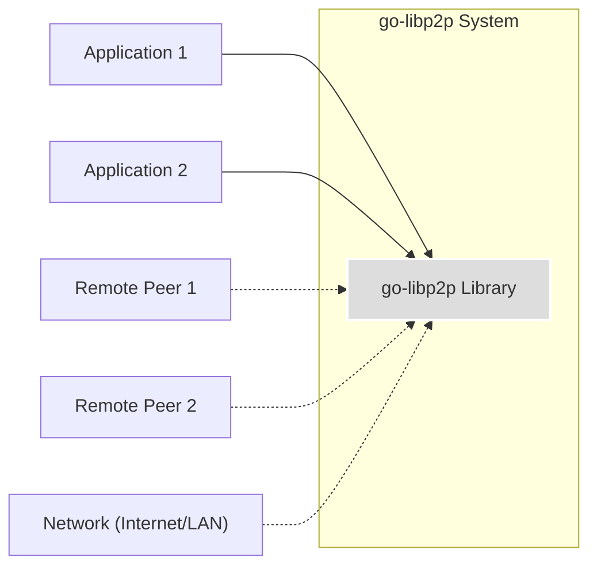
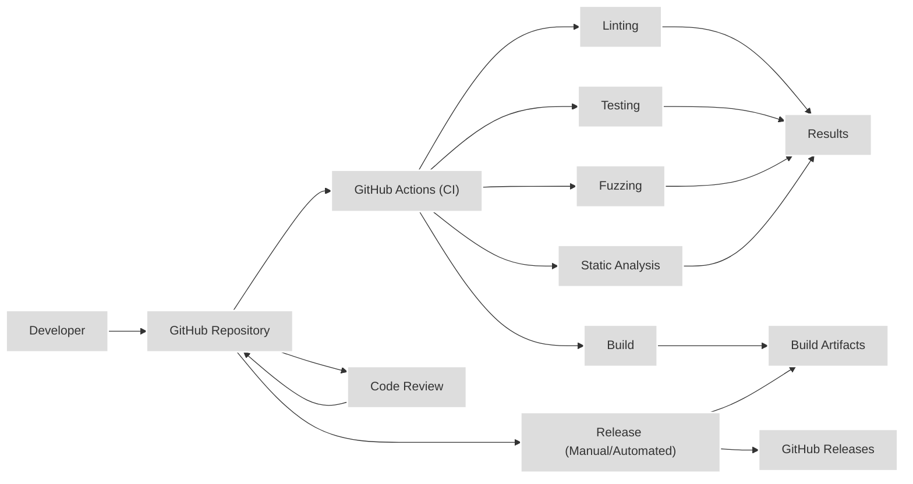

Okay, here's a detailed design document for the go-libp2p project, following the instructions provided.

# Project Design Document: go-libp2p

## BUSINESS POSTURE

go-libp2p is a modular network stack for peer-to-peer applications. It's the core networking library used by IPFS, Filecoin, and many other decentralized projects.  The primary business goal is to provide a robust, flexible, and secure foundation for building decentralized applications.  This includes enabling efficient and reliable communication between peers, regardless of their network location (NAT traversal, etc.) or underlying transport protocols.  The project's success is directly tied to the success of the decentralized applications that rely on it.

Business Priorities:

*   Reliability: The network stack must be highly reliable, ensuring consistent connectivity and data delivery between peers.
*   Performance:  The library must be performant, minimizing latency and maximizing throughput for peer-to-peer communication.
*   Modularity: The design must be modular, allowing developers to select and compose only the necessary components for their specific application.
*   Extensibility: The library must be easily extensible, supporting new transport protocols, security mechanisms, and other features.
*   Security:  The library must provide strong security guarantees, protecting against common network attacks and ensuring data confidentiality and integrity.
*   Adoption:  Widespread adoption by decentralized application developers is crucial for the project's long-term success.

Business Risks:

*   Security Vulnerabilities:  Vulnerabilities in the library could compromise the security of applications built upon it, leading to data breaches, denial-of-service attacks, or other harm. This is the most significant risk.
*   Performance Bottlenecks:  Performance issues could limit the scalability and usability of applications built on go-libp2p.
*   Lack of Adoption:  If developers choose alternative networking solutions, the project's impact and long-term viability could be diminished.
*   Complexity:  The library's complexity could make it difficult for developers to use and contribute to, hindering adoption and innovation.
*   Protocol Ossification:  Failure to adapt to evolving network conditions and security threats could render the library obsolete.

## SECURITY POSTURE

Existing Security Controls:

*   security control: Transport Security: go-libp2p supports multiple transport security mechanisms, including TLS and Noise, to encrypt communication between peers. (Implemented in transport implementations and connection upgrader).
*   security control: Peer Identity:  Each peer has a cryptographic identity (Peer ID) based on a public key, allowing for authentication and verification of messages. (Implemented in `peer.ID` and related modules).
*   security control: Stream Multiplexing:  go-libp2p uses stream multiplexers (e.g., mplex, yamux) to efficiently manage multiple concurrent streams over a single connection, reducing overhead and improving performance. Security of the multiplexer is crucial. (Implemented in `go-stream-muxer`).
*   security control: Connection Upgrader: A defined process for upgrading insecure connections to secure, authenticated connections. (Implemented in `conn/upgrader.go`).
*   security control: NAT Traversal:  go-libp2p includes mechanisms for NAT traversal (e.g., AutoNAT, Hole Punching), allowing peers behind NATs to connect to each other. (Implemented in `p2p/host/autonat` and related modules).
*   security control: Protocol Negotiation:  go-libp2p uses a protocol negotiation mechanism (multistream-select) to agree on the protocols to use for communication. (Implemented in `go-multistream`).
*   security control: Code Reviews: The project uses code reviews to identify and address potential security vulnerabilities before they are merged into the codebase. (Visible in GitHub pull requests).
*   security control: Static Analysis: The project may use static analysis tools to detect potential security issues. (Not explicitly mentioned, but assumed).
*   security control: Fuzzing: The project uses fuzzing to test the robustness of the code and identify potential vulnerabilities. (Visible in `test/fuzz` directory).

Accepted Risks:

*   accepted risk: Dependency Vulnerabilities:  go-libp2p relies on external dependencies, which may contain vulnerabilities. The project mitigates this risk by regularly updating dependencies and monitoring for security advisories.
*   accepted risk: Complexity of Cryptographic Primitives:  The use of cryptographic primitives introduces the risk of implementation errors. The project mitigates this risk by using well-vetted cryptographic libraries and following best practices.
*   accepted risk: Evolving Threat Landscape:  New attacks and vulnerabilities are constantly being discovered. The project mitigates this risk by staying informed about the latest security threats and adapting the library accordingly.

Recommended Security Controls:

*   security control: Formal Security Audits: Conduct regular, independent security audits of the codebase to identify and address potential vulnerabilities.
*   security control: Supply Chain Security: Implement measures to secure the software supply chain, such as signing releases and verifying dependencies.
*   security control: Enhanced Fuzzing: Expand fuzzing efforts to cover more code paths and edge cases.
*   security control: Bug Bounty Program: Establish a bug bounty program to incentivize security researchers to find and report vulnerabilities.

Security Requirements:

*   Authentication:
    *   All peers must be authenticated using their cryptographic identities (Peer IDs).
    *   The authentication mechanism must be resistant to common attacks, such as replay attacks and man-in-the-middle attacks.
    *   Support for different authentication mechanisms (e.g., certificate-based authentication) should be considered.

*   Authorization:
    *   Access control mechanisms should be implemented to restrict access to resources based on peer identity and permissions.
    *   A clear authorization model should be defined, specifying how permissions are granted and revoked.

*   Input Validation:
    *   All input received from peers must be validated to prevent injection attacks and other vulnerabilities.
    *   Input validation should be performed at multiple layers of the stack.
    *   Specific validation rules should be defined for each protocol and message type.

*   Cryptography:
    *   Strong, well-vetted cryptographic algorithms and libraries must be used for all security-sensitive operations.
    *   Key management practices must be secure, protecting private keys from unauthorized access.
    *   Cryptographic agility should be considered, allowing for the replacement of algorithms in the future if necessary.
    *   Use constant-time cryptographic operations where appropriate to mitigate timing side-channel attacks.

## DESIGN

### C4 CONTEXT



Context Diagram Element Descriptions:

*   Element:
    *   Name: go-libp2p Library
    *   Type: System
    *   Description: The core go-libp2p library, providing a modular network stack for peer-to-peer applications.
    *   Responsibilities:
        *   Establishing and managing connections between peers.
        *   Providing transport security and authentication.
        *   Multiplexing streams over connections.
        *   Supporting NAT traversal.
        *   Routing messages between peers.
        *   Implementing various peer-to-peer protocols.
    *   Security controls: Transport Security, Peer Identity, Stream Multiplexing, Connection Upgrader, NAT Traversal, Protocol Negotiation.

*   Element:
    *   Name: Application 1
    *   Type: User
    *   Description: An application built using the go-libp2p library.
    *   Responsibilities:
        *   Utilizing go-libp2p for peer-to-peer communication.
        *   Implementing application-specific logic.
    *   Security controls: Application-specific security controls.

*   Element:
    *   Name: Application 2
    *   Type: User
    *   Description: Another application built using the go-libp2p library.
    *   Responsibilities:
        *   Utilizing go-libp2p for peer-to-peer communication.
        *   Implementing application-specific logic.
    *   Security controls: Application-specific security controls.

*   Element:
    *   Name: Remote Peer 1
    *   Type: External System
    *   Description: A remote peer running an application that uses go-libp2p or a compatible implementation.
    *   Responsibilities:
        *   Communicating with other peers using the libp2p protocols.
    *   Security controls:  Dependent on the remote peer's implementation.

*   Element:
    *   Name: Remote Peer 2
    *   Type: External System
    *   Description: A remote peer running an application that uses go-libp2p or a compatible implementation.
    *   Responsibilities:
        *   Communicating with other peers using the libp2p protocols.
    *   Security controls: Dependent on the remote peer's implementation.

*   Element:
    *   Name: Network (Internet/LAN)
    *   Type: External System
    *   Description: The underlying network infrastructure used for communication.
    *   Responsibilities:
        *   Transporting data between peers.
    *   Security controls:  Network-level security controls (e.g., firewalls, intrusion detection systems).

### C4 CONTAINER

```mermaid
graph LR
    subgraph "go-libp2p Library"
        Host["Host"]
        Transport["Transport"]
        Security["Security"]
        Muxer["Stream Muxer"]
        DHT["DHT"]
        PubSub["PubSub"]
        ConnManager["Connection Manager"]

        Host --> Transport
        Host --> Security
        Host --> Muxer
        Host --> DHT
        Host --> PubSub
        Host --> ConnManager
        Transport --> Security
        Security --> Muxer
    end

    UserApp["Application"] --> Host

    classDef C4Container fill:#dddddd,stroke:#ffffff,stroke-width:2px;
    class Host,Transport,Security,Muxer,DHT,PubSub,ConnManager C4Container;
```

Container Diagram Element Descriptions:

*   Element:
    *   Name: Host
    *   Type: Container
    *   Description: The main entry point for applications using go-libp2p.  Manages the lifecycle of the peer and its connections.
    *   Responsibilities:
        *   Creating and managing transports.
        *   Upgrading connections to secure and authenticated connections.
        *   Handling incoming and outgoing connections.
        *   Providing access to other libp2p components (DHT, PubSub, etc.).
    *   Security controls: Connection Upgrader, Peer Identity.

*   Element:
    *   Name: Transport
    *   Type: Container
    *   Description:  Provides the ability to establish connections over different network protocols (e.g., TCP, QUIC, WebSockets).
    *   Responsibilities:
        *   Dialing and listening for connections.
        *   Providing a common interface for different transport protocols.
    *   Security controls:  May implement transport-specific security mechanisms (e.g., TLS for TCP).

*   Element:
    *   Name: Security
    *   Type: Container
    *   Description:  Handles the security aspects of connections, including encryption and authentication.
    *   Responsibilities:
        *   Encrypting and decrypting data.
        *   Authenticating peers.
        *   Negotiating security protocols.
    *   Security controls: Transport Security (TLS, Noise), Peer Identity.

*   Element:
    *   Name: Stream Muxer
    *   Type: Container
    *   Description:  Allows multiple streams to be multiplexed over a single connection.
    *   Responsibilities:
        *   Creating and managing streams.
        *   Multiplexing and demultiplexing data.
    *   Security controls: Stream Multiplexing security.

*   Element:
    *   Name: DHT
    *   Type: Container
    *   Description:  Implements a distributed hash table (DHT) for peer discovery and content routing.
    *   Responsibilities:
        *   Storing and retrieving peer information.
        *   Finding peers that provide specific content.
    *   Security controls:  DHT-specific security considerations (e.g., Sybil attack resistance).

*   Element:
    *   Name: PubSub
    *   Type: Container
    *   Description:  Provides a publish-subscribe messaging system.
    *   Responsibilities:
        *   Publishing and subscribing to messages.
        *   Routing messages to subscribers.
    *   Security controls:  PubSub-specific security considerations (e.g., message authenticity, access control).

*   Element:
    *   Name: Connection Manager
    *   Type: Container
    *   Description: Manages connections to other peers, including pruning connections and enforcing limits.
    *   Responsibilities:
        *   Tracking active connections.
        *   Closing connections based on resource limits or other criteria.
    *   Security controls:  Connection management policies.

*   Element:
    *   Name: Application
    *   Type: User
    *   Description: An application built using the go-libp2p library.
    *   Responsibilities:
        *   Utilizing go-libp2p for peer-to-peer communication.
        *   Implementing application-specific logic.
    *   Security controls: Application-specific security controls.

### DEPLOYMENT

go-libp2p is a library, not a standalone application, so it doesn't have a traditional "deployment" in the sense of deploying a server.  Instead, it's *integrated* into applications, which are then deployed.  However, we can describe the deployment of applications *using* go-libp2p.

Possible Deployment Solutions:

1.  **Standalone Executable:** The application using go-libp2p is compiled into a standalone executable and deployed directly onto a server (physical or virtual).
2.  **Containerized (Docker):** The application is packaged into a Docker container and deployed to a container orchestration platform (e.g., Kubernetes, Docker Swarm).
3.  **Serverless (e.g., AWS Lambda):**  While less common for persistent peer-to-peer connections, parts of an application using go-libp2p could be deployed as serverless functions. This is more likely for supporting services, not the core peer-to-peer networking.
4.  **Embedded Systems:** go-libp2p can be used in embedded systems, where the application is deployed directly onto the device's firmware.

Chosen Solution (Containerized - Kubernetes):

This is a common and robust deployment model for modern applications.

```mermaid
graph LR
    subgraph "Kubernetes Cluster"
        subgraph "Node 1"
            Pod1["Pod (App Instance 1)"]
        end
        subgraph "Node 2"
            Pod2["Pod (App Instance 2)"]
        end
        subgraph "Node 3"
            Pod3["Pod (App Instance 3)"]
        end
    end

    Internet["Internet"] -.-> Pod1
    Internet -.-> Pod2
    Internet -.-> Pod3
    Pod1 <--> Pod2
    Pod1 <--> Pod3
    Pod2 <--> Pod3

    classDef C4Deployment fill:#dddddd,stroke:#ffffff,stroke-width:2px;
    class Pod1,Pod2,Pod3,Node1,Node2,Node3 C4Deployment;
```

Deployment Diagram Element Descriptions:

*   Element:
    *   Name: Kubernetes Cluster
    *   Type: Deployment Environment
    *   Description: A Kubernetes cluster managing the deployment and scaling of the application.
    *   Responsibilities:
        *   Orchestrating container deployment.
        *   Managing resources.
        *   Providing networking and service discovery.
    *   Security controls: Kubernetes security features (RBAC, network policies, pod security policies).

*   Element:
    *   Name: Node 1, Node 2, Node 3
    *   Type: Infrastructure Node
    *   Description: Physical or virtual machines within the Kubernetes cluster.
    *   Responsibilities:
        *   Running containerized application instances.
    *   Security controls: Node-level security (OS hardening, firewalls).

*   Element:
    *   Name: Pod (App Instance 1, 2, 3)
    *   Type: Container Instance
    *   Description:  A Kubernetes Pod running an instance of the application that uses go-libp2p.
    *   Responsibilities:
        *   Executing the application code.
        *   Communicating with other peers using go-libp2p.
    *   Security controls:  Container security (image scanning, resource limits), go-libp2p security controls.

*   Element:
    *   Name: Internet
    *   Type: External System
    *   Description: The external network through which peers connect.
    *   Responsibilities:
        *   Providing network connectivity.
    *   Security controls:  External network security (firewalls, intrusion detection systems).

### BUILD

The go-libp2p project uses a combination of Makefiles and GitHub Actions for its build and release process.

Build Process:

1.  **Developer:** A developer makes changes to the code and pushes them to a branch in the GitHub repository.
2.  **Pull Request:** A pull request is created to merge the changes into the main branch.
3.  **GitHub Actions (CI):**  GitHub Actions workflows are triggered by the pull request. These workflows perform the following steps:
    *   **Linting:**  Code linters (e.g., `golangci-lint`) are run to check for code style and potential errors.
    *   **Testing:** Unit tests and integration tests are executed to ensure the code functions correctly.
    *   **Fuzzing:** Fuzz tests are run to identify potential vulnerabilities.
    *   **Static Analysis:** Static analysis tools may be used to detect potential security issues.
    *   **Build:** The code is compiled for different platforms.
4.  **Code Review:**  Other developers review the code changes and provide feedback.
5.  **Merge:** Once the code review is approved and all CI checks pass, the pull request is merged into the main branch.
6.  **Release (Manual/Automated):** A new release is created, typically by tagging a commit on the main branch. This may trigger additional GitHub Actions workflows to:
    *   **Build Release Artifacts:**  Create release binaries for different platforms.
    *   **Publish Release:** Publish the release artifacts to GitHub Releases.
    *   **Update Documentation:** Update documentation and website.



Security Controls in Build Process:

*   security control: Code Reviews:  Mandatory code reviews help identify security vulnerabilities before they are merged.
*   security control: Linting:  Linters enforce coding standards and can detect some potential security issues.
*   security control: Testing:  Automated tests help ensure the code functions correctly and can catch regressions that might introduce vulnerabilities.
*   security control: Fuzzing:  Fuzzing helps identify vulnerabilities that might be missed by traditional testing.
*   security control: Static Analysis:  Static analysis tools can detect a wide range of potential security issues.
*   security control: Dependency Management:  Regularly updating dependencies and monitoring for security advisories helps mitigate the risk of vulnerabilities in external libraries.

## RISK ASSESSMENT

Critical Business Processes:

*   **Peer-to-peer communication:** The core functionality of go-libp2p is to enable reliable and secure communication between peers.  This is critical for all applications built on the library.
*   **Data exchange:**  Many applications use go-libp2p to exchange data between peers. The security and integrity of this data exchange are critical.
*   **Content discovery and routing:**  go-libp2p provides mechanisms for discovering and routing content between peers.  The efficiency and reliability of these mechanisms are critical for applications that rely on them.
*   **Decentralized application operation:** The overall operation of decentralized applications built on go-libp2p depends on the library's security and reliability.

Data Sensitivity:

The data transmitted using go-libp2p can vary greatly in sensitivity depending on the application.  Examples include:

*   **Low Sensitivity:** Publicly available data, such as blockchain data or public content.
*   **Medium Sensitivity:** User-generated content, such as messages or files shared between peers.
*   **High Sensitivity:**  Private keys, personal information, or other confidential data.

go-libp2p itself aims to be data-agnostic, providing the *mechanisms* for secure transport, but the *responsibility* for handling data appropriately rests with the applications using the library.  Applications dealing with high-sensitivity data must implement additional security measures, such as end-to-end encryption, to protect the data.

## QUESTIONS & ASSUMPTIONS

Questions:

*   What specific static analysis tools are used in the CI pipeline?
*   Are there any plans to implement a formal bug bounty program?
*   What is the process for handling security vulnerabilities reported by external researchers?
*   What are the specific performance targets for go-libp2p (e.g., latency, throughput)?
*   What are the plans for supporting emerging network technologies and security standards?
*   Are there any specific compliance requirements (e.g., GDPR, HIPAA) that need to be considered for applications built on go-libp2p?

Assumptions:

*   BUSINESS POSTURE: The primary users of go-libp2p are developers building decentralized applications.
*   BUSINESS POSTURE:  The project prioritizes security, reliability, and performance.
*   SECURITY POSTURE:  The project follows secure software development practices.
*   SECURITY POSTURE: Dependencies are regularly updated and monitored for security vulnerabilities.
*   DESIGN: The architecture is modular and extensible.
*   DESIGN: The project uses GitHub Actions for CI/CD.
*   DESIGN: Applications using go-libp2p are typically deployed in containerized environments.