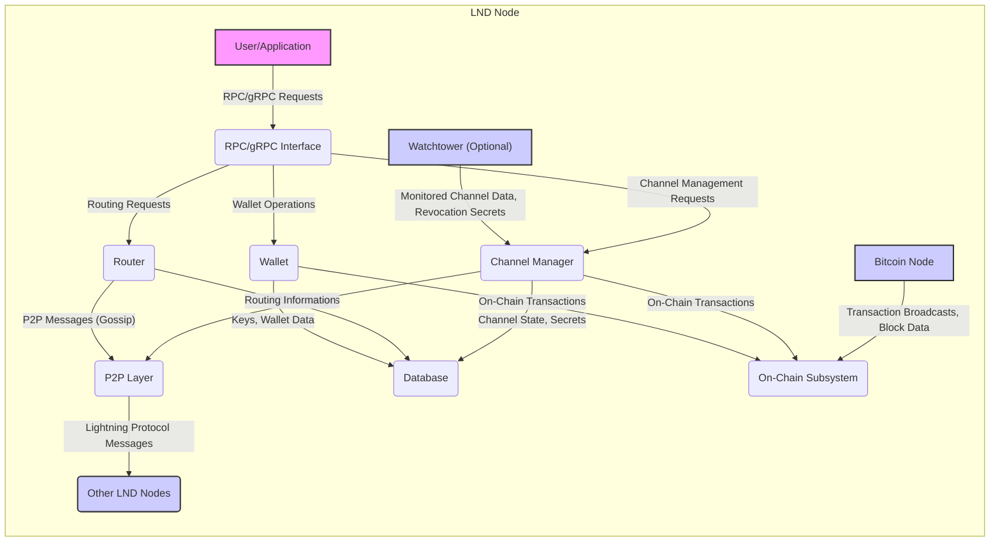

## Project Design Document: Lightning Network Daemon (LND) - Improved

**1. Introduction**

This document provides an enhanced architectural overview of the Lightning Network Daemon (LND), a prominent implementation of the Lightning Network protocol. It is specifically designed to serve as a robust foundation for subsequent threat modeling exercises. This document details the key components, data flows, and interactions within the LND system, with a particular emphasis on security-relevant aspects.

**2. Project Overview**

LND is a fully functional Lightning Network node implementation developed in Go. It empowers users to conduct fast and low-cost Bitcoin transactions via the Lightning Network, a layer-2 scaling solution. LND manages payment channels with other Lightning nodes, intelligently routes payments across the network, and interacts with the underlying Bitcoin blockchain for channel establishment and settlement.

**3. Architectural Overview**

LND's architecture is modular, comprising the following core components:

*   **Wallet:** Manages cryptographic keys, generates payment addresses, signs transactions, and tracks the node's on-chain Bitcoin holdings. This is a critical component for asset security.
*   **Channel Manager:**  Orchestrates the lifecycle of Lightning Network channels, including their creation, updates, and closure. This component enforces the Lightning Network protocol rules and manages channel state.
*   **Router:**  Discovers and selects optimal payment paths through the Lightning Network graph. It utilizes network gossip data to determine efficient routes, considering factors like fees and channel capacity.
*   **Peer-to-Peer (P2P) Layer:** Handles secure communication with other Lightning Network nodes. This involves establishing connections, maintaining communication channels, and exchanging protocol messages.
*   **RPC/gRPC Interface:** Provides a programmatic interface for users and applications to interact with the LND node. This allows for external control and monitoring of the node's operations.
*   **Database:**  Persistently stores critical node data, including channel states, peer information, routing information, and encrypted wallet data. Its integrity and confidentiality are paramount.
*   **Watchtower (Optional):** An independent process that can monitor channels for attempted fraud and automatically trigger corrective actions. It enhances security against malicious counterparties.
*   **On-Chain Subsystem:**  Manages interactions with the Bitcoin blockchain, including broadcasting channel funding and closing transactions, and claiming funds during various channel closure scenarios.

**4. Detailed Component Description**

*   **Wallet:**
    *   **Security Responsibility:** Securely stores and manages the node's seed and derived private keys, which are essential for controlling funds.
    *   Implements BIP-32 for hierarchical deterministic key generation, enhancing key management.
    *   Supports `aezeed` and other key derivation schemes.
    *   Signs Bitcoin transactions for critical operations like channel funding, commitment updates, and channel closures.
    *   Tracks Unspent Transaction Outputs (UTXOs) controlled by the wallet on the Bitcoin blockchain.
    *   Provides functionality for generating new Bitcoin addresses for receiving on-chain payments.
    *   **Potential Vulnerabilities:** Key leakage, seed compromise, insufficient encryption.

*   **Channel Manager:**
    *   **Security Responsibility:** Enforces the state machine of Lightning Network channels, preventing unauthorized state transitions and ensuring fair channel closures.
    *   Handles the secure negotiation and execution of channel opening and closing protocols with peers.
    *   Manages channel state updates based on payment activity, ensuring consistency between channel participants.
    *   Enforces the rules of the Lightning Network protocol to detect and prevent cheating attempts.
    *   Stores and updates sensitive channel state information, including commitment transactions and revocation secrets, in the database.
    *   Interacts with the P2P layer to exchange signed channel update messages with connected peers.
    *   **Potential Vulnerabilities:** State corruption, protocol implementation flaws, mishandling of revocation secrets.

*   **Router:**
    *   **Security Responsibility:**  While not directly handling funds, a compromised router could lead to denial-of-service or routing attacks.
    *   Maintains a local representation of the Lightning Network graph based on gossip messages received from other nodes.
    *   Implements pathfinding algorithms (e.g., Dijkstra's algorithm) to determine routes for outgoing payments.
    *   Considers factors like channel capacity, fees advertised by nodes, and perceived reliability when selecting payment paths.
    *   Handles payment retries and path re-evaluation in case of routing failures.
    *   **Potential Vulnerabilities:** Manipulation of gossip data, routing table poisoning, denial-of-service attacks on routing functionality.

*   **Peer-to-Peer (P2P) Layer:**
    *   **Security Responsibility:** Establishes and maintains secure and authenticated communication channels with other Lightning nodes.
    *   Utilizes the Noise Protocol Framework for secure handshake and encrypted communication, ensuring confidentiality and integrity of messages.
    *   Manages persistent TCP connections with other Lightning nodes in the network.
    *   Handles the serialization and deserialization of messages according to the Lightning Network protocol specification.
    *   Implements the gossip protocol for sharing network topology and channel information with other nodes.
    *   Provides mechanisms for peer discovery, allowing the node to find and connect to other nodes.
    *   **Potential Vulnerabilities:** Man-in-the-middle attacks, denial-of-service attacks on connections, exploitation of vulnerabilities in the Noise Protocol implementation.

*   **RPC/gRPC Interface:**
    *   **Security Responsibility:** Controls access to the LND node's functionalities and protects sensitive operations from unauthorized access.
    *   Exposes a set of Application Programming Interfaces (APIs) for interacting with the LND node programmatically.
    *   Supports both REST and gRPC protocols for communication.
    *   Provides functionalities for wallet management, channel management, payment operations, node information retrieval, and graph exploration.
    *   Uses authentication mechanisms such as TLS certificates and macaroon authentication to control access to the API endpoints.
    *   **Potential Vulnerabilities:** Authentication bypass, authorization flaws, insecure API endpoints, information disclosure.

*   **Database:**
    *   **Security Responsibility:**  Persistently stores sensitive data, requiring strong protection against unauthorized access, modification, and data loss.
    *   Typically uses `boltdb` or `etcd` for persistent storage of node data.
    *   Stores highly sensitive information, including the encrypted wallet seed and private keys, channel states, commitment transactions, peer information, routing information, and payment history.
    *   **Potential Vulnerabilities:** Database compromise, unauthorized access to data files, data corruption, insufficient encryption of sensitive data at rest.

*   **Watchtower:**
    *   **Security Responsibility:** Monitors channel states on the blockchain to detect and respond to attempts by counterparties to broadcast outdated or revoked commitment transactions.
    *   Monitors the Bitcoin blockchain for commitment transactions related to the channels it is watching.
    *   If a revoked commitment transaction is detected, it broadcasts a justice transaction to claim the full channel balance, penalizing the malicious counterparty.
    *   Requires secure access to the channel's revocation secrets to construct and broadcast justice transactions.
    *   **Potential Vulnerabilities:** Compromise of watchtower keys, denial-of-service attacks preventing timely responses, inability to access necessary revocation data.

*   **On-Chain Subsystem:**
    *   **Security Responsibility:**  Handles the broadcasting of critical transactions to the Bitcoin network, requiring careful construction and signing to prevent loss of funds or unintended consequences.
    *   Interacts with a Bitcoin node (either a locally running full node or a remote node via RPC).
    *   Broadcasts Bitcoin transactions for channel funding, cooperative closures, and unilateral (force) closures.
    *   Monitors the Bitcoin blockchain for relevant transactions, such as channel confirmations and the broadcasting of commitment transactions by counterparties.
    *   **Potential Vulnerabilities:**  Transaction malleability issues (though largely mitigated by SegWit), broadcasting incorrect or malicious transactions, reliance on the security of the connected Bitcoin node.

**5. Data Flow Diagram**

**6. Key Data Flows (with Security Emphasis)**

*   **Starting the Node:**
    *   Configuration parameters (potentially containing sensitive information) are loaded.
    *   The database is accessed, requiring decryption if the wallet is encrypted.
    *   The wallet is unlocked, potentially requiring a password or seed phrase.
    *   The P2P layer initiates secure connections with known peers.

*   **Opening a Channel:**
    *   A user request via RPC/gRPC triggers the Wallet to generate a funding transaction (sensitive key usage).
    *   The Channel Manager negotiates parameters with the peer over a secure P2P connection.
    *   The funding transaction (signed with the node's private key) is broadcast to the Bitcoin network via the On-Chain Subsystem.

*   **Sending a Payment:**
    *   A payment request via RPC/gRPC initiates pathfinding by the Router.
    *   The Channel Manager constructs and signs HTLCs, updating the local channel state and sending them to the next hop via the secure P2P layer. This involves revealing payment preimages securely.

*   **Receiving a Payment:**
    *   An incoming HTLC is received via the secure P2P layer.
    *   The Channel Manager verifies the HTLC and potentially reveals the payment preimage, updating the channel state.

*   **Closing a Channel (Cooperative):**
    *   Negotiation of final balances occurs over the secure P2P connection.
    *   A closing transaction is created and signed by both parties (requiring secure key usage).
    *   The signed closing transaction is broadcast to the Bitcoin network.

*   **Closing a Channel (Force):**
    *   The Channel Manager broadcasts the latest commitment transaction (signed with the node's private key).
    *   If a watchtower is involved, it may broadcast a justice transaction using pre-agreed revocation secrets.

*   **Gossip Protocol:**
    *   Nodes exchange signed messages about network topology and channel information via the secure P2P layer. Verification of signatures is crucial to prevent malicious gossip.

**7. Key Security Considerations (Expanded)**

*   **Private Key Management:**  The most critical security aspect. Secure generation, storage (encryption at rest), and usage (protection during signing operations) of private keys are paramount. Compromise leads to immediate loss of funds.
*   **Channel State Management:** Ensuring the integrity and consistency of channel states is vital to prevent double-spending or other forms of cheating. Robust protocol implementation and secure storage of channel state data are essential.
*   **Peer-to-Peer Communication Security:**  The Noise Protocol provides strong encryption and authentication, but vulnerabilities in its implementation or configuration could be exploited. Protecting against denial-of-service attacks on P2P connections is also important.
*   **RPC/gRPC Interface Security:**  Strong authentication (e.g., mutual TLS, macaroon authentication with appropriate permissions) and authorization are crucial to prevent unauthorized access and control of the node. Rate limiting and input validation can mitigate certain attacks.
*   **Database Security:**  The database contains highly sensitive information and must be protected with strong encryption at rest. Access control mechanisms should be in place to prevent unauthorized access to the database files. Regular backups are also important for disaster recovery.
*   **Watchtower Security:**  The watchtower itself becomes a critical security component if used. Its private keys and access to revocation secrets must be secured. Communication between the LND node and the watchtower should also be secure.
*   **On-Chain Interaction Security:**  Careful construction and signing of Bitcoin transactions are essential to prevent errors or malicious manipulation. Reliance on a secure and trusted Bitcoin node is also crucial.
*   **Dependency Management:**  LND relies on various external libraries and dependencies. Keeping these dependencies up-to-date and free of known vulnerabilities is important for overall security.
*   **Seed Phrase Security:** The initial seed phrase is the root of all keys. Its secure storage and handling are paramount.

**8. Assumptions and Limitations**

*   This document provides a general architectural overview of LND. Specific implementation details may vary across different versions and configurations.
*   The focus is on the core components and data flows most relevant to security threat modeling.
*   Security of the underlying operating system, hardware, and network infrastructure are assumed to be reasonably secure but are not explicitly detailed here.
*   This document assumes a standard deployment scenario without specific custom modifications or third-party extensions.

**9. Future Considerations**

*   Detailed sequence diagrams for critical data flows, highlighting security protocols.
*   More granular analysis of specific cryptographic primitives and their usage within LND.
*   Consideration of potential side-channel attacks and mitigation strategies.
*   Analysis of the security implications of different LND configurations and deployment models.

This improved document provides a more detailed and security-focused overview of the LND architecture, enhancing its value for threat modeling activities. By understanding these components, data flows, and security considerations, security professionals can more effectively identify potential vulnerabilities and develop appropriate mitigation strategies to protect LND nodes and the funds they manage.