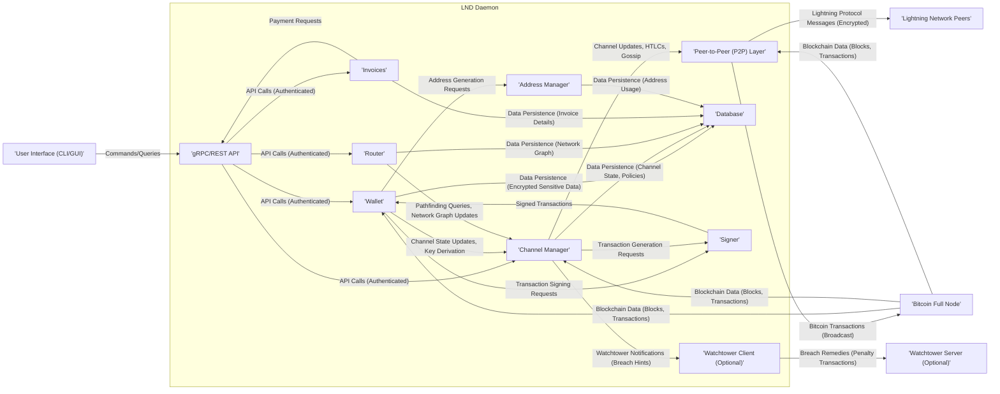

## Project Design Document: Lightning Network Daemon (LND) for Threat Modeling (Improved)

**1. Introduction**

This document provides an enhanced and more detailed design overview of the Lightning Network Daemon (LND), a Go implementation of the Lightning Network protocol. Building upon the previous version, this document aims to provide an even stronger foundation for subsequent threat modeling activities. It meticulously outlines the key components, their specific functionalities, intricate data flows, and interactions within the LND system. This document is primarily intended for security professionals and developers directly involved in the rigorous assessment and proactive mitigation of potential security risks intrinsically associated with LND.

**2. Goals and Objectives**

*   Deliver a highly comprehensive and granular architectural overview of LND.
*   Precisely identify key components and meticulously detail their specific responsibilities and internal workings.
*   Thoroughly describe the complex interactions and communication pathways between different components.
*   Illustrate critical data flows within the system with a focus on sensitive information handling.
*   Sharply highlight potential areas of security concern, providing specific context for further in-depth analysis during threat modeling sessions.

**3. System Architecture**

LND functions as a persistent daemon that actively interacts with a fully synchronized Bitcoin full node and a dynamic network of other Lightning Network nodes. Its core responsibilities include the sophisticated management of payment channels, the intelligent routing of payments across the network, and the secure handling of cryptographic operations mandated by the Lightning Network protocol.

**4. Key Components**

*   **gRPC/REST API:**
    *   **Responsibilities:** Serves as the primary and secure communication gateway for users and external applications to interact with the LND node.
    *   **Key Functions:**
        *   Exposes a comprehensive suite of functionalities for managing the wallet (e.g., generating addresses, retrieving balances).
        *   Provides control over channel operations (e.g., opening, closing, managing fees).
        *   Enables the initiation and management of payments (sending and receiving).
        *   Offers access to network information (e.g., node information, routing tables).
    *   **Security Relevance:**  A critical attack surface. Requires robust authentication (e.g., TLS certificates, macaroon authentication) and authorization mechanisms to prevent unauthorized access and malicious manipulation. Input validation is crucial to prevent injection attacks.

*   **Wallet:**
    *   **Responsibilities:**  Securely manages the private keys and associated funds controlled by the LND node.
    *   **Key Functions:**
        *   Generates new Bitcoin addresses for receiving on-chain funds.
        *   Derives private keys for Lightning channels using BIP-32/BIP-44 derivation paths.
        *   Signs Bitcoin transactions (funding, commitment, settlement, closing) using the Signer component.
        *   Tracks on-chain and off-chain balances.
        *   Manages UTXOs (Unspent Transaction Outputs).
    *   **Security Relevance:**  The core of LND's security. Compromise of the wallet's private keys results in a complete loss of funds. Secure key generation, storage (potentially encrypted), and access control are paramount. Memory management of sensitive key material is also critical.

*   **Channel Manager:**
    *   **Responsibilities:**  Orchestrates the entire lifecycle of Lightning Network channels established with peer nodes.
    *   **Key Functions:**
        *   Handles the negotiation and execution of channel opening procedures (funding transaction creation and exchange).
        *   Manages the collaborative and unilateral closing of channels.
        *   Processes and validates channel updates received from peers.
        *   Manages the state of channels, including the latest commitment transactions and HTLCs.
        *   Enforces channel policies and fee structures.
        *   Interacts with the Peer-to-Peer layer for all channel-related communication.
        *   May interact with optional Watchtowers for proactive channel monitoring and breach remedy.
    *   **Security Relevance:**  Vulnerable to state manipulation attacks if not implemented correctly. Requires careful handling of cryptographic signatures and state transitions. Logic flaws in channel management could lead to fund loss or channel jamming.

*   **Router:**
    *   **Responsibilities:**  Intelligently determines the most efficient and cost-effective paths for payments across the Lightning Network graph.
    *   **Key Functions:**
        *   Maintains a local representation of the Lightning Network graph, populated by gossip messages from other nodes.
        *   Executes pathfinding algorithms (e.g., Dijkstra, A*) to identify suitable routes.
        *   Handles payment retries and manages pathfinding failures.
        *   Considers factors like fees, channel capacity, and node reliability when selecting paths.
    *   **Security Relevance:**  Susceptible to routing attacks where malicious nodes advertise false channel information to intercept or delay payments. Requires robust validation of gossip messages and potentially reputation scoring of nodes.

*   **Peer-to-Peer (P2P) Layer:**
    *   **Responsibilities:**  Manages all direct communication and data exchange with other Lightning Network nodes.
    *   **Key Functions:**
        *   Establishes and maintains secure, authenticated connections with peers using the Noise Protocol Framework.
        *   Handles the serialization and deserialization of Lightning Network protocol messages.
        *   Implements message queuing and delivery mechanisms.
        *   Broadcasts and receives gossip messages to update the network graph.
    *   **Security Relevance:**  A critical entry point for network-level attacks. Requires strong encryption and authentication to prevent eavesdropping, tampering, and man-in-the-middle attacks. Vulnerable to DoS attacks if not properly rate-limited and secured.

*   **Database:**
    *   **Responsibilities:**  Provides persistent storage for all critical LND data, ensuring data integrity and availability.
    *   **Key Functions:**
        *   Stores encrypted wallet information, including private keys and seed.
        *   Persists the current state and historical data of all managed channels.
        *   Maintains the local representation of the Lightning Network graph.
        *   Stores information about known peers and their connection details.
        *   Persists invoice details and payment history.
    *   **Security Relevance:**  Contains highly sensitive information. Requires strong encryption at rest and in transit. Access control mechanisms are crucial to prevent unauthorized access and data breaches. Regular backups and data integrity checks are essential.

*   **Signer:**
    *   **Responsibilities:**  Performs all cryptographic signing operations required by the Lightning Network protocol.
    *   **Key Functions:**
        *   Signs Bitcoin transactions (funding, commitment, closing).
        *   Signs Lightning Network messages (channel updates, HTLCs).
        *   Protects the private keys used for signing, potentially leveraging hardware security modules (HSMs) or secure enclaves.
    *   **Security Relevance:**  Directly responsible for the security of private keys. Vulnerabilities in the signing process or key management could lead to unauthorized spending of funds.

*   **Watchtower Client (Optional):**
    *   **Responsibilities:**  Proactively monitors the Bitcoin blockchain for attempts by counterparty nodes to broadcast outdated channel states, protecting against unilateral channel closure fraud.
    *   **Key Functions:**
        *   Registers channel commitment states with a remote Watchtower server.
        *   Receives "breach hints" from the Watchtower server if an outdated state is detected on the blockchain.
        *   Constructs and broadcasts pre-signed penalty transactions to recover funds in case of a breach attempt.
    *   **Security Relevance:**  Relies on the security and availability of the Watchtower server. Vulnerabilities in the communication protocol with the Watchtower or compromise of the Watchtower server could negate its security benefits.

*   **Invoices:**
    *   **Responsibilities:**  Manages the creation, storage, and tracking of payment requests (invoices).
    *   **Key Functions:**
        *   Generates BOLT 11 invoices containing payment details (amount, payment hash, expiry).
        *   Stores invoice details and tracks their payment status.
        *   Provides mechanisms for retrieving and verifying invoice information.
    *   **Security Relevance:**  Improper handling of invoice data could lead to payment confusion or denial of service.

*   **Address Manager:**
    *   **Responsibilities:**  Manages the generation and tracking of Bitcoin addresses used by the LND wallet.
    *   **Key Functions:**
        *   Generates new receiving addresses based on the wallet's key derivation scheme.
        *   Tracks the usage of generated addresses to prevent address reuse.
        *   May implement address gap limits for security and privacy.
    *   **Security Relevance:**  While less critical than key management, proper address management contributes to privacy and security best practices.

**5. Data Flow**

Here are more detailed examples of critical data flows within LND, highlighting the specific messages and transactions involved:

*   **Opening a Channel:**
    1. User initiates a `OpenChannel` request via the gRPC API, specifying the peer node ID and desired channel capacity.
    2. The Wallet generates a funding transaction with two outputs: one paying to a multi-sig address controlled by both nodes, and a change output back to the local wallet.
    3. The Signer signs the local node's input in the funding transaction.
    4. The Channel Manager exchanges `funding_created` and `funding_signed` messages with the peer via the P2P layer, sharing partial signatures of the funding transaction.
    5. Once both nodes have signed, the fully signed funding transaction is broadcast to the Bitcoin network via the Bitcoin Full Node using the `SendRawTransaction` RPC.
    6. Upon confirmation of the funding transaction on the blockchain, both Channel Managers transition the channel to an `OPEN` state.

*   **Sending a Payment:**
    1. User initiates a `SendPayment` request via the gRPC API, providing the payment hash and amount from the recipient's invoice.
    2. The Router queries its local network graph to find a suitable payment path to the destination node.
    3. The Channel Manager constructs a series of HTLCs (Hashed TimeLocked Contracts) for each hop in the path. Each HTLC is added to the latest commitment transaction.
    4. The Channel Manager exchanges `update_add_htlc`, `update_fulfill_htlc` (after receiving the payment secret), and `commitment_signed` messages with each hop in the path via the P2P layer, atomically updating channel states.
    5. Once the payment reaches the recipient, the recipient reveals the payment secret (preimage of the payment hash) in a `payment_preimage` message.
    6. The payment secret propagates back along the path, allowing each node to claim their portion of the payment by revealing the secret in `update_fulfill_htlc` messages.

*   **Receiving a Payment:**
    1. A sending node initiates a payment by sending `update_add_htlc` messages along a payment path.
    2. The receiving node's Channel Manager receives the HTLC.
    3. If the payment hash in the HTLC matches the hash of a pre-image known to the receiver (from a previously generated invoice), the receiver reveals the payment secret in a `payment_preimage` message.
    4. The Channel Manager sends `update_fulfill_htlc` messages back along the path, settling the HTLCs and receiving the payment.

*   **Closing a Channel (Cooperative):**
    1. One of the channel participants initiates a cooperative close by sending a `shutdown` message via the P2P layer.
    2. The Channel Managers of both peers negotiate the final balances for each party.
    3. A closing transaction is created, distributing the channel funds according to the agreed-upon balances.
    4. Both parties sign the closing transaction.
    5. One of the nodes broadcasts the fully signed closing transaction to the Bitcoin network.

*   **Closing a Channel (Force):**
    1. One of the channel participants broadcasts their latest *valid* commitment transaction to the Bitcoin network.
    2. If the broadcasted commitment transaction is outdated (i.e., a more recent state exists), the counterparty (or their Watchtower) can broadcast a penalty transaction, spending the funds in the outdated commitment transaction to an address controlled by the honest party.

**6. Security Considerations (Detailed)**

This section provides a more detailed analysis of potential security concerns, linking them directly to the components and data flows described above.

*   **Private Key Management (Wallet, Signer):**
    *   **Threats:** Key exfiltration (malware, insider threat), key compromise due to weak entropy or insecure storage, side-channel attacks on signing processes.
    *   **Mitigations:** Secure key generation using cryptographically secure random number generators, encryption of private keys at rest and in memory, use of HSMs or secure enclaves for signing, robust access control mechanisms.

*   **API Security (gRPC/REST API):**
    *   **Threats:** Unauthorized access, data breaches, manipulation of LND state, injection attacks (SQL injection, command injection), cross-site scripting (if a web UI is involved).
    *   **Mitigations:** Strong authentication (TLS client certificates, macaroon authentication), robust authorization mechanisms, input validation and sanitization, rate limiting to prevent DoS attacks, regular security audits.

*   **Peer-to-Peer Communication Security (P2P Layer):**
    *   **Threats:** Eavesdropping, message tampering, man-in-the-middle attacks, Sybil attacks, DoS attacks.
    *   **Mitigations:** Use of the Noise Protocol Framework for authenticated and encrypted communication, peer blacklisting and reputation scoring, rate limiting and connection management to mitigate DoS attacks.

*   **Channel State Management (Channel Manager):**
    *   **Threats:** State manipulation attacks, replay attacks, channel jamming, griefing attacks.
    *   **Mitigations:** Careful implementation of state transition logic, use of cryptographic signatures to ensure message integrity and authenticity, commitment transaction revocation mechanisms, fee bumping mechanisms to counter channel jamming.

*   **Database Security (Database):**
    *   **Threats:** Unauthorized access, data breaches, data corruption, loss of data integrity.
    *   **Mitigations:** Encryption of sensitive data at rest and in transit, strong access control mechanisms, regular backups, data integrity checks, use of database hardening techniques.

*   **Dependency Management:**
    *   **Threats:** Vulnerabilities in third-party libraries used by LND.
    *   **Mitigations:** Regular dependency updates, vulnerability scanning, use of dependency management tools, careful review of third-party code.

*   **Routing Attacks (Router):**
    *   **Threats:** Malicious nodes advertising false channel information to intercept or delay payments, fee sniping attacks.
    *   **Mitigations:** Validation of gossip messages, reputation scoring of nodes, path randomization techniques, monitoring of routing behavior.

*   **Watchtower Security (Watchtower Client):**
    *   **Threats:** Compromise of the Watchtower server, eavesdropping or tampering of communication with the Watchtower, denial of service attacks against the Watchtower.
    *   **Mitigations:** Secure communication protocols with the Watchtower (e.g., TLS), authentication of the Watchtower server, ensuring the Watchtower server implements robust security measures.

*   **Invoice Security (Invoices):**
    *   **Threats:** Payment confusion, replay attacks if invoices are not properly managed, denial of service by flooding with invalid invoices.
    *   **Mitigations:** Proper invoice generation and verification, unique payment hashes for each invoice, expiry times for invoices.

**7. Assumptions and Limitations**

*   This document assumes a solid understanding of the fundamental principles of the Lightning Network protocol and Bitcoin.
*   The focus remains on the core functionalities of LND. Highly specific or experimental features might not be exhaustively detailed.
*   The subsequent threat modeling process will leverage this document as a foundation to identify specific threats, vulnerabilities, and potential attack vectors.
*   The LND architecture is subject to ongoing development and refinement; therefore, this document represents a snapshot in time.

**8. Conclusion**

This improved design document provides a more granular and comprehensive understanding of the LND architecture, its intricate components, and critical data flows. It serves as a robust and detailed foundation for conducting thorough threat modeling exercises, empowering security professionals to proactively identify and effectively mitigate potential security risks associated with the Lightning Network Daemon. The detailed security considerations outlined will be further scrutinized and analyzed to develop targeted security controls and robust mitigation strategies.