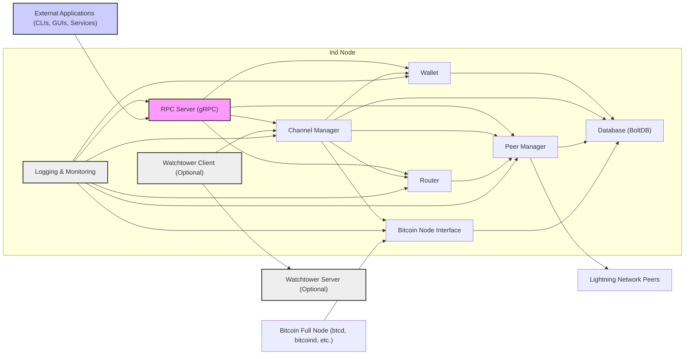
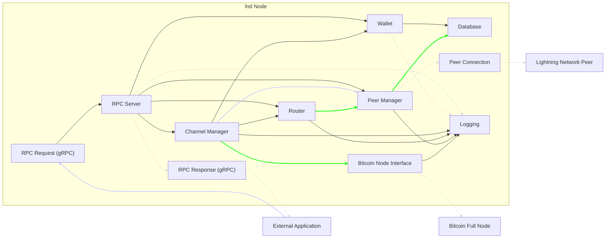

# Project Design Document: Lightning Network Daemon (lnd)

**Project Name:** Lightning Network Daemon (lnd)

**Project Repository:** [https://github.com/lightningnetwork/lnd](https://github.com/lightningnetwork/lnd)

**Document Version:** 1.1
**Date:** 2023-10-27
**Author:** AI Expert

## 1. Project Overview

### 1.1. Project Goals and Objectives

The Lightning Network Daemon (lnd) is a robust and complete implementation of a Lightning Network node, built to enhance Bitcoin's scalability and transaction efficiency. The core objectives of lnd are:

*   **Scalability Enhancement for Bitcoin:**  Significantly increase Bitcoin's transaction throughput by enabling off-chain transactions via the Lightning Network, reducing congestion on the main Bitcoin blockchain.
*   **Instantaneous Payments:** Facilitate near real-time Bitcoin payments, drastically faster than on-chain confirmation times, improving user experience for time-sensitive transactions.
*   **Microtransaction Efficiency:**  Dramatically lower transaction fees, especially for small payments (microtransactions), making Bitcoin viable for use cases previously impractical due to high on-chain fees.
*   **Privacy Improvement:** Enhance user transaction privacy by minimizing the on-chain footprint of individual payments, as most transactions occur within Lightning channels.
*   **Cross-Implementation Compatibility:** Adhere strictly to the Lightning Network protocol specifications (BOLTs) to ensure seamless interoperability with other Lightning Network implementations and nodes.
*   **Developer-Centric Design:** Provide a well-documented, stable, and feature-rich gRPC API, empowering developers to build a wide range of applications and services leveraging the Lightning Network.
*   **Robustness and Reliability:**  Operate reliably under various network conditions and workloads, ensuring consistent performance and data integrity.

### 1.2. Target Users

lnd is designed to serve a broad spectrum of users within the Bitcoin and Lightning Network ecosystem:

*   **Individual Bitcoin Users:** Users seeking faster, cheaper, and more private Bitcoin transactions for everyday use, such as online purchases or peer-to-peer payments.
*   **Merchants and Businesses:** Businesses of all sizes looking to accept Bitcoin payments with significantly reduced fees and instant confirmations, improving cash flow and customer satisfaction.
*   **Lightning Network Service Providers:** Entities offering Lightning Network-based services like wallets, exchanges, payment processors, and routing nodes, relying on lnd as a core infrastructure component.
*   **Application Developers:** Software engineers building applications that require fast and low-cost Bitcoin transactions, including point-of-sale systems, micropayment platforms, content monetization services, and decentralized applications (dApps).
*   **Researchers and Educators:** Individuals and institutions studying and exploring the Lightning Network, using lnd as a platform for experimentation and learning.
*   **Lightning Network Operators (Routing Node Operators):** Users who operate lnd nodes to contribute to the network's routing capacity, earn routing fees, and support the overall health of the Lightning Network.

### 1.3. High-Level System Description

lnd is a Go-based application that implements the full suite of Lightning Network protocol functionalities. It acts as a bridge between the Bitcoin blockchain and the Lightning Network, requiring interaction with a Bitcoin full node for on-chain operations. lnd's core responsibilities include:

*   **Bitcoin Blockchain Interaction:** Communicating with a Bitcoin full node to monitor the blockchain, broadcast on-chain transactions (channel funding, closing, etc.), and retrieve blockchain data.
*   **Lightning Channel Management:**  Managing the entire lifecycle of Lightning channels, from creation and funding to updates, cooperative closures, and unilateral (force) closures.
*   **Payment Routing and Forwarding:**  Discovering and executing payment routes across the Lightning Network, forwarding payments through established channels, and participating in the network's routing infrastructure.
*   **Peer-to-Peer Communication:** Establishing and maintaining secure connections with other Lightning Network nodes (peers), exchanging Lightning Network protocol messages, and participating in the gossip network for network topology updates.
*   **Secure Wallet Management:**  Managing and securely storing private keys, generating addresses, signing transactions, and maintaining Bitcoin and Lightning Network balances.
*   **External API (gRPC):** Providing a well-defined gRPC API for external applications to interact with lnd, enabling programmatic control over all node functionalities.
*   **Optional Watchtower Integration:** Supporting integration with external Watchtower services to enhance security against channel counterparty misbehavior and node failures by monitoring channel states and automatically reacting to unilateral closures.

## 2. System Architecture

### 2.1. Architectural Diagram

### 2.2. Component Description

*   **"RPC Server (gRPC)":** The primary interface for external interaction. It exposes lnd's functionalities through a gRPC API, handling requests from "External Applications". It manages authentication and authorization using macaroons and routes requests to the appropriate internal components.
*   **"Wallet":**  Manages cryptographic keys, addresses, and balances for both Bitcoin and Lightning Network operations. It is responsible for secure key generation, storage (encrypted in "Database"), transaction signing, and UTXO management.
*   **"Channel Manager":**  The core component responsible for managing the lifecycle of Lightning channels. It handles channel creation, state updates, commitment transaction management, HTLC processing, and channel closures. It interacts with the "Wallet" for signing transactions, the "Peer Manager" for communication with channel peers, and the "Bitcoin Node Interface" for on-chain operations.
*   **"Router":**  Responsible for payment routing within the Lightning Network. It maintains a local view of the network graph (obtained via the gossip protocol), performs pathfinding to determine optimal payment routes, and manages payment attempts. It interacts with the "Peer Manager" to send and receive routing messages and payment data.
*   **"Peer Manager":** Manages all peer-to-peer connections with other Lightning Network nodes. It handles connection establishment, maintenance, message serialization/deserialization according to the Lightning Network protocol, and message routing between internal components and connected peers.
*   **"Database (BoltDB)":**  Provides persistent storage for lnd's operational data using BoltDB, an embedded key/value database. It stores wallet data, channel state, routing information, peer information, and node configuration. Data is accessed and managed by other components for persistence and retrieval.
*   **"Watchtower Client (Optional)":** An optional component that interacts with external "Watchtower Servers". It monitors channel states and, in case of unilateral channel closures or potential fraud attempts by channel counterparties, it can automatically trigger the broadcast of pre-signed justice transactions to protect funds.
*   **"Bitcoin Node Interface":**  Handles communication with an external "Bitcoin Full Node". It abstracts the specifics of interacting with different Bitcoin node implementations (like `btcd` or `bitcoind`) and provides a consistent interface for lnd to broadcast transactions, retrieve blockchain data, and monitor on-chain events.
*   **"Logging & Monitoring":**  Provides logging capabilities for debugging, auditing, and monitoring lnd's operation. It can output logs to files, stdout, or external monitoring systems. It may also expose metrics for performance monitoring and health checks.

### 2.3. Data Flow Diagram

### 2.4. Data Flow Description

1.  **External Application Initiates Action:** An "External Application" sends an "RPC Request (gRPC)" to the "RPC Server" to trigger an action, such as sending a payment or opening a channel.
2.  **RPC Server Processing and Routing:** The "RPC Server" receives the request, authenticates and authorizes the request based on macaroons, and then routes the request to the appropriate internal component (e.g., "Wallet", "Channel Manager", "Router", "Peer Manager").
3.  **Component-Specific Processing:** The designated component processes the request. This may involve:
    *   **Data Access and Persistence:** Interacting with the "Database" to read or update persistent state.
    *   **Wallet Operations:**  Utilizing the "Wallet" for cryptographic operations like transaction signing or address derivation.
    *   **Bitcoin Blockchain Interaction:** Communicating with the "Bitcoin Node Interface" to interact with the "Bitcoin Full Node" for on-chain transactions and data retrieval.
    *   **Peer-to-Peer Communication:**  Using the "Peer Manager" to send and receive messages to "Lightning Network Peers" over "Peer Connections" for channel updates, payment routing, and gossip.
    *   **Routing Logic Execution:** The "Router" component executes pathfinding algorithms to determine payment routes.
4.  **Bitcoin Node Communication:** The "Bitcoin Node Interface" translates lnd's requests into Bitcoin node-specific RPC calls and handles responses from the "Bitcoin Full Node".
5.  **Peer-to-Peer Network Interaction:** "Peer Connections" facilitate communication with "Lightning Network Peers" using the Lightning Network protocol for all peer-to-peer interactions.
6.  **Logging Throughout the Process:** The "Logging" component receives log events from various components throughout the request processing lifecycle, recording relevant information for debugging, auditing, and monitoring.
7.  **RPC Response Generation:** After processing the request, the relevant component generates a response and sends it back to the "RPC Server".
8.  **RPC Response Delivery:** The "RPC Server" formats the response into a gRPC message and sends the "RPC Response (gRPC)" back to the "External Application".

## 3. Components and Technologies

*   **Core Programming Language:** Go (Golang) - Chosen for its performance, concurrency features, and strong standard library, suitable for network-intensive and cryptographic applications.
*   **Persistent Database:** BoltDB - An embedded, ACID-compliant, key/value store. Selected for its simplicity, performance, and suitability for embedded applications like lnd.
*   **Remote Procedure Call (RPC) Framework:** gRPC - A high-performance RPC framework using Protocol Buffers for efficient serialization and interface definition. Enables language-agnostic communication with external applications.
*   **Bitcoin Library Integration:** btcd - A complete and efficient Bitcoin full node implementation in Go. lnd primarily uses `btcd` but also supports integration with `bitcoind`/Bitcoin Core via RPC.
*   **Networking Stack:** TCP/IP - Standard networking protocol for internet communication. TLS (Transport Layer Security) is used for secure communication channels.
*   **Cryptography Library:** libsecp256k1 - Highly optimized library for elliptic curve cryptography (secp256k1), crucial for Bitcoin and Lightning Network operations. Go standard library crypto packages are also used for various cryptographic functions.
*   **Lightning Network Protocol Implementation:** BOLTs (Basis of Lightning Technology) - lnd is built to strictly adhere to the BOLTs specifications, ensuring interoperability and protocol correctness.

**Detailed Component Breakdown (Enhanced):**

*   **Wallet:**
    *   Technology: Go, BoltDB, libsecp256k1, BIP32/BIP44 HD wallet derivation.
    *   Functionality: Hierarchical Deterministic (HD) wallet management, key generation, address derivation (P2WPKH, P2SH-P2WPKH), UTXO management, transaction construction and signing (using `libsecp256k1`), balance tracking (on-chain and Lightning). Seed phrase (BIP39) generation and recovery.
    *   Security Considerations:  **Critical component for security.** Private key storage is encrypted using a user-provided password or automatically generated encryption key. Secure entropy generation for seed phrases. Protection against key leakage, unauthorized access, and data breaches. Memory management to prevent sensitive data from lingering in memory.
*   **Channel Manager:**
    *   Technology: Go, BoltDB, Lightning Network Protocol (BOLTs), State Machine implementation.
    *   Functionality: Channel lifecycle management (opening, funding, updating, closing - cooperative and unilateral), state machine for managing channel protocol stages, commitment transaction and HTLC management, on-chain transaction construction (funding, commitment, closing transactions), fee negotiation, channel policy enforcement, handling channel updates and error conditions.
    *   Security Considerations: **High security importance.** Ensuring correct implementation of the Lightning Network protocol to prevent vulnerabilities in channel state transitions and commitment transaction handling. Protection against channel jamming attacks, griefing attacks, and replay attacks. Robust error handling to prevent unexpected channel closures or data corruption. Secure management of revocation keys and secrets.
*   **Router:**
    *   Technology: Go, BoltDB, Lightning Network Protocol (Gossip), Graph algorithms (Dijkstra, probabilistic pathfinding).
    *   Functionality: Network graph maintenance (receiving and processing gossip messages, updating channel and node information), pathfinding algorithms to find optimal routes for payments (considering fees, channel capacity, and reliability), payment routing logic (onion routing), fee estimation and management, route selection and optimization, handling routing failures and retries.
    *   Security Considerations: **Medium security importance, but impacts privacy and reliability.** Resistance to routing attacks (probing attacks, denial-of-service attacks on routing, eclipse attacks). Privacy implications of network graph information and routing decisions. Efficiency and scalability of routing algorithms to handle large networks. Protection against manipulation of routing information.
*   **Peer Manager:**
    *   Technology: Go, TCP/IP, TLS 1.3, Lightning Network Protocol (BOLTs), Noise Protocol Framework for handshake.
    *   Functionality: Peer discovery (using gossip protocol and manual peer connection), connection management (establishing, maintaining, and closing peer connections), message handling (serialization/deserialization of Lightning Network messages), protocol negotiation (feature bit negotiation), secure channel establishment (using Noise protocol and TLS), handling peer disconnections and network errors.
    *   Security Considerations: **High security importance for communication security.** Peer authentication and authorization. Denial-of-service protection against malicious peers. Secure channel establishment using TLS and Noise protocol to prevent man-in-the-middle attacks and ensure confidentiality and integrity of communication. Protection against protocol-level attacks targeting peer communication.
*   **RPC Server:**
    *   Technology: Go, gRPC, Protocol Buffers, Macaroons for authentication, TLS (optional, but highly recommended).
    *   Functionality: Exposing lnd functionality through a gRPC API defined by Protocol Buffers. Handling RPC requests from external applications, request parsing and validation, response serialization, authentication and authorization using macaroons (capability-based access control), TLS encryption for secure API access (optional, but strongly advised for production).
    *   Security Considerations: **High security importance as it's the external interface.** API access control using macaroons to restrict access to sensitive functionalities. Protection against API abuse, unauthorized access, and injection attacks. Input validation and sanitization to prevent vulnerabilities. Rate limiting and request throttling to mitigate denial-of-service attacks. Secure communication using TLS to protect sensitive data in transit.
*   **Database (BoltDB):**
    *   Technology: Go, BoltDB.
    *   Functionality: Persistent storage for all lnd's critical data: wallet data (encrypted private keys, addresses), channel state (commitment transactions, HTLCs), routing information (network graph), peer information, node configuration. Data retrieval and persistence operations. ACID properties for data integrity.
    *   Security Considerations: **Critical for data integrity and confidentiality.** Data integrity and consistency. Data confidentiality for sensitive data (private keys, channel state). Database access control (within the lnd process). Protection against database corruption and data loss. Regular backups are essential. Encryption at rest for sensitive data within the database.
*   **Watchtower Client:**
    *   Technology: Go, Lightning Network Protocol (Watchtower protocol - BOLTs specifications), gRPC or similar for communication with Watchtower server.
    *   Functionality: (Optional) Monitoring channels for unilateral closures and potential fraud attempts. Interacting with external "Watchtower Servers" to outsource channel monitoring. Constructing and broadcasting justice transactions in case of malicious channel closures. Secure communication with Watchtower servers.
    *   Security Considerations: **Enhances security but introduces a new trust dependency.** Secure communication with Watchtower servers to protect channel data and prevent man-in-the-middle attacks. Protection against malicious Watchtowers (selecting reputable Watchtower providers). Privacy implications of sharing channel data with Watchtowers. Ensuring the Watchtower client operates correctly and reliably to prevent false positives or missed fraud attempts.
*   **Bitcoin Node Interface:**
    *   Technology: Go, RPC (to Bitcoin full node - JSON-RPC for `bitcoind`, gRPC for `btcd`).
    *   Functionality: Abstracting communication with different Bitcoin full node implementations (btcd, bitcoind/Bitcoin Core). Broadcasting on-chain transactions (channel funding, closing, justice transactions). Retrieving blockchain data (transaction details, block headers, UTXO sets). Monitoring blockchain events (transaction confirmations, block chain reorganizations).
    *   Security Considerations: **Relies on the security of the Bitcoin full node.** Secure communication with the Bitcoin full node (using RPC authentication and potentially TLS). Proper handling of Bitcoin node responses and errors. Dependency on the availability and reliability of the Bitcoin full node. Ensuring data integrity when retrieving blockchain data.

## 4. Security Considerations (Pre-Threat Modeling)

### 4.1. Trust Boundaries (Refined)

*   **"lnd Node (Trusted Zone)":**  All components within the "lnd Node" boundary are considered to operate within a single trust zone. This includes "RPC Server", "Wallet", "Channel Manager", "Router", "Peer Manager", "Database", "Watchtower Client", "Bitcoin Node Interface", and "Logging & Monitoring".  Internal communication within this zone is considered trusted.
*   **"External Applications (Untrusted Input)":** Applications interacting with lnd via the "RPC Server" are outside the lnd node's trust boundary. Input from these applications must be treated as untrusted and carefully validated and sanitized to prevent vulnerabilities. Access is controlled by macaroons.
*   **"Lightning Network Peers (Untrusted Counterparties)":** All "Lightning Network Peers" are considered untrusted counterparties. lnd must operate defensively, assuming peers may be malicious, compromised, or unreliable. The Lightning Network protocol is designed to mitigate risks associated with untrusted peers.
*   **"Bitcoin Full Node (External Dependency)":** The "Bitcoin Full Node" is an external dependency. While lnd relies on its correctness and availability, it is considered a separate entity and not fully within lnd's trust boundary. lnd should be resilient to potential issues with the Bitcoin node.
*   **"Watchtower Server (Optional, Third-Party Trust)":** If a "Watchtower Server" is used, it represents a third-party trust boundary. Users must explicitly trust the chosen Watchtower provider to act honestly and securely. The Watchtower's security and privacy practices become relevant trust considerations.

### 4.2. Key Security Features (Detailed)

*   **Encrypted Private Key Storage:** Private keys are encrypted at rest within the BoltDB database using AES-256-CTR encryption. The encryption key is derived from a user-provided password or automatically generated and protected.
*   **Macaroon-Based API Authentication and Authorization:**  Access to the gRPC API is secured using macaroons. Macaroons are capability-based tokens that can be configured with fine-grained permissions, limiting access to specific API endpoints and functionalities. This allows for secure delegation of access to external applications with least privilege.
*   **Mandatory TLS Encryption for Peer Communication:** All peer-to-peer communication within the Lightning Network protocol is mandatorily encrypted using TLS 1.3, ensuring confidentiality and integrity of messages exchanged with peers.
*   **Optional TLS Encryption for RPC API:** TLS encryption for the gRPC API is highly recommended and configurable. Enabling TLS protects sensitive data transmitted between external applications and the lnd node over the API.
*   **Lightning Network Protocol Security Mechanisms:** The Lightning Network protocol itself incorporates robust security features:
    *   **Commitment Transactions:**  Time-locked and revocable transactions ensure that outdated channel states cannot be broadcast to steal funds.
    *   **HTLCs (Hashed Time-Locked Contracts):**  Conditional payments secured by cryptographic hashes and time locks, ensuring atomic swaps and preventing payment theft during routing.
    *   **Revocation Keys and Justice Transactions:**  Mechanisms to punish counterparties who attempt to broadcast outdated commitment transactions by allowing the honest party to claim all funds in the channel.
*   **Optional Watchtower Support for Enhanced Channel Monitoring:** Integration with Watchtower services provides an additional layer of security by outsourcing channel monitoring and automated response to unilateral closures, mitigating risks associated with node downtime or malicious counterparties.
*   **Seed Phrase (BIP39) for Wallet Backup and Recovery:**  Users are provided with a BIP39 seed phrase for backing up and restoring their wallet, enabling recovery from data loss or node failures. Seed phrase generation uses strong entropy.

### 4.3. Potential Attack Surfaces (Categorized and Detailed)

Using a simplified STRIDE-like categorization for potential threats:

*   **Spoofing:**
    *   **Peer Spoofing:** Malicious peers attempting to impersonate legitimate peers to disrupt routing or steal funds. Mitigated by peer authentication and secure channel establishment.
    *   **RPC Request Spoofing:** Unauthorized applications attempting to send malicious RPC requests. Mitigated by macaroon-based authentication and authorization.

*   **Tampering:**
    *   **Database Tampering:**  Attacker gaining access to the BoltDB database and modifying data, potentially leading to fund theft or node malfunction. Mitigated by file system permissions, database encryption, and secure node environment.
    *   **Memory Tampering:**  Exploiting memory vulnerabilities to modify lnd's memory space and alter its behavior. Mitigated by secure coding practices and memory safety features of Go.
    *   **Man-in-the-Middle (MITM) Attacks on RPC API:** Intercepting and modifying RPC requests or responses if TLS is not enabled for the API. Mitigated by enabling TLS for the gRPC API.
    *   **Man-in-the-Middle (MITM) Attacks on Peer Connections (less likely due to mandatory TLS):** While less likely due to mandatory TLS, vulnerabilities in TLS implementation or compromised certificates could lead to MITM attacks on peer connections.

*   **Repudiation:**
    *   **Payment Repudiation:**  A payer attempting to deny sending a payment after it has been routed. Lightning Network protocol and HTLCs are designed to prevent payment repudiation.
    *   **Channel State Repudiation:** A channel counterparty attempting to deny a channel state update. Commitment transactions and revocation mechanisms prevent channel state repudiation.
    *   **Audit Log Tampering:**  If logging is insufficient or logs are not securely stored, attackers might tamper with logs to hide malicious activity. Robust logging and secure log storage are needed.

*   **Information Disclosure:**
    *   **Private Key Exposure:**  Most critical threat. Compromise of private keys would lead to complete fund theft. Mitigated by encrypted key storage, secure wallet implementation, and protection of the node environment.
    *   **Channel State Information Leakage:**  Exposure of channel state data (commitment transactions, HTLCs) could reveal sensitive information and potentially be exploited. Mitigated by secure data handling and access control within lnd.
    *   **Routing Information Leakage:**  Exposure of routing information could reveal network topology and payment patterns, potentially impacting privacy. Mitigated by onion routing and privacy-preserving routing protocols.
    *   **API Information Disclosure:**  Improperly configured API endpoints or insufficient access control could lead to unintended information disclosure via the RPC API. Mitigated by robust API access control and careful API design.
    *   **Log File Information Disclosure:**  Log files might contain sensitive information if not properly managed. Secure log storage and redaction of sensitive data in logs are important.

*   **Denial of Service (DoS):**
    *   **RPC API DoS:**  Overwhelming the RPC API with requests to exhaust resources and prevent legitimate use. Mitigated by rate limiting, request throttling, and robust API implementation.
    *   **Peer-to-Peer Network DoS (Channel Jamming, Griefing):**  Attacks targeting the peer-to-peer network to disrupt routing, exhaust channel capacity, or prevent channel operations. Mitigated by protocol-level defenses against channel jamming and griefing, and robust peer management.
    *   **Bitcoin Node Dependency DoS:**  If the Bitcoin full node becomes unavailable or experiences DoS, lnd's functionality will be severely impacted. Ensuring a reliable and robust Bitcoin node infrastructure is crucial.
    *   **Database DoS:**  Attacks targeting the BoltDB database to cause performance degradation or data corruption. Mitigated by database performance optimization and resource management.

*   **Elevation of Privilege:**
    *   **Exploiting vulnerabilities to gain higher privileges within the lnd process or the host system.** Mitigated by secure coding practices, input validation, sandboxing (if applicable), and regular security updates.

## 5. Deployment Environment (Expanded)

lnd's versatility allows for deployment in diverse environments, each with specific considerations:

*   **Desktop Computers (User-Controlled Environment):**
    *   Scenario: Individual users running lnd for personal use, often with GUI wallets.
    *   Considerations: User-friendliness, ease of setup, resource consumption, desktop OS compatibility (Linux, macOS, Windows). Security relies heavily on user's system security practices.
    *   Security Focus:  Protecting against malware on the user's desktop, securing the seed phrase backup, user education on security best practices.

*   **Servers (Data Centers, VPS - More Controlled Environment):**
    *   Scenario: Merchants, businesses, routing node operators, and service providers running lnd for production use.
    *   Considerations: High availability, reliability, performance, scalability, remote management, server OS (Linux preferred), robust networking.
    *   Security Focus: Server hardening, firewall configuration, intrusion detection systems, regular security audits, secure remote access, protection against network-based attacks.

*   **Cloud Environments (AWS, GCP, Azure - Scalable and Managed):**
    *   Scenario: Scalable and highly available deployments for large-scale services, exchanges, payment processors.
    *   Considerations: Cloud provider managed infrastructure, scalability, elasticity, load balancing, monitoring, integration with cloud services, cost optimization.
    *   Security Focus: Cloud security best practices, IAM (Identity and Access Management) configuration, network security groups, encryption of data at rest and in transit, security monitoring and logging provided by cloud platforms.

*   **Embedded Systems (Raspberry Pi, etc. - Resource-Constrained):**
    *   Scenario: Hobbyists, developers, or specific use cases requiring low-power, compact nodes.
    *   Considerations: Resource limitations (CPU, memory, storage), operating system (lightweight Linux distributions), power efficiency, physical security.
    *   Security Focus: OS hardening for embedded systems, physical security of the device, resource management to prevent DoS due to resource exhaustion, secure boot processes.

**Infrastructure Dependencies (Detailed):**

*   **Bitcoin Full Node:**
    *   Requirement: A fully synchronized and reliably accessible Bitcoin full node (btcd, bitcoind/Bitcoin Core).
    *   Security Dependency: lnd's security and functionality depend on the integrity and availability of the Bitcoin full node. Compromise or failure of the Bitcoin node can impact lnd.
    *   Best Practices: Run the Bitcoin node on a separate, secure system if possible. Ensure the Bitcoin node is properly configured and secured. Monitor the Bitcoin node's health and synchronization status.

*   **Network Connectivity:**
    *   Requirement: Stable and reliable internet connectivity for communication with the Bitcoin node, Lightning Network peers, and external applications.
    *   Security Dependency: Network security is crucial. Unsecured networks can expose lnd to network-based attacks.
    *   Best Practices: Use firewalls to restrict network access to lnd. Use VPNs or secure network configurations when operating in untrusted network environments. Ensure sufficient bandwidth and low latency for optimal performance.

*   **Operating System:**
    *   Requirement: Compatible operating system (Linux, macOS, Windows). Linux is generally preferred for server deployments due to its security features and stability.
    *   Security Dependency: OS security is fundamental. Vulnerabilities in the OS can be exploited to compromise lnd.
    *   Best Practices: Keep the OS up-to-date with security patches. Harden the OS configuration according to security best practices. Use a minimal OS installation to reduce the attack surface.

*   **Go Runtime Environment:**
    *   Requirement: Go runtime environment (version compatible with lnd).
    *   Security Dependency: Vulnerabilities in the Go runtime could potentially impact lnd.
    *   Best Practices: Use a stable and supported version of Go. Keep the Go runtime updated with security patches.

## 6. Data Storage and Handling (Detailed)

### 6.1. Types of Data Stored (Categorized by Sensitivity)

*   **Highly Sensitive Data (Confidentiality and Integrity Critical):**
    *   **Wallet Private Keys (Encrypted):**  Master seed, derived private keys for Bitcoin and Lightning Network addresses.
    *   **Channel Commitment Secrets and Revocation Keys:**  Secrets used in commitment transactions and revocation mechanisms.
    *   **Macaroon Root Keys:**  Keys used to generate and verify macaroons for API access control.

*   **Sensitive Data (Confidentiality and Integrity Important):**
    *   **Channel State Data:** Commitment transactions, HTLCs, channel balances, channel parameters, channel policies.
    *   **Routing Data (Network Graph):** Node and channel information, routing policies, network topology.
    *   **Peer Connection Information:** Peer addresses, ports, public keys, connection state.
    *   **Node Configuration (Potentially Sensitive):** API access tokens (macaroons), listening addresses, network settings.

*   **Less Sensitive Data (Integrity Important, Confidentiality Less Critical):**
    *   **Wallet Public Keys and Addresses:** Derived from private keys, but less sensitive than private keys.
    *   **Transaction History (On-chain and Lightning):** Records of past transactions.
    *   **Balances (Bitcoin and Lightning):** Current balances of the wallet.
    *   **Log Data:** Operational logs, debugging information (ensure sensitive data is not logged or is redacted).

### 6.2. Data Storage Mechanisms (Details)

*   **BoltDB (Embedded Key/Value Database):**
    *   Primary storage for all persistent data.
    *   Data is organized as key-value pairs within "buckets".
    *   Transactions are ACID-compliant, ensuring data consistency.
    *   File-based database, typically stored in a single file on disk.
    *   Encryption at rest is applied to sensitive data *before* being written to BoltDB.

*   **In-Memory Caching (Volatile):**
    *   Used for performance optimization to cache frequently accessed data (e.g., routing information, channel state).
    *   Data in memory is lost when lnd process restarts.
    *   Cache invalidation mechanisms are used to maintain data consistency between cache and persistent storage.

### 6.3. Data Sensitivity and Confidentiality Requirements (Detailed)

*   **Private Keys (Highest Confidentiality):**  Must be protected with the highest level of security. Encryption at rest is mandatory. Access control must be strictly enforced. Loss or compromise leads to immediate and irreversible fund theft.
*   **Channel State Data (High Confidentiality and Integrity):** Confidentiality is important to prevent information leakage that could be exploited. Integrity is crucial to ensure correct channel operation and prevent fund loss due to data corruption.
*   **Routing Data (Moderate Confidentiality and Integrity):** Confidentiality is less critical than private keys or channel state, but revealing too much routing information can have privacy implications. Integrity is important for correct routing decisions.
*   **Peer Data (Low Confidentiality, Moderate Integrity):** Confidentiality is less critical. Integrity is important for maintaining correct peer connections and network state.
*   **Node Configuration (Variable Confidentiality):** Confidentiality depends on the specific configuration settings. API access tokens (macaroons) are sensitive and require confidentiality.

## 7. API and Interfaces (Expanded)

### 7.1. RPC API (gRPC) (Detailed Endpoints Categories)

*   **Purpose:**  Programmatic interface for external applications.
*   **Technology:** gRPC, Protocol Buffers, TLS (optional), Macaroons.
*   **Endpoint Categories (Examples):**
    *   **Wallet Service:**
        *   `CreateWallet`: Initialize a new wallet.
        *   `UnlockWallet`: Unlock an existing wallet.
        *   `GetBalance`: Retrieve wallet balances (on-chain and Lightning).
        *   `SendCoins`: Send Bitcoin on-chain.
        *   `NewAddress`: Generate a new Bitcoin address.
        *   `ListUnspentUtxos`: List unspent transaction outputs.
    *   **Lightning Service:**
        *   `OpenChannel`: Open a new Lightning channel with a peer.
        *   `CloseChannel`: Close an existing Lightning channel.
        *   `ListChannels`: List open Lightning channels.
        *   `GetChannelBalance`: Get channel balance.
        *   `SendPayment`: Send a Lightning Network payment.
        *   `ReceivePayment`: Generate a payment request (invoice).
        *   `ListPayments`: List payment history.
    *   **Routing Service:**
        *   `QueryRoutes`: Query possible payment routes.
        *   `GetNetworkInfo`: Get general network information.
        *   `GetNodeInfo`: Get information about a specific node.
        *   `GetChannelGraph`: Retrieve the channel graph.
    *   **Peer Service:**
        *   `ConnectPeer`: Connect to a Lightning Network peer.
        *   `DisconnectPeer`: Disconnect from a peer.
        *   `ListPeers`: List connected peers.
    *   **Info Service:**
        *   `GetInfo`: Get general node information (node ID, version, etc.).
        *   `GetVersion`: Get lnd version information.
    *   **Watchtower Service (if enabled):**
        *   `AddWatchtower`: Add a Watchtower server.
        *   `RemoveWatchtower`: Remove a Watchtower server.
        *   `ListWatchtowers`: List configured Watchtower servers.
*   **Access Control:** Macaroon-based authentication and authorization. Macaroons can be generated with specific permissions to control access to individual API endpoints or categories of endpoints.
*   **Security Considerations:** Secure communication (TLS), robust authentication and authorization (macaroons), input validation, rate limiting, protection against API abuse.

### 7.2. Peer-to-Peer Protocol (BOLTs)

*   **Purpose:** Core communication protocol for the Lightning Network.
*   **Technology:** Lightning Network Protocol (BOLTs), TCP/IP, TLS 1.3, Noise Protocol Framework.
*   **Functionality:**
    *   **Channel Establishment (BOLT #2):** Protocol for opening and funding new Lightning channels.
    *   **Channel Updates (BOLT #2):** Protocol for updating channel balances and adding/removing HTLCs.
    *   **Payment Routing (BOLT #4):** Onion routing protocol for sending payments across the network.
    *   **Gossip Protocol (BOLT #7):** Protocol for disseminating network topology information (node and channel announcements).
    *   **Error Handling and Protocol Negotiation:** Mechanisms for handling errors and negotiating protocol features.
*   **Security Considerations:** Secure channel establishment (TLS, Noise), resistance to protocol-level attacks (channel jamming, routing attacks), privacy considerations in gossip and routing, protocol correctness and adherence to BOLTs specifications.

### 7.3. External Interfaces (Further Details)

*   **Bitcoin Full Node Interface (RPC):**
    *   Protocol: RPC (JSON-RPC for `bitcoind`, gRPC for `btcd`).
    *   Functionality: Transaction broadcasting, blockchain data retrieval, blockchain event monitoring.
    *   Security Considerations: Secure communication with the Bitcoin node (RPC authentication, potentially TLS), proper handling of Bitcoin node responses, dependency on Bitcoin node security.

*   **Watchtower Interface (Optional):**
    *   Protocol: Likely gRPC or similar RPC-based protocol. Protocol specifications are defined by Watchtower implementations.
    *   Functionality: Channel state monitoring, reporting unilateral closures, receiving justice transaction instructions.
    *   Security Considerations: Secure communication with Watchtower servers, authentication and authorization, data privacy when sharing channel data with Watchtowers, trust in the Watchtower provider.

*   **Logging and Monitoring Interfaces:**
    *   Logging Output: Standard output (stdout), log files (configurable location and format).
    *   Monitoring Metrics: Potentially exposed via a metrics endpoint (e.g., Prometheus format) for integration with monitoring systems.
    *   Security Considerations: Secure log storage, log rotation and management, redaction of sensitive data in logs, secure access to metrics endpoints.

This improved design document provides a more comprehensive and detailed overview of the Lightning Network Daemon (lnd) project, with enhanced sections on security considerations, deployment environments, data handling, and API details. This document serves as a strong foundation for conducting a thorough threat model and identifying potential security vulnerabilities in lnd.