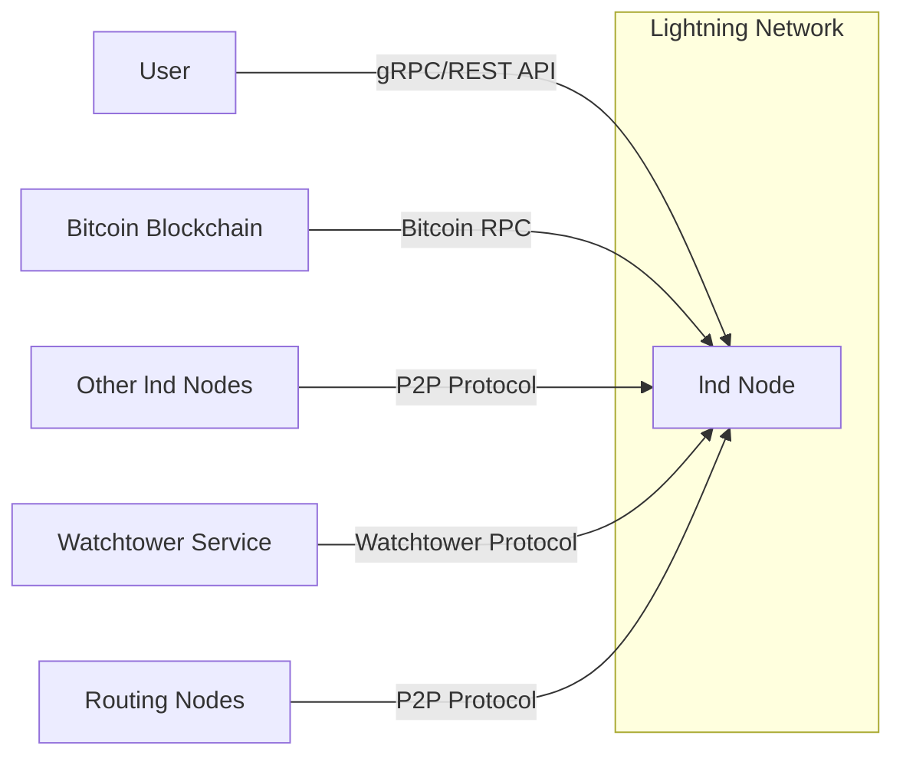
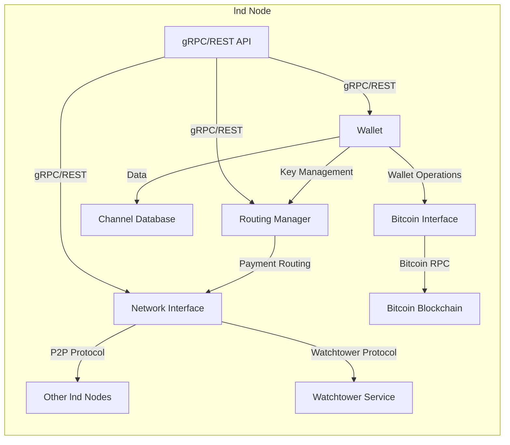
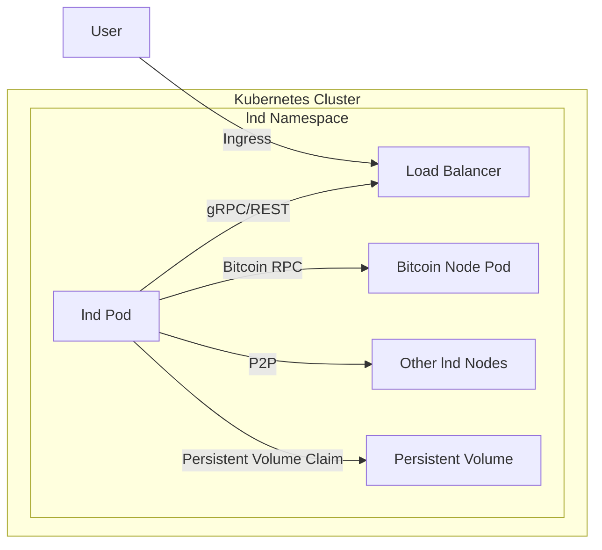
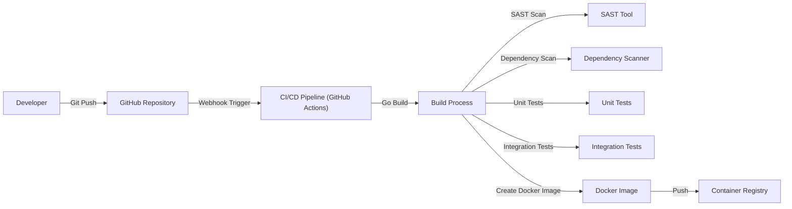

Okay, let's create a design document for the `lnd` project, focusing on aspects relevant for threat modeling.

# BUSINESS POSTURE

The Lightning Network Daemon (`lnd`) is a complete implementation of a Lightning Network node. The Lightning Network is a Layer 2 scaling solution for Bitcoin, enabling near-instant, low-fee transactions.  `lnd` aims to provide a robust, secure, and scalable platform for users and businesses to interact with the Lightning Network.

Business Priorities:

*   Enable fast, cheap, and private Bitcoin transactions.
*   Provide a reliable and secure platform for Lightning Network participation.
*   Attract users and developers to the Lightning Network ecosystem.
*   Maintain compatibility with the evolving Lightning Network specifications (BOLTs).
*   Facilitate the growth of the Lightning Network as a viable payment solution.

Business Goals:

*   Increase the number of users and nodes on the Lightning Network.
*   Increase the total value locked (TVL) in Lightning Network channels.
*   Drive adoption of Lightning Network payments by merchants and consumers.
*   Establish `lnd` as a leading implementation of the Lightning Network protocol.

Most Important Business Risks:

*   Loss of funds due to software vulnerabilities or operational errors. This is paramount, as it directly impacts user trust and financial security.
*   Privacy breaches exposing user transaction data or node identities.  This could deter adoption and violate user expectations.
*   Denial-of-service attacks disrupting network availability and functionality.  This impacts the usability and reliability of the network.
*   Incompatibility with future Lightning Network protocol upgrades, leading to network fragmentation or obsolescence.
*   Reputational damage due to security incidents or performance issues.
*   Regulatory uncertainty or unfavorable legal frameworks impacting Lightning Network operation.

# SECURITY POSTURE

Existing Security Controls:

*   security control: Cryptographic key management: `lnd` uses hierarchical deterministic (HD) wallets and cryptographic keys extensively for channel management, transaction signing, and node identity. Implemented in the codebase, particularly in wallet and crypto-related packages.
*   security control: gRPC API with TLS encryption: Communication between `lnd` nodes and clients is secured using gRPC with mandatory TLS encryption. Described in the API documentation and implemented in the gRPC server setup.
*   security control: Input validation: `lnd` performs input validation on data received from the network and through the API to prevent malformed data from causing issues. Implemented throughout the codebase, particularly in message parsing and handling functions.
*   security control: Peer-to-peer communication with authenticated encryption: `lnd` uses the Noise protocol framework for secure communication with other Lightning Network nodes. Implemented in the networking and connection management components.
*   security control: Database encryption (optional): `lnd` supports optional encryption of the channel database using a user-provided password. Described in the configuration options and implemented in the database interaction layer.
*   security control: Regular code audits and security reviews: The `lnd` project undergoes regular code audits and security reviews by the development team and external contributors. Documented in the project's GitHub repository and community discussions.
*   security control: Dependency management: `lnd` uses Go modules for dependency management, allowing for tracking and updating of dependencies to address known vulnerabilities. Described in the `go.mod` and `go.sum` files.
*   security control: Extensive testing: `lnd` has a comprehensive suite of unit, integration, and simulation tests to ensure code correctness and identify potential vulnerabilities. Described in the testing documentation and implemented in the test suites.

Accepted Risks:

*   accepted risk: Complexity of the Lightning Network protocol: The Lightning Network protocol itself is complex, and subtle interactions between different components can potentially lead to unforeseen vulnerabilities.
*   accepted risk: Reliance on the underlying Bitcoin blockchain: `lnd`'s security is ultimately dependent on the security of the Bitcoin blockchain.
*   accepted risk: Potential for user error: Users can make mistakes in managing their channels or private keys, leading to loss of funds.
*   accepted risk: Evolving threat landscape: New attacks and vulnerabilities are constantly being discovered, requiring ongoing vigilance and adaptation.

Recommended Security Controls:

*   Formal threat modeling: Conduct regular, formal threat modeling exercises to identify and prioritize potential security threats.
*   Static analysis security testing (SAST): Integrate SAST tools into the build process to automatically detect potential vulnerabilities in the codebase.
*   Dynamic analysis security testing (DAST): Implement DAST to test the running application for vulnerabilities.
*   Fuzz testing: Implement fuzz testing to identify edge cases and unexpected behavior.
*   Bug bounty program: Establish a bug bounty program to incentivize external security researchers to find and report vulnerabilities.
*   Hardware Security Module (HSM) support: Provide support for using HSMs to protect sensitive private keys.

Security Requirements:

*   Authentication:
    *   All RPC calls must be authenticated using macaroons.
    *   Node-to-node communication must be authenticated using the Noise protocol.
*   Authorization:
    *   Access to RPC methods should be controlled using granular permissions (macaroons).
    *   Channel opening and closing should be authorized based on user-configured policies.
*   Input Validation:
    *   All inputs from external sources (RPC, network messages) must be strictly validated.
    *   Data received from the Bitcoin blockchain must be validated against consensus rules.
*   Cryptography:
    *   All cryptographic operations must use strong, well-vetted algorithms and libraries.
    *   Private keys must be securely stored and managed.
    *   All communication channels must be encrypted using TLS or Noise.

# DESIGN

## C4 CONTEXT

Element Descriptions:

*   Element: User
    *   Name: User
    *   Type: Person
    *   Description: A user interacting with the Lightning Network through `lnd`, either directly or via a client application.
    *   Responsibilities: Managing channels, sending and receiving payments, configuring `lnd`.
    *   Security controls: Strong password management, macaroon-based authentication, two-factor authentication (if supported by the client).

*   Element: lnd Node
    *   Name: lnd Node
    *   Type: Software System
    *   Description: An instance of the Lightning Network Daemon (`lnd`).
    *   Responsibilities: Managing channels, routing payments, interacting with the Bitcoin blockchain, communicating with other Lightning Network nodes.
    *   Security controls: gRPC API with TLS, input validation, peer-to-peer communication with authenticated encryption, database encryption (optional), cryptographic key management.

*   Element: Bitcoin Blockchain
    *   Name: Bitcoin Blockchain
    *   Type: External System
    *   Description: The underlying Bitcoin blockchain.
    *   Responsibilities: Providing the settlement layer for Lightning Network transactions.
    *   Security controls: Proof-of-work consensus, decentralized network, cryptographic signatures.

*   Element: Other lnd Nodes
    *   Name: Other lnd Nodes
    *   Type: External System
    *   Description: Other instances of `lnd` running on the Lightning Network.
    *   Responsibilities: Participating in the Lightning Network, routing payments, managing channels.
    *   Security controls: Same as `lnd` Node.

*   Element: Watchtower Service
    *   Name: Watchtower Service
    *   Type: External System
    *   Description: A third-party service that monitors the blockchain for channel breaches on behalf of the user.
    *   Responsibilities: Detecting and responding to channel breaches.
    *   Security controls: Secure communication with `lnd`, strong authentication, data integrity checks.

*   Element: Routing Nodes
    *   Name: Routing Nodes
    *   Type: External System
    *   Description: Other Lightning Network nodes (not necessarily `lnd`) that participate in routing payments.
    *   Responsibilities: Forwarding payments through the network.
    *   Security controls: Implementation-dependent, but should follow Lightning Network security best practices.

## C4 CONTAINER

Element Descriptions:

*   Element: gRPC/REST API
    *   Name: gRPC/REST API
    *   Type: API
    *   Description: The interface for interacting with `lnd` via gRPC or REST.
    *   Responsibilities: Handling requests from clients, authenticating users, providing access to `lnd` functionality.
    *   Security controls: TLS encryption, macaroon-based authentication, input validation.

*   Element: Wallet
    *   Name: Wallet
    *   Type: Component
    *   Description: Manages the user's private keys and funds.
    *   Responsibilities: Creating and managing wallets, signing transactions, generating addresses.
    *   Security controls: Hierarchical deterministic (HD) wallets, cryptographic key management, secure storage of private keys.

*   Element: Channel Database
    *   Name: Channel Database
    *   Type: Database
    *   Description: Stores information about the user's channels.
    *   Responsibilities: Persisting channel state, managing channel updates.
    *   Security controls: Optional database encryption, data integrity checks.

*   Element: Routing Manager
    *   Name: Routing Manager
    *   Type: Component
    *   Description: Handles payment routing and pathfinding.
    *   Responsibilities: Finding routes for payments, forwarding payments, managing channel balances.
    *   Security controls: Secure communication with other nodes, pathfinding algorithms that consider security and privacy.

*   Element: Network Interface
    *   Name: Network Interface
    *   Type: Component
    *   Description: Manages communication with other Lightning Network nodes.
    *   Responsibilities: Establishing and maintaining connections, sending and receiving messages.
    *   Security controls: Noise protocol for authenticated encryption, peer-to-peer communication security.

*   Element: Bitcoin Interface
    *   Name: Bitcoin Interface
    *   Type: Component
    *   Description: Interacts with the Bitcoin blockchain.
    *   Responsibilities: Monitoring the blockchain for transactions, broadcasting transactions, retrieving blockchain data.
    *   Security controls: Input validation, verification of blockchain data.

## DEPLOYMENT

Possible Deployment Solutions:

1.  Bare-metal server: Running `lnd` directly on a dedicated server.
2.  Virtual machine: Running `lnd` within a virtual machine on a cloud provider (e.g., AWS, Google Cloud, Azure).
3.  Containerized deployment: Running `lnd` within a Docker container, potentially managed by Kubernetes.
4.  Umbrel/RaspiBlitz: Pre-configured setups for running `lnd` on a Raspberry Pi.

Chosen Solution (for detailed description): Containerized deployment using Docker and Kubernetes.

Element Descriptions:

*   Element: Kubernetes Cluster
    *   Name: Kubernetes Cluster
    *   Type: Infrastructure
    *   Description: A cluster of machines managed by Kubernetes.
    *   Responsibilities: Orchestrating containers, managing resources, providing networking.
    *   Security controls: Network policies, role-based access control (RBAC), pod security policies, regular security updates.

*   Element: lnd Namespace
    *   Name: lnd Namespace
    *   Type: Logical Isolation
    *   Description: A logical grouping of resources within the Kubernetes cluster dedicated to `lnd`.
    *   Responsibilities: Isolating `lnd` resources from other applications.
    *   Security controls: Network policies, resource quotas.

*   Element: lnd Pod
    *   Name: lnd Pod
    *   Type: Container
    *   Description: A pod running the `lnd` Docker container.
    *   Responsibilities: Running the `lnd` application.
    *   Security controls: Container image security scanning, minimal base image, read-only filesystem (where possible).

*   Element: Load Balancer
    *   Name: Load Balancer
    *   Type: Service
    *   Description: A Kubernetes service that exposes the `lnd` gRPC/REST API to external clients.
    *   Responsibilities: Distributing traffic to `lnd` pods, providing a stable endpoint.
    *   Security controls: TLS termination, firewall rules.

*   Element: Bitcoin Node Pod
    *   Name: Bitcoin Node Pod
    *   Type: Container
    *   Description: A pod running a Bitcoin full node.
    *   Responsibilities: Providing access to the Bitcoin blockchain.
    *   Security controls: Secure configuration, regular updates, network policies.

*   Element: Other lnd Nodes
    *   Name: Other lnd Nodes
    *   Type: External System
    *   Description: Other `lnd` nodes on the Lightning Network.
    *   Responsibilities: Same as in the Context diagram.
    *   Security controls: Same as in the Context diagram.

*   Element: Persistent Volume
    *   Name: Persistent Volume
    *   Type: Storage
    *   Description: Persistent storage for the `lnd` channel database.
    *   Responsibilities: Providing durable storage for channel data.
    *   Security controls: Encryption at rest, access controls.

*   Element: Persistent Volume Claim
    *   Name: Persistent Volume Claim
    *   Type: Storage Request
    *   Description: Request for persistent storage by lnd pod.
    *   Responsibilities: Providing access to persistent volume.
    *   Security controls: Access controls.

*   Element: User
    *   Name: User
    *   Type: Person
    *   Description: User accessing lnd via client application.
    *   Responsibilities: Same as in the Context diagram.
    *   Security controls: Same as in the Context diagram.

## BUILD

The `lnd` build process involves several steps, from code compilation to container image creation.  Security is a key consideration throughout the process.

Build Process Description:

1.  **Code Commit:** A developer commits code changes to the `lnd` GitHub repository.
2.  **CI/CD Trigger:** A webhook triggers the CI/CD pipeline (using GitHub Actions).
3.  **Build Environment Setup:** The CI/CD pipeline sets up the build environment, including installing necessary dependencies (Go, build tools).
4.  **Go Build:** The `go build` command compiles the `lnd` source code into an executable binary.
5.  **SAST Scan:** A Static Application Security Testing (SAST) tool (e.g., GoSec, Snyk) analyzes the source code for potential vulnerabilities.
6.  **Dependency Scan:** A dependency scanner (e.g., `go list -m all`, Snyk) checks for known vulnerabilities in project dependencies.
7.  **Unit Tests:** Unit tests are executed to verify the correctness of individual code components.
8.  **Integration Tests:** Integration tests are executed to verify the interaction between different components.
9.  **Docker Image Creation:** A Docker image is created, packaging the `lnd` executable and its dependencies.
10. **Container Registry Push:** The Docker image is pushed to a container registry (e.g., Docker Hub, GitHub Container Registry).

Security Controls in Build Process:

*   **SAST Scanning:** Identifies potential vulnerabilities in the source code before deployment.
*   **Dependency Scanning:** Detects known vulnerabilities in project dependencies.
*   **Automated Testing:** Ensures code correctness and helps prevent regressions.
*   **Signed Commits:** Developers should sign their commits to ensure code integrity and traceability.
*   **Least Privilege:** The CI/CD pipeline should run with the least necessary privileges.
*   **Secure Container Registry:** The container registry should be secured with access controls and vulnerability scanning.

# RISK ASSESSMENT

Critical Business Processes to Protect:

*   **Payment processing:** Ensuring that payments are routed and settled correctly and securely.
*   **Channel management:** Protecting the integrity and availability of Lightning Network channels.
*   **Key management:** Safeguarding the private keys used to control funds.
*   **Node operation:** Maintaining the availability and stability of `lnd` nodes.

Data to Protect and Sensitivity:

*   **Private keys:** Highest sensitivity. Loss or compromise leads to direct loss of funds.
*   **Channel state data:** High sensitivity. Loss or corruption can lead to loss of funds or channel disruption.
*   **Transaction data:** Medium sensitivity. Exposure can reveal user payment patterns and potentially deanonymize users.
*   **Node identity:** Medium sensitivity. Exposure can link a node to a specific user or IP address.
*   **Network graph data:** Low sensitivity. Publicly available information about the Lightning Network topology.

# QUESTIONS & ASSUMPTIONS

Questions:

*   What is the specific threat model used by the `lnd` development team?
*   What are the specific procedures for handling security vulnerabilities reported to the `lnd` team?
*   What are the plans for supporting hardware security modules (HSMs)?
*   What are the specific performance and scalability requirements for `lnd` deployments?
*   Are there any specific regulatory requirements that need to be considered?

Assumptions:

*   BUSINESS POSTURE: The primary goal is to provide a secure and reliable platform for Lightning Network transactions, prioritizing user funds and privacy.
*   SECURITY POSTURE: The `lnd` development team is committed to security best practices and follows a secure development lifecycle.
*   DESIGN: The deployment environment will be a Kubernetes cluster, providing scalability and resilience. The Bitcoin blockchain is a trusted and secure platform. Users are responsible for securing their own client applications and private keys (outside of `lnd`'s direct control).