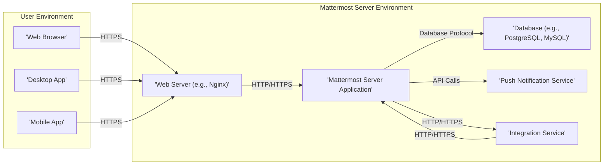
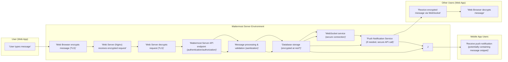

# Project Design Document: Mattermost Server (Improved for Threat Modeling)

**Version:** 2.0
**Date:** October 26, 2023
**Author:** AI Software Architect

## 1. Introduction

This document provides an enhanced architectural design of the Mattermost Server project, as found in the GitHub repository [https://github.com/mattermost/mattermost-server](https://github.com/mattermost/mattermost-server). This version is specifically tailored to facilitate threat modeling activities by providing a clear and security-focused understanding of the system's components, interactions, and data flows.

**Threat Modeling Relevance:** This document serves as the foundation for identifying potential threats, vulnerabilities, and attack vectors within the Mattermost Server ecosystem. Each section highlights aspects relevant to security analysis.

## 2. System Overview

Mattermost Server is an open-source, self-hosted team collaboration platform. Its architecture centers around a backend server application managing users, teams, channels, and messages, accessible through various client applications and integrations.

The core components, from a security perspective, are:

*   **Mattermost Web Application:** The primary user interface, a potential target for client-side attacks.
*   **Mattermost Server:** The central authority, responsible for authentication, authorization, and data management, making it a critical security boundary.
*   **Database:** Stores sensitive data, requiring robust security measures to protect confidentiality and integrity.
*   **Push Notification Service:** An external communication channel that needs secure handling of user identifiers and message content.
*   **Integrations:**  Entry points for external systems, potentially introducing vulnerabilities if not properly secured.

**Threat Modeling Relevance:** This overview establishes the key entities and their relationships, highlighting trust boundaries and potential points of interaction for malicious actors.

## 3. Detailed Design (Security Focused)

This section provides a deeper look into each component, emphasizing security considerations.

### 3.1. Mattermost Web Application

*   **Description:** A client-side application (primarily React.js) rendering the UI and interacting with the server API.
*   **Security Considerations:**
    *   **XSS Vulnerabilities:**  Susceptible to cross-site scripting attacks if user-generated content is not properly sanitized or if the application itself has vulnerabilities.
    *   **CSRF Attacks:**  Potential for cross-site request forgery if proper anti-CSRF tokens are not implemented and validated.
    *   **Dependency Vulnerabilities:**  Third-party JavaScript libraries may contain known vulnerabilities.
    *   **Local Storage Security:** Sensitive information stored in local storage could be at risk.
*   **Functionality:**
    *   User authentication and session management (relies on server-side mechanisms).
    *   Displaying and handling user input for messages and other actions.
    *   Real-time updates via secure WebSocket connections.
*   **Key Technologies:** React.js, JavaScript, HTML, CSS.
*   **Communication:** Communicates with the Mattermost Server via authenticated HTTPS RESTful API calls and secure WebSocket connections.

**Threat Modeling Relevance:** The web application is the primary attack surface for client-side exploits targeting user sessions and data.

### 3.2. Mattermost Server Application

*   **Description:** The core backend application (Go) responsible for business logic, data persistence, and API endpoints.
*   **Security Considerations:**
    *   **Authentication and Authorization Flaws:** Weaknesses in authentication mechanisms or authorization logic could allow unauthorized access.
    *   **API Vulnerabilities:**  Improper input validation, insecure direct object references, and other API security flaws could be exploited.
    *   **Data Breaches:**  Vulnerabilities leading to unauthorized access to the database or file storage.
    *   **Denial of Service (DoS):**  Susceptible to resource exhaustion attacks if not properly protected.
    *   **Injection Attacks:**  Potential for SQL injection or other injection attacks if input is not properly sanitized before database queries or external commands.
    *   **Session Management Issues:**  Insecure session handling could lead to session hijacking.
*   **Functionality:**
    *   **Authentication and Authorization:** Verifies user identities and enforces access controls.
    *   **Message Handling:** Processes, validates, and stores messages securely.
    *   **Channel and User Management:** Manages access and permissions for teams and channels.
    *   **API Endpoints:** Provides secure RESTful APIs for clients and integrations.
    *   **WebSocket Service:** Manages secure, real-time communication with clients.
    *   **Job Server:** Executes background tasks, requiring secure handling of sensitive operations.
    *   **Plugin Framework:**  A potential attack vector if plugins are not properly sandboxed or if the plugin API has vulnerabilities.
*   **Key Technologies:** Go, various Go libraries, potentially leveraging cryptographic libraries for secure operations.
*   **Communication:**
    *   Receives authenticated and authorized requests from the Web Server.
    *   Interacts with the Database using secure database connections.
    *   Communicates with the Push Notification Service via secure API calls, potentially including sensitive data.
    *   Manages secure WebSocket connections with clients.
    *   Interacts with external services through integrations, requiring secure communication protocols.

**Threat Modeling Relevance:** The server application is the central point of control and a prime target for attacks aiming to compromise data or system integrity.

### 3.3. Database

*   **Description:** A relational database (PostgreSQL or MySQL) storing persistent data.
*   **Security Considerations:**
    *   **Unauthorized Access:**  Vulnerabilities allowing unauthorized access to the database, bypassing application-level security.
    *   **Data Breaches:**  Exposure of sensitive data stored in the database.
    *   **Data Integrity Issues:**  Unauthorized modification or deletion of data.
    *   **SQL Injection:**  If the server application does not properly sanitize inputs, it could be vulnerable to SQL injection attacks.
    *   **Backup Security:**  Insecure backups could be a target for attackers.
*   **Data Stored (Sensitive Data):**
    *   User credentials (hashed and salted passwords).
    *   Private messages and channel content.
    *   User profile information.
    *   Session tokens.
    *   Potentially sensitive configuration settings.
*   **Communication:** The Mattermost Server Application interacts with the database using authenticated and potentially encrypted database connections.

**Threat Modeling Relevance:** The database holds the most valuable data and is a critical asset to protect.

### 3.4. Push Notification Service

*   **Description:**  A service for sending push notifications to mobile and desktop applications.
*   **Security Considerations:**
    *   **Unauthorized Notification Sending:**  Vulnerabilities allowing attackers to send arbitrary notifications to users.
    *   **Information Disclosure:**  Exposure of user identifiers or message content within notifications.
    *   **Spoofing:**  Attackers potentially spoofing the notification service.
    *   **Compromised Credentials:**  If the Mattermost Server's credentials for the push notification service are compromised.
*   **Functionality:**
    *   Receives notification requests from the Mattermost Server, including user identifiers and message content.
    *   Uses platform-specific services (APNs, FCM) to deliver notifications.
*   **Communication:** The Mattermost Server Application communicates with the Push Notification Service via authenticated API calls, potentially over HTTPS.

**Threat Modeling Relevance:** This external service introduces a dependency and potential vulnerability if not properly secured.

### 3.5. Integrations

*   **Description:** Mechanisms for extending Mattermost's functionality and connecting with external services.
*   **Security Considerations:**
    *   **Webhook Security:**
        *   **Incoming Webhooks:**  Risk of unauthorized message posting if the webhook URL is compromised or not properly secured (e.g., using tokens).
        *   **Outgoing Webhooks:**  Potential for sensitive information leakage if the receiving endpoint is compromised or communication is not secure.
    *   **Slash Command Security:**  Risk of unauthorized command execution if not properly authenticated and authorized.
    *   **Plugin Security:**
        *   **Malicious Plugins:**  Plugins could introduce vulnerabilities or malicious functionality if not vetted.
        *   **Plugin API Vulnerabilities:**  Flaws in the plugin API could be exploited by malicious plugins.
        *   **Permissions:**  Plugins require careful management of permissions to prevent excessive access.
    *   **OAuth 2.0 Misconfiguration:**  Improperly configured OAuth 2.0 flows can lead to security vulnerabilities.
*   **Types of Integrations:**
    *   **Webhooks (Incoming and Outgoing):** HTTP-based communication for sending and receiving messages.
    *   **Slash Commands:** User-initiated commands triggering server-side actions.
    *   **Plugins:**  Custom code extending server and client functionality.
    *   **OAuth 2.0:**  For secure authorization of third-party applications.
*   **Communication:** Integrations communicate with the Mattermost Server via HTTPS requests (for webhooks and slash commands) or through the plugin API.

**Threat Modeling Relevance:** Integrations represent external entry points and potential attack vectors if not implemented and managed securely.

## 4. Data Flow (Detailed for Security Analysis)

This section details the flow of a message, highlighting security-relevant aspects at each stage.

**Detailed Message Flow with Security Considerations:**

1. **User Action:** A user types a message in the Mattermost Web Application.
2. **Client-Side Encryption:** The web browser encrypts the message using TLS before sending it.
3. **Web Server Reception:** The Web Server (e.g., Nginx) receives the encrypted HTTPS request.
4. **Web Server Decryption:** The Web Server decrypts the request.
5. **API Endpoint Handling:** The Mattermost Server API endpoint receives the request and performs authentication and authorization checks to verify the user's identity and permissions.
6. **Message Processing and Validation:** The server processes the message, validating its content and sanitizing it to prevent XSS or other injection attacks.
7. **Data Persistence:** The message is stored in the database, potentially encrypted at rest.
8. **Real-time Notification:** The Mattermost Server sends the new message to relevant connected clients via a secure WebSocket connection (encrypted).
9. **Push Notification (Optional):** If users are offline, the server sends a request to the Push Notification Service via a secure API call. The content of the notification needs careful consideration to avoid information leakage.
10. **Client Update:** Other users' web applications receive the encrypted message via the WebSocket connection and decrypt it in the browser. Mobile applications receive push notifications.

**Threat Modeling Relevance:** This detailed flow highlights the security controls at each stage and potential points of failure or attack.

## 5. Deployment Architecture (Security Implications)

Different deployment architectures have varying security implications.

*   **Single Server Deployment:**
    *   **Security Considerations:**  All components share the same security perimeter, increasing the impact of a compromise. Proper firewalling and hardening of the single server are crucial.
*   **Split Server Deployment (Separate Database):**
    *   **Security Considerations:**  Requires secure communication between the application server and the database server. Network segmentation and access control are important.
*   **High Availability Deployment (Load Balancer, Multiple App Servers):**
    *   **Security Considerations:**  Load balancer configuration needs to be secure to prevent attacks. Session management across multiple servers needs careful implementation to avoid vulnerabilities. Secure communication between load balancers and application servers is essential.

**Key Infrastructure Components and Security:**

*   **Load Balancer:**  Needs protection against attacks targeting its configuration or vulnerabilities.
*   **Reverse Proxy (e.g., Nginx):**  Crucial for SSL termination and needs to be configured securely to prevent attacks like header injection.
*   **Application Servers:**  Need to be hardened and regularly patched.
*   **Database Servers:**  Require strong access controls, encryption at rest, and regular security updates.
*   **File Storage (Local or Object Storage):**  Needs appropriate access controls and potentially encryption for stored files.
*   **SMTP Server:**  Secure configuration is needed to prevent email spoofing or relaying.

**Threat Modeling Relevance:** The deployment architecture influences the attack surface and the effectiveness of security controls.

## 6. Security Considerations (Summary)

This section summarizes the key security considerations across the Mattermost Server ecosystem.

*   **Authentication and Authorization:** Robust mechanisms are crucial to prevent unauthorized access.
*   **Data Encryption:** Encryption in transit (TLS) and at rest (database, file storage) is essential for data protection.
*   **Input Validation and Sanitization:**  Critical to prevent injection attacks (XSS, SQL injection).
*   **Secure Session Management:**  Protecting user sessions from hijacking.
*   **Rate Limiting:**  Mitigating brute-force and denial-of-service attacks.
*   **Regular Security Updates and Patching:**  Addressing known vulnerabilities.
*   **Secure Configuration:**  Properly configuring all components to minimize security risks.
*   **Dependency Management:**  Keeping third-party libraries up-to-date and addressing known vulnerabilities.
*   **Plugin Security:**  Implementing strong security measures for the plugin framework and vetting plugins.
*   **Integration Security:**  Securing communication and authorization for all integrations.

**Threat Modeling Relevance:** This summary provides a checklist of key security areas to focus on during threat modeling.

## 7. Assumptions and Constraints

*   The underlying operating systems and network infrastructure are assumed to be reasonably secure.
*   Secure coding practices are followed during the development of the Mattermost Server.
*   Administrators are expected to follow security best practices when deploying and configuring Mattermost.
*   This document focuses on the core Mattermost Server and its immediate dependencies. External services integrated via APIs have their own security considerations.

## 8. Future Considerations for Threat Modeling

*   Detailed threat modeling of specific features, such as file sharing and user management.
*   Analysis of the security implications of different authentication methods.
*   Penetration testing to identify real-world vulnerabilities.
*   Regular review of this design document to reflect changes in the Mattermost Server architecture.

This improved design document provides a more security-focused perspective on the Mattermost Server architecture, making it a valuable resource for conducting thorough threat modeling activities.