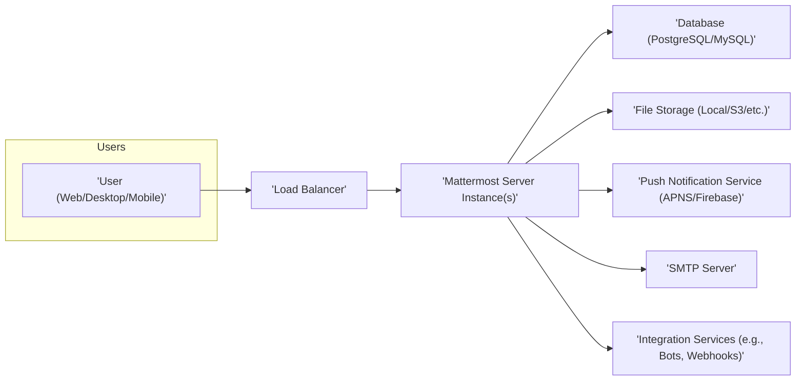
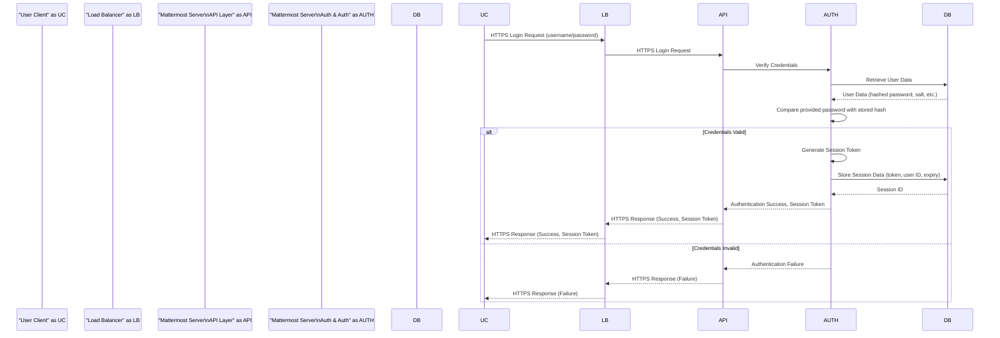
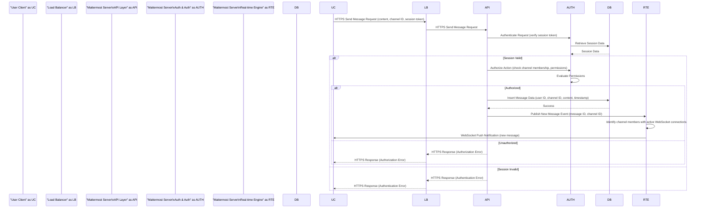

# Mattermost Server Project Design Document

**Version:** 1.1
**Date:** October 26, 2023
**Author:** AI Software Architect

## 1. Introduction

This document provides an enhanced architectural design overview of the Mattermost Server, an open-source, self-hosted team collaboration platform. This revised document aims to provide a more detailed understanding of the system's structure, components, and interactions, with a stronger emphasis on elements crucial for thorough threat modeling. The design focuses on key architectural elements directly relevant to security considerations and potential attack vectors.

This document is based on the information available in the Mattermost Server repository: [https://github.com/mattermost/mattermost-server](https://github.com/mattermost/mattermost-server).

## 2. Goals and Objectives

The primary goal of this document remains to provide a clear and comprehensive architectural overview of the Mattermost Server, but with greater depth and clarity. The specific objectives have been refined to include:

*   Identifying key components and detailing their specific responsibilities and sub-components.
*   Mapping the interactions and data flow between components with more granular detail, including specific protocols and data formats where relevant.
*   Highlighting security-relevant aspects of the architecture with concrete examples of potential vulnerabilities and attack surfaces.
*   Providing enhanced visual representations of the system architecture, including more detailed diagrams for specific subsystems.
*   Serving as a more robust and actionable basis for subsequent threat modeling activities.

## 3. High-Level System Architecture

The Mattermost Server operates as a multi-tiered application. The core components interact to deliver the full functionality of the platform. This diagram illustrates the primary external interfaces and dependencies.



*   **Users:** Interact with the platform through various client applications, each with its own communication protocols and authentication mechanisms.
    *   Web Client (Browser-based)
    *   Desktop Client (Electron-based)
    *   Mobile Client (Native iOS/Android)
*   **Load Balancer:** Distributes incoming traffic across multiple Mattermost Server instances to ensure high availability and scalability. This can be an external service or an internal component.
*   **Mattermost Server Instance(s):** The core application logic, responsible for handling user requests, processing data, managing real-time communication, and enforcing security policies.
*   **Database:** Stores persistent data, including user accounts, channels, posts, configurations, and audit logs. The choice of database impacts performance and scalability.
*   **File Storage:** Stores uploaded files and attachments. Different storage backends offer varying security and performance characteristics.
*   **Push Notification Service:** Facilitates sending notifications to users on their mobile devices when the app is in the background. This relies on platform-specific services.
*   **SMTP Server:** Used for sending outbound emails, such as password reset requests, email invitations, and notifications.
*   **Integration Services:** Enables communication with external applications and services through webhooks, slash commands, and bots. This introduces external dependencies and potential security risks.

## 4. Detailed Component Architecture

This section provides a more granular view of the internal components within a Mattermost Server instance and their interactions.

```mermaid
graph LR
    subgraph "Mattermost Server Instance"
        A["'API Layer'"]
        subgraph "API Layer Subcomponents"
            AA["'REST API Handlers'"]
            AB["'GraphQL API Handlers'"]
            AC["'Authentication Middleware'"]
            AD["'Authorization Middleware'"]
            AE["'Rate Limiting Middleware'"]
        end
        B["'Web Application'"]
        C["'Real-time Engine'"]
        subgraph "Real-time Engine Subcomponents"
            CA["'WebSocket Manager'"]
            CB["'Broadcast Service'"]
            CC["'Presence Service'"]
        end
        D["'Job Server'"]
        subgraph "Job Server Subcomponents"
            DA["'Job Queue'"]
            DB["'Workers'"]
            DC["'Schedulers'"]
        end
        E["'Plugin Framework'"]
        subgraph "Plugin Framework Subcomponents"
            EA["'Plugin API'"]
            EB["'Hook System'"]
            EC["'App Registry'"]
        end
        F["'Cluster Management'"]
        G["'Authentication & Authorization'"]
        subgraph "Auth & Auth Subcomponents"
            GA["'Local Authentication'"]
            GB["'OAuth 2.0'"]
            GC["'SAML'"]
            GD["'Permissions Engine'"]
        end
        H["'Data Access Layer'"]
        subgraph "Data Access Layer Subcomponents"
            HA["'ORM (e.g., sqlx)'"]
            HB["'Database Connection Pool'"]
            HC["'Query Builders'"]
        end
        I["'Metrics & Logging'"]
    end
    J["'Database (PostgreSQL/MySQL)'"]
    K["'File Storage'"]
    L["'Push Notification Service'"]
    M["'SMTP Server'"]
    N["'Integration Services'"]

    A --> G
    A --> B
    A --> C
    A --> D
    A --> E
    A --> H
    A --> I

    AA --> AC
    AB --> AC
    AC --> AD
    AD --> G
    AE --> A

    B --> A
    C --> A
    C -- Websockets --> "User Clients"
    CA --> CB
    CB --> CC
    D --> H
    DA --> DB
    DB --> H
    D --> J
    E -- Communication --> A
    EA --> EB
    F --> A
    G --> H
    GD --> H
    H --> J
    I -- Logs --> "Logging System"
    D --> K
    A --> L
    A --> M
    A -- Webhooks/Slash Commands --> N
```

*   **API Layer ('API'):**  The entry point for most client interactions and integrations.
    *   **REST API Handlers:** Handle standard RESTful requests.
    *   **GraphQL API Handlers:** Handle GraphQL queries and mutations.
    *   **Authentication Middleware:** Verifies user credentials and establishes sessions.
    *   **Authorization Middleware:** Enforces access control policies based on user roles and permissions.
    *   **Rate Limiting Middleware:** Protects against abuse by limiting the number of requests from a single source.
*   **Web Application ('WebApp'):** Serves the static assets and handles the initial rendering of the web client.
*   **Real-time Engine ('Realtime'):** Manages bidirectional communication with clients for real-time updates.
    *   **WebSocket Manager:** Handles the establishment and management of WebSocket connections.
    *   **Broadcast Service:** Responsible for distributing real-time events to connected clients.
    *   **Presence Service:** Tracks user online/offline status.
*   **Job Server ('Jobs'):** Executes asynchronous tasks and scheduled jobs.
    *   **Job Queue:** Stores pending jobs to be processed.
    *   **Workers:** Execute the actual job logic.
    *   **Schedulers:** Trigger jobs based on predefined schedules.
*   **Plugin Framework ('Plugins'):** Enables extending Mattermost functionality through plugins.
    *   **Plugin API:** Provides interfaces for plugins to interact with the server.
    *   **Hook System:** Allows plugins to intercept and modify server behavior at specific points.
    *   **App Registry:** Manages installed plugins and their configurations.
*   **Cluster Management ('Cluster'):** Coordinates activities across multiple server instances in a clustered environment.
*   **Authentication & Authorization ('Auth'):** Manages user authentication and authorization.
    *   **Local Authentication:** Handles username/password-based authentication.
    *   **OAuth 2.0:** Supports authentication via OAuth providers.
    *   **SAML:** Supports authentication via SAML identity providers.
    *   **Permissions Engine:** Evaluates permissions based on user roles, channel membership, and other factors.
*   **Data Access Layer ('Data'):** Provides an abstraction layer for database interactions.
    *   **ORM (e.g., sqlx):** Maps objects to database records.
    *   **Database Connection Pool:** Manages connections to the database.
    *   **Query Builders:** Facilitate the construction of database queries.
*   **Metrics & Logging:** Collects and exposes server metrics and logs for monitoring and auditing.

## 5. Key Components and Interactions

This section provides a more detailed description of key components and their interactions, highlighting security-relevant aspects.

*   **User Clients (Web, Desktop, Mobile):**
    *   **Web Client:** Communicates with the server primarily via HTTPS for API calls and WSS for real-time updates. Subject to browser security policies and potential vulnerabilities in JavaScript dependencies.
    *   **Desktop Client:**  Typically embeds a web browser engine (e.g., Electron) and interacts with the server similarly to the web client. Potential for vulnerabilities within the embedded browser.
    *   **Mobile Client:** Native applications that communicate with the server via HTTPS and WSS. Relies on platform-specific security features and secure coding practices.

*   **API Layer:**
    *   Enforces authentication and authorization for all incoming requests. Vulnerabilities here could lead to unauthorized access or data breaches.
    *   Rate limiting helps prevent denial-of-service attacks and brute-force attempts. Misconfiguration can lead to service disruption or ineffective protection.
    *   Input validation is crucial to prevent injection attacks. Lack of proper validation is a common vulnerability.
    *   The choice of API protocols (REST, GraphQL) impacts security considerations and potential attack vectors.

*   **Web Application:**
    *   Serving static assets securely is important to prevent cross-site scripting (XSS) attacks.
    *   Proper content security policies (CSP) can mitigate certain types of XSS vulnerabilities.

*   **Real-time Engine:**
    *   Secure WebSocket connections (WSS) are essential to protect the confidentiality and integrity of real-time communication.
    *   Authorization checks must be in place to ensure users only receive updates for channels they have access to.

*   **Job Server:**
    *   Secure handling of credentials and sensitive information within background jobs is crucial.
    *   Proper input validation for job parameters is necessary to prevent unintended actions or security breaches.

*   **Plugin Framework:**
    *   Plugins can introduce significant security risks if not developed securely.
    *   The Plugin API must be carefully designed to prevent plugins from compromising the server's security.
    *   Mechanisms for auditing and reviewing plugins are important.

*   **Cluster Management:**
    *   Secure communication between cluster nodes is essential to prevent unauthorized access or data manipulation within the cluster.
    *   Properly configured access controls for cluster management operations are necessary.

*   **Authentication & Authorization:**
    *   The strength of the authentication mechanisms directly impacts the security of user accounts.
    *   Vulnerabilities in the authentication logic can lead to unauthorized access.
    *   Granular permission controls are needed to enforce the principle of least privilege.

*   **Data Access Layer:**
    *   Protection against SQL injection and other database vulnerabilities is paramount.
    *   Secure storage of database credentials is critical.

## 6. Data Flow Diagrams

This section provides more detailed data flow diagrams for key operations.

### 6.1. User Login (Detailed)



### 6.2. Sending a Message (Detailed)



## 7. Security Considerations

This section provides a more detailed breakdown of security considerations, linking them to specific components and potential threats.

*   **Authentication and Authorization:**
    *   **Threats:** Brute-force attacks on login endpoints, session hijacking, privilege escalation due to flawed permission checks.
    *   **Mitigations:** Strong password policies, multi-factor authentication, secure session management (HTTPOnly, Secure flags), robust permission model with regular audits. Vigilant monitoring of failed login attempts.
    *   **Relevant Components:** API Layer (Authentication Middleware), Authentication & Authorization component.

*   **Data Protection:**
    *   **Threats:** Data breaches due to unauthorized access to the database or file storage, interception of sensitive data in transit.
    *   **Mitigations:** Encryption at rest for the database and file storage, mandatory HTTPS/TLS for all client-server communication, secure handling of API keys and secrets (e.g., using a secrets management system).
    *   **Relevant Components:** Database, File Storage, API Layer, Load Balancer.

*   **Input Validation:**
    *   **Threats:** SQL injection, cross-site scripting (XSS), command injection.
    *   **Mitigations:**  Strict input validation on all user-provided data, output encoding to prevent XSS, parameterized queries to prevent SQL injection. Regular security scanning and penetration testing.
    *   **Relevant Components:** API Layer (REST and GraphQL handlers), Web Application.

*   **Real-time Communication Security:**
    *   **Threats:**  Eavesdropping on real-time communication, message spoofing, unauthorized access to real-time channels.
    *   **Mitigations:**  Enforce WSS for all WebSocket connections, implement authorization checks for real-time events, secure generation and handling of WebSocket connection identifiers.
    *   **Relevant Components:** Real-time Engine.

*   **Plugin Security:**
    *   **Threats:** Malicious plugins introducing vulnerabilities or backdoors, insecure plugins exposing sensitive data.
    *   **Mitigations:**  Plugin sandboxing to limit plugin access to system resources, a secure plugin API to prevent plugins from performing privileged operations, code review and security audits for popular plugins, a mechanism for disabling or removing malicious plugins.
    *   **Relevant Components:** Plugin Framework.

*   **API Security:**
    *   **Threats:** API abuse, unauthorized access to API endpoints, data leakage through API responses.
    *   **Mitigations:**  Rate limiting, strong authentication and authorization for API requests, secure API design principles (e.g., least privilege), regular security testing of API endpoints.
    *   **Relevant Components:** API Layer.

*   **Infrastructure Security:**
    *   **Threats:**  Compromise of the underlying server infrastructure, denial-of-service attacks.
    *   **Mitigations:**  Regular security patching of operating systems and software, network segmentation, firewalls, intrusion detection systems, DDoS mitigation services.
    *   **Relevant Components:** All components, deployment environment.

*   **Integration Security:**
    *   **Threats:**  Compromise of integrated services leading to data breaches or unauthorized actions within Mattermost, insecure handling of integration credentials.
    *   **Mitigations:**  Secure authentication and authorization mechanisms for integrations (e.g., OAuth), secure storage and management of integration secrets, regular review of integration configurations and permissions.
    *   **Relevant Components:** API Layer, Integration Services.

## 8. Deployment Considerations

*   Mattermost Server can be deployed on various platforms, including:
    *   Bare metal servers
    *   Virtual machines (VMs)
    *   Containerized environments (Docker, Kubernetes)
*   High availability and scalability are typically achieved through:
    *   Clustering multiple Mattermost Server instances behind a load balancer.
    *   Database replication and failover mechanisms.
    *   Scalable file storage solutions (e.g., object storage services like AWS S3).
*   Security considerations for deployment include:
    *   Secure configuration of the underlying operating system and network.
    *   Regular security patching and updates.
    *   Properly configured firewalls and network segmentation.
    *   Secure access controls for administrative interfaces.

## 9. Technology Stack

*   **Backend:** Go
*   **Database:** PostgreSQL (recommended), MySQL
*   **Frontend:** React, Redux, Typescript
*   **Real-time Communication:** WebSockets
*   **Caching:** In-memory, Redis (optional)
*   **Search Engine:** Elasticsearch (optional)
*   **Message Queue (for jobs):**  Often uses an internal queue or can be configured with external solutions like RabbitMQ or Kafka.

## 10. Future Considerations

*   Further refinement of component diagrams to illustrate internal modules and their relationships.
*   Detailed sequence diagrams for less common but security-relevant workflows (e.g., password reset, user provisioning).
*   A dedicated section on threat modeling methodologies and potential attack scenarios based on this design.
*   Analysis of the security implications of specific features, such as guest accounts or shared channels.

This enhanced document provides a more detailed and security-focused architectural overview of the Mattermost Server, offering a stronger foundation for subsequent threat modeling efforts. The added granularity in component descriptions, data flow diagrams, and security considerations aims to facilitate a more thorough and effective security analysis.