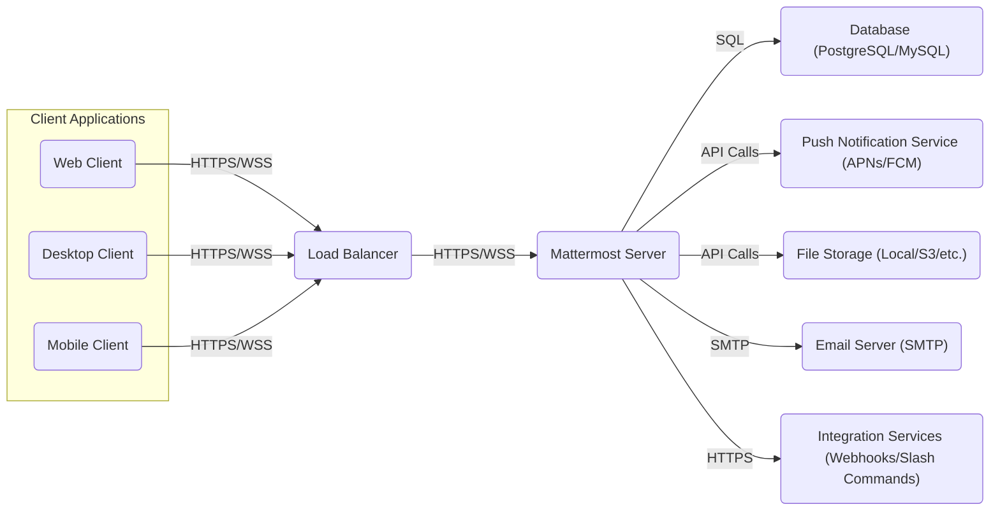
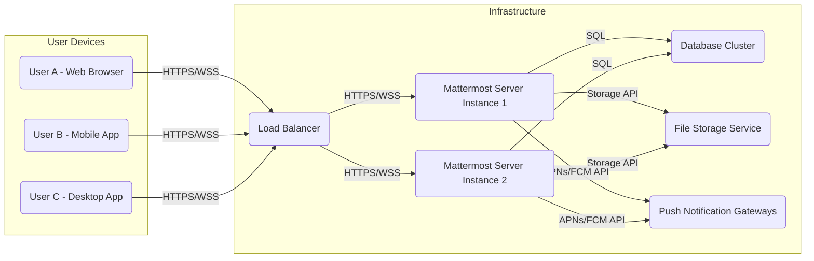
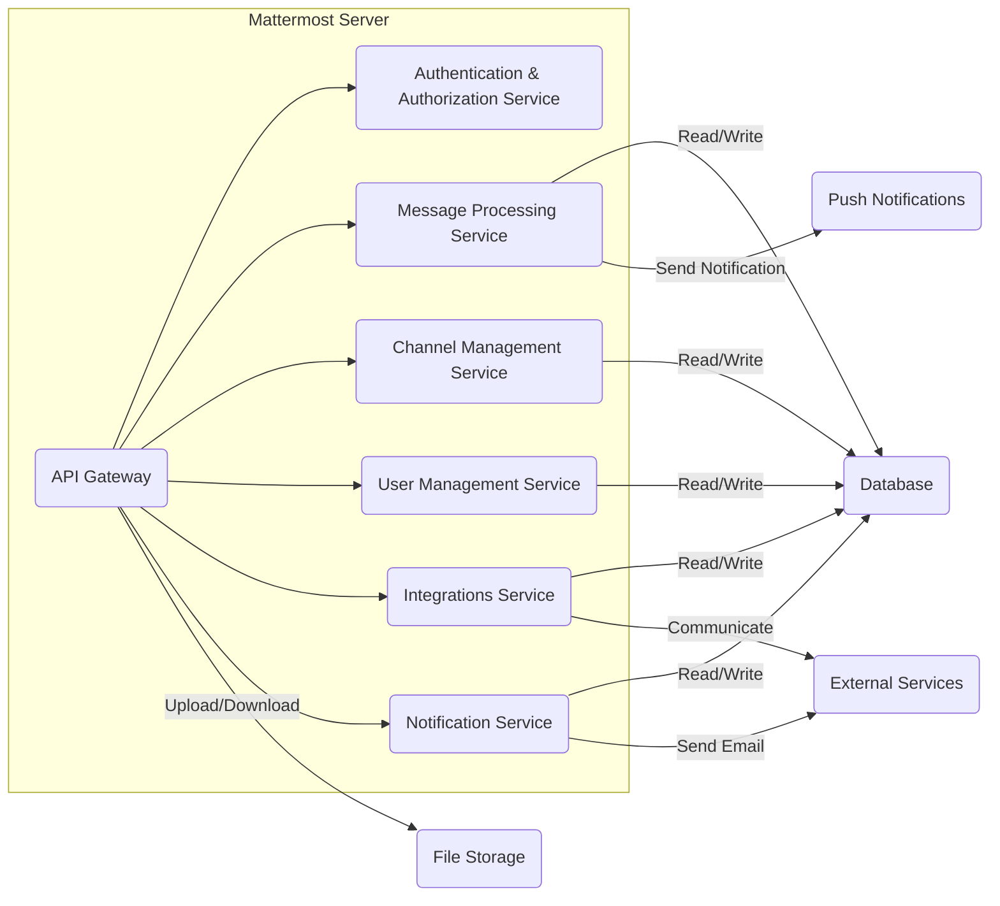

## Project Design Document: Mattermost Server

**Version:** 1.1
**Date:** October 26, 2023
**Author:** AI Software Architect

### 1. Introduction

This document provides a detailed architectural design of the Mattermost server, an open-source, self-hosted team communication platform. This document is intended to serve as a foundation for subsequent threat modeling activities, providing a comprehensive understanding of the system's components, interactions, and data flows. This revision aims to provide more clarity and detail based on initial feedback.

### 2. Purpose

The primary purpose of this document is to outline the architecture of the Mattermost server in sufficient detail to facilitate effective threat modeling. It aims to identify key components, data flows, and trust boundaries within the system. This document will be used by security professionals to identify potential vulnerabilities and design appropriate security controls.

### 3. Scope

This document focuses on the core components and functionalities of the Mattermost server. It includes:

*   User interactions via standard clients (web, desktop, and mobile).
*   Core server functionalities encompassing message handling, channel management, and user management.
*   Database interactions for persistent data storage.
*   Push notification services for mobile client updates.
*   File storage mechanisms for user-uploaded content.
*   Authentication and authorization processes for secure access.
*   Key integration points, such as email and webhooks.

This document does not cover:

*   In-depth details of specific client implementations (web, desktop, mobile), although their interaction patterns with the server are described.
*   Specific deployment infrastructure configurations (e.g., particular cloud provider setups, containerization strategies).
*   Granular configuration options available within the Mattermost server.
*   Detailed architectures of specific plugins or individual plugin designs.

### 4. High-Level Architecture

The Mattermost server employs a client-server architecture. Clients (web, desktop, mobile) communicate with the server using RESTful APIs over HTTPS and establish persistent connections via WebSockets over TLS. The server is responsible for core business logic, data persistence, and communication with external services.

### 5. Key Components

*   **Client Applications (Web, Desktop, Mobile):**
    *   Provide the user interface for interacting with the Mattermost platform.
    *   **Responsibilities:** User input and display, rendering the user interface, managing user sessions, communicating with the server via APIs and WebSockets.
    *   **Communication:** Utilize HTTPS for standard API requests and WebSockets (WSS) for real-time event streaming.
    *   **Security Considerations:** Vulnerable to client-side attacks (e.g., XSS), require secure storage of session tokens.

*   **Load Balancer:**
    *   Distributes incoming client requests across multiple Mattermost server instances to ensure scalability and high availability.
    *   **Responsibilities:** Traffic distribution, health checks of backend servers, SSL termination (optional).
    *   **Communication:** Receives client requests via HTTPS/WSS and forwards them to available Mattermost servers.
    *   **Security Considerations:**  Needs to be secured against attacks targeting load balancers, proper SSL configuration is crucial.

*   **Mattermost Server:**
    *   The core application responsible for handling all business logic and coordinating interactions between other components.
    *   **Responsibilities:** User authentication and authorization, message processing and routing, channel and team management, user role management, API endpoint handling, interaction with the database, push notification service, and file storage.
    *   **Communication:** Communicates with clients via HTTPS/WSS, with the database via SQL, with push notification services via their respective APIs, with file storage via storage-specific APIs, and with email servers via SMTP.
    *   **Security Considerations:**  The primary target for attacks, requires robust security measures including input validation, secure coding practices, and protection against common web application vulnerabilities.

*   **Database (PostgreSQL/MySQL):**
    *   Persistently stores all application data.
    *   **Responsibilities:** Data storage, retrieval, and management; ensuring data integrity and consistency.
    *   **Data Stored:** User accounts and profiles, teams, channels, memberships, messages and message history, file metadata, configuration settings, audit logs.
    *   **Communication:** Receives SQL queries from the Mattermost server.
    *   **Security Considerations:** Requires strong access controls, encryption at rest, and protection against SQL injection attacks.

*   **Push Notification Service (APNs/FCM):**
    *   Facilitates sending push notifications to mobile clients when the application is in the background.
    *   **Responsibilities:** Delivering notifications to user devices based on requests from the Mattermost server.
    *   **Communication:** Mattermost server sends API requests to APNs (for iOS) and FCM (for Android).
    *   **Security Considerations:** Requires secure API key management, potential for notification spoofing if not properly secured.

*   **File Storage (Local/S3/etc.):**
    *   Stores uploaded files and attachments.
    *   **Responsibilities:** Securely storing and retrieving user-uploaded files.
    *   **Storage Options:** Local file system, Amazon S3, MinIO, or other compatible storage solutions.
    *   **Communication:** Mattermost server interacts with the storage backend via file system operations or storage-specific APIs.
    *   **Security Considerations:** Requires access controls, encryption at rest, and protection against unauthorized access and malicious file uploads.

*   **Email Server (SMTP):**
    *   Used for sending email notifications.
    *   **Responsibilities:** Sending emails for password resets, email invitations, and other notifications.
    *   **Communication:** Mattermost server sends emails via the SMTP protocol.
    *   **Security Considerations:** Requires secure configuration to prevent unauthorized email sending and potential spoofing.

*   **Integration Services (Webhooks/Slash Commands):**
    *   Enable interaction with external applications and services.
    *   **Incoming Webhooks:** Allow external systems to post messages into Mattermost channels via HTTP POST requests.
        *   **Security Considerations:** Requires validation of incoming requests to prevent unauthorized posting.
    *   **Outgoing Webhooks:** Triggered by messages in Mattermost, sending data to external systems via HTTP POST requests.
        *   **Security Considerations:** Sensitive data might be transmitted, requires secure communication (HTTPS) and potentially authentication mechanisms.
    *   **Slash Commands:** Allow users to trigger actions in external systems by typing commands in Mattermost.
        *   **Security Considerations:** Requires careful authorization and input validation to prevent abuse.

### 6. Data Flow

Here are some key data flows within the Mattermost server:

*   **User Login:**
    1. Client application sends login credentials (username/password or OAuth token) to the Mattermost server via an HTTPS POST request to the `/api/v4/users/login` endpoint.
    2. Mattermost server authenticates the user against the stored credentials in the database.
    3. Upon successful authentication, the server creates a session and returns a session token to the client in the HTTP response.
    4. Subsequent requests from the client include the session token in the `Authorization` header for authorization.

*   **Sending a Message:**
    1. Client application sends a message content to the Mattermost server via a WebSocket connection or an HTTPS POST request to the `/api/v4/posts` endpoint.
    2. Mattermost server authenticates and authorizes the request based on the user's session and channel permissions.
    3. Server stores the message content, sender information, and timestamp in the `Posts` table in the database.
    4. Server pushes the new message data to relevant clients connected to the channel via WebSocket.
    5. If push notifications are enabled and the recipient is offline, the server sends a notification request to APNs/FCM containing relevant message details.

*   **Uploading a File:**
    1. Client application initiates a file upload to the Mattermost server via an HTTPS POST request to the `/api/v4/files` endpoint.
    2. Mattermost server authenticates and authorizes the request.
    3. Server stores the file in the configured file storage backend (e.g., writes to local disk or uploads to S3).
    4. Server stores metadata about the uploaded file (e.g., filename, size, storage location) in the `FileInfo` table in the database.
    5. A message containing a link or attachment information referencing the uploaded file can then be sent.

*   **Receiving a Push Notification:**
    1. Mattermost server sends a push notification request to APNs/FCM, including the device token and notification payload.
    2. APNs/FCM delivers the notification to the user's mobile device.
    3. User interacts with the notification, potentially opening the Mattermost mobile app.
    4. The mobile app connects to the Mattermost server via HTTPS/WSS to retrieve new messages and updates.

### 7. Security Considerations (For Threat Modeling)

This section outlines security considerations relevant for threat modeling:

*   **Authentication and Authorization:**
    *   **Threats:** Brute-force attacks on login, credential stuffing, session hijacking, privilege escalation.
    *   **Considerations:** Strength of password policies, multi-factor authentication (MFA), secure session management (e.g., HTTP-only, secure cookies), role-based access control (RBAC).

*   **Session Management:**
    *   **Threats:** Session fixation, session replay attacks.
    *   **Considerations:** Secure generation and storage of session tokens, session timeouts, regular session invalidation.

*   **Data at Rest Encryption:**
    *   **Threats:** Unauthorized access to sensitive data stored in the database or file storage.
    *   **Considerations:** Encryption of database contents, encryption of files in storage, key management practices.

*   **Data in Transit Encryption:**
    *   **Threats:** Man-in-the-middle (MITM) attacks, eavesdropping on communication.
    *   **Considerations:** Enforcement of HTTPS for all client-server communication, secure WebSocket connections (WSS), TLS configuration.

*   **Input Validation:**
    *   **Threats:** Cross-site scripting (XSS), SQL injection, command injection.
    *   **Considerations:** Server-side validation of all user inputs, output encoding, parameterized queries for database interactions.

*   **Rate Limiting:**
    *   **Threats:** Brute-force attacks, denial-of-service (DoS) attacks.
    *   **Considerations:** Implementing rate limits on API endpoints, especially authentication endpoints.

*   **Vulnerability Management:**
    *   **Threats:** Exploitation of known vulnerabilities in dependencies or the Mattermost codebase.
    *   **Considerations:** Regular security patching and updates, vulnerability scanning, dependency management.

*   **Secure File Handling:**
    *   **Threats:** Malware uploads, unauthorized access to uploaded files.
    *   **Considerations:** Antivirus scanning of uploaded files, secure storage permissions, preventing direct access to uploaded files.

*   **Push Notification Security:**
    *   **Threats:** Notification spoofing, unauthorized sending of notifications.
    *   **Considerations:** Secure management of APNs/FCM credentials, validating the source of push notification requests.

*   **Integration Security:**
    *   **Threats:** Data breaches through compromised integrations, malicious actions triggered by integrations.
    *   **Considerations:** Secure webhook configuration, input validation for incoming webhooks, secure communication with external services, proper authorization for slash commands.

### 8. Technologies Used

*   **Backend Programming Language:** Go
*   **Frontend Technologies:** React, JavaScript, HTML, CSS
*   **Databases:** PostgreSQL, MySQL
*   **Real-time Communication:** WebSockets
*   **API Protocol:** REST over HTTPS
*   **Push Notifications:** Apple Push Notification service (APNs), Firebase Cloud Messaging (FCM)
*   **File Storage:** Local File System, Amazon S3, MinIO, Azure Blob Storage, Google Cloud Storage
*   **Authentication Mechanisms:** Password-based authentication, OAuth 2.0, SAML, AD/LDAP
*   **Operating System (Typical Deployment):** Linux

### 9. Diagrams

#### 9.1. High-Level Deployment Diagram

#### 9.2. Core Server Components Diagram

### 10. Conclusion

This revised document provides a more detailed and structured overview of the Mattermost server architecture, specifically tailored for threat modeling purposes. By outlining the key components, data flows, and initial security considerations, this document serves as a valuable resource for identifying potential vulnerabilities and designing appropriate security controls. This document will be maintained and updated as the Mattermost server architecture evolves.