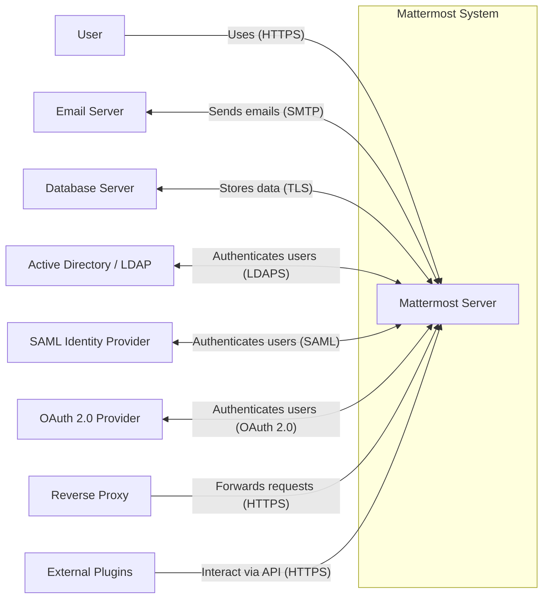
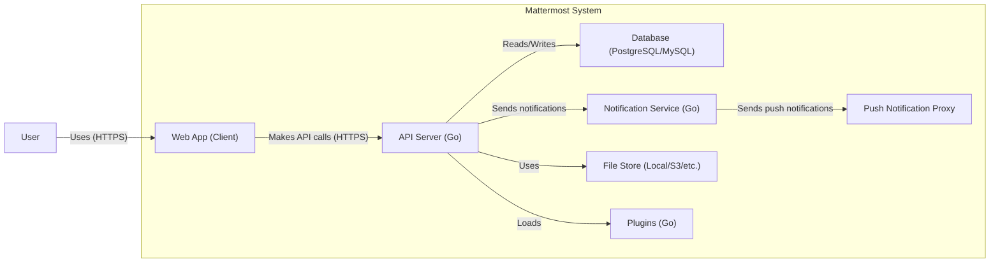
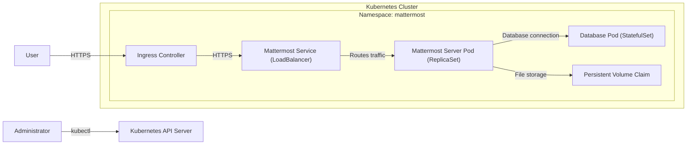
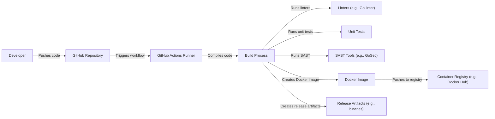

Okay, let's create a design document for the Mattermost server project, focusing on aspects relevant for threat modeling.

# BUSINESS POSTURE

Mattermost is an open-source, self-hosted, Slack-alternative, workplace messaging solution.  It's designed for organizations that require high levels of control over their communication data, often due to compliance, security, or privacy concerns.  The core business value proposition is providing a secure and customizable communication platform.

Business Priorities:

*   Data Security and Privacy:  Ensuring the confidentiality, integrity, and availability of user communications and data. This is paramount, as Mattermost is often used in environments with sensitive information.
*   Compliance:  Meeting the requirements of various regulations (e.g., GDPR, HIPAA, FINRA) depending on the customer's industry and location.
*   Customization and Extensibility:  Allowing organizations to tailor the platform to their specific needs through plugins, integrations, and API access.
*   Scalability and Reliability:  Supporting large user bases and high message volumes with minimal downtime.
*   Self-Hosting and Control:  Giving organizations complete control over their data and infrastructure.
*   Open Source: Allowing community to contribute, review and use the code.

Business Risks:

*   Data Breaches: Unauthorized access to sensitive communication data, potentially leading to legal and reputational damage.
*   Compliance Violations:  Failure to meet regulatory requirements, resulting in fines and legal penalties.
*   Service Disruptions:  Outages or performance issues that hinder communication and productivity.
*   Malicious Insiders:  Employees or contractors with authorized access who misuse their privileges.
*   Supply Chain Attacks: Compromise of third-party libraries or dependencies used in Mattermost.
*   Vulnerabilities in Customizations:  Poorly written plugins or integrations that introduce security flaws.

# SECURITY POSTURE

Existing Security Controls (based on the GitHub repository and general knowledge of Mattermost):

*   security control: Authentication: Supports various authentication methods, including email/password, multi-factor authentication (MFA), SAML, OAuth 2.0, and GitLab SSO. (Implemented in the server code and configuration options).
*   security control: Authorization: Role-based access control (RBAC) system to manage user permissions and access to channels, teams, and features. (Implemented in the server code and database schema).
*   security control: Transport Layer Security (TLS): Encourages (and often requires) the use of TLS for encrypting communication between clients and the server, and between the server and other services (e.g., database). (Configurable via server settings).
*   security control: Data at Rest Encryption: Supports encryption of data at rest, depending on the underlying database and storage configuration. (Dependent on database and infrastructure setup).
*   security control: Auditing: Provides audit logs of user activity and system events. (Implemented in the server code and logging mechanisms).
*   security control: Regular Security Updates: Mattermost releases regular security updates and patches to address vulnerabilities. (Part of the release process).
*   security control: Security Reviews: Undergoes internal and external security reviews and penetration testing. (Mentioned in security documentation).
*   security control: Plugin System Security: Includes measures to mitigate risks associated with third-party plugins, such as sandboxing and permission controls. (Implemented in the plugin architecture).
*   security control: Rate Limiting: Implements rate limiting to protect against brute-force attacks and denial-of-service attacks. (Implemented in the server code).
*   security control: Input Validation: Implements input validation to prevent common web vulnerabilities like cross-site scripting (XSS) and SQL injection. (Implemented throughout the codebase).
*   security control: Content Security Policy (CSP): Uses CSP to mitigate XSS and other code injection attacks. (Implemented in HTTP response headers).

Accepted Risks:

*   accepted risk: Reliance on Third-Party Components: Mattermost, like any complex software, relies on numerous third-party libraries and dependencies. While efforts are made to vet these components, there's an inherent risk of vulnerabilities in these dependencies.
*   accepted risk: Self-Hosting Responsibility:  Since Mattermost is primarily self-hosted, the security of the underlying infrastructure (servers, network, operating systems) is the responsibility of the deploying organization.  Misconfigurations or unpatched systems can expose Mattermost to risks.
*   accepted risk: Plugin Ecosystem Risks: While the plugin system has security controls, there's still a risk that a malicious or poorly written plugin could compromise the system.

Recommended Security Controls:

*   Implement a robust vulnerability management program, including regular penetration testing and dynamic application security testing (DAST).
*   Enhance supply chain security measures, including software composition analysis (SCA) and software bill of materials (SBOM) generation.
*   Provide more granular control over plugin permissions and capabilities.
*   Implement a comprehensive secrets management solution.

Security Requirements:

*   Authentication:
    *   Support for strong password policies (length, complexity, history).
    *   Enforcement of MFA for all users, or at least for privileged accounts.
    *   Secure session management (e.g., session timeouts, secure cookies).
    *   Protection against brute-force and credential stuffing attacks.

*   Authorization:
    *   Fine-grained permission model to control access to specific resources and actions.
    *   Regular review and auditing of user roles and permissions.
    *   Principle of least privilege should be applied throughout the system.

*   Input Validation:
    *   Strict validation of all user inputs on both the client-side and server-side.
    *   Use of whitelisting rather than blacklisting where possible.
    *   Protection against common web vulnerabilities (XSS, SQL injection, CSRF).

*   Cryptography:
    *   Use of strong, industry-standard cryptographic algorithms and protocols.
    *   Secure key management practices.
    *   Encryption of sensitive data in transit and at rest.
    *   Regular review of cryptographic configurations to ensure they remain up-to-date.

# DESIGN

## C4 CONTEXT

Element Descriptions:

*   Element:
    *   Name: User
    *   Type: Person
    *   Description: A person who uses Mattermost to communicate with others.
    *   Responsibilities: Sending messages, creating channels, managing teams, etc.
    *   Security controls: Authentication, Authorization, MFA, Session Management.

*   Element:
    *   Name: Mattermost Server
    *   Type: Software System
    *   Description: The core Mattermost application that handles messaging, user management, and other features.
    *   Responsibilities: Processing messages, managing users, enforcing access control, interacting with external systems.
    *   Security controls: Input Validation, Rate Limiting, Auditing, TLS, CSP.

*   Element:
    *   Name: Email Server
    *   Type: Software System
    *   Description: An external system used to send email notifications.
    *   Responsibilities: Sending emails on behalf of Mattermost.
    *   Security controls: Secure SMTP configuration, TLS.

*   Element:
    *   Name: Database Server
    *   Type: Software System
    *   Description: A database server (e.g., PostgreSQL, MySQL) that stores Mattermost data.
    *   Responsibilities: Storing user data, messages, channel information, etc.
    *   Security controls: Data at Rest Encryption, Access Control, Auditing, TLS.

*   Element:
    *   Name: Active Directory / LDAP
    *   Type: Software System
    *   Description: An external directory service used for user authentication and management.
    *   Responsibilities: Authenticating users, providing user information.
    *   Security controls: LDAPS, Secure Configuration.

*   Element:
    *   Name: SAML Identity Provider
    *   Type: Software System
    *   Description: An external identity provider used for SAML-based single sign-on.
    *   Responsibilities: Authenticating users via SAML.
    *   Security controls: Secure SAML configuration.

*   Element:
    *   Name: OAuth 2.0 Provider
    *   Type: Software System
    *   Description: An external identity provider used for OAuth 2.0-based authentication.
    *   Responsibilities: Authenticating users via OAuth 2.0.
    *   Security controls: Secure OAuth 2.0 configuration.

*   Element:
    *   Name: Reverse Proxy
    *   Type: Software System
    *   Description: A reverse proxy (e.g., Nginx, Apache) that sits in front of the Mattermost server.
    *   Responsibilities: Handling TLS termination, load balancing, and potentially caching.
    *   Security controls: TLS configuration, Web Application Firewall (WAF).

*   Element:
    *   Name: External Plugins
    *   Type: Software System
    *   Description: External plugins that extend the functionality of Mattermost.
    *   Responsibilities: Providing additional features and integrations.
    *   Security controls: Plugin Sandboxing, Permission Controls.

## C4 CONTAINER

Element Descriptions:

*   Element:
    *   Name: Web App (Client)
    *   Type: Web Application
    *   Description: The client-side application that runs in the user's browser.
    *   Responsibilities: Rendering the user interface, handling user interactions, making API calls.
    *   Security controls: Input Validation, CSP, Secure Cookies.

*   Element:
    *   Name: API Server (Go)
    *   Type: Web Application
    *   Description: The core server-side application written in Go.
    *   Responsibilities: Handling API requests, processing business logic, interacting with the database and other services.
    *   Security controls: Input Validation, Rate Limiting, Authentication, Authorization, Auditing.

*   Element:
    *   Name: Database (PostgreSQL/MySQL)
    *   Type: Database
    *   Description: The database that stores Mattermost data.
    *   Responsibilities: Storing data persistently.
    *   Security controls: Data at Rest Encryption, Access Control, Auditing.

*   Element:
    *   Name: Notification Service (Go)
    *   Type: Application
    *   Description: A service responsible for handling notifications.
    *   Responsibilities: Sending email notifications, push notifications, etc.
    *   Security controls: Secure Communication, Rate Limiting.

*   Element:
    *   Name: Push Notification Proxy
    *   Type: Software System
    *   Description: A proxy service for sending push notifications to mobile devices.
    *   Responsibilities: Relaying push notifications to mobile platforms (APNs, FCM).
    *   Security controls: Secure Communication.

*   Element:
    *   Name: File Store (Local/S3/etc.)
    *   Type: Data Store
    *   Description: Storage for file attachments.
    *   Responsibilities: Storing and retrieving files.
    *   Security controls: Access Control, Encryption (depending on the storage type).

*   Element:
    *   Name: Plugins (Go)
    *   Type: Application
    *   Description: Plugins that extend the functionality of Mattermost.
    *   Responsibilities: Providing additional features and integrations.
    *   Security controls: Plugin Sandboxing, Permission Controls.

## DEPLOYMENT

Possible Deployment Solutions:

1.  Docker Compose: Simple deployment for smaller instances.
2.  Kubernetes: Scalable and resilient deployment for larger, more complex environments.
3.  Manual Installation:  Direct installation on a server (e.g., using a package manager).
4.  Cloud-Specific Deployments: Using cloud provider services (e.g., AWS Marketplace, Azure Marketplace).

Chosen Solution (for detailed description): Kubernetes

Element Descriptions:

*   Element:
    *   Name: User
    *   Type: Person
    *   Description: A user accessing Mattermost.
    *   Responsibilities: Using the Mattermost application.
    *   Security controls: Authentication, Authorization.

*   Element:
    *   Name: Administrator
    *   Type: Person
    *   Description: An administrator managing the Kubernetes cluster.
    *   Responsibilities: Deploying, configuring, and maintaining the Mattermost deployment.
    *   Security controls: Kubernetes RBAC, Secure Access to the Kubernetes API.

*   Element:
    *   Name: Kubernetes API Server
    *   Type: Software System
    *   Description: The control plane for the Kubernetes cluster.
    *   Responsibilities: Managing the cluster state, scheduling pods, etc.
    *   Security controls: Kubernetes RBAC, TLS, Authentication.

*   Element:
    *   Name: Ingress Controller
    *   Type: Software System
    *   Description: A component that manages external access to services in the cluster.
    *   Responsibilities: Handling TLS termination, routing traffic to the Mattermost service.
    *   Security controls: TLS Configuration, WAF (if configured).

*   Element:
    *   Name: Mattermost Service (LoadBalancer)
    *   Type: Kubernetes Service
    *   Description: A Kubernetes service that exposes the Mattermost pods.
    *   Responsibilities: Load balancing traffic across multiple Mattermost pods.
    *   Security controls: Network Policies.

*   Element:
    *   Name: Mattermost Server Pod (ReplicaSet)
    *   Type: Kubernetes Pod
    *   Description: A pod running the Mattermost server application.
    *   Responsibilities: Handling user requests, interacting with the database and file storage.
    *   Security controls: Container Security (e.g., image scanning), Network Policies.

*   Element:
    *   Name: Database Pod (StatefulSet)
    *   Type: Kubernetes Pod
    *   Description: A pod running the database server.
    *   Responsibilities: Storing Mattermost data.
    *   Security controls: Database Security Configuration, Network Policies.

*   Element:
    *   Name: Persistent Volume Claim
    *   Type: Kubernetes Persistent Volume Claim
    *   Description: A request for storage by the database pod.
    *   Responsibilities: Providing persistent storage for the database.
    *   Security controls: Storage Encryption (if configured).

## BUILD

The Mattermost build process involves several stages, from code compilation to creating deployable artifacts.  GitHub Actions is used for CI/CD.

Security Controls in Build Process:

*   Linters: Static analysis tools that check for code style and potential errors.
*   Unit Tests: Automated tests that verify the functionality of individual components.
*   SAST Tools: Static Application Security Testing tools (e.g., GoSec) that scan the codebase for security vulnerabilities.
*   Software Composition Analysis (SCA): Tools to identify and analyze third-party dependencies for known vulnerabilities (not explicitly shown in the diagram, but should be part of the process).
*   Signed Commits: Developers should sign their commits to ensure the integrity and authenticity of the code.
*   Secure Build Environment: The build server (GitHub Actions Runner) should be configured securely, with limited access and regular security updates.
*   Artifact Signing: Release artifacts (e.g., binaries, Docker images) should be signed to ensure their integrity and authenticity.

# RISK ASSESSMENT

Critical Business Processes:

*   Secure Communication: Ensuring the confidentiality, integrity, and availability of user communications.
*   User Management: Managing user accounts, roles, and permissions.
*   Data Storage: Securely storing and managing Mattermost data.
*   System Administration: Managing and maintaining the Mattermost server and infrastructure.

Data Sensitivity:

*   User Messages: Highly sensitive, containing potentially confidential business communications, personal information, and intellectual property.
*   User Account Information: Sensitive, including usernames, email addresses, and potentially passwords (if not using external authentication).
*   Channel and Team Information: Moderately sensitive, revealing the structure and organization of communication within the company.
*   System Logs: Moderately sensitive, containing information about user activity and system events.
*   Configuration Files: Highly sensitive, containing credentials and other sensitive settings.

# QUESTIONS & ASSUMPTIONS

Questions:

*   What specific compliance requirements (e.g., GDPR, HIPAA, FINRA) must Mattermost deployments adhere to? This will influence the necessary security controls and configurations.
*   What is the expected scale of Mattermost deployments (number of users, message volume)? This will impact the choice of deployment architecture and performance tuning.
*   What are the specific threat models and attack scenarios that are of greatest concern to Mattermost users? This will help prioritize security efforts.
*   What level of detail is required for the threat modeling exercise? This will determine the depth of analysis and documentation.
*   What are the specific procedures for handling security incidents and vulnerabilities?
*   What are organization's policies regarding data retention and data deletion?

Assumptions:

*   BUSINESS POSTURE: Organizations deploying Mattermost prioritize data security and privacy.
*   BUSINESS POSTURE: Compliance with relevant regulations is a key requirement.
*   SECURITY POSTURE: Mattermost is deployed in a secure environment with appropriate network security controls.
*   SECURITY POSTURE: The underlying infrastructure (servers, operating systems, databases) is regularly patched and maintained.
*   SECURITY POSTURE: Administrators follow security best practices when configuring and managing Mattermost.
*   DESIGN: The deployment architecture will be based on Kubernetes for scalability and resilience.
*   DESIGN: The build process will incorporate security checks, including SAST and SCA.
*   DESIGN: Mattermost will be configured to use TLS for all communication.
*   DESIGN: Database will be configured to use encryption at rest.