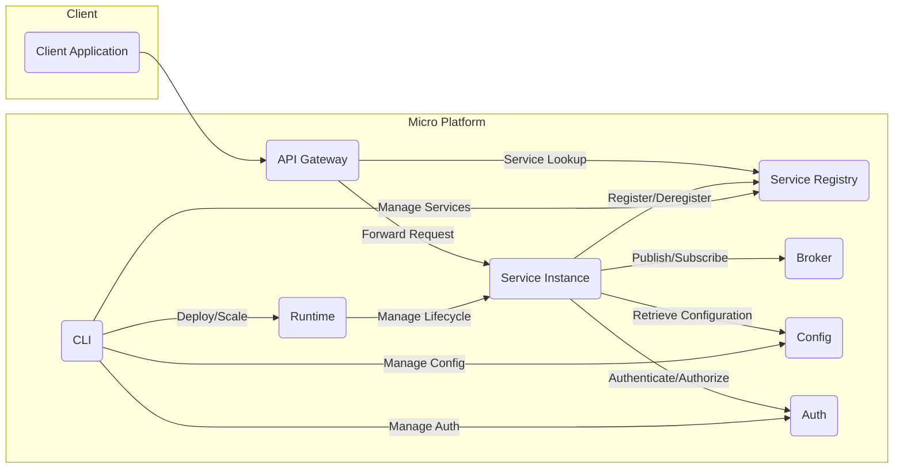
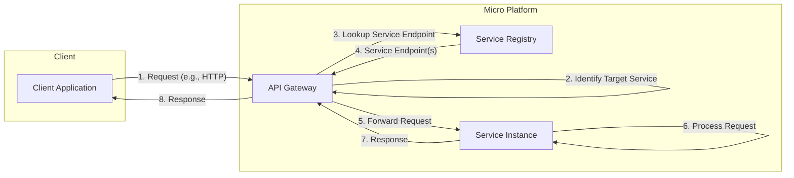
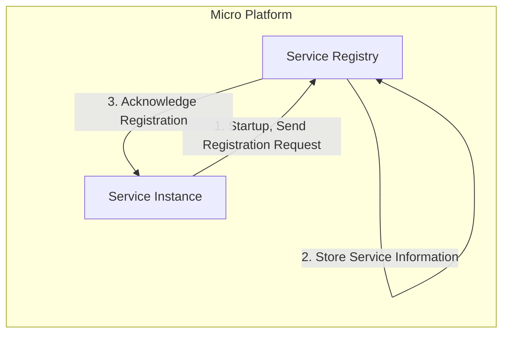
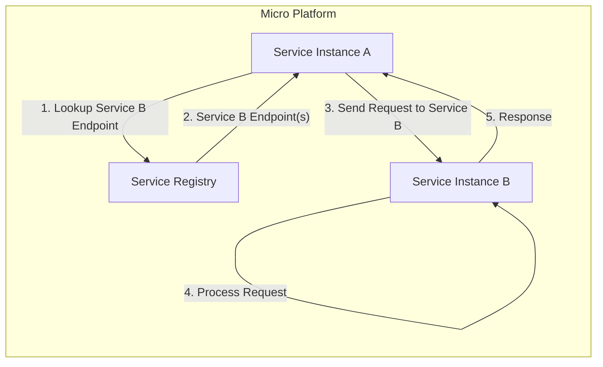
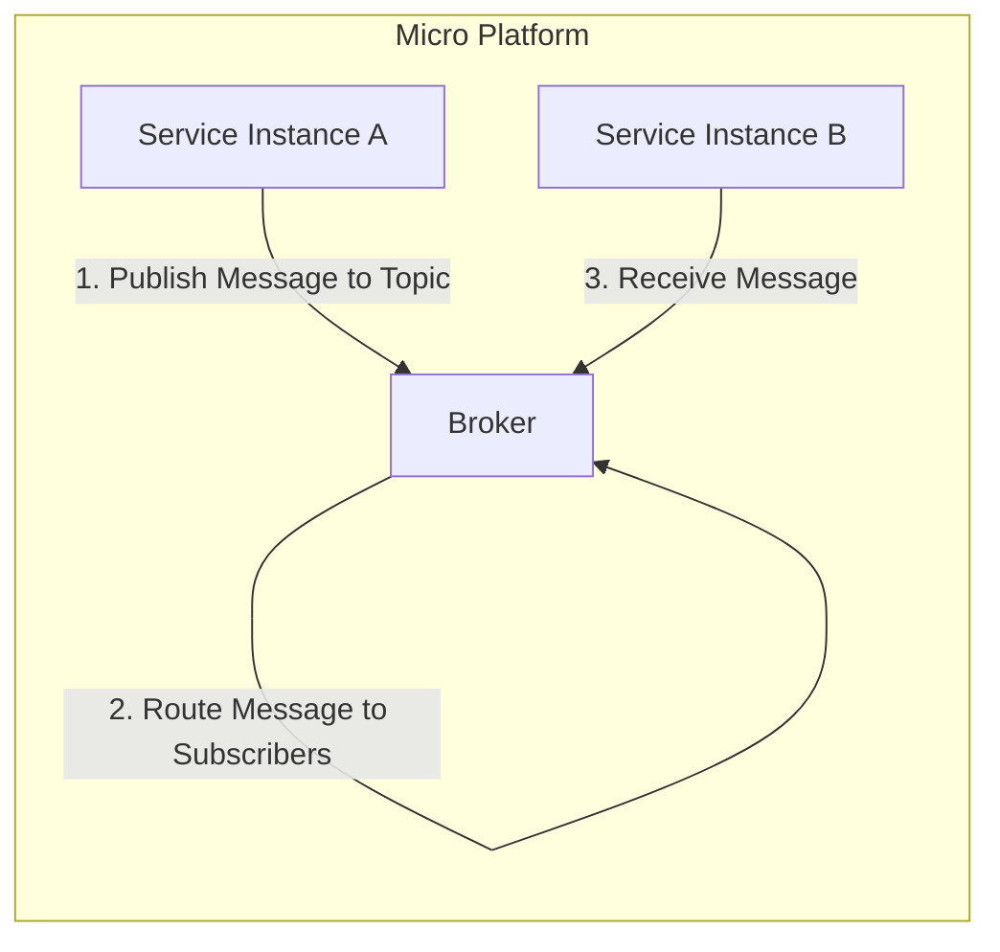
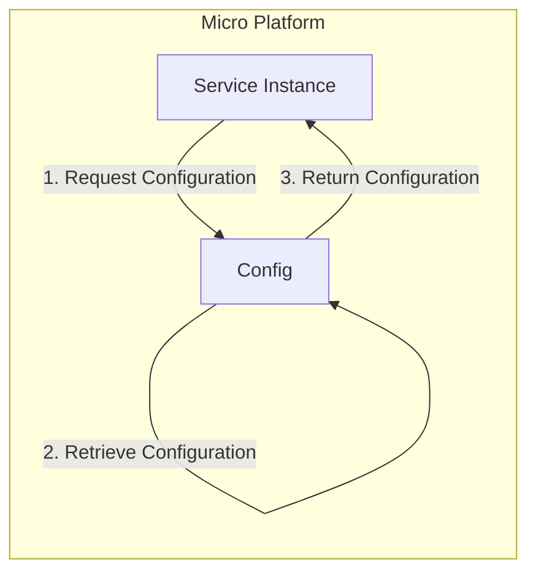

# Project Design Document: Micro Platform

**Version:** 1.1
**Date:** October 26, 2023
**Author:** AI Software Architect

## 1. Introduction

This document provides an enhanced design overview of the Micro platform, an open-source microservices development platform. This document aims to clearly articulate the system's architecture, components, and data flow, serving as a robust foundation for subsequent threat modeling activities. The design is based on the information available in the project's GitHub repository: [https://github.com/micro/micro](https://github.com/micro/micro).

## 2. Goals

*   Provide a comprehensive and detailed architectural overview of the Micro platform.
*   Clearly define the roles, responsibilities, and key functionalities of each core component.
*   Illustrate the key data flows within the system with enhanced clarity.
*   Identify potential areas of security concern with more specific examples for future threat modeling.

## 3. System Architecture

The Micro platform follows a microservices architecture, providing a suite of tools and services to build, deploy, and manage microservices. The core components interact to facilitate service discovery, communication, configuration, authentication, and lifecycle management.

### 3.1. Core Components

*   **API Gateway ("API Gateway"):** The intelligent entry point for all external requests targeting the microservices.
    *   **Responsibilities:** Request routing, load balancing, authentication, authorization, TLS termination, request transformation, and potentially rate limiting, circuit breaking, and observability.
    *   **Functionalities:**  Receives client requests, identifies the target service, authenticates and authorizes the request, and forwards it to an appropriate service instance.
*   **Service Registry ("Service Registry"):**  A distributed database that maintains a real-time inventory of available service instances and their network locations.
    *   **Responsibilities:** Service registration, deregistration, health checking, and providing service discovery information to clients.
    *   **Functionalities:** Allows service instances to register their availability, monitors their health, and provides APIs for other components to query for available service endpoints.
*   **Broker ("Broker"):**  An asynchronous messaging system enabling decoupled communication between services using a publish/subscribe pattern.
    *   **Responsibilities:** Message routing, delivery guarantees (depending on the implementation), and message persistence (optional).
    *   **Functionalities:**  Receives messages published by services, routes them to interested subscribers based on topics, and ensures reliable delivery.
*   **Config ("Config"):**  A centralized configuration management service that allows services to retrieve and dynamically update their configuration settings.
    *   **Responsibilities:** Storing, managing, and providing configuration data to services. Supporting different configuration sources and formats.
    *   **Functionalities:** Provides an API for services to request their configuration, supports versioning and rollback of configurations, and can push configuration updates to services.
*   **Auth ("Auth"):**  Provides authentication and authorization capabilities for both external clients and internal services.
    *   **Responsibilities:** User management, authentication (verifying identity), authorization (granting access), token issuance and verification, and policy enforcement.
    *   **Functionalities:**  Authenticates users and services, issues access tokens (e.g., JWT), verifies the validity of tokens, and enforces access control policies based on roles or permissions.
*   **Runtime ("Runtime"):**  Manages the lifecycle of service instances, including deployment, scaling, updates, and health monitoring.
    *   **Responsibilities:** Deploying new service instances, scaling existing instances based on demand, performing rolling updates, and monitoring service health.
    *   **Functionalities:** Interacts with underlying infrastructure (e.g., container orchestrators) to manage the deployment and scaling of services.
*   **CLI ("CLI"):**  A command-line interface for developers and operators to interact with and manage the Micro platform.
    *   **Responsibilities:** Providing commands for service management (e.g., deploy, scale, restart), viewing logs, inspecting service status, and managing platform configurations.
    *   **Functionalities:**  Offers a set of commands to interact with the various components of the Micro platform, simplifying management tasks.
*   **Service Instance ("Service Instance"):**  An individual running instance of a microservice built using the Micro framework.
    *   **Responsibilities:**  Implementing specific business logic, registering with the Service Registry, communicating with other services, and reporting health status.
    *   **Functionalities:**  Receives requests, processes them according to its business logic, and interacts with other platform components for service discovery, configuration, and communication.

## 4. Data Flow

This section describes the typical data flows within the Micro platform with more detail.

### 4.1. Client Request to Service

1. The **Client Application** sends a request (e.g., HTTP) to the **API Gateway**.
2. The **API Gateway** analyzes the request (e.g., path, headers) to identify the target service.
3. The **API Gateway** queries the **Service Registry** to find the network location(s) of available instances of the target service.
4. The **Service Registry** returns the network address(es) of the available **Service Instance(s)**.
5. The **API Gateway** selects an appropriate **Service Instance** (potentially using load balancing algorithms) and forwards the request.
6. The selected **Service Instance** processes the request based on its business logic.
7. The **Service Instance** sends a response back to the **API Gateway**.
8. The **API Gateway** forwards the response back to the **Client Application**.

### 4.2. Service Registration

1. A **Service Instance** starts up and sends a registration request to the **Service Registry**, including its name, version, endpoints, health check information, and metadata.
2. The **Service Registry** receives the registration request and stores the service's information in its registry.
3. The **Service Registry** sends an acknowledgment back to the **Service Instance**, confirming successful registration.

### 4.3. Inter-Service Communication (Synchronous)

1. **Service Instance A** needs to communicate synchronously with **Service Instance B**.
2. **Service Instance A** queries the **Service Registry** for the network location(s) of **Service Instance B**.
3. The **Service Registry** returns the network address(es) of **Service Instance B**.
4. **Service Instance A** sends a request directly to **Service Instance B** (typically using HTTP or gRPC).
5. **Service Instance B** processes the request and sends a response back to **Service Instance A**.

### 4.4. Inter-Service Communication (Asynchronous)

1. **Service Instance A** wants to asynchronously notify other services about an event.
2. **Service Instance A** publishes a message to a specific topic on the **Broker**.
3. The **Broker** receives the message and routes it to all **Service Instance(s)** that have subscribed to that topic (e.g., **Service Instance B**). **Service Instance B** then receives the message.

### 4.5. Configuration Retrieval

1. A **Service Instance** needs its configuration settings, typically during startup or when configuration changes are detected.
2. The **Service Instance** sends a request to the **Config** service, identifying itself and the configuration it needs.
3. The **Config** service retrieves the relevant configuration from its storage.
4. The **Config** service returns the configuration data to the requesting **Service Instance**.

## 5. Security Considerations

This section outlines potential security considerations for the Micro platform, providing more specific examples. These areas will be further explored during threat modeling.

*   **API Gateway Security:**
    *   **Threats:** Unauthorized access, credential stuffing, brute-force attacks, injection attacks (SQLi, XSS), DDoS attacks.
    *   **Mitigations:** Strong authentication mechanisms (e.g., OAuth 2.0, OpenID Connect), input validation, rate limiting, Web Application Firewall (WAF), TLS encryption.
*   **Service-to-Service Authentication and Authorization:**
    *   **Threats:** Service impersonation, unauthorized access to internal APIs, data breaches.
    *   **Mitigations:** Mutual TLS (mTLS), JWT-based authentication and authorization, API keys with proper rotation, network segmentation.
*   **Service Registry Security:**
    *   **Threats:** Unauthorized registration or deregistration of services, tampering with service metadata, information disclosure.
    *   **Mitigations:** Access control lists (ACLs), authentication for registry access, encryption of sensitive data at rest and in transit.
*   **Broker Security:**
    *   **Threats:** Message interception, message tampering, unauthorized publishing or subscribing, denial of service.
    *   **Mitigations:** TLS encryption for message transport, authentication and authorization for topic access, message signing and verification.
*   **Config Security:**
    *   **Threats:** Exposure of sensitive configuration data (e.g., database credentials, API keys), unauthorized modification of configurations.
    *   **Mitigations:** Encryption of configuration data at rest and in transit, access control for configuration retrieval and modification, secrets management solutions (e.g., HashiCorp Vault).
*   **Auth Service Security:**
    *   **Threats:** Credential compromise, account takeover, privilege escalation, insecure password storage.
    *   **Mitigations:** Strong password policies, multi-factor authentication (MFA), secure password hashing algorithms, protection against common authentication vulnerabilities.
*   **Runtime Security:**
    *   **Threats:** Container vulnerabilities, insecure container configurations, compromised container images, unauthorized access to the underlying infrastructure.
    *   **Mitigations:** Regular security scanning of container images, principle of least privilege for container execution, secure container orchestration platform configuration, network policies.
*   **CLI Security:**
    *   **Threats:** Credential compromise for administrative access, unauthorized execution of management commands.
    *   **Mitigations:** Strong authentication for CLI access, role-based access control (RBAC) for command authorization, audit logging of CLI actions.
*   **Data in Transit:**
    *   **Threats:** Eavesdropping, man-in-the-middle attacks.
    *   **Mitigations:** Enforce TLS encryption for all communication between components and with external clients.
*   **Data at Rest:**
    *   **Threats:** Unauthorized access to stored data.
    *   **Mitigations:** Encryption of sensitive data stored by platform components (e.g., in the Config service, Auth service).
*   **Input Validation:**
    *   **Threats:** Injection attacks, data corruption.
    *   **Mitigations:** Implement robust input validation and sanitization in all components, especially the API Gateway and service endpoints.
*   **Logging and Auditing:**
    *   **Threats:** Lack of visibility into security incidents, difficulty in forensic analysis.
    *   **Mitigations:** Implement comprehensive logging of security-relevant events, secure storage and management of logs, regular security audits.
*   **Secrets Management:**
    *   **Threats:** Hardcoded secrets, secrets stored in insecure locations.
    *   **Mitigations:** Utilize dedicated secrets management solutions to securely store and access sensitive credentials.

## 6. Deployment Considerations

The security of the Micro platform is significantly influenced by its deployment environment.

*   **Containers (Docker):**  Requires secure container image management, vulnerability scanning, and proper resource isolation.
*   **Orchestration Platforms (Kubernetes):**  Security considerations include network policies, RBAC, secrets management, and secure node configuration.
*   **Cloud Platforms (AWS, GCP, Azure):**  Leveraging cloud-specific security services (e.g., IAM, security groups, KMS) is crucial. Misconfigurations in cloud deployments can introduce significant vulnerabilities.
*   **On-Premise:** Requires careful attention to network security, physical security, and infrastructure hardening.

## 7. Future Considerations

*   **Enhanced Service Mesh Integration:**  Exploring deeper integration with service mesh technologies like Istio or Linkerd to leverage features like automatic mTLS, advanced traffic management, and enhanced observability.
*   **Improved Observability and Security Monitoring:** Implementing more sophisticated monitoring and tracing capabilities, integrated with Security Information and Event Management (SIEM) systems for proactive threat detection and response.
*   **Policy-Based Access Control (PBAC):**  Moving towards more granular and dynamic access control mechanisms based on attributes and policies rather than just roles.
*   **Federated Identity Management:** Supporting integration with external identity providers for seamless authentication and authorization across different systems.
*   **Formal Security Audits and Penetration Testing:**  Regularly conducting security assessments to identify and address potential vulnerabilities.

This enhanced document provides a more detailed understanding of the Micro platform's architecture, data flow, and security considerations. This information will be invaluable for conducting a comprehensive threat model to identify and mitigate potential security risks effectively.