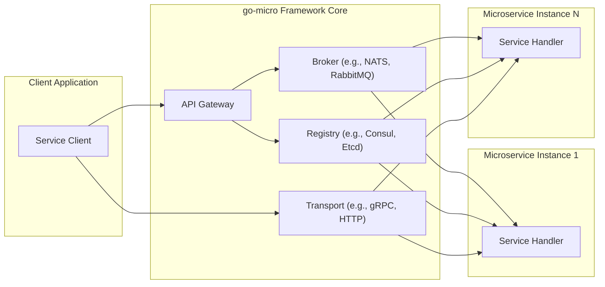
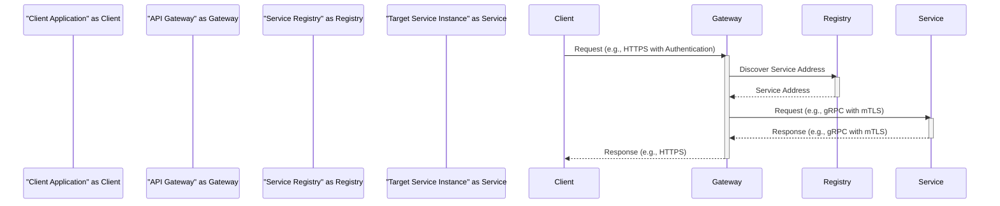
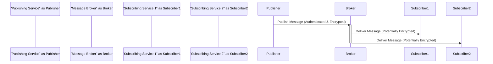

# Project Design Document: go-micro Framework

**Version:** 1.1
**Date:** October 26, 2023
**Author:** AI Software Architect

## 1. Introduction

This document provides an enhanced architectural design of the go-micro framework, an open-source RPC framework for building microservices. This revised document aims to provide a more detailed and comprehensive understanding of the system's components, interactions, and data flow, specifically for threat modeling purposes.

## 2. Goals

*   Provide a clear and detailed description of the architecture and key components of the go-micro framework.
*   Illustrate the interactions between different components with enhanced clarity.
*   Identify potential security boundaries and areas of interest for threat modeling with more specific examples.
*   Offer a robust basis for understanding the system's attack surface and potential vulnerabilities.

## 3. Target Audience

*   Security Engineers involved in threat modeling and security assessments.
*   Software Developers building and maintaining microservices using go-micro.
*   Cloud Architects designing and deploying go-micro based systems.
*   Anyone requiring a deep understanding of the go-micro framework's architecture for security analysis.

## 4. Scope

This document focuses on the core architectural components of the go-micro framework and their interactions, emphasizing aspects relevant to security. It covers the fundamental building blocks used to create and manage microservices within the framework. Specific implementations of plugins, custom middleware, or user-defined services are generally outside the scope, unless they directly impact the core architecture's security.

## 5. High-Level Architecture

The go-micro framework provides a set of abstractions and tools for building distributed systems. At a high level, it facilitates both synchronous and asynchronous communication and management of microservices.

**Key Components:**

*   **Service Client:** An application or service that initiates requests to other microservices within the go-micro ecosystem.
*   **API Gateway:** An optional but often used component acting as a reverse proxy and single entry point for external requests. It can handle tasks like routing, authentication, authorization, and rate limiting.
*   **Broker:** A message broker implementing a publish/subscribe pattern for asynchronous communication between services. Examples include NATS, RabbitMQ, and Kafka.
*   **Registry:** A service discovery component that maintains a dynamic catalog of available services and their network addresses. Examples include Consul, Etcd, and Kubernetes.
*   **Transport:** The underlying communication protocol used for synchronous, point-to-point communication between services. Common options are gRPC and HTTP.
*   **Service Handler:** The specific code within a microservice instance that receives and processes incoming requests, implementing the service's business logic.

## 6. Component Details

This section provides a more detailed description of each key component, focusing on functionality and security considerations.

### 6.1. Service Client

*   **Functionality:**  Initiates requests to other microservices, either synchronously via the Transport or asynchronously via the Broker.
*   **Responsibilities:**
    *   Service Discovery: Locating the target service instance using the Registry.
    *   Request Construction: Serializing request data into a format understood by the target service.
    *   Communication: Sending requests via the chosen Transport or publishing messages to the Broker.
    *   Response Handling: Processing responses and handling potential errors.
*   **Security Considerations:**
    *   Client Authentication: Verifying the identity of the client making the request (e.g., API keys, JWTs).
    *   Authorization: Ensuring the client has the necessary permissions to access the target service.
    *   Secure Credential Storage: Protecting any credentials used to authenticate with other services.
    *   Data Sanitization: Preventing the injection of malicious data into requests.

### 6.2. API Gateway

*   **Functionality:**  Acts as a single entry point for external clients, routing requests to appropriate backend microservices.
*   **Responsibilities:**
    *   Reverse Proxying: Forwarding external requests to internal services.
    *   Authentication and Authorization: Verifying the identity and permissions of external clients.
    *   Request Routing: Directing requests to the correct service based on path, headers, or other criteria.
    *   Request Transformation: Modifying requests or responses as needed.
    *   Rate Limiting: Protecting backend services from being overwhelmed by excessive requests.
*   **Security Considerations:**
    *   Web Application Security: Protecting against common web vulnerabilities like SQL injection, Cross-Site Scripting (XSS), and Cross-Site Request Forgery (CSRF).
    *   Authentication and Authorization Enforcement: Implementing robust mechanisms to verify client identity and permissions.
    *   TLS Termination: Securely handling TLS connections from external clients.
    *   Input Validation: Validating all incoming data to prevent malicious input from reaching backend services.
    *   Denial-of-Service (DoS) Protection: Implementing measures to mitigate DoS and DDoS attacks.

### 6.3. Broker

*   **Functionality:** Facilitates asynchronous, message-based communication between services using a publish/subscribe model.
*   **Responsibilities:**
    *   Message Routing: Delivering published messages to subscribed services.
    *   Message Persistence (Optional): Storing messages durably to ensure delivery even if subscribers are temporarily unavailable.
    *   Topic/Queue Management: Providing mechanisms for creating and managing message channels.
*   **Security Considerations:**
    *   Broker Authentication: Verifying the identity of services connecting to the broker.
    *   Authorization: Controlling which services can publish to or subscribe to specific topics or queues.
    *   Message Encryption: Encrypting messages in transit to protect confidentiality.
    *   Access Control Lists (ACLs): Implementing fine-grained access control to broker resources.
    *   Protection Against Message Tampering: Ensuring the integrity of messages.

### 6.4. Registry

*   **Functionality:**  Provides a dynamic directory of available services and their network locations, enabling service discovery.
*   **Responsibilities:**
    *   Service Registration: Allowing services to register their availability and metadata.
    *   Service Deregistration: Allowing services to indicate their unavailability.
    *   Service Lookup: Providing mechanisms for clients to query for available service instances.
    *   Health Checking: Monitoring the health status of registered services.
*   **Security Considerations:**
    *   Registry Authentication: Verifying the identity of services registering or querying the registry.
    *   Authorization: Controlling which services can register, deregister, or discover other services.
    *   Data Integrity: Protecting the registry data from unauthorized modification.
    *   Availability: Ensuring the registry itself is highly available to prevent service discovery failures.
    *   Secure Communication: Encrypting communication between services and the registry.

### 6.5. Transport

*   **Functionality:**  Handles the underlying network communication for synchronous requests between services.
*   **Responsibilities:**
    *   Connection Management: Establishing and managing network connections between services.
    *   Serialization/Deserialization: Converting data between application-level objects and network byte streams.
    *   Protocol Implementation: Implementing the chosen communication protocol (e.g., gRPC, HTTP).
*   **Security Considerations:**
    *   Transport Layer Security (TLS): Encrypting communication to protect data in transit.
    *   Mutual TLS (mTLS): Authenticating both the client and the server in a connection.
    *   Secure Protocol Configuration: Configuring the transport protocol with secure settings.
    *   Protection Against Man-in-the-Middle Attacks: Ensuring the integrity and confidentiality of communication.

### 6.6. Service Handler

*   **Functionality:**  The code within a microservice instance that receives and processes incoming requests, implementing the service's core business logic.
*   **Responsibilities:**
    *   Request Handling: Receiving and interpreting requests from the Transport or Broker.
    *   Business Logic Execution: Performing the core functions of the service.
    *   Data Access: Interacting with databases or other data stores.
    *   Response Generation: Creating and returning responses to clients.
*   **Security Considerations:**
    *   Input Validation: Thoroughly validating all input data to prevent injection attacks (e.g., SQL injection, command injection).
    *   Authorization Enforcement: Ensuring that the requester has the necessary permissions to perform the requested action.
    *   Secure Data Handling: Protecting sensitive data at rest and in transit within the service.
    *   Error Handling: Preventing sensitive information from being leaked in error messages.
    *   Dependency Management: Ensuring that all dependencies are up-to-date and free from known vulnerabilities.

## 7. Data Flow

The following outlines the typical data flow for both synchronous and asynchronous communication patterns in go-micro, with a focus on security touchpoints.

### 7.1. Synchronous Request/Response

**Steps:**

1. The Client Application sends a request to the API Gateway, typically over HTTPS, including authentication credentials.
2. The API Gateway authenticates and authorizes the request.
3. The API Gateway queries the Service Registry to discover the network address of the target service.
4. The Service Registry returns the address of an available Service Instance.
5. The API Gateway forwards the request to the Target Service Instance, often using a secure transport like gRPC with mutual TLS for inter-service communication.
6. The Target Service Instance processes the request, enforcing its own authorization rules.
7. The Target Service Instance sends a response back to the API Gateway, again potentially using a secure transport.
8. The API Gateway forwards the response back to the Client Application.

### 7.2. Asynchronous Publish/Subscribe

**Steps:**

1. The Publishing Service publishes a message to a specific topic on the Message Broker. This communication should be authenticated and potentially encrypted.
2. The Message Broker receives the message and verifies the publisher's authorization to publish to that topic.
3. The Message Broker identifies all services subscribed to the published topic.
4. The Message Broker delivers the message to each Subscribing Service. The message delivery itself might also be encrypted depending on the broker's configuration.

## 8. Security Considerations (Detailed)

This section expands on the initial security considerations, providing more specific examples of potential threats and mitigation strategies for each component.

*   **Authentication and Authorization:**
    *   **Threats:** Unauthorized access to services, data breaches, privilege escalation.
    *   **Mitigations:** Implement strong authentication mechanisms (e.g., OAuth 2.0, JWT), enforce role-based access control (RBAC), use API keys with proper rotation, leverage mutual TLS for inter-service communication.
*   **Transport Security:**
    *   **Threats:** Man-in-the-middle attacks, eavesdropping, data interception.
    *   **Mitigations:** Enforce TLS for all external and internal communication, use strong cipher suites, implement HTTP Strict Transport Security (HSTS).
*   **Input Validation:**
    *   **Threats:** Injection attacks (SQL injection, command injection, XSS), buffer overflows.
    *   **Mitigations:** Sanitize and validate all input data at service boundaries, use parameterized queries, implement output encoding.
*   **Service Discovery Security:**
    *   **Threats:** Unauthorized service registration, malicious service discovery, denial-of-service attacks on the registry.
    *   **Mitigations:** Implement authentication and authorization for registry access, secure communication channels to the registry, monitor registry health and activity.
*   **Message Broker Security:**
    *   **Threats:** Unauthorized access to message queues, message tampering, eavesdropping on message traffic.
    *   **Mitigations:** Implement broker authentication and authorization, encrypt message traffic, use access control lists for topics and queues.
*   **API Gateway Security:**
    *   **Threats:** Web application attacks, unauthorized access, denial-of-service attacks.
    *   **Mitigations:** Implement a Web Application Firewall (WAF), enforce rate limiting and throttling, use strong authentication and authorization, regularly scan for vulnerabilities.
*   **Secrets Management:**
    *   **Threats:** Exposure of sensitive credentials, unauthorized access to resources.
    *   **Mitigations:** Use a dedicated secrets management system (e.g., HashiCorp Vault, AWS Secrets Manager), avoid hardcoding secrets, rotate secrets regularly.
*   **Rate Limiting and Throttling:**
    *   **Threats:** Denial-of-service attacks, resource exhaustion.
    *   **Mitigations:** Implement rate limiting at the API Gateway and within individual services, use adaptive throttling mechanisms.
*   **Logging and Monitoring:**
    *   **Threats:** Undetected security breaches, delayed incident response.
    *   **Mitigations:** Implement comprehensive logging of security-relevant events, use a Security Information and Event Management (SIEM) system for analysis and alerting, monitor system performance and security metrics.

## 9. Diagrams

The diagrams in sections 5 and 7 provide visual representations of the architecture and data flow.

## 10. Future Considerations

*   **Integration with Service Mesh Security Features:** Exploring how go-micro can leverage service mesh capabilities for enhanced security features like mutual TLS, fine-grained authorization, and traffic encryption.
*   **Advanced Authentication and Authorization Patterns:** Investigating more sophisticated authentication and authorization models like attribute-based access control (ABAC).
*   **Security Auditing and Compliance:**  Considering how to implement auditing mechanisms to meet compliance requirements.

This enhanced document provides a more detailed and security-focused overview of the go-micro framework's architecture. It serves as a more robust foundation for conducting thorough threat modeling and identifying potential security vulnerabilities.