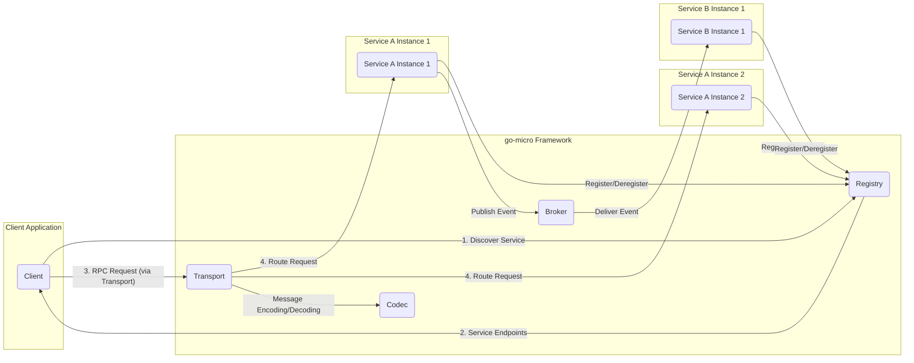
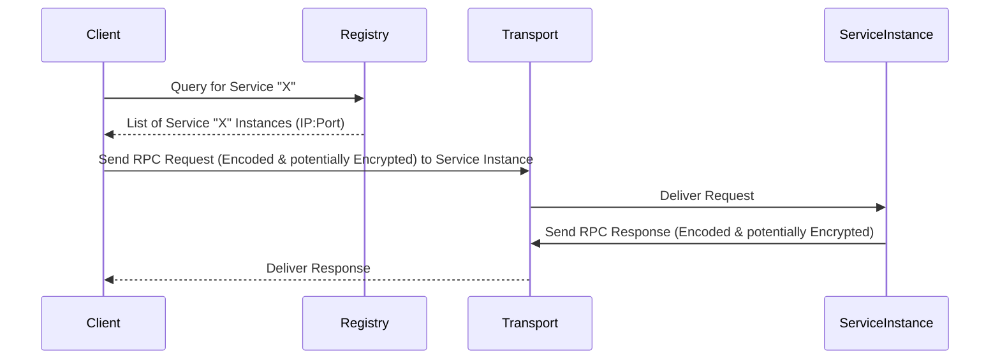
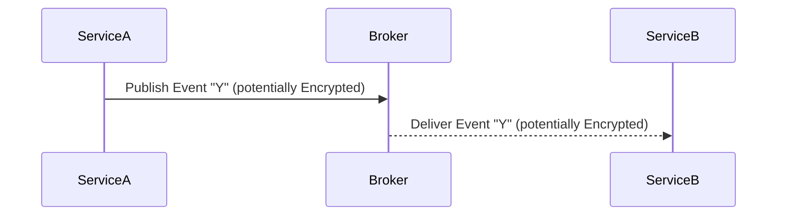

# Project Design Document: go-micro Framework - Enhanced

**Version:** 1.1
**Date:** October 26, 2023
**Author:** AI Software Architect

## 1. Introduction

This document provides an enhanced architectural design of the go-micro framework, a distributed systems development framework. This refined document builds upon the previous version and aims to provide even greater clarity and detail, specifically for threat modeling purposes. It outlines the key components, their interactions, data flow, and security considerations, incorporating more specific examples and potential vulnerabilities.

## 2. Goals

*   Provide a clear, comprehensive, and more detailed overview of the go-micro framework's architecture.
*   Elaborate on the responsibilities and internal workings of key components.
*   Illustrate the typical data flow within a go-micro based system with an emphasis on security boundaries.
*   Highlight potential security considerations, providing more specific examples of threats and vulnerabilities.
*   Serve as a robust and detailed basis for conducting a thorough threat model of the framework and applications built upon it.

## 3. Architectural Overview

go-micro facilitates the development of microservices by abstracting away complexities related to distributed systems. It offers features like service discovery, load balancing, message passing, and RPC through a set of well-defined interfaces and implementations.

### 3.1. High-Level Architecture Diagram

### 3.2. Key Components

*   **Client:** An application (internal or external) that initiates requests to services. It leverages the go-micro client library for service discovery and communication.
*   **Service:** An independent, deployable application unit encapsulating specific business logic. It exposes an API, registers with the Registry, and can interact with the Broker.
*   **Registry:** A distributed database responsible for maintaining a dynamic list of available service instances and their network locations. It enables clients to discover service endpoints.
*   **Broker:** An asynchronous messaging system facilitating decoupled communication between services. It uses a publish/subscribe pattern for event-driven architectures.
*   **Transport:** The underlying mechanism for synchronous, point-to-point communication (typically RPC) between services. It handles connection management and message delivery.
*   **Codec:** Responsible for serializing and deserializing messages exchanged between services, ensuring interoperability across different languages and platforms.

## 4. Detailed Component Description

### 4.1. Client

*   **Functionality:**
    *   Discovers service endpoints by querying the Registry.
    *   Initiates synchronous requests to services via the Transport.
    *   Potentially subscribes to events via the Broker (if acting as a consumer).
    *   Handles retries, timeouts, and load balancing based on the discovered service instances.
*   **Security Considerations:**
    *   **Authentication:** How does the Client authenticate itself to the services it calls? (e.g., API keys, OAuth tokens).
    *   **Authorization:** What permissions does the Client have to access specific service endpoints?
    *   **Credential Management:** Secure storage and handling of client-side credentials.
    *   **Request Forgery:** Protection against the Client being tricked into making unauthorized requests.
    *   **Input Sanitization:**  If the client takes user input, it must be sanitized before being included in requests to prevent injection attacks on the services.

### 4.2. Service

*   **Functionality:**
    *   Implements core business logic.
    *   Registers its availability (address, metadata) with the Registry upon startup.
    *   Handles incoming synchronous requests via the Transport.
    *   Can publish events to the Broker to notify other services of state changes.
    *   Can subscribe to events from the Broker to react to events published by other services.
*   **Security Considerations:**
    *   **Authentication:** How does the Service authenticate incoming requests? (e.g., verifying JWTs, API keys).
    *   **Authorization:** Enforcing access control policies to ensure only authorized clients can access specific endpoints.
    *   **Input Validation:** Rigorous validation of all incoming data to prevent injection vulnerabilities (SQL, command injection, etc.).
    *   **Data Sanitization:** Sanitizing data before processing or storing to prevent cross-site scripting (XSS) or other vulnerabilities.
    *   **Error Handling:**  Preventing sensitive information leakage through error messages.
    *   **Rate Limiting:** Protecting against denial-of-service attacks by limiting the number of requests from a single source.
    *   **Secure Configuration:**  Properly configuring security settings, such as TLS certificates and authentication mechanisms.

### 4.3. Registry

*   **Functionality:**
    *   Provides a central repository for service registration and discovery.
    *   Maintains an up-to-date list of available service instances and their network addresses.
    *   Allows clients to query for service endpoints based on service names.
    *   Typically employs a distributed consensus mechanism for high availability and data consistency.
*   **Security Considerations:**
    *   **Authentication:** How are services and clients authenticated when interacting with the Registry?
    *   **Authorization:** Who is authorized to register, deregister, and query service information?
    *   **Data Integrity:** Protecting the registry data from unauthorized modification or deletion.
    *   **Availability:** Ensuring the registry is highly available to prevent service discovery failures.
    *   **Secure Communication:** Encrypting communication between services/clients and the Registry (e.g., using TLS).
    *   **Access Control:** Implementing access control lists (ACLs) to restrict access to registry data.

### 4.4. Broker

*   **Functionality:**
    *   Facilitates asynchronous message passing between services using a publish/subscribe model.
    *   Provides message durability and delivery guarantees (depending on the specific broker implementation).
    *   Allows services to communicate without direct knowledge of each other's location or availability.
*   **Security Considerations:**
    *   **Authentication:** How are publishers and subscribers authenticated when interacting with the Broker?
    *   **Authorization:** Who is authorized to publish to specific topics or subscribe to specific queues?
    *   **Message Confidentiality:** Encrypting messages in transit and at rest within the Broker.
    *   **Message Integrity:** Ensuring that messages are not tampered with during transit.
    *   **Access Control:** Implementing access control policies for topics and queues.
    *   **Broker Hardening:** Secure configuration and patching of the Broker infrastructure.

### 4.5. Transport

*   **Functionality:**
    *   Handles the low-level details of network communication for synchronous requests.
    *   Manages connections between clients and service instances.
    *   Provides mechanisms for message serialization and deserialization (often in conjunction with the Codec).
    *   Can support various protocols (e.g., gRPC, HTTP).
*   **Security Considerations:**
    *   **Encryption:** Enforcing encryption of data in transit using TLS/SSL.
    *   **Mutual Authentication (mTLS):** Authenticating both the client and the server to prevent impersonation.
    *   **Transport Layer Hardening:** Configuring the transport layer to resist attacks like man-in-the-middle.
    *   **Protocol Vulnerabilities:** Staying up-to-date with security patches for the chosen transport protocol.

### 4.6. Codec

*   **Functionality:**
    *   Defines the format in which messages are encoded for transmission and decoded upon receipt.
    *   Ensures interoperability between services potentially written in different programming languages.
    *   Common codecs include Protocol Buffers, JSON, and others.
*   **Security Considerations:**
    *   **Deserialization Vulnerabilities:**  Protecting against vulnerabilities arising from insecure deserialization of data, which can lead to remote code execution.
    *   **Data Integrity:** Ensuring that the encoding and decoding process does not introduce data corruption.
    *   **Codec-Specific Vulnerabilities:** Staying informed about and mitigating known vulnerabilities in the chosen codec library.

## 5. Data Flow

### 5.1. Service Discovery and Synchronous Request

### 5.2. Asynchronous Event Communication

## 6. Security Considerations

This section expands on the security considerations, providing more specific examples and potential threats.

### 6.1. Authentication and Authorization

*   **Threats:**
    *   **Unauthorized Access:** Attackers gaining access to services or data without proper authentication.
    *   **Privilege Escalation:**  Legitimate users gaining access to resources beyond their authorized scope.
    *   **Impersonation:** An attacker pretending to be a legitimate service or client.
*   **Mitigation:**
    *   Implement strong authentication mechanisms (e.g., OAuth 2.0, mTLS, API keys).
    *   Enforce granular authorization policies using RBAC or ABAC.
    *   Regularly review and update access control lists.

### 6.2. Data in Transit Protection

*   **Threats:**
    *   **Eavesdropping:** Attackers intercepting communication and gaining access to sensitive data.
    *   **Man-in-the-Middle (MITM) Attacks:** Attackers intercepting and potentially manipulating communication between services or clients.
*   **Mitigation:**
    *   Enforce TLS/SSL for all communication between components.
    *   Use strong cipher suites.
    *   Implement certificate pinning for enhanced security.

### 6.3. Data at Rest Protection

*   **Threats:**
    *   **Data Breaches:** Unauthorized access to stored data.
    *   **Compromised Backups:**  Attackers gaining access to sensitive data stored in backups.
*   **Mitigation:**
    *   Encrypt sensitive data at rest in databases and other storage systems.
    *   Securely manage encryption keys.
    *   Implement strict access controls for data storage systems.

### 6.4. Input Validation

*   **Threats:**
    *   **Injection Attacks:** SQL injection, command injection, cross-site scripting (XSS).
    *   **Buffer Overflows:**  Caused by processing unexpectedly large inputs.
*   **Mitigation:**
    *   Validate all input data against expected formats and ranges.
    *   Sanitize input data before processing or storing.
    *   Use parameterized queries to prevent SQL injection.

### 6.5. Dependency Management

*   **Threats:**
    *   **Vulnerable Dependencies:** Using libraries with known security vulnerabilities.
    *   **Supply Chain Attacks:**  Malicious code injected into dependencies.
*   **Mitigation:**
    *   Use dependency management tools to track and manage dependencies.
    *   Regularly scan dependencies for vulnerabilities.
    *   Use trusted repositories for dependencies.

### 6.6. Rate Limiting and Denial of Service (DoS) Protection

*   **Threats:**
    *   **Service Outages:**  Services becoming unavailable due to excessive requests.
    *   **Resource Exhaustion:**  Services consuming excessive resources, impacting performance.
*   **Mitigation:**
    *   Implement rate limiting at the API gateway or service level.
    *   Use techniques like throttling and request queuing.

### 6.7. Logging and Monitoring

*   **Threats:**
    *   **Lack of Visibility:** Inability to detect and respond to security incidents.
    *   **Data Tampering:**  Logs being altered to hide malicious activity.
*   **Mitigation:**
    *   Implement comprehensive logging of security-related events.
    *   Use a centralized logging system with secure storage.
    *   Implement monitoring and alerting for suspicious activity.

### 6.8. Registry Security

*   **Threats:**
    *   **Service Discovery Manipulation:** Attackers registering malicious service instances.
    *   **Information Disclosure:** Unauthorized access to service metadata.
*   **Mitigation:**
    *   Secure access to the registry with strong authentication and authorization.
    *   Implement mechanisms to verify the identity of services registering with the registry.

### 6.9. Broker Security

*   **Threats:**
    *   **Message Tampering:**  Attackers modifying messages in transit.
    *   **Unauthorized Access to Messages:** Attackers reading sensitive messages.
*   **Mitigation:**
    *   Enforce authentication and authorization for publishers and subscribers.
    *   Encrypt messages in transit and at rest within the broker.

### 6.10. Codec Security

*   **Threats:**
    *   **Deserialization of Untrusted Data:** Leading to remote code execution.
*   **Mitigation:**
    *   Avoid deserializing untrusted data.
    *   Use secure serialization libraries and keep them updated.

## 7. Assumptions

*   The go-micro framework is the primary architecture for building microservices.
*   Services are deployed as independent, network-accessible units.
*   A dedicated Registry service is utilized for service discovery.
*   A dedicated Broker service is used for asynchronous communication.
*   A well-defined Transport mechanism is in place for synchronous communication.

## 8. Out of Scope

*   Specific implementation details within individual microservices (e.g., internal database schema, business logic details).
*   The underlying infrastructure and operating system security configurations.
*   Detailed configuration of third-party Registry and Broker services beyond their interaction with go-micro.

## 9. Future Considerations

*   Integration with security policy enforcement points (e.g., service mesh).
*   Standardized security middleware or interceptors for common security concerns.
*   Automated security testing frameworks specifically tailored for go-micro applications.
*   Consideration of confidential computing techniques for sensitive data processing.

This enhanced document provides a more detailed and security-focused view of the go-micro framework architecture. It serves as a more robust foundation for conducting thorough threat modeling exercises and identifying potential security vulnerabilities.
