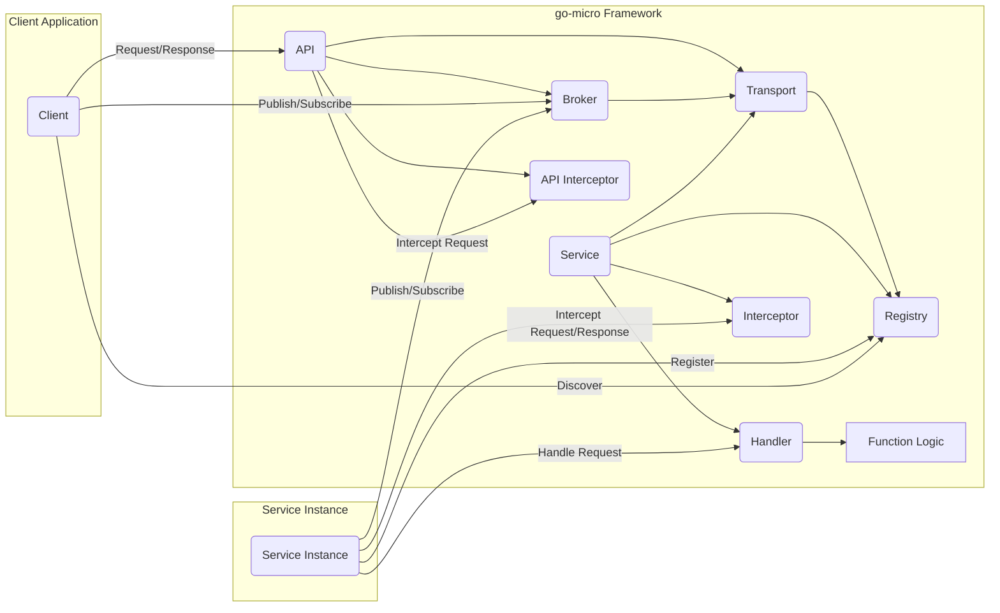
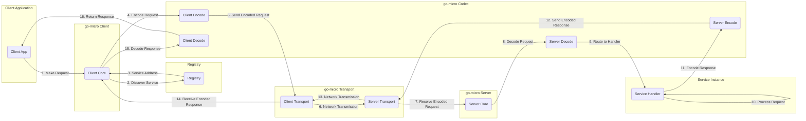
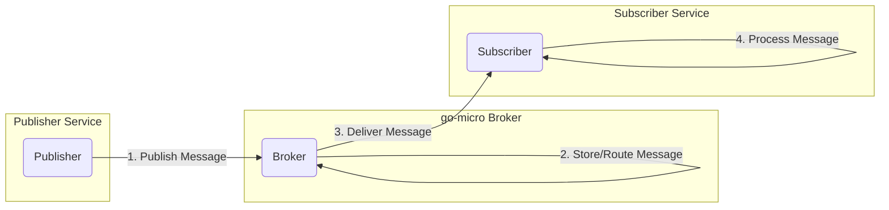

## Project Design Document: go-micro

**Version:** 1.1
**Date:** October 26, 2023
**Author:** AI Software Architect

### 1. Introduction

This document provides an enhanced architectural design of the go-micro project, a pluggable microservice framework in Go. This revised document offers a more detailed understanding of the system's components, their interactions, and the flow of data, specifically tailored for effective threat modeling. We aim to provide a granular view of the system to facilitate the identification of potential vulnerabilities.

### 2. Goals and Objectives

The primary goals of go-micro are to:

* Simplify the development of microservices by providing a comprehensive set of tools and abstractions.
* Offer essential building blocks for distributed systems, including service discovery, communication, and observability.
* Provide a highly pluggable architecture, allowing developers to customize and extend the framework with their preferred technologies.
* Promote best practices for microservice development, such as loose coupling and independent deployability.

### 3. High-Level Architecture

go-micro employs a client-server architecture with a central registry for service discovery and relies on pluggable components for various functionalities.

**Key Actors and Components:**

* **Client:** An application that consumes services provided by go-micro services. This could be another microservice or an external application.
* **API (`go-micro/api`):** The primary interface for interacting with the go-micro framework. It handles request routing, service discovery lookups, and acts as a gateway.
* **Broker (`go-micro/broker`):** An asynchronous message broker (e.g., NATS, RabbitMQ, Kafka) facilitating publish/subscribe communication between services.
* **Registry (`go-micro/registry`):** A service discovery mechanism (e.g., Consul, etcd, Kubernetes) responsible for maintaining a directory of available services and their network locations.
* **Transport (`go-micro/transport`):** The underlying communication protocol used for synchronous communication between services (e.g., gRPC, HTTP).
* **Service (`go-micro/service`):** A deployable unit of functionality built using the go-micro framework, encapsulating specific business logic.
* **Handler (`go-micro/server`):** The specific function within a service that processes incoming requests.
* **Function Logic:** The core business logic implemented within a service handler.
* **Service Instance:** A running instance of a go-micro service. Multiple instances of the same service can exist for scalability and resilience.
* **Interceptor:** Middleware that can intercept and process requests and responses at various points in the communication flow (both on the client and server side).
* **API Interceptor:** Specific interceptors applied at the API gateway level for cross-cutting concerns.

### 4. Key Components and their Functionality

This section provides a more detailed breakdown of the core components of the go-micro framework and their responsibilities, emphasizing their interactions.

* **API (`go-micro/api`):**
    * Acts as the entry point for external requests targeting go-micro services.
    * Performs service discovery by querying the **Registry** to locate available service instances.
    * Routes incoming requests to the appropriate **Service** instance based on the discovered information.
    * Utilizes the **Transport** for sending synchronous requests.
    * Interacts with the **Broker** for publishing messages on behalf of clients.
    * Supports **API Interceptors** for tasks like authentication, authorization, logging, and rate limiting before requests reach the target service.

* **Broker (`go-micro/broker`):**
    * Provides an abstraction layer over various message broker implementations.
    * Enables services to publish messages to specific topics, which are then distributed to subscribed services.
    * Facilitates asynchronous communication patterns, decoupling services and improving resilience.
    * Relies on concrete broker implementations (e.g., NATS, RabbitMQ) for message persistence and delivery.

* **Registry (`go-micro/registry`):**
    * Maintains a dynamic list of available services and their network addresses.
    * Services register themselves with the **Registry** upon startup, providing information about their name, version, and endpoints.
    * The **API** and **Client** components query the **Registry** to discover the location of target services.
    * Supports various registry backends, allowing for flexibility in deployment environments.

* **Transport (`go-micro/transport`):**
    * Handles the low-level details of network communication between services for synchronous requests.
    * Encapsulates the chosen communication protocol (e.g., gRPC, HTTP).
    * Manages connection establishment, message serialization (often using a **Codec**), and error handling.
    * Provides an interface for sending and receiving messages between **Client** and **Server** components.

* **Codec (`go-micro/codec`):**
    * Responsible for encoding and decoding messages exchanged between services.
    * Ensures that data can be transmitted and understood by different services, potentially written in different languages.
    * Supports various encoding formats like Protobuf, JSON, and MessagePack.
    * Is utilized by the **Transport** layer for message serialization and deserialization.

* **Client (`go-micro/client`):**
    * Provides a programmatic interface for making requests to other go-micro services.
    * Performs service discovery by querying the **Registry**.
    * Abstracts away the complexities of the underlying **Transport** and **Codec**.
    * Implements client-side middleware (**Interceptors**) for tasks like logging, tracing, and retries.

* **Server (`go-micro/server`):**
    * Listens for incoming requests on a specified **Transport**.
    * Decodes incoming messages using the configured **Codec**.
    * Routes requests to the appropriate **Handler** based on the service and method name.
    * Executes server-side middleware (**Interceptors**) for tasks like authentication, authorization, and logging.
    * Registers the service with the **Registry** upon startup.

### 5. Data Flow

This section provides a more granular view of the data flow patterns within a go-micro system, highlighting key steps and components involved.

#### 5.1. Synchronous Request/Response Flow (Detailed)

**Steps:**

1. The client application initiates a request to a specific service through the go-micro client API.
2. The client core queries the **Registry** to discover the network address of available instances of the target service.
3. The **Registry** returns the address(es) of the service instance(s).
4. The client core encodes the request message using the configured **Codec**.
5. The encoded request is sent through the client-side **Transport**.
6. The request travels over the network.
7. The server-side **Transport** receives the encoded request.
8. The server core decodes the request message using the configured **Codec**.
9. The server core routes the decoded request to the appropriate **Handler**.
10. The service handler processes the request.
11. The service handler encodes the response message using the configured **Codec**.
12. The encoded response is sent through the server-side **Transport**.
13. The response travels over the network.
14. The client-side **Transport** receives the encoded response.
15. The client core decodes the response message using the configured **Codec**.
16. The client core returns the decoded response to the client application.

#### 5.2. Asynchronous Publish/Subscribe Flow (Detailed)

**Steps:**

1. A publisher service publishes a message to a specific topic through the go-micro broker API.
2. The **Broker** receives the message and stores it (depending on the broker implementation) and routes it to relevant subscribers.
3. The **Broker** delivers the message to all services that have subscribed to the specific topic.
4. The subscriber service receives the message and processes it.

### 6. Security Considerations

This section provides more specific security considerations for a go-micro based system, offering examples of potential threats.

* **Authentication and Authorization:**
    * **Threat:** Unauthorized clients or services could access sensitive endpoints or data.
    * **Considerations:** Implement robust authentication mechanisms (e.g., JWT, OAuth 2.0) for both clients and inter-service communication. Enforce authorization policies to control access based on roles or permissions. Consider using mTLS for secure inter-service communication.

* **Transport Security:**
    * **Threat:** Communication between services could be intercepted and eavesdropped upon (man-in-the-middle attacks).
    * **Considerations:** Enforce TLS encryption for all inter-service communication. Ensure proper certificate management and rotation.

* **Data Security:**
    * **Threat:** Sensitive data could be exposed if not properly handled.
    * **Considerations:** Encrypt sensitive data at rest and in transit. Implement secure data handling practices within services.

* **Input Validation:**
    * **Threat:** Malicious input could lead to vulnerabilities like injection attacks (e.g., SQL injection, command injection).
    * **Considerations:** Implement strict input validation and sanitization on all service endpoints.

* **Rate Limiting and Throttling:**
    * **Threat:** Services could be overwhelmed by excessive requests, leading to denial-of-service.
    * **Considerations:** Implement rate limiting and throttling mechanisms at the API gateway and service levels.

* **Service Discovery Security:**
    * **Threat:** Malicious actors could register rogue services or tamper with service discovery information, leading to misrouting of requests.
    * **Considerations:** Secure access to the service registry. Implement authentication and authorization for service registration.

* **Dependency Management:**
    * **Threat:** Vulnerabilities in third-party dependencies could be exploited.
    * **Considerations:** Regularly scan dependencies for known vulnerabilities and update them promptly.

* **Logging and Auditing:**
    * **Threat:** Lack of proper logging can hinder incident response and forensic analysis.
    * **Considerations:** Implement comprehensive logging of security-related events, including authentication attempts, authorization decisions, and access to sensitive data.

* **Secrets Management:**
    * **Threat:** Sensitive credentials stored insecurely could be compromised.
    * **Considerations:** Utilize secure secrets management solutions (e.g., HashiCorp Vault, cloud provider secrets managers) to store and manage sensitive credentials. Avoid hardcoding secrets in code.

### 7. Deployment Model

go-micro services are commonly deployed as containerized applications, often orchestrated by platforms like Kubernetes, enabling scalability and resilience.

* **Containerization (Docker):** Packaging go-micro services as Docker containers ensures consistent deployment environments and simplifies management.
* **Orchestration (Kubernetes):** Kubernetes provides features for automated deployment, scaling, and management of containerized go-micro services. This includes service discovery, load balancing, and health checks.
* **Service Mesh (Istio, Linkerd):** Integrating a service mesh can enhance security by providing features like mutual TLS, traffic management, and observability without requiring code changes in the go-micro services themselves.
* **Cloud Platforms (AWS, Google Cloud, Azure):** go-micro services can be readily deployed and managed on various cloud platforms, leveraging their managed services for infrastructure and security.
* **Deployment Patterns:** Common deployment patterns include deploying each service as a separate set of containers, potentially with multiple replicas for high availability.

### 8. Assumptions and Constraints

* **Pluggable Component Security:** The overall security of the system is heavily influenced by the security characteristics of the chosen implementations for transport, broker, registry, and codec. It is assumed that secure and well-maintained implementations are selected.
* **Underlying Infrastructure Security:** This design assumes that the underlying infrastructure (network, operating system, cloud platform) provides a secure foundation.
* **Secure Development Practices:** The security of individual services relies on developers following secure coding practices, including proper input validation, output encoding, and secure handling of sensitive data.
* **Operational Security:** Proper configuration and maintenance of the deployment environment, including security updates and access controls, are crucial for the overall security posture.

This enhanced document provides a more detailed and nuanced understanding of the go-micro project architecture, specifically designed to facilitate a thorough and effective threat modeling process.