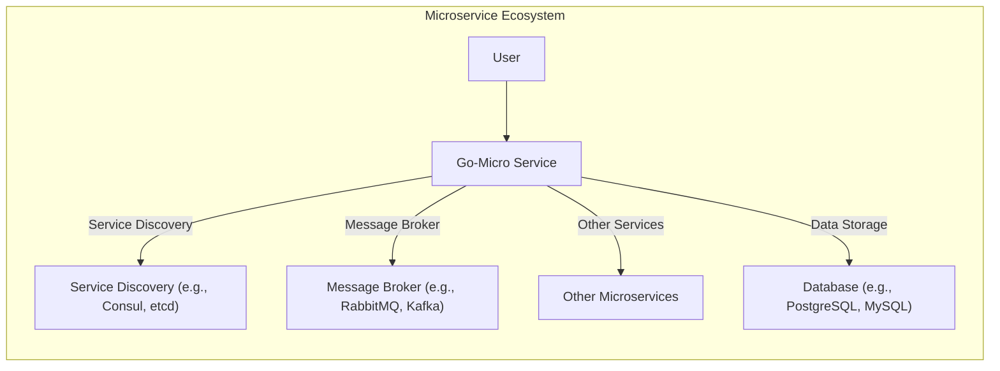
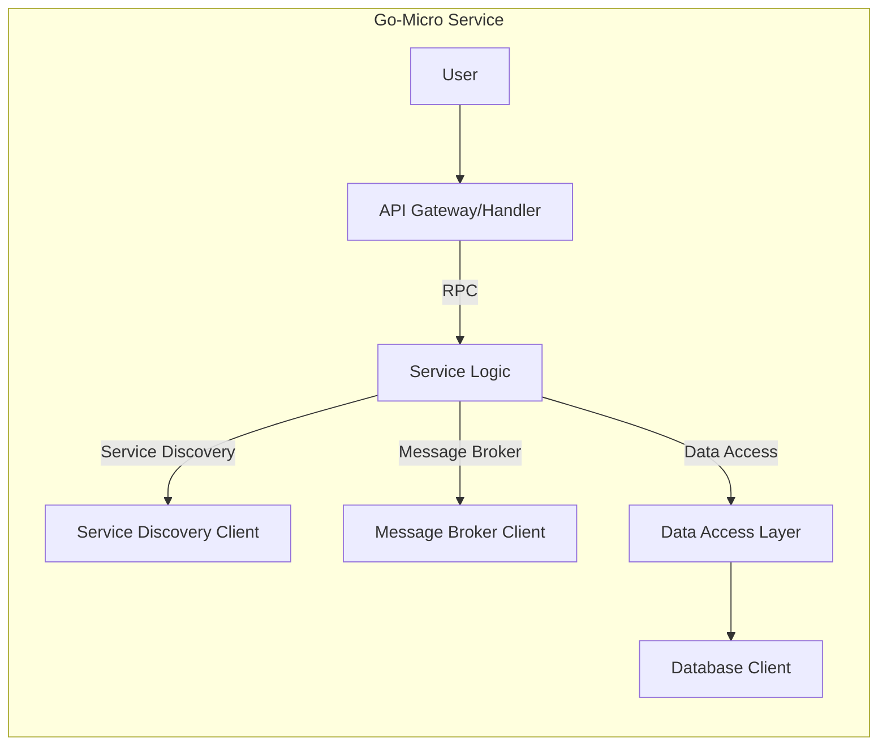
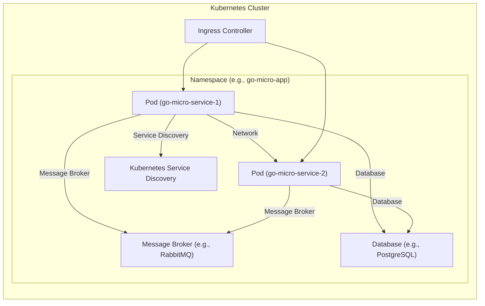
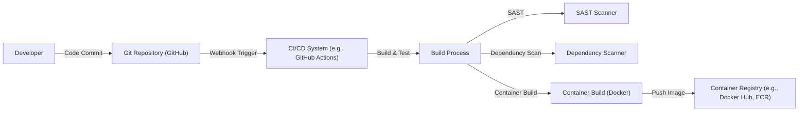

Okay, let's create a design document for the go-micro project, focusing on aspects relevant for threat modeling.

# BUSINESS POSTURE

Business Priorities and Goals:

*   Provide a simple, yet powerful framework for building microservices.
*   Enable developers to focus on business logic rather than infrastructure concerns.
*   Offer a pluggable architecture for various technologies (service discovery, message brokers, etc.).
*   Promote rapid development and deployment of distributed systems.
*   Reduce the complexity of building and managing microservices.
*   Support a polyglot environment (though primarily focused on Go).

Most Important Business Risks:

*   Compromise of a microservice leading to unauthorized data access or manipulation.
*   Denial of service attacks impacting the availability of microservices.
*   Interception of communication between microservices.
*   Lack of visibility and auditability of inter-service communication.
*   Supply chain attacks through compromised dependencies.
*   Configuration errors leading to vulnerabilities.
*   Inconsistent security policies across different microservices.

# SECURITY POSTURE

Existing Security Controls:

*   security control: Pluggable architecture: Allows for the integration of various security-focused plugins (e.g., for authentication, authorization, encryption). Implemented in go-micro architecture.
*   security control: Transport Layer Security (TLS): Supported for secure communication between services. Implemented in go-micro transport packages.
*   security control: Go language: Go's built-in features (memory safety, strong typing) contribute to reducing certain classes of vulnerabilities. Implemented by using Go language.
*   security control: Context: Go's context package is used extensively, which can help with cancellation and deadline propagation, potentially mitigating some denial-of-service scenarios. Implemented in go-micro architecture.

Accepted Risks:

*   accepted risk: Default configurations: The framework may have default configurations that are not secure by default, requiring developers to explicitly configure security settings.
*   accepted risk: Plugin responsibility: The security of many features depends on the specific plugins used. A poorly implemented or insecure plugin can compromise the entire system.
*   accepted risk: Developer awareness: The framework relies on developers to understand and implement security best practices when building their microservices.

Recommended Security Controls:

*   security control: Authentication plugin: Implement a default, robust authentication plugin (e.g., using JWT or mTLS).
*   security control: Authorization plugin: Implement a default authorization plugin (e.g., using RBAC or ABAC).
*   security control: Input validation: Enforce strict input validation in all service handlers and data models.
*   security control: Secrets management: Integrate with a secrets management solution (e.g., HashiCorp Vault) to securely store and manage sensitive information.
*   security control: Auditing: Implement comprehensive audit logging for all service interactions.
*   security control: Rate limiting: Implement rate limiting to protect against denial-of-service attacks.
*   security control: Dependency scanning: Regularly scan dependencies for known vulnerabilities.
*   security control: Static analysis: Integrate static analysis tools into the build process.

Security Requirements:

*   Authentication:
    *   All services must authenticate with each other.
    *   Support for multiple authentication mechanisms (e.g., API keys, JWT, mTLS).
    *   Secure storage and management of authentication credentials.
*   Authorization:
    *   Fine-grained access control for all service endpoints.
    *   Support for role-based access control (RBAC) or attribute-based access control (ABAC).
    *   Centralized policy management.
*   Input Validation:
    *   All input data must be validated against a predefined schema.
    *   Whitelist approach for allowed input values.
    *   Protection against common injection attacks (e.g., SQL injection, cross-site scripting).
*   Cryptography:
    *   Use of strong, industry-standard cryptographic algorithms.
    *   Secure key management practices.
    *   Encryption of data in transit (TLS) and at rest (if applicable).
    *   Data integrity checks.

# DESIGN

## C4 CONTEXT

Element Descriptions:

*   Element:
    *   Name: User
    *   Type: Person
    *   Description: Represents a user interacting with the Go-Micro service, either directly or indirectly.
    *   Responsibilities: Initiates requests to the Go-Micro service.
    *   Security controls: Authentication and authorization at the service boundary.

*   Element:
    *   Name: Go-Micro Service
    *   Type: Software System
    *   Description: A microservice built using the Go-Micro framework.
    *   Responsibilities: Handles business logic, interacts with other services and resources.
    *   Security controls: Authentication, authorization, input validation, encryption, auditing, rate limiting.

*   Element:
    *   Name: Service Discovery (e.g., Consul, etcd)
    *   Type: Software System
    *   Description: A system used for service registration and discovery.
    *   Responsibilities: Maintains a registry of available services and their locations.
    *   Security controls: Secure communication with services, access control to the registry.

*   Element:
    *   Name: Message Broker (e.g., RabbitMQ, Kafka)
    *   Type: Software System
    *   Description: A system used for asynchronous communication between services.
    *   Responsibilities: Handles message queuing, routing, and delivery.
    *   Security controls: Authentication, authorization, encryption of messages.

*   Element:
    *   Name: Other Microservices
    *   Type: Software System
    *   Description: Other microservices within the ecosystem.
    *   Responsibilities: Provide specific functionalities.
    *   Security controls: Same as Go-Micro Service.

*   Element:
    *   Name: Database (e.g., PostgreSQL, MySQL)
    *   Type: Software System
    *   Description: A database used for persistent data storage.
    *   Responsibilities: Stores and retrieves data.
    *   Security controls: Authentication, authorization, encryption of data at rest and in transit, auditing.

## C4 CONTAINER

Element Descriptions:

*   Element:
    *   Name: API Gateway/Handler
    *   Type: Container
    *   Description: Handles incoming requests, performs routing, and potentially authentication/authorization.
    *   Responsibilities: Request routing, authentication, authorization, input validation.
    *   Security controls: Authentication, authorization, input validation, rate limiting.

*   Element:
    *   Name: Service Logic
    *   Type: Container
    *   Description: Contains the core business logic of the microservice.
    *   Responsibilities: Implements the service's functionality.
    *   Security controls: Input validation, business rule enforcement.

*   Element:
    *   Name: Service Discovery Client
    *   Type: Container
    *   Description: Interacts with the service discovery system.
    *   Responsibilities: Registers the service, discovers other services.
    *   Security controls: Secure communication with the service discovery system.

*   Element:
    *   Name: Message Broker Client
    *   Type: Container
    *   Description: Interacts with the message broker.
    *   Responsibilities: Sends and receives messages.
    *   Security controls: Authentication, authorization, encryption of messages.

*   Element:
    *   Name: Data Access Layer
    *   Type: Container
    *   Description: Handles interactions with the database.
    *   Responsibilities: Data retrieval, storage, and manipulation.
    *   Security controls: Input validation, parameterized queries, protection against SQL injection.

*   Element:
    *   Name: Database Client
    *   Type: Container
    *   Description: Connects to and interacts with the database.
    *   Responsibilities: Executes database queries.
    *   Security controls: Secure communication with the database.

## DEPLOYMENT

Possible Deployment Solutions:

1.  Kubernetes: The most common and recommended approach for deploying microservices.
2.  Docker Swarm: Another container orchestration platform, less feature-rich than Kubernetes.
3.  Nomad: A simpler orchestrator from HashiCorp, often used with Consul.
4.  Virtual Machines: Traditional deployment on VMs, less flexible and scalable.
5.  Serverless (e.g., AWS Lambda): Possible for some microservices, but may require significant adaptation.

Chosen Solution: Kubernetes

Element Descriptions:

*   Element:
    *   Name: Pod (go-micro-service-1)
    *   Type: Deployment Unit
    *   Description: An instance of a Go-Micro service running in a Kubernetes Pod.
    *   Responsibilities: Executes the service's code.
    *   Security controls: Network policies, resource limits, security contexts.

*   Element:
    *   Name: Pod (go-micro-service-2)
    *   Type: Deployment Unit
    *   Description: Another instance of a Go-Micro service (or a different service) running in a Pod.
    *   Responsibilities: Executes the service's code.
    *   Security controls: Network policies, resource limits, security contexts.

*   Element:
    *   Name: Kubernetes Service Discovery
    *   Type: Infrastructure
    *   Description: Kubernetes' built-in service discovery mechanism.
    *   Responsibilities: Provides service discovery within the cluster.
    *   Security controls: RBAC for access to service information.

*   Element:
    *   Name: Message Broker (e.g., RabbitMQ)
    *   Type: Infrastructure
    *   Description: A message broker deployed within or outside the Kubernetes cluster.
    *   Responsibilities: Handles asynchronous communication.
    *   Security controls: Authentication, authorization, encryption.

*   Element:
    *   Name: Database (e.g., PostgreSQL)
    *   Type: Infrastructure
    *   Description: A database deployed within or outside the Kubernetes cluster.
    *   Responsibilities: Stores and retrieves data.
    *   Security controls: Authentication, authorization, encryption.

*   Element:
    *   Name: Ingress Controller
    *   Type: Infrastructure
    *   Description: Handles external access to services within the cluster.
    *   Responsibilities: Routing, TLS termination, load balancing.
    *   Security controls: TLS, authentication, authorization, web application firewall (WAF).

## BUILD

Build Process Description:

1.  Developer commits code to the Git repository (GitHub).
2.  A webhook triggers the CI/CD system (e.g., GitHub Actions).
3.  The CI/CD system checks out the code.
4.  The build process starts:
    *   Static Application Security Testing (SAST) is performed using a SAST scanner.
    *   Dependencies are scanned for known vulnerabilities.
    *   Unit and integration tests are executed.
    *   The Go code is compiled.
    *   A Docker container image is built.
5.  The container image is pushed to a container registry (e.g., Docker Hub, ECR).

Security Controls:

*   security control: SAST: Static analysis to identify vulnerabilities in the code.
*   security control: Dependency Scanning: Scanning dependencies for known vulnerabilities.
*   security control: Code Signing: Signing the built artifacts to ensure integrity.
*   security control: Least Privilege: Running build processes with minimal required permissions.
*   security control: Build Automation: Automating the build process to ensure consistency and reduce manual errors.

# RISK ASSESSMENT

Critical Business Processes:

*   Service availability: Ensuring that microservices are available and responsive.
*   Data integrity: Maintaining the accuracy and consistency of data.
*   Data confidentiality: Protecting sensitive data from unauthorized access.
*   User authentication and authorization: Ensuring that only authorized users can access services and data.

Data Sensitivity:

*   User data (PII): High sensitivity. Requires strong protection (encryption, access control).
*   Financial data: High sensitivity. Requires strong protection (encryption, access control, auditing).
*   Service configuration data: Medium sensitivity. Requires protection to prevent unauthorized modification.
*   Logs: Low to medium sensitivity, depending on the content. Requires protection to prevent tampering and unauthorized access.

# QUESTIONS & ASSUMPTIONS

Questions:

*   What specific service discovery and message broker implementations are intended to be used?
*   What are the specific data storage requirements (database type, data volume, etc.)?
*   What are the existing security policies and compliance requirements?
*   What is the expected traffic volume and load?
*   Are there any specific regulatory requirements (e.g., GDPR, HIPAA)?
*   What level of logging and monitoring is required?
*   What is the deployment environment (cloud provider, on-premise)?
*   Are there any existing authentication and authorization mechanisms in place?

Assumptions:

*   BUSINESS POSTURE: The organization has a moderate risk appetite, balancing innovation with security.
*   SECURITY POSTURE: Developers have basic security awareness, but may not be security experts.
*   DESIGN: The microservices will be primarily written in Go. The system will be deployed on Kubernetes. A service mesh (e.g., Istio) may be considered in the future, but is not currently in scope.