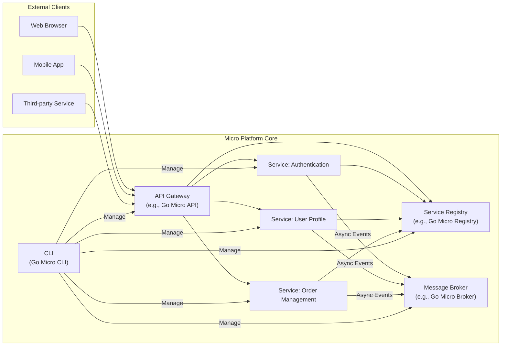

## Project Design Document: Micro Platform (Improved)

**Version:** 1.1
**Date:** October 26, 2023
**Author:** AI Software Architect

### 1. Project Overview

This document details the design of the Micro platform, an open-source microservices development ecosystem focused on simplifying the complexities of building, deploying, and managing distributed applications. This design serves as the foundation for subsequent threat modeling exercises. Micro aims to provide a comprehensive and user-friendly experience for developers embracing microservice architectures.

### 2. Goals

* To offer a highly scalable and resilient platform for developing and running microservices.
* To provide a consistent and intuitive developer experience across all platform components.
* To enable seamless service discovery and inter-service communication.
* To facilitate robust API management, including routing, authentication, and rate limiting.
* To support a variety of transport protocols (e.g., gRPC, HTTP) and message formats (e.g., JSON, Protobuf).
* To integrate comprehensive observability features for monitoring, logging, and tracing microservice interactions.
* To promote a pluggable architecture allowing for customization and extension.

### 3. Target Audience

* Software developers building and maintaining microservice-based applications.
* DevOps engineers responsible for the deployment, operation, and monitoring of microservices.
* Software architects designing and planning distributed systems using microservice principles.

### 4. High-Level Architecture

The Micro platform's architecture is centered around a set of core components facilitating microservice interaction and management. External clients access services through the API Gateway. Services register their availability with the Service Registry, enabling dynamic discovery. The Message Broker handles asynchronous communication between services. The CLI provides administrative and development tooling. Specific examples of Micro components are included for clarity.

### 5. Component Details

* **API Gateway (e.g., Go Micro API):**
    * **Purpose:**  The central entry point for all external requests, decoupling clients from individual services.
    * **Responsibilities:**
        * **Reverse Proxying:**  Routing incoming requests to the appropriate backend services.
        * **Authentication and Authorization:** Verifying the identity and permissions of clients.
        * **Rate Limiting:**  Protecting backend services from overload by limiting request rates.
        * **Load Balancing:** Distributing incoming traffic across multiple instances of a service.
        * **Request Transformation:** Modifying requests and responses as needed.
        * **TLS Termination:** Handling SSL/TLS encryption and decryption.
    * **Key Interactions:**
        * Receives requests from external clients (web browsers, mobile apps, other services).
        * Queries the Service Registry to locate service instances.
        * Forwards requests to backend services.
        * Sends responses back to clients.

* **Service Registry (e.g., Go Micro Registry):**
    * **Purpose:** A central repository for service metadata, enabling dynamic service discovery.
    * **Responsibilities:**
        * **Service Registration:** Allowing services to register their location (IP address, port).
        * **Service Deregistration:**  Handling the removal of services that are no longer available.
        * **Health Checking:** Periodically verifying the health and availability of registered services.
        * **Service Discovery:** Providing mechanisms for other components (e.g., API Gateway, other services) to query for available service instances.
    * **Key Interactions:**
        * Services register with the Service Registry upon startup.
        * The API Gateway queries the Service Registry to find service endpoints.
        * Other services may also query the Service Registry to communicate directly.

* **Message Broker (e.g., Go Micro Broker):**
    * **Purpose:** Facilitates asynchronous, decoupled communication between services.
    * **Responsibilities:**
        * **Message Routing:** Directing messages to the appropriate subscribers.
        * **Message Queuing:**  Storing messages until they are consumed by subscribers.
        * **Publish/Subscribe:** Enabling services to publish messages to topics and other services to subscribe to those topics.
        * **Message Persistence (Optional):**  Storing messages durably to ensure delivery even if consumers are temporarily unavailable.
    * **Key Interactions:**
        * Services publish messages to the Message Broker.
        * Services subscribe to specific topics or queues to receive messages.

* **Services (e.g., Authentication, User Profile, Order Management):**
    * **Purpose:**  Independent, deployable units of functionality responsible for specific business capabilities.
    * **Responsibilities:**
        * Implementing core business logic.
        * Exposing APIs (typically RESTful HTTP or gRPC endpoints).
        * Registering with the Service Registry upon startup.
        * Communicating with other services (synchronously via the API Gateway or directly, or asynchronously via the Message Broker).
        * Managing their own data persistence.
    * **Key Interactions:**
        * Register with the Service Registry.
        * May receive requests directly from the API Gateway.
        * May publish events to the Message Broker.
        * May subscribe to events from the Message Broker.
        * May communicate with other services directly (though less common in a well-architected microservice system).

* **Command Line Interface (CLI) (e.g., Go Micro CLI):**
    * **Purpose:** Provides a command-line interface for interacting with and managing the Micro platform.
    * **Responsibilities:**
        * **Service Deployment:** Deploying new versions of services.
        * **Service Management:** Starting, stopping, and scaling services.
        * **Monitoring:** Viewing service status, logs, and metrics.
        * **Configuration Management:**  Managing platform and service configurations.
        * **Interacting with the Service Registry:**  Viewing registered services.
        * **Interacting with the Message Broker:** Publishing and subscribing to messages for testing or administration.
    * **Key Interactions:**
        * Interacts with the API Gateway to manage its configuration.
        * Interacts with the Service Registry to view and manage services.
        * Interacts with the Message Broker for administrative tasks.
        * May interact directly with service instances for debugging or management.

### 6. Data Flow

A typical synchronous request flow initiated by an external client:

1. An external client (e.g., a web browser) sends an HTTP request to the **API Gateway**.
2. The **API Gateway** authenticates and authorizes the request based on configured policies.
3. The **API Gateway** consults the **Service Registry** to discover the network location of the target service (e.g., the "Order Management" service).
4. The **API Gateway** forwards the request to an available instance of the target service.
5. The target service processes the request, potentially interacting with its own database or other internal resources.
6. The target service sends an HTTP response back to the **API Gateway**.
7. The **API Gateway** may perform response transformation (e.g., aggregating data from multiple services) before sending the final response to the client.

An example of asynchronous communication using the Message Broker:

1. The "Order Management" service completes processing an order and publishes an "OrderCreated" event to the **Message Broker**.
2. The **Message Broker** receives the event and routes it to all subscribed services.
3. The "User Profile" service, which has subscribed to "OrderCreated" events, receives the message from the **Message Broker** and updates the user's order history.

### 7. Key Technologies

* **Core Language:** Go (primary language for the Micro platform and likely for many services).
* **Inter-service Communication:** gRPC (for efficient, type-safe communication), HTTP/REST (for interoperability and simpler use cases).
* **Service Discovery Implementation:**  Potentially Consul, etcd, Kubernetes DNS, or a custom implementation provided by Go Micro.
* **Message Broker Implementation:**  Examples include NATS, RabbitMQ, Kafka, with Go Micro providing an abstraction layer.
* **API Gateway Framework:**  Likely built using Go and potentially leveraging libraries like `net/http` or specialized gateway frameworks.
* **CLI Framework:**  Likely built using Go and a CLI library like `spf13/cobra`.
* **Serialization:** Protocol Buffers (for gRPC), JSON (for HTTP).
* **Deployment & Orchestration:** Docker (for containerization), Kubernetes (for orchestration).
* **Observability:**  Integration with tools like Prometheus for metrics, Grafana for dashboards, Jaeger or Zipkin for tracing, and logging solutions like Elasticsearch, Fluentd, and Kibana (EFK stack).

### 8. Security Considerations (Detailed)

This section expands on the initial security considerations, providing more specific examples of potential threats and mitigation strategies.

* **API Gateway:**
    * **Threats:** Unauthorized access, injection attacks (SQLi, XSS), denial-of-service (DoS), man-in-the-middle attacks.
    * **Mitigations:** Strong authentication mechanisms (e.g., OAuth 2.0, JWT), input validation and sanitization, rate limiting, TLS encryption, Web Application Firewall (WAF).
* **Service Registry:**
    * **Threats:** Unauthorized service registration/deregistration, information disclosure, tampering with service metadata.
    * **Mitigations:** Access control lists (ACLs) to restrict access, authentication for registration and discovery, encryption of sensitive data at rest and in transit.
* **Message Broker:**
    * **Threats:** Unauthorized message publishing/subscription, message tampering, eavesdropping, replay attacks.
    * **Mitigations:** Authentication and authorization for publishers and subscribers, encryption of messages in transit and at rest, message signing to ensure integrity.
* **Services:**
    * **Threats:** Business logic vulnerabilities, data breaches, insecure dependencies, injection flaws.
    * **Mitigations:** Secure coding practices, input validation, output encoding, regular security audits and penetration testing, dependency scanning, principle of least privilege.
* **CLI:**
    * **Threats:** Unauthorized access to management functions, command injection vulnerabilities.
    * **Mitigations:** Strong authentication for CLI users, role-based access control (RBAC), input validation for CLI commands, secure storage of credentials.
* **General Platform:**
    * **Threats:** Compromised credentials, insecure secrets management, lack of security monitoring, supply chain attacks.
    * **Mitigations:** Secure secret management solutions (e.g., HashiCorp Vault), regular security updates and patching, network segmentation, intrusion detection systems (IDS), security information and event management (SIEM) systems.

### 9. Deployment Model

The Micro platform and its associated services are typically deployed in a containerized environment managed by an orchestration platform like Kubernetes.

* **Containerization (Docker):** Each component (API Gateway, Service Registry, Message Broker, individual services) is packaged as a Docker container, ensuring consistency and portability across different environments.
* **Orchestration (Kubernetes):** Kubernetes automates the deployment, scaling, and management of containerized applications. This includes:
    * **Automated Rollouts and Rollbacks:**  Deploying new versions of services with minimal downtime.
    * **Service Discovery:** Kubernetes provides its own internal service discovery mechanism, which can be integrated with the Micro Service Registry.
    * **Load Balancing:** Distributing traffic across multiple instances of a service.
    * **Health Checks:** Monitoring the health of containers and restarting failed ones.
    * **Scaling:** Automatically adjusting the number of service replicas based on demand.
* **Infrastructure:** The platform can be deployed on various infrastructure providers, including:
    * **Cloud Providers:** Amazon Web Services (AWS), Microsoft Azure, Google Cloud Platform (GCP).
    * **On-Premises:**  Utilizing existing infrastructure with a Kubernetes distribution.
* **Deployment Strategies:** Common deployment strategies include blue/green deployments, canary releases, and rolling updates to minimize downtime during updates.

This improved design document provides a more detailed and comprehensive overview of the Micro platform's architecture and considerations for threat modeling.
