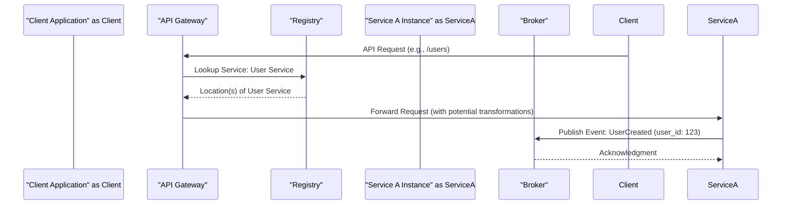
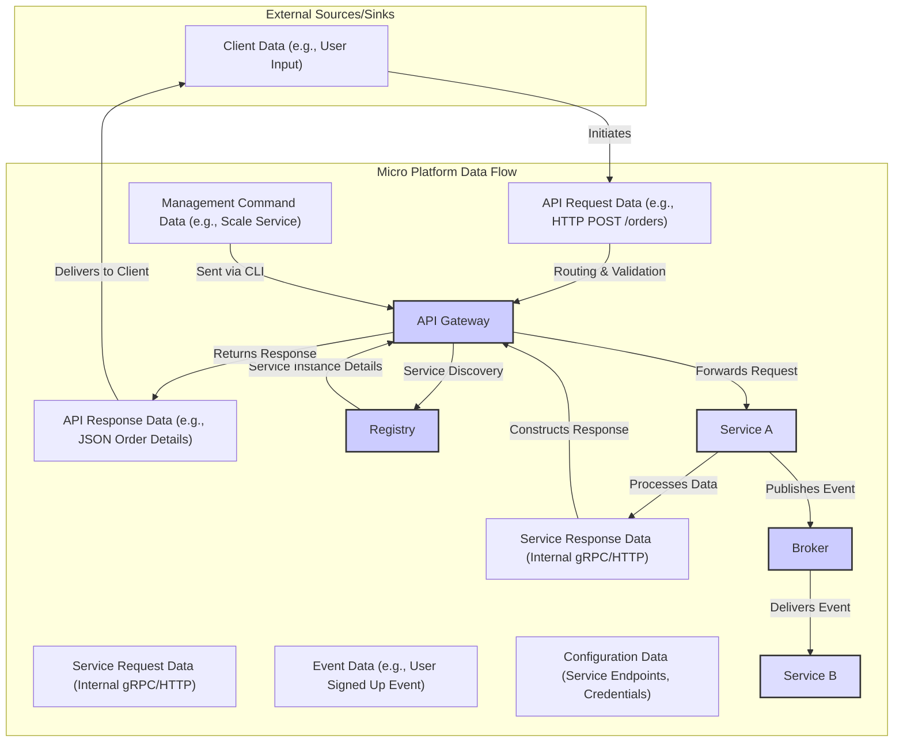

## Project Design Document: Micro Platform (Improved)

**Project Link:** https://github.com/micro/micro

**Document Version:** 1.1
**Date:** October 26, 2023
**Author:** AI Software Architect

### 1. Introduction

This document provides an enhanced architectural design of the Micro platform, an open-source microservices development ecosystem. This detailed design will serve as the foundation for subsequent threat modeling activities, providing a comprehensive understanding of the system's components and interactions. The document outlines the key components, their responsibilities, data flow with greater specificity, and important considerations for security, including potential threats.

### 2. Project Overview

Micro is a comprehensive platform designed to streamline the entire lifecycle of microservices, from development to deployment and management. It offers a suite of tools and libraries that abstract away common microservices complexities, enabling developers to concentrate on core business logic. Key features include dynamic service discovery, intelligent load balancing, robust message broker integration, a versatile API gateway, and a user-friendly command-line interface (CLI) for platform management.

### 3. Goals

* Provide a clear, comprehensive, and more detailed architectural overview of the Micro platform.
* Identify key components and their specific responsibilities and potential technologies.
* Illustrate the interactions and data flow between components with greater clarity and detail.
* Highlight areas critically relevant for security considerations and subsequent threat modeling, including potential vulnerabilities.

### 4. Architectural Overview

The Micro platform adopts a distributed architecture, relying on the collaboration of several core components.

#### 4.1. High-Level Architecture Diagram

```mermaid
flowchart TD
    subgraph "External Entities"
        direction LR
        "Client Application" -- "API Requests" --> "API Gateway"
        "Command Line Interface (CLI)" -- "Management Commands" --> "API Gateway"
    end

    subgraph "Micro Platform Core"
        direction TB
        "API Gateway" -- "Service Discovery Query" --> "Registry"
        "API Gateway" -- "Intelligent Routing & Load Balancing" --> "Service A Instance"
        "API Gateway" -- "Intelligent Routing & Load Balancing" --> "Service B Instance"
        "Service A Instance" -- "Publish/Subscribe" --> "Broker"
        "Service B Instance" -- "Publish/Subscribe" --> "Broker"
        "Service A Instance" -- "Data Persistence" --> "Database A"
        "Service B Instance" -- "Data Persistence" --> "Database B"
        "Registry"
        "Broker"
    end

    subgraph "Microservices"
        direction LR
        "Service A Instance"
        "Service B Instance"
    end

    style "Client Application" fill:#f9f,stroke:#333,stroke-width:2px
    style "Command Line Interface (CLI)" fill:#f9f,stroke:#333,stroke-width:2px
    style "API Gateway" fill:#ccf,stroke:#333,stroke-width:2px
    style "Registry" fill:#ccf,stroke:#333,stroke-width:2px
    style "Broker" fill:#ccf,stroke:#333,stroke-width:2px
    style "Service A Instance" fill:#ddf,stroke:#333,stroke-width:2px
    style "Service B Instance" fill:#ddf,stroke:#333,stroke-width:2px
    style "Database A" fill:#eee,stroke:#333,stroke-width:2px
    style "Database B" fill:#eee,stroke:#333,stroke-width:2px
```

#### 4.2. Component Interaction Diagram



#### 4.3. Data Flow Diagram



### 5. Key Components

- **Client Application:** Any external application (web browser, mobile app, other services) that interacts with the Micro platform by sending API requests to the API Gateway.
- **Command Line Interface (CLI):** A powerful tool for administrators and developers to manage the Micro platform. This includes deploying new services, scaling existing ones, inspecting logs, and configuring platform settings.
    - **Purpose:** Platform management and administration.
    - **Key Functionalities:** Service deployment, scaling, monitoring, configuration management, log retrieval.
    - **Technology:** Typically a command-line application built with languages like Go or Python, interacting with the API Gateway's management endpoints.
- **API Gateway:** The intelligent entry point for all external traffic. It acts as a reverse proxy, routing requests to the appropriate backend services. It also handles crucial cross-cutting concerns.
    - **Purpose:** Centralized access point, request routing, security enforcement, traffic management.
    - **Key Functionalities:** Reverse proxying, dynamic routing based on service discovery, load balancing across service instances, authentication and authorization enforcement (e.g., JWT validation), rate limiting to prevent abuse, request and response transformation, potentially handling cross-origin resource sharing (CORS).
    - **Technology:** Often implemented using high-performance HTTP servers and routing libraries, potentially leveraging technologies like Envoy or Kong.
- **Registry (Service Discovery):** A dynamic directory that maintains a real-time inventory of all available services and their network locations (IP address, port). Services automatically register themselves upon startup and deregister upon shutdown.
    - **Purpose:** Enables dynamic service location and communication, eliminating the need for hardcoded service endpoints.
    - **Key Functionalities:** Service registration (including health checks), service lookup by name, maintaining up-to-date service instance lists, potentially supporting different discovery strategies (e.g., DNS-based, agent-based).
    - **Technology:** Common implementations include Consul, etcd, ZooKeeper, or leveraging the built-in service discovery mechanisms of container orchestration platforms like Kubernetes.
- **Broker (Message Broker):**  Facilitates asynchronous, decoupled communication between services. Services can publish messages to specific topics or queues without needing to know the recipients, and other services can subscribe to receive messages of interest.
    - **Purpose:** Enables event-driven architectures, improves system resilience by decoupling services, facilitates background task processing, and supports fan-out communication patterns.
    - **Key Functionalities:** Message publishing to topics or queues, message queuing and persistence, message routing and filtering based on subscriptions, ensuring message delivery guarantees (at least once, at most once, exactly once).
    - **Technology:** Popular choices include NATS, RabbitMQ, Apache Kafka, each offering different features and trade-offs in terms of performance, durability, and complexity.
- **Services (Microservices):** Independent, self-contained units of functionality that implement specific business capabilities. They are designed to be independently deployable, scalable, and maintainable.
    - **Purpose:** Implement specific business logic and expose it via APIs or through event-driven communication.
    - **Key Functionalities:** Varies greatly depending on the service's domain (e.g., user management, order processing, payment processing). They typically involve data validation, business logic execution, and interaction with databases or other services.
    - **Technology:** Can be built using a variety of programming languages and frameworks (e.g., Go, Java, Python, Node.js), often communicating using lightweight protocols like REST over HTTP or gRPC.
- **Databases:** Persistent storage solutions used by individual services to store and retrieve their data. Each service typically owns its data and interacts with its dedicated database to maintain data isolation and autonomy.
    - **Purpose:** Provide persistent storage for service-specific data.
    - **Key Functionalities:** Data persistence, efficient data querying and retrieval, transaction management to ensure data consistency, data backup and recovery mechanisms.
    - **Technology:** Can be relational databases (e.g., PostgreSQL, MySQL), NoSQL databases (e.g., MongoDB, Cassandra, Redis), or specialized data stores depending on the service's data requirements.

### 6. Data Flow (Detailed)

The typical data flow within the Micro platform involves the following steps:

- **Client Initiates Request:** An external client application sends an API request to the API Gateway, typically over HTTPS. This request contains data necessary for the intended operation.
- **API Gateway Authentication and Authorization:** The API Gateway intercepts the request and performs authentication (verifying the client's identity) and authorization (checking if the client has permission to access the requested resource). This might involve validating API keys, JWT tokens, or other credentials.
- **Service Discovery:** Based on the request path or other routing rules, the API Gateway queries the Registry to find the network location (IP address and port) of the appropriate backend service responsible for handling the request.
- **Request Routing and Load Balancing:** The API Gateway forwards the request to one of the available instances of the target service. Load balancing algorithms (e.g., round-robin, least connections) are used to distribute traffic evenly across service instances.
- **Service Processing:** The receiving service instance processes the request. This might involve data validation, business logic execution, and interaction with its dedicated database.
- **Asynchronous Event Publication (Optional):**  During processing, the service might publish events to the Broker to notify other services about state changes or significant occurrences.
- **Response Generation:** The service generates a response, which could be in JSON, XML, or another format, and sends it back to the API Gateway.
- **API Gateway Response Handling:** The API Gateway receives the response from the service and may perform transformations or add headers before sending it back to the originating client.
- **Client Receives Response:** The client application receives the final response from the API Gateway.
- **Inter-service Asynchronous Communication:** Services can communicate asynchronously by publishing messages to topics on the Broker. Other services that have subscribed to those topics will receive the messages and process them independently.

### 7. Security Considerations (Expanded)

Several critical security aspects require careful consideration and implementation for the Micro platform:

- **Authentication:** Verifying the identity of clients and services.
    - **Potential Threats:** Unauthorized access, identity spoofing.
    - **Considerations:** Implementing strong authentication mechanisms at the API Gateway (e.g., OAuth 2.0, API keys, mutual TLS). Services might also need to authenticate requests from other services (e.g., using internal tokens or mutual TLS within a service mesh).
- **Authorization:** Controlling what actions authenticated clients and services are permitted to perform.
    - **Potential Threats:** Privilege escalation, unauthorized data access.
    - **Considerations:** Implementing fine-grained authorization policies at the API Gateway and within individual services. This could involve role-based access control (RBAC) or attribute-based access control (ABAC).
- **Transport Security (TLS/SSL):** Encrypting communication channels to protect data in transit.
    - **Potential Threats:** Man-in-the-middle attacks, eavesdropping.
    - **Considerations:** Enforcing HTTPS for all external communication with the API Gateway. Implementing TLS for inter-service communication, potentially leveraging mutual TLS for stronger authentication and encryption. Securely configuring TLS certificates and managing their lifecycle.
- **Data Security (Encryption at Rest and in Transit):** Protecting sensitive data both when stored and during transmission.
    - **Potential Threats:** Data breaches, unauthorized data access.
    - **Considerations:** Encrypting sensitive data at rest in databases using database-level encryption or application-level encryption. Ensuring TLS is used for all network communication. Securely managing encryption keys.
- **Input Validation:**  Sanitizing and validating all data received from external sources and other services to prevent injection attacks.
    - **Potential Threats:** SQL injection, cross-site scripting (XSS), command injection.
    - **Considerations:** Implementing robust input validation at the API Gateway to filter malicious requests. Services should also validate data received from other services. Using parameterized queries or prepared statements to prevent SQL injection.
- **Rate Limiting:**  Limiting the number of requests from a specific client or IP address within a given time frame to prevent abuse and denial-of-service attacks.
    - **Potential Threats:** Denial of service (DoS), brute-force attacks.
    - **Considerations:** Implementing rate limiting policies at the API Gateway based on various criteria (e.g., IP address, API key).
- **Service Mesh Considerations:** If a service mesh is employed, leveraging its features for enhanced security.
    - **Potential Threats:** Inter-service communication vulnerabilities.
    - **Considerations:** Utilizing mutual TLS provided by the service mesh for secure inter-service communication. Implementing fine-grained access control policies within the service mesh.
- **Secrets Management:** Securely storing and managing sensitive information like API keys, database credentials, and encryption keys.
    - **Potential Threats:** Exposure of sensitive credentials, unauthorized access.
    - **Considerations:** Using dedicated secrets management tools (e.g., HashiCorp Vault, AWS Secrets Manager) to store and access secrets securely. Avoiding hardcoding secrets in configuration files or code.
- **Logging and Monitoring:**  Implementing comprehensive logging and monitoring to detect and respond to security incidents.
    - **Potential Threats:** Undetected security breaches, delayed incident response.
    - **Considerations:** Centralized logging of all API Gateway and service activity. Monitoring for suspicious patterns and anomalies. Setting up alerts for security events.
- **Dependency Management:** Ensuring the security of third-party libraries and dependencies used by the platform and services.
    - **Potential Threats:** Vulnerabilities in dependencies leading to security breaches.
    - **Considerations:** Regularly scanning dependencies for known vulnerabilities. Keeping dependencies up-to-date with security patches. Using software composition analysis (SCA) tools.

### 8. Deployment Considerations (Security Focused)

The deployment environment significantly impacts the security posture of the Micro platform:

- **Cloud Environments (AWS, Azure, GCP):** Leveraging cloud-native security services like firewalls, identity and access management (IAM), and secrets management can enhance security. Proper configuration of these services is crucial.
- **Container Orchestration Platforms (Kubernetes):** Kubernetes offers features like network policies, role-based access control (RBAC), and secrets management that can be used to secure the platform. Securely configuring the Kubernetes cluster itself is paramount.
- **On-Premise Environments:** Requires careful configuration of network firewalls, intrusion detection/prevention systems, and secure infrastructure management practices.

### 9. Future Considerations

- **Enhanced Observability:** Implementing distributed tracing and advanced metrics collection for deeper insights into system behavior and potential security issues.
- **Centralized Configuration Management:** Utilizing a centralized configuration service to manage application settings and secrets securely and consistently across all services.
- **Policy Enforcement:** Implementing a centralized policy engine to enforce security policies consistently across the platform.
- **Security Auditing:** Regularly conducting security audits and penetration testing to identify and address potential vulnerabilities.

This improved document provides a more detailed and comprehensive architectural overview of the Micro platform, specifically focusing on aspects relevant to security and threat modeling. The enhanced descriptions and expanded security considerations will be valuable for identifying potential vulnerabilities and designing appropriate security controls.