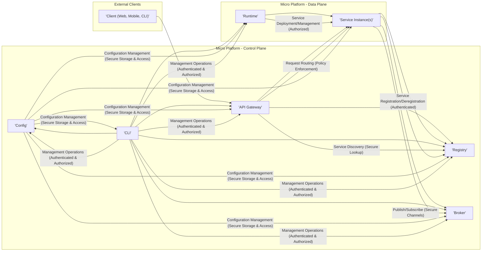

# Project Design Document: Micro - Microservices Toolkit (Improved)

**Project Name:** Micro

**Project Repository:** [https://github.com/micro/micro](https://github.com/micro/micro)

**Document Version:** 1.1
**Date:** 2023-10-27
**Author:** AI Cloud & Security Expert

## 1. Introduction

This document provides an enhanced design overview of the Micro project, an open-source microservices toolkit, specifically tailored for threat modeling and security analysis. Building upon the initial design, this version offers greater detail and emphasizes security considerations for each component and the overall architecture. This document serves as a crucial input for conducting a comprehensive threat model, enabling security architects, developers, and operations teams to proactively identify and mitigate potential security risks in applications built using the Micro framework.

## 2. Project Overview

Micro is a cloud-native development platform designed to simplify the creation, deployment, and management of microservices. It offers a comprehensive suite of tools and abstractions, addressing the common challenges of distributed systems. By providing essential building blocks like service discovery, API gateway, and communication libraries, Micro accelerates microservice development and promotes best practices for cloud-native architectures.

**Key Features (Security Perspective Highlighted):**

*   **Service Discovery (Secure Registration & Lookup):**  Automates service registration and discovery, crucial for dynamic environments. Security considerations include protecting the registry from unauthorized access and ensuring secure service registration to prevent spoofing.
*   **API Gateway (Centralized Security Enforcement):**  Acts as a single entry point, enabling centralized enforcement of security policies like authentication, authorization, and rate limiting. This simplifies security management and reduces the attack surface.
*   **Request Routing (Intelligent & Secure):**  Intelligently routes requests, ensuring requests are directed to the correct service instances. Security aspects include preventing routing manipulation and ensuring secure communication channels.
*   **Client/Server Communication (Secure Channels):** Provides libraries for synchronous and asynchronous communication, supporting secure communication protocols and encryption to protect data in transit.
*   **Pluggable Architecture (Security Customization):**  Allows customization and extension of core components, enabling integration with specific security tools and technologies. This flexibility is vital for adapting to diverse security requirements.
*   **CLI Tooling (Secure Management Interface):** Offers a command-line interface for managing the platform. Security is paramount for CLI access, requiring robust authentication and authorization to prevent unauthorized administrative actions.
*   **Cloud Native (Designed for Secure Cloud Deployments):**  Designed for containerized and cloud environments, aligning with modern security best practices for cloud deployments.

## 3. Architecture Overview

Micro's architecture is modular and distributed, comprising a control plane and a data plane. The control plane manages the platform's core functionalities, while the data plane handles the actual service execution. This separation of concerns enhances manageability and security.

**Components (Security Focused Descriptions):**

*   **API Gateway (Security Entry Point):**  The first line of defense, responsible for securing access to the microservices. It enforces authentication, authorization, and other security policies before routing requests to backend services.
*   **Registry (Secure Service Catalog):**  Maintains a secure and reliable catalog of services. Security is critical to prevent unauthorized access to service information and to ensure the integrity of service registrations.
*   **Broker (Secure Message Bus):**  Facilitates asynchronous communication securely. Encryption and access control are essential to protect message confidentiality and integrity.
*   **Config (Secure Configuration Vault):**  Provides a secure and centralized configuration management system. Protecting configuration data, especially secrets, is paramount.
*   **Runtime (Secure Service Orchestrator):**  Manages the lifecycle of services in a secure manner. Secure deployment, isolation, and resource management are key security considerations.
*   **CLI (Secure Management Console):**  Provides a secure interface for administrative tasks. Strong authentication and authorization are crucial to prevent unauthorized platform management.
*   **Service Instance(s) (Secure Application Logic):**  Individual microservices implementing business logic. Security within each service is vital, including secure coding practices, input validation, and protection of sensitive data.
*   **External Clients (Potentially Untrusted):**  Represent external entities interacting with the platform. Security measures must be in place to protect the platform from potentially malicious clients.

## 4. Component Details (Enhanced Security Focus)

### 4.1. API Gateway (Detailed Security Analysis)

*   **Functionality (Security Emphasis):**
    *   **Reverse Proxy (Secure Routing):** Routes requests securely, preventing direct access to backend services.
    *   **Load Balancing (Resilience & Availability):** Distributes traffic to enhance availability and resilience against DoS attacks.
    *   **Authentication & Authorization (Identity & Access Management):**  Verifies user identities (Authentication) and enforces access control policies (Authorization). Should support various methods like JWT, OAuth 2.0, API Keys, and potentially mutual TLS.
    *   **Rate Limiting (DoS Prevention):**  Protects against brute-force attacks and resource exhaustion by limiting request rates.
    *   **Request Transformation (Security Normalization):** Can sanitize or normalize requests to mitigate injection attacks.
    *   **Observability (Security Monitoring & Auditing):**  Provides logs and metrics for security monitoring, incident detection, and auditing.
    *   **TLS Termination (Encryption in Transit):** Terminates TLS connections, ensuring encrypted communication from clients.
    *   **Web Application Firewall (WAF) (Attack Mitigation):**  Can integrate with WAFs to detect and block common web attacks (e.g., SQL injection, XSS).

*   **Data Flow (Security Perspective):**
    *   Receives potentially malicious requests from external clients.
    *   Performs security checks (authentication, authorization, WAF).
    *   Queries the Registry securely to discover service locations.
    *   Forwards requests to backend services over secure channels (e.g., mTLS).
    *   Receives responses from backend services.
    *   Returns responses to external clients, potentially sanitizing responses for security.

*   **Technology Stack (Security Relevant Examples):**
    *   Go (memory-safe language, performance for security processing)
    *   HTTP/2, gRPC (performance and security features)
    *   TLS 1.3 (strong encryption)
    *   JWT libraries (secure token handling)
    *   OAuth 2.0 libraries (standardized authorization)
    *   WAF integration (e.g., integration with cloud provider WAFs or open-source WAFs like ModSecurity)

*   **Security Considerations (Threats & Mitigations):**
    *   **Authentication Bypass (Threat):** Vulnerabilities in authentication mechanisms. **Mitigation:** Robust authentication implementation, regular security audits, multi-factor authentication.
    *   **Authorization Failures (Threat):** Incorrectly configured authorization policies. **Mitigation:** Principle of least privilege, policy-as-code, thorough testing of authorization rules.
    *   **Injection Attacks (Threat):** Header injection, request smuggling. **Mitigation:** Input validation, output encoding, secure request transformation practices, WAF.
    *   **Denial of Service (DoS) (Threat):**  Resource exhaustion, application-level DoS. **Mitigation:** Rate limiting, resource quotas, load balancing, WAF, anomaly detection.
    *   **Exposure of Internal Services (Threat):** Misconfiguration exposing internal services. **Mitigation:** Network segmentation, strict firewall rules, default-deny policies, regular security configuration reviews.
    *   **Man-in-the-Middle (MitM) Attacks (Threat):**  Interception of communication. **Mitigation:** Enforce HTTPS, use TLS 1.3, consider mutual TLS for backend communication.

### 4.2. Registry (Detailed Security Analysis)

*   **Functionality (Security Emphasis):**
    *   **Service Registration (Authenticated & Authorized):**  Requires services to authenticate and be authorized before registration to prevent unauthorized or malicious service entries.
    *   **Service Discovery (Authorized Access):**  Access to service discovery information should be controlled to prevent unauthorized services or clients from gaining knowledge of the service topology.
    *   **Health Checking (Integrity & Availability):**  Secure health checks to ensure only legitimate and healthy services are registered, preventing routing to compromised instances.
    *   **Service Metadata (Secure Storage):**  Metadata should be stored securely, especially if it contains sensitive information.

*   **Data Flow (Security Perspective):**
    *   Services authenticate and authorize before registering.
    *   Registry authenticates and authorizes clients requesting service discovery information.
    *   Registry performs health checks securely, potentially using mutual TLS or signed requests.
    *   Data at rest within the Registry should be encrypted.

*   **Technology Stack (Security Relevant Examples):**
    *   Consul (ACLs for access control, TLS encryption, secure gossip protocol)
    *   Etcd (RBAC for access control, TLS encryption, secure authentication)
    *   Kubernetes (RBAC, Network Policies, Secret management for secure access to Kubernetes API)

*   **Security Considerations (Threats & Mitigations):**
    *   **Unauthorized Access to Service Information (Threat):**  Information disclosure of service topology and endpoints. **Mitigation:** Access control lists (ACLs), Role-Based Access Control (RBAC), authentication for Registry API access, network segmentation.
    *   **Service Registration Spoofing (Threat):**  Malicious services registering as legitimate ones. **Mitigation:** Mutual TLS for service registration, service identity verification, secure registration API, anomaly detection for unexpected registrations.
    *   **Data Integrity (Threat):**  Manipulation of service information in the Registry. **Mitigation:** Data integrity checks, secure storage, audit logging of changes, potentially using a distributed consensus algorithm with security properties.
    *   **Denial of Service (DoS) (Threat):**  Overloading the Registry. **Mitigation:** Rate limiting, resource quotas, load balancing for the Registry itself, robust infrastructure.
    *   **Registry Compromise (Threat):**  Complete compromise of the Registry server. **Mitigation:** Hardened operating system, regular security patching, intrusion detection systems, backups and disaster recovery, principle of least privilege for Registry processes.

### 4.3. Broker (Detailed Security Analysis)

*   **Functionality (Security Emphasis):**
    *   **Message Publishing (Authorized Publishers):**  Control who can publish to specific topics to prevent unauthorized message injection.
    *   **Message Subscription (Authorized Subscribers):** Control who can subscribe to topics to protect message confidentiality.
    *   **Message Routing (Secure & Reliable):**  Ensure messages are routed securely and reliably to authorized subscribers.
    *   **Message Persistence (Secure Storage):** If messages are persisted, ensure secure storage and access control to persisted messages.
    *   **Message Encryption (Confidentiality):**  Support encryption of messages in transit and at rest to protect sensitive data.

*   **Data Flow (Security Perspective):**
    *   Publishers authenticate and authorize before publishing messages.
    *   Broker enforces access control policies for publishing and subscribing.
    *   Messages are transmitted over secure channels (e.g., TLS).
    *   Persisted messages are stored securely and accessed with authorization.

*   **Technology Stack (Security Relevant Examples):**
    *   NATS (TLS encryption, authentication, authorization via accounts and permissions)
    *   RabbitMQ (TLS encryption, authentication, authorization via users and permissions, message queue mirroring for HA)
    *   Kafka (TLS encryption, SASL/SCRAM authentication, ACLs for authorization, message encryption at rest)

*   **Security Considerations (Threats & Mitigations):**
    *   **Message Interception (Confidentiality) (Threat):**  Eavesdropping on message traffic. **Mitigation:** TLS encryption for broker communication, message encryption at the application level.
    *   **Message Tampering (Integrity) (Threat):**  Modification of messages in transit. **Mitigation:** TLS encryption (provides integrity), message signing at the application level.
    *   **Unauthorized Publishing/Subscribing (Authorization) (Threat):**  Unauthorized access to message topics. **Mitigation:** Access control lists (ACLs), Role-Based Access Control (RBAC), authentication for broker clients.
    *   **Message Injection (Threat):**  Malicious actors publishing harmful messages. **Mitigation:** Input validation on message content, authorization for publishing, message filtering, anomaly detection.
    *   **Denial of Service (DoS) (Threat):**  Overloading the broker with messages. **Mitigation:** Rate limiting, message size limits, resource quotas, broker clustering for scalability.
    *   **Broker Compromise (Threat):**  Compromise of the Broker server. **Mitigation:** Hardened operating system, regular security patching, intrusion detection systems, backups and disaster recovery, principle of least privilege for Broker processes, secure storage for persisted messages.

### 4.4. Config (Detailed Security Analysis)

*   **Functionality (Security Emphasis):**
    *   **Centralized Configuration Storage (Secure Vault):**  Store configuration data securely, especially secrets.
    *   **Configuration Retrieval (Authorized Access):**  Control access to configuration data based on service identity and authorization policies.
    *   **Configuration Updates (Audited & Authorized):**  Require authorization and audit logging for configuration updates.
    *   **Secrets Management (Dedicated Secrets Storage):**  Ideally integrate with dedicated secrets management solutions (e.g., HashiCorp Vault, AWS Secrets Manager, Azure Key Vault).
    *   **Configuration Versioning (Audit Trail & Rollback):**  Maintain version history for auditing and rollback purposes.

*   **Data Flow (Security Perspective):**
    *   Services authenticate and authorize before retrieving configuration.
    *   Configuration data is transmitted over secure channels (e.g., TLS).
    *   Secrets are retrieved from dedicated secrets management systems.
    *   Configuration updates are logged and audited.

*   **Technology Stack (Security Relevant Examples):**
    *   Consul KV (ACLs, TLS encryption, secure storage)
    *   Etcd (RBAC, TLS encryption, secure storage)
    *   Kubernetes ConfigMaps/Secrets (RBAC, encryption at rest for Secrets, integration with external secrets stores via CSI drivers)
    *   HashiCorp Vault (Dedicated secrets management, strong access control, audit logging, encryption)
    *   Cloud Provider Secrets Managers (AWS Secrets Manager, Azure Key Vault, GCP Secret Manager)

*   **Security Considerations (Threats & Mitigations):**
    *   **Unauthorized Access to Configuration Data (Threat):**  Exposure of sensitive configuration, including secrets. **Mitigation:** Strong access control (ACLs, RBAC), authentication for Config API access, network segmentation, encryption at rest for configuration data, use of dedicated secrets management.
    *   **Configuration Tampering (Threat):**  Malicious modification of configuration. **Mitigation:** Authorization for configuration updates, audit logging of changes, configuration versioning and rollback, integrity checks.
    *   **Exposure of Secrets (Threat):**  Accidental or intentional exposure of secrets in logs, code, or insecure storage. **Mitigation:** Use dedicated secrets management, avoid hardcoding secrets, secure logging practices, regular security scans for exposed secrets.
    *   **Configuration Injection (Threat):**  Exploiting vulnerabilities in configuration parsing to inject malicious configuration. **Mitigation:** Secure configuration parsing libraries, input validation for configuration data.
    *   **Denial of Service (DoS) (Threat):**  Overloading the Config component. **Mitigation:** Rate limiting, resource quotas, caching, robust infrastructure.

### 4.5. Runtime (Detailed Security Analysis)

*   **Functionality (Security Emphasis):**
    *   **Service Deployment (Secure Deployment Pipelines):**  Use secure deployment pipelines to ensure only authorized and validated service images are deployed.
    *   **Service Scaling (Secure Resource Allocation):**  Allocate resources securely and prevent resource exhaustion or contention.
    *   **Service Health Monitoring (Secure Monitoring Agents):**  Use secure monitoring agents and channels to prevent tampering with health status.
    *   **Resource Management (Isolation & Quotas):**  Enforce resource isolation and quotas to prevent cross-service interference and resource abuse.
    *   **Service Lifecycle Management (Secure Operations):**  Secure service startup, shutdown, and update processes to prevent disruptions or vulnerabilities.
    *   **Network Policies (Network Segmentation):**  Enforce network policies to isolate services and restrict network access.
    *   **Security Contexts (Least Privilege):**  Utilize security contexts to run containers with the least necessary privileges.

*   **Data Flow (Security Perspective):**
    *   Runtime receives deployment instructions from authorized sources (e.g., CLI, CI/CD pipelines).
    *   Runtime interacts with infrastructure providers securely (e.g., Kubernetes API with RBAC and TLS).
    *   Runtime monitors service health securely.
    *   Runtime manages service resources within defined security boundaries.

*   **Technology Stack (Security Relevant Examples):**
    *   Kubernetes (RBAC, Network Policies, Security Contexts, Pod Security Policies/Admission Controllers, Secrets Management, Image Security Scanning, Audit Logging)
    *   Docker Swarm (TLS encryption, mutual TLS for cluster communication, secrets management)
    *   Nomad (ACLs, TLS encryption, secure RPC communication, secrets management)

*   **Security Considerations (Threats & Mitigations):**
    *   **Unauthorized Service Deployment/Management (Threat):**  Malicious actors deploying or managing services. **Mitigation:** Strong authentication and authorization for Runtime API access, secure deployment pipelines, image signing and verification, admission controllers to enforce security policies.
    *   **Container Security (Threat):**  Vulnerabilities in container images or runtime. **Mitigation:** Image scanning for vulnerabilities, base image hardening, minimal container images, regular patching of container runtime, security contexts, container runtime security features (e.g., seccomp, AppArmor, SELinux).
    *   **Privilege Escalation (Threat):**  Containers gaining excessive privileges. **Mitigation:** Principle of least privilege for containers, security contexts, Pod Security Policies/Admission Controllers to restrict capabilities and privileges.
    *   **Resource Exhaustion (Threat):**  Runaway services or malicious resource consumption. **Mitigation:** Resource quotas, resource limits, monitoring and alerting, network policies to limit lateral movement.
    *   **Infrastructure Security (Threat):**  Compromise of the underlying infrastructure. **Mitigation:** Hardened infrastructure, regular security patching, intrusion detection systems, network segmentation, access control for infrastructure management, security audits of infrastructure configuration.

### 4.6. CLI (Detailed Security Analysis)

*   **Functionality (Security Emphasis):**
    *   **Service Management (Authorized Operations):**  Restrict service management commands to authorized users.
    *   **Registry Interaction (Secure Access):**  Securely access the Registry API with proper authentication and authorization.
    *   **Broker Interaction (Secure Communication):**  Communicate with the Broker securely, using TLS and authentication.
    *   **Configuration Management (Secure Configuration Access):**  Securely access and manage configuration data, respecting access control policies.
    *   **Platform Administration (Audited Administrative Actions):**  Log and audit all administrative actions performed through the CLI.
    *   **Secure Credential Handling:**  Handle user credentials and API keys securely, avoiding storage in plaintext and using secure credential storage mechanisms.

*   **Data Flow (Security Perspective):**
    *   CLI authenticates users before allowing access to platform management functions.
    *   CLI communicates with other Micro components over secure channels (e.g., TLS, authenticated APIs).
    *   CLI securely handles user credentials and API keys.
    *   CLI logs all administrative actions.

*   **Technology Stack (Security Relevant Examples):**
    *   Go (secure coding practices)
    *   TLS for communication with Micro components
    *   Secure credential storage libraries (e.g., OS-specific keychains, password managers)
    *   Audit logging libraries

*   **Security Considerations (Threats & Mitigations):**
    *   **Authentication & Authorization for CLI Access (Threat):**  Unauthorized users gaining access to administrative functions. **Mitigation:** Strong authentication mechanisms (e.g., password-based, multi-factor authentication, API keys), Role-Based Access Control (RBAC) for CLI commands, audit logging of CLI access and commands.
    *   **Command Injection (Threat):**  Vulnerabilities in CLI command parsing. **Mitigation:** Secure command parsing libraries, input validation for CLI arguments, avoid executing arbitrary shell commands based on user input.
    *   **Exposure of Credentials (Threat):**  Credentials stored insecurely or exposed in logs or command history. **Mitigation:** Secure credential storage (e.g., OS keychain), avoid storing credentials in plaintext, secure logging practices, clear command history after use, use short-lived tokens where possible.
    *   **Privilege Escalation (Threat):**  Attackers gaining elevated privileges through the CLI. **Mitigation:** Principle of least privilege for CLI users, RBAC to restrict command access, regular security audits of CLI code and functionality.
    *   **Session Hijacking (Threat):**  Attackers hijacking CLI sessions. **Mitigation:** Secure session management, session timeouts, encryption of session data, protection against cross-site scripting (XSS) if CLI has a web interface.

## 5. Data Flow Details (Security Enhanced)

The typical request flow and asynchronous communication flows described previously are still valid, but now with a stronger emphasis on security at each step.  Every communication channel should be considered for encryption (TLS/mTLS), and every component interaction should be subject to authentication and authorization.

## 6. Technology Stack Overview (Security Considerations)

The technology stack choices have significant security implications. Choosing secure and well-maintained technologies is crucial.  For example:

*   **Go:**  A memory-safe language, reducing the risk of memory corruption vulnerabilities.
*   **TLS 1.3:**  Provides strong encryption and authentication for communication.
*   **Protocol Buffers:**  Efficient and well-defined serialization format, reducing parsing vulnerabilities compared to less structured formats.
*   **Pluggable Components:**  While offering flexibility, pluggable components introduce the risk of vulnerabilities in the chosen implementations. Careful selection and security assessment of pluggable components are essential.  For example, choosing a well-vetted and actively maintained message broker like RabbitMQ or Kafka is preferable to a less mature or unmaintained option.

## 7. Deployment Model (Security Best Practices)

Deploying Micro securely requires following cloud-native security best practices, especially in Kubernetes environments:

*   **Network Policies:**  Implement network policies to segment services and restrict network traffic, limiting the blast radius of potential breaches.
*   **RBAC:**  Utilize Kubernetes RBAC to enforce least privilege access to Kubernetes API and resources.
*   **Security Contexts:**  Apply security contexts to Pods and Containers to restrict capabilities, enforce read-only root filesystems, and run containers as non-root users.
*   **Pod Security Admission (or Pod Security Policies - deprecated):**  Enforce baseline or restricted security profiles for Pods to prevent deployment of insecure containers.
*   **Secrets Management:**  Use Kubernetes Secrets or external secrets management solutions to securely manage secrets. Enable encryption at rest for Secrets.
*   **Image Security Scanning:**  Integrate image scanning into CI/CD pipelines to identify vulnerabilities in container images before deployment.
*   **Audit Logging:**  Enable Kubernetes audit logging to track API activity and detect suspicious behavior.
*   **Regular Security Updates:**  Keep Kubernetes nodes and control plane components up-to-date with security patches.
*   **Node Security Hardening:**  Harden Kubernetes nodes by applying security benchmarks and disabling unnecessary services.
*   **Ingress Security:**  Secure Ingress controllers with TLS, WAF, and rate limiting.

## 8. Security Considerations (Comprehensive)

This section expands on the initial security considerations, providing a more comprehensive view for threat modeling:

*   **Identity and Access Management (IAM):**  Implement a robust IAM system across all Micro components. Centralized IAM solutions can simplify management and improve consistency.
*   **Data Encryption:**  Encrypt data in transit (TLS/mTLS) and at rest (encryption at storage layer, database encryption, secrets encryption).
*   **Secure Development Lifecycle (SDLC):**  Integrate security into the entire SDLC, including secure coding practices, security testing (SAST, DAST, penetration testing), and security reviews.
*   **Incident Response Plan:**  Develop and regularly test an incident response plan to handle security incidents effectively.
*   **Security Awareness Training:**  Provide security awareness training to developers, operations teams, and users to promote a security-conscious culture.
*   **Compliance Requirements:**  Consider relevant compliance requirements (e.g., GDPR, HIPAA, PCI DSS) and implement necessary security controls.
*   **Supply Chain Security:**  Assess the security of dependencies and third-party libraries used by Micro and its components.
*   **Regular Vulnerability Scanning and Penetration Testing:**  Conduct regular vulnerability scans and penetration testing to proactively identify and address security weaknesses.
*   **Threat Modeling (Using this Document):**  Utilize this design document as the basis for conducting a structured threat modeling exercise (e.g., STRIDE) to identify specific threats and develop mitigation strategies for each component and data flow.

## 9. Diagrams

Diagrams are included throughout the document. Refer to the Architecture Overview section for the main architecture diagram.

## 10. Future Considerations (Security Roadmap)

*   **Service Mesh Integration (Enhanced Security Features):**  Explore service mesh integration for advanced security features like mutual TLS, fine-grained authorization policies, and enhanced observability.
*   **Policy Enforcement (Centralized Security Policies):**  Implement policy enforcement engines (e.g., Open Policy Agent - OPA) to centralize and automate security policy management across the platform.
*   **Security Hardening Automation:**  Develop automation tools and scripts for security hardening of Micro deployments and infrastructure.
*   **Security Auditing and Compliance Tools:**  Integrate tools for automated security auditing and compliance checks.
*   **Zero Trust Architecture Principles:**  Further align Micro's architecture with Zero Trust principles, emphasizing least privilege, micro-segmentation, and continuous verification.

This improved design document provides a more detailed and security-focused overview of the Micro project. It is now better equipped to serve as a foundation for comprehensive threat modeling, enabling proactive security measures to be implemented throughout the Micro platform and applications built upon it. The enhanced component details and security considerations sections are specifically designed to facilitate a thorough threat modeling process, such as STRIDE, by providing a clear understanding of each component's functionality, data flow, and potential vulnerabilities.