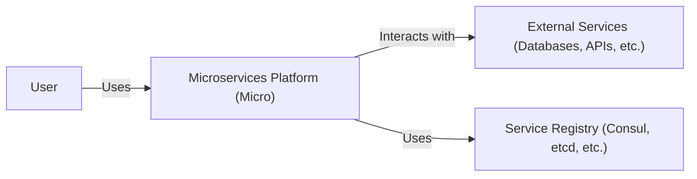
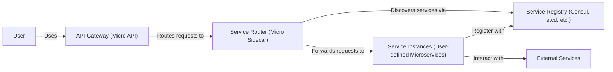
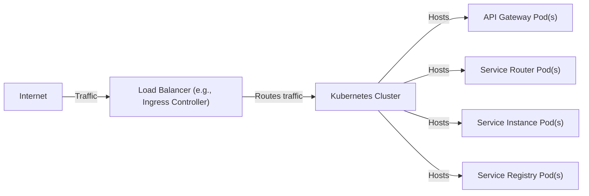
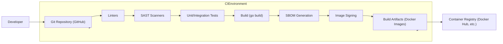

Okay, let's create a design document for the `micro/micro` project.

# BUSINESS POSTURE

Business Priorities and Goals:

*   Provide a simple and efficient platform for microservice development and management.
*   Offer a unified toolkit for building, deploying, and observing microservices.
*   Reduce the complexity of distributed systems development.
*   Enable rapid iteration and deployment of services.
*   Support multiple programming languages and frameworks.
*   Provide a self-service platform for developers.

Most Important Business Risks:

*   Service disruption due to misconfiguration or bugs in the platform itself.
*   Unauthorized access to sensitive data or services due to vulnerabilities in the platform.
*   Inability to scale the platform to meet growing demand.
*   Lack of visibility into service behavior, leading to difficulty in troubleshooting and performance optimization.
*   Vendor lock-in due to reliance on a specific platform or technology.
*   Supply chain attacks, due to vulnerabilities in third party libraries.

# SECURITY POSTURE

Existing Security Controls (as inferred from the repository and documentation):

*   security control: API Gateway with built-in authentication and authorization mechanisms (Go Micro).
*   security control: Service discovery with support for secure communication (mDNS, Consul, etcd).
*   security control: Pluggable architecture, allowing for custom security implementations.
*   security control: Support for TLS encryption for inter-service communication.
*   security control: Use of Go, a memory-safe language, reducing the risk of memory corruption vulnerabilities.
*   security control: Basic input validation in core components (observed in code, but needs further documentation).

Accepted Risks:

*   accepted risk: The default configuration may not be secure for all environments. Users are responsible for configuring security appropriately.
*   accepted risk: Limited built-in support for advanced security features like fine-grained access control and auditing.
*   accepted risk: Reliance on third-party components (e.g., Consul, etcd) introduces potential security risks if those components are not properly secured.
*   accepted risk: The project is under active development, and new vulnerabilities may be introduced.

Recommended Security Controls:

*   Implement comprehensive input validation and sanitization for all API endpoints and user inputs.
*   Provide detailed documentation and guidance on secure configuration and deployment.
*   Integrate with existing identity and access management (IAM) systems.
*   Implement robust auditing and logging capabilities.
*   Perform regular security assessments and penetration testing.
*   Establish a vulnerability disclosure program.
*   Implement signed releases.
*   Implement software bill of materials (SBOM).

Security Requirements:

*   Authentication:
    *   Support for multiple authentication mechanisms (e.g., API keys, JWT, OAuth 2.0).
    *   Secure storage of credentials and secrets.
    *   Protection against brute-force attacks.
*   Authorization:
    *   Role-based access control (RBAC) for managing user permissions.
    *   Fine-grained access control at the service and resource level.
*   Input Validation:
    *   Strict validation of all user inputs and API parameters.
    *   Protection against common web vulnerabilities (e.g., XSS, SQL injection, CSRF).
*   Cryptography:
    *   Use of strong, industry-standard cryptographic algorithms.
    *   Secure key management practices.
    *   Encryption of data in transit and at rest.

# DESIGN

## C4 CONTEXT

Element Descriptions:

*   Element:
    *   Name: User
    *   Type: Person
    *   Description: Developers and operators interacting with the Microservices Platform.
    *   Responsibilities: Deploying, managing, and monitoring microservices.
    *   Security controls: Authentication, Authorization (external to the platform, e.g., through an API gateway or identity provider).

*   Element:
    *   Name: Microservices Platform (Micro)
    *   Type: Software System
    *   Description: The core platform for building and managing microservices.
    *   Responsibilities: Providing APIs for service management, routing, configuration, and observability.
    *   Security controls: API Gateway with authentication and authorization, TLS encryption, input validation.

*   Element:
    *   Name: External Services
    *   Type: Software System
    *   Description: External services that microservices interact with, such as databases, message queues, and third-party APIs.
    *   Responsibilities: Providing specific functionalities to microservices.
    *   Security controls: Dependent on the specific service (e.g., database authentication, API keys).

*   Element:
    *   Name: Service Registry
    *   Type: Software System
    *   Description: A service registry used for service discovery (e.g., Consul, etcd).
    *   Responsibilities: Maintaining a list of available services and their locations.
    *   Security controls: TLS encryption, access control lists (ACLs).

## C4 CONTAINER

Element Descriptions:

*   Element:
    *   Name: User
    *   Type: Person
    *   Description: Developers and operators interacting with the Microservices Platform.
    *   Responsibilities: Deploying, managing, and monitoring microservices.
    *   Security controls: Authentication, Authorization (external to the platform).

*   Element:
    *   Name: API Gateway (Micro API)
    *   Type: Container (Go application)
    *   Description: The entry point for external requests to the platform.
    *   Responsibilities: Authentication, authorization, request routing, rate limiting.
    *   Security controls: Authentication (JWT, API keys), authorization (RBAC), input validation, TLS encryption.

*   Element:
    *   Name: Service Router (Micro Sidecar)
    *   Type: Container (Go application)
    *   Description: A sidecar proxy that handles inter-service communication.
    *   Responsibilities: Service discovery, request routing, load balancing, circuit breaking.
    *   Security controls: TLS encryption, mutual TLS (mTLS) authentication.

*   Element:
    *   Name: Service Instances (User-defined Microservices)
    *   Type: Container (Various languages/frameworks)
    *   Description: Individual microservices developed by users.
    *   Responsibilities: Implementing specific business logic.
    *   Security controls: Input validation, output encoding, secure coding practices, authentication/authorization (if applicable).

*   Element:
    *   Name: Service Registry (Consul, etcd, etc.)
    *   Type: Container (External service)
    *   Description: A service registry used for service discovery.
    *   Responsibilities: Maintaining a list of available services and their locations.
    *   Security controls: TLS encryption, access control lists (ACLs).

*   Element:
    *   Name: External Services
    *   Type: Software System
    *   Description: External services that microservices interact with.
    *   Responsibilities: Providing specific functionalities to microservices.
    *   Security controls: Dependent on the specific service.

## DEPLOYMENT

Possible Deployment Solutions:

1.  Kubernetes: The most common and recommended deployment environment for Micro.
2.  Docker Swarm: A simpler alternative to Kubernetes, suitable for smaller deployments.
3.  Nomad: Another container orchestration platform from HashiCorp.
4.  Bare Metal/VMs: Possible, but requires manual configuration and management.

Chosen Solution (Kubernetes):

Element Descriptions:

*   Element:
    *   Name: Internet
    *   Type: External
    *   Description: The public internet.
    *   Responsibilities: Source of external traffic.
    *   Security controls: Firewall, DDoS protection (typically provided by the cloud provider).

*   Element:
    *   Name: Load Balancer (e.g., Ingress Controller)
    *   Type: Infrastructure
    *   Description: Distributes incoming traffic across multiple instances of the API Gateway.
    *   Responsibilities: Load balancing, SSL termination.
    *   Security controls: TLS encryption, Web Application Firewall (WAF).

*   Element:
    *   Name: Kubernetes Cluster
    *   Type: Infrastructure
    *   Description: The Kubernetes cluster where the Micro platform and microservices are deployed.
    *   Responsibilities: Container orchestration, resource management, scaling.
    *   Security controls: Network policies, pod security policies, RBAC.

*   Element:
    *   Name: API Gateway Pod(s)
    *   Type: Pod
    *   Description: One or more pods running the Micro API Gateway.
    *   Responsibilities: Handling external requests, authentication, authorization.
    *   Security controls: Authentication, authorization, input validation, TLS encryption.

*   Element:
    *   Name: Service Router Pod(s)
    *   Type: Pod
    *   Description: One or more pods running the Micro Sidecar.
    *   Responsibilities: Service discovery, request routing, load balancing.
    *   Security controls: TLS encryption, mTLS authentication.

*   Element:
    *   Name: Service Instance Pod(s)
    *   Type: Pod
    *   Description: Pods running user-defined microservices.
    *   Responsibilities: Implementing specific business logic.
    *   Security controls: Input validation, output encoding, secure coding practices.

*   Element:
    *   Name: Service Registry Pod(s)
    *   Type: Pod
    *   Description: Pods running the service registry (e.g., Consul, etcd).
    *   Responsibilities: Maintaining a list of available services.
    *   Security controls: TLS encryption, ACLs.

## BUILD

Build Process Description:

1.  Developer commits code to the Git repository (GitHub).
2.  A CI/CD pipeline (e.g., GitHub Actions) is triggered.
3.  Linters (e.g., `golangci-lint`) are run to check code style and identify potential issues.
4.  Static Application Security Testing (SAST) scanners (e.g., `gosec`) are run to detect security vulnerabilities in the code.
5.  Unit and integration tests are executed.
6.  The code is built using `go build`.
7.  A Software Bill of Materials (SBOM) is generated.
8.  The resulting Docker images are built and signed.
9.  The Docker images are pushed to a container registry (e.g., Docker Hub, Google Container Registry).

Security Controls:

*   security control: Use of linters to enforce coding standards and identify potential bugs.
*   security control: Use of SAST scanners to detect security vulnerabilities.
*   security control: Automated testing to ensure code quality and prevent regressions.
*   security control: Generation of SBOM to track dependencies and identify known vulnerabilities.
*   security control: Image signing to ensure the integrity and authenticity of the built artifacts.
*   security control: Use of a secure container registry to store and distribute Docker images.

# RISK ASSESSMENT

Critical Business Processes:

*   Service discovery and registration.
*   API gateway functionality (routing, authentication, authorization).
*   Inter-service communication.
*   Deployment and management of microservices.

Data Sensitivity:

*   Configuration data (potentially containing secrets). Sensitivity: High
*   Service metadata. Sensitivity: Low to Medium
*   User data (depending on the specific microservices). Sensitivity: Variable (Low to High)
*   Logs and metrics. Sensitivity: Low to Medium

# QUESTIONS & ASSUMPTIONS

Questions:

*   What specific authentication and authorization mechanisms are currently used or planned for the Micro API Gateway?
*   What are the specific requirements for auditing and logging?
*   What are the target deployment environments (e.g., specific cloud providers, on-premise)?
*   What level of support is provided for different programming languages and frameworks?
*   What is the process for handling security vulnerabilities and incidents?
*   Are there any existing integrations with IAM systems?
*   What is the expected scale of deployments (number of services, requests per second)?

Assumptions:

*   BUSINESS POSTURE: The primary goal is to provide a developer-friendly platform for building microservices, with a focus on simplicity and ease of use. Security is important, but not at the expense of usability.
*   SECURITY POSTURE: The project relies on a combination of built-in security features and best practices for secure configuration and deployment. Users are expected to take responsibility for securing their own microservices.
*   DESIGN: The architecture is based on a common microservices pattern, with an API gateway, service discovery, and sidecar proxies. Kubernetes is the preferred deployment environment. The build process is automated and includes security checks.