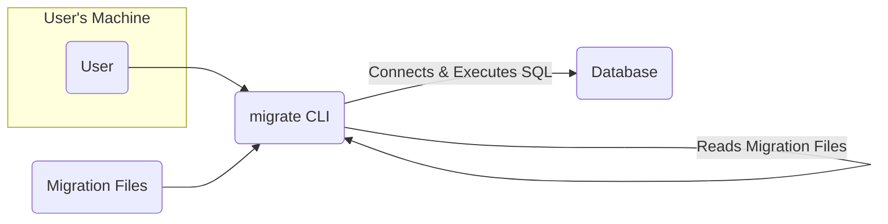
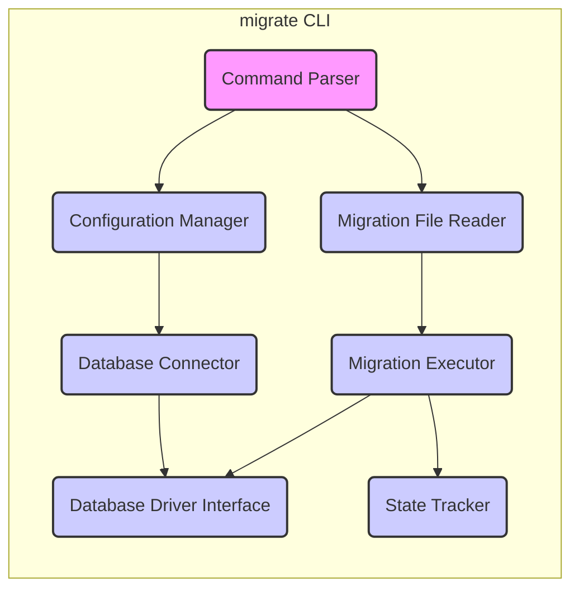
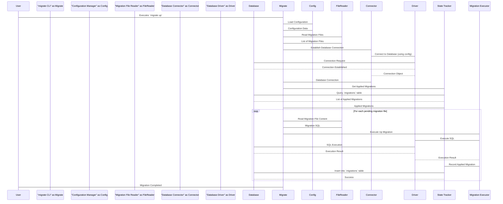

# Project Design Document: golang-migrate/migrate

**Version:** 1.1
**Date:** October 26, 2023
**Author:** AI Software Architect

## 1. Introduction

This document provides a detailed design overview of the `golang-migrate/migrate` project, a command-line tool written in Go for managing database schema migrations. This document aims to clearly articulate the system's architecture, components, and data flow to facilitate subsequent threat modeling activities. This revision incorporates minor clarifications and ensures strict adherence to markdown and Mermaid syntax requirements.

## 2. Goals and Non-Goals

### 2.1. Goals

*   Provide a reliable and efficient way to apply and revert database schema changes.
*   Support multiple database systems through database drivers.
*   Offer a simple and intuitive command-line interface.
*   Allow for versioning and tracking of database migrations.
*   Ensure idempotency of migration operations.
*   Provide mechanisms for handling migration failures.

### 2.2. Non-Goals

*   Providing a GUI for managing migrations.
*   Implementing database schema comparison or diffing tools.
*   Offering real-time migration capabilities during application runtime (primarily a CLI tool).
*   Managing application data migrations (focus is on schema changes).

## 3. System Architecture

The `migrate` tool operates as a command-line application that interacts with a database based on user-provided configuration and migration files.

### 3.1. High-Level Architecture

*   **User:** The individual or system invoking the `migrate` CLI.
*   **migrate CLI:** The core application responsible for reading configuration, parsing migration files, connecting to the database, and executing SQL statements.
*   **Migration Files:** Text files (typically SQL) containing the instructions for database schema changes.
*   **Database:** The target database system being managed by the migrations.

### 3.2. Component-Level Architecture

The `migrate` CLI can be further broken down into key functional components:

*   **Command Parser:** Responsible for interpreting the command-line arguments provided by the user (e.g., `up`, `down`, `create`). This component translates user intent into actionable instructions for the rest of the application.
*   **Configuration Manager:** Handles loading and validating configuration settings. This includes database connection details (DSN), migration file paths, and other operational options. Configuration can be sourced from various locations such as environment variables, configuration files (e.g., `.yaml`, `.toml`), or command-line flags, providing flexibility in deployment.
*   **Migration File Reader:** Reads and parses the migration files from the specified directory. It typically identifies files based on a predefined naming convention, often incorporating a version number and a descriptive name (e.g., `001_create_users_table.up.sql`, `001_create_users_table.down.sql`).
*   **Database Driver Interface:** An abstraction layer that provides a consistent set of functions for interacting with different database systems. This interface allows the core logic of `migrate` to remain independent of the specific database being used, with database-specific implementations provided by individual drivers (e.g., for PostgreSQL, MySQL, SQLite).
*   **Database Connector:** Responsible for establishing and managing the connection to the target database. It utilizes the appropriate database driver and the connection details obtained from the Configuration Manager to create a database session.
*   **Migration Executor:** Executes the SQL statements contained within the migration files against the connected database. It differentiates between "up" migrations (applying changes) and "down" migrations (reverting changes) based on the command and the content of the migration files.
*   **State Tracker:** Manages the history of applied migrations. This is typically achieved by storing the version numbers of successfully applied migrations in a dedicated database table (commonly named `migrations`). This table acts as a ledger, allowing `migrate` to determine which migrations need to be applied or reverted to reach the desired state.

## 4. Data Flow

The typical data flow for applying migrations (`migrate up`) is as follows:

Key data elements involved in this process:

*   **Configuration Data:**  Includes sensitive information such as database connection strings (potentially containing usernames and passwords), migration file paths, and the selected database driver. The source and security of this data are critical.
*   **Migration File Content:**  Contains the SQL statements that define the schema changes. These files are typically plain text and their integrity is paramount to prevent malicious modifications.
*   **Database Connection Object:** Represents the active connection to the database, encapsulating the necessary credentials and session information.
*   **List of Applied Migrations:**  A record of the migration versions that have been successfully applied to the database, usually stored in the `migrations` table. This data is used to determine the current state of the database schema.
*   **SQL Execution Results:**  Indicates the success or failure of each SQL statement executed against the database. Error messages from the database can provide valuable debugging information but should be handled carefully to avoid exposing sensitive details.

## 5. Security Considerations (Pre-Threat Modeling)

Before conducting a formal threat model, it's important to highlight potential areas of security concern that will be explored in more detail:

*   **Storage and Handling of Database Credentials:** The security of database credentials is paramount. Weak storage mechanisms (e.g., plain text in configuration files) or insecure transmission can lead to unauthorized access.
*   **Integrity of Migration Files:**  Compromised migration files pose a significant risk. Maliciously crafted SQL within these files could lead to data breaches, data corruption, or denial-of-service attacks. Mechanisms to ensure the integrity of these files are crucial.
*   **SQL Injection Vulnerabilities (Indirect):** While the tool primarily executes static SQL from files, vulnerabilities could arise if future features involve dynamic SQL generation based on user input or external data sources.
*   **Access Control to the `migrate` Tool and Resources:**  Restricting who can execute the `migrate` tool and access its configuration and migration files is essential to prevent unauthorized schema modifications.
*   **Dependency Management and Supply Chain Security:**  Vulnerabilities in the `migrate` tool's dependencies could be exploited. Regularly auditing and updating dependencies is important.
*   **Command Injection (Mitigation Focus):** While the current design is unlikely to be directly vulnerable, it's important to consider potential risks if future features involve executing external commands or scripts. Input sanitization would be critical in such scenarios.
*   **Security of the State Tracking Mechanism:**  If the `migrations` table is compromised or manipulated, the tool might apply or revert migrations incorrectly, leading to database inconsistencies and potential data loss.
*   **Error Handling and Information Disclosure:**  Carefully handling error messages is important to prevent the disclosure of sensitive information about the database structure, connection details, or internal system workings.

## 6. Deployment Considerations

The `migrate` tool is typically deployed as a standalone executable, often integrated into CI/CD pipelines or executed manually by developers or database administrators. Key deployment considerations include:

*   **Execution Environment Security:** The environment where the `migrate` tool is executed must have secure network access to the target database. Isolating this environment can reduce the risk of unauthorized access.
*   **Secure Credential Provisioning:**  Securely providing database credentials to the tool during execution is critical. Techniques like using secrets management tools (e.g., HashiCorp Vault, AWS Secrets Manager) or securely injected environment variables are recommended over storing credentials directly in configuration files.
*   **Migration File Version Control:** Migration files should be version-controlled alongside the application code to ensure consistency and allow for tracking changes.
*   **Principle of Least Privilege:** The user or service account running the `migrate` tool should be granted only the necessary database privileges to perform migrations. Avoid using overly permissive database accounts.
*   **Rollback and Recovery Strategy:**  A well-defined strategy for rolling back migrations in case of errors is essential. This includes having "down" migrations for all "up" migrations and testing the rollback process.

## 7. Future Considerations

Potential future enhancements that could impact the design and security posture of the `migrate` tool include:

*   **GUI Interface:** Adding a graphical user interface for managing migrations could introduce new attack vectors related to web application security (e.g., cross-site scripting, cross-site request forgery).
*   **Schema Diffing and Automatic Migration Generation:**  Integrating tools to automatically compare database schemas and generate migration scripts could introduce risks if the diffing logic is flawed or if user review of generated scripts is inadequate.
*   **Migration Hooks and Extensibility:** Allowing users to define custom scripts or plugins to run before or after migrations could introduce security risks if these extensions are not properly sandboxed or validated.
*   **Cloud Integrations and Managed Services:** Direct integration with cloud database services could introduce complexities related to cloud-specific authentication and authorization mechanisms.

This document provides a comprehensive and improved overview of the `golang-migrate/migrate` project's design. This detailed information will be valuable for conducting a thorough threat model to identify and mitigate potential security risks effectively.
