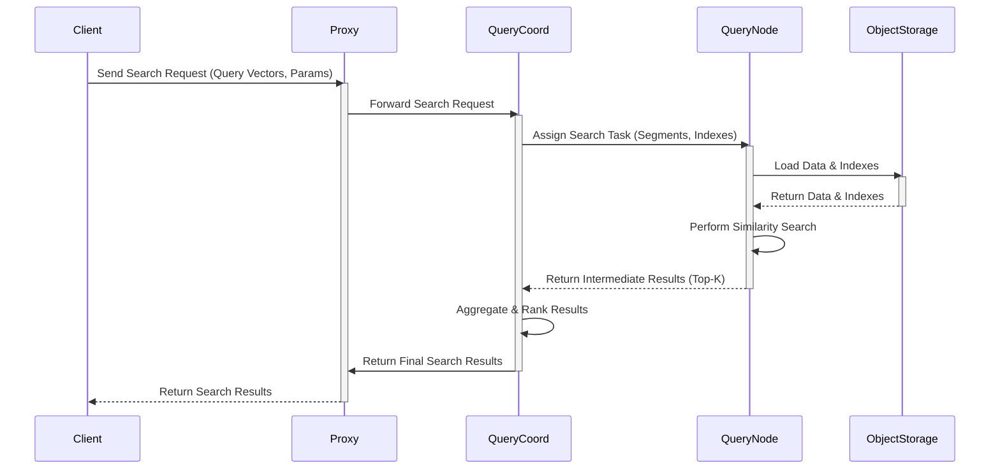

# Project Design Document: Milvus - An Open-Source Vector Database

**Version:** 1.1
**Date:** October 26, 2023
**Author:** AI Software Architect

## 1. Introduction

This document provides an enhanced and more detailed architectural design overview of the Milvus vector database system. It aims to provide a comprehensive understanding of the system's components, their interactions, and data flow, with a stronger focus on aspects relevant to security analysis and threat modeling.

## 2. Goals

*   Clearly define the architecture of the Milvus system with greater detail on component responsibilities.
*   Identify key components and their specific responsibilities, highlighting security-relevant functions.
*   Describe the data flow within the system with more granular steps and data types.
*   Highlight important architectural considerations specifically relevant for security analysis and threat modeling.
*   Provide improved visual representations of the system architecture and data flow.

## 3. Target Audience

This document is intended for:

*   Security engineers and architects responsible for in-depth threat modeling and security assessments.
*   Development teams working on or integrating with Milvus, requiring a deeper understanding of its internals.
*   Operations teams responsible for deploying, maintaining, and securing Milvus in production environments.

## 4. System Overview

Milvus is an open-source, cloud-native vector database built to manage large-scale embedding vectors generated by AI and machine learning applications. It excels at providing efficient similarity search and analytics over massive datasets. Milvus supports various indexing techniques and distance metrics, allowing users to optimize for different performance and accuracy trade-offs.

## 5. Architectural Design

The Milvus architecture is designed as a distributed system composed of several independent microservices that communicate over a network. This modular design allows for scalability, fault tolerance, and independent development.

### 5.1. Key Components and Responsibilities

*   **Client SDKs:**
    *   Provide programmatic interfaces for user interaction with Milvus.
    *   Responsibilities include: constructing requests, handling responses, and managing connections.
    *   Security Relevance: Potential point for client-side vulnerabilities if not implemented securely.
*   **Proxy:**
    *   Acts as the single entry point for all client requests.
    *   Responsibilities include: request routing, authentication, authorization (RBAC), request validation, load balancing across query nodes, and caching metadata.
    *   Security Relevance: Critical component for enforcing access control and preventing unauthorized access.
*   **Coordinator Service Group:**
    *   **RootCoord:**
        *   Responsibilities: global metadata management, cluster topology management, data definition language (DDL) operations (create/drop collection/partition/index), timestamp allocation, and ID allocation.
        *   Security Relevance: Compromise could lead to complete cluster control.
    *   **DataCoord:**
        *   Responsibilities: data node metadata management, data distribution and load balancing across data nodes, segment management, garbage collection, and flushing data to object storage.
        *   Security Relevance: Controls data placement and lifecycle.
    *   **IndexCoord:**
        *   Responsibilities: index node metadata management, index building task assignment and scheduling, and managing index lifecycle.
        *   Security Relevance: Controls how data is indexed for efficient searching.
    *   **QueryCoord:**
        *   Responsibilities: query node metadata management, query planning and decomposition, query routing to appropriate query nodes, and result aggregation.
        *   Security Relevance: Orchestrates query execution and data access.
*   **Worker Node Group:**
    *   **Data Node:**
        *   Responsibilities: storing and managing raw vector data and associated metadata for assigned segments, handling data ingestion (insert/delete), data compaction, and persisting data to object storage.
        *   Security Relevance: Holds the actual vector data, requiring strong security measures.
    *   **Index Node:**
        *   Responsibilities: building and managing indexes for vector data segments based on instructions from IndexCoord, and loading indexes from object storage.
        *   Security Relevance: Processes sensitive vector data during index building.
    *   **Query Node:**
        *   Responsibilities: executing vector similarity search queries on loaded data and indexes, and returning results.
        *   Security Relevance: Directly accesses and processes vector data for search operations.
*   **Metadata Store (Meta Store):**
    *   Responsibilities: persistent storage of all Milvus metadata, including collection schemas, partition information, segment metadata, index metadata, node status, and transaction logs.
    *   Implementation: Typically uses etcd for its distributed consensus and key-value storage capabilities.
    *   Security Relevance: Critical component; unauthorized access or corruption can compromise the entire system.
*   **Object Storage:**
    *   Responsibilities: persistent storage of raw vector data files and index files.
    *   Implementation: Supports various cloud object storage services (e.g., AWS S3, Azure Blob Storage, Google Cloud Storage) or on-premise solutions (e.g., MinIO).
    *   Security Relevance: Contains the persistent representation of vector data, requiring appropriate access controls and encryption.
*   **Message Queue (Message Broker):**
    *   Responsibilities: facilitating asynchronous communication and event notifications between different Milvus components, enabling decoupling and scalability.
    *   Implementation: Commonly uses Apache Kafka or Apache Pulsar.
    *   Security Relevance: Potential for message interception or tampering if not secured.
*   **Log Broker:**
    *   Responsibilities: centralized collection, aggregation, and management of logs from all Milvus components for monitoring, auditing, and debugging.
    *   Security Relevance: Important for security monitoring and incident response.

### 5.2. Component Interactions

The following list details the interactions between key components, highlighting the protocols and data exchanged:

*   Clients communicate with the **Proxy** via gRPC or REST APIs, sending requests for data manipulation (insert, delete), search, and data definition operations.
*   The **Proxy** authenticates clients against a configured authentication mechanism (e.g., username/password, API keys).
*   The **Proxy** authorizes requests based on Role-Based Access Control (RBAC) policies defined within Milvus metadata.
*   For DDL operations, the **Proxy** forwards requests to the **RootCoord** via gRPC.
*   For data insertion, the **Proxy** forwards requests to the **DataCoord** via gRPC, which coordinates data distribution to **Data Nodes**.
*   For vector search, the **Proxy** forwards requests to the **QueryCoord** via gRPC.
*   The **QueryCoord** plans the query and distributes sub-queries to relevant **Query Nodes** via gRPC.
*   **DataCoord** instructs **Data Nodes** to ingest data and flush to **Object Storage** via gRPC.
*   **IndexCoord** assigns index building tasks to **Index Nodes** via gRPC.
*   **Data Nodes** persist vector data to **Object Storage** using storage-specific APIs (e.g., AWS SDK for S3).
*   **Index Nodes** build indexes and store them in **Object Storage** using storage-specific APIs.
*   All coordinator nodes persist and retrieve metadata from the **Meta Store** (etcd) using its client API.
*   Components communicate asynchronously via the **Message Queue** (Kafka/Pulsar) for events like segment sealing and index building completion.
*   All components send log data to the **Log Broker** via standard logging protocols.

## 6. Data Flow

This section details the data flow for key operations, emphasizing the movement and transformation of data.

### 6.1. Data Insertion Flow

1. A client sends an insert request containing vector data and associated metadata to the **Proxy** via gRPC.
2. The **Proxy** authenticates and authorizes the request.
3. The **Proxy** forwards the request to the **DataCoord**.
4. The **DataCoord** determines the target **Data Node(s)** based on load balancing and collection partitioning strategy.
5. The **DataCoord** sends an instruction to the target **Data Node(s)** via gRPC, including the vector data and metadata.
6. The **Data Node(s)** write the vector data to in-memory buffers (MemTable).
7. Periodically, or upon reaching a threshold, the **Data Node(s)** flush the MemTable data to **Object Storage** as immutable data files (SSTables).
8. The **Data Node(s)** update metadata in the **Meta Store** about the new data segments.
9. Optionally, the **IndexCoord** is notified about the new segment and may schedule index building on an **Index Node**.

### 6.2. Vector Search Flow

1. A client sends a search request containing query vectors, search parameters (e.g., `nprobe`), and collection name to the **Proxy** via gRPC.
2. The **Proxy** authenticates and authorizes the request.
3. The **Proxy** forwards the request to the **QueryCoord**.
4. The **QueryCoord** analyzes the request and determines the relevant data segments and indexes based on metadata.
5. The **QueryCoord** identifies available and healthy **Query Nodes**.
6. The **QueryCoord** plans the query execution and distributes sub-queries to selected **Query Nodes** via gRPC, specifying the segments and indexes to search.
7. The **Query Node(s)** load necessary data and indexes from **Object Storage** into their local cache.
8. The **Query Node(s)** perform the similarity search using the specified algorithm and parameters.
9. The **Query Node(s)** return the intermediate search results (top-k vectors) to the **QueryCoord**.
10. The **QueryCoord** aggregates the results from all **Query Nodes** and performs a final ranking.
11. The **QueryCoord** returns the final search results to the **Proxy**.
12. The **Proxy** sends the results back to the client.

## 7. Security Considerations

This section expands on the preliminary security considerations, providing more specific details relevant for threat modeling.

*   **Authentication and Authorization:**
    *   The **Proxy** is the primary enforcement point for authentication (verifying user identity) and authorization (verifying user permissions).
    *   Milvus supports RBAC, allowing granular control over access to collections and operations.
    *   Threats: Unauthorized access to data, privilege escalation.
    *   Mitigation: Strong authentication mechanisms, regularly reviewed and updated RBAC policies.
*   **Network Security:**
    *   Communication between components should be secured using TLS/SSL encryption to protect data in transit.
    *   Network segmentation should be implemented to isolate different parts of the system (e.g., separating client-facing components from internal components).
    *   Threats: Man-in-the-middle attacks, eavesdropping, unauthorized access to internal services.
    *   Mitigation: Enforce TLS for all internal and external communication, firewall rules, network policies.
*   **Data Encryption:**
    *   Data at rest in **Object Storage** should be encrypted using server-side or client-side encryption.
    *   Consider encrypting data in transit between **Data Nodes** and **Object Storage**.
    *   Threats: Unauthorized access to persistent data.
    *   Mitigation: Enable encryption at rest for object storage, explore encryption for internal data transfer.
*   **Access Control to Metadata Store:**
    *   Access to the **Meta Store** (etcd) should be strictly controlled, as it contains sensitive configuration and metadata.
    *   Implement authentication and authorization for etcd access.
    *   Threats: Data corruption, unauthorized configuration changes, information disclosure.
    *   Mitigation: Secure etcd deployment, restrict access to authorized components only.
*   **Input Validation:**
    *   The **Proxy** and other components processing client input must perform thorough input validation to prevent injection attacks (e.g., SQL injection, command injection).
    *   Threats: Data manipulation, system compromise.
    *   Mitigation: Implement robust input validation and sanitization.
*   **Dependency Management:**
    *   Regularly scan dependencies for known vulnerabilities and update them promptly.
    *   Threats: Exploitation of vulnerabilities in third-party libraries.
    *   Mitigation: Use dependency scanning tools, maintain an up-to-date dependency list.
*   **Logging and Auditing:**
    *   Comprehensive logging and auditing of all security-relevant events (e.g., authentication attempts, authorization decisions, data access) are crucial for security monitoring and incident response.
    *   Threats: Undetected security breaches, difficulty in forensic analysis.
    *   Mitigation: Configure detailed logging, centralize logs in the **Log Broker**, implement alerting for suspicious activity.
*   **Secrets Management:**
    *   Securely manage sensitive information like database credentials, API keys, and encryption keys using a dedicated secrets management solution.
    *   Threats: Exposure of sensitive credentials leading to unauthorized access.
    *   Mitigation: Use a secrets manager (e.g., HashiCorp Vault), avoid storing secrets in code or configuration files.
*   **Resource Management:**
    *   Implement resource limits and quotas to prevent denial-of-service (DoS) attacks.
    *   Threats: Service unavailability due to resource exhaustion.
    *   Mitigation: Configure resource limits (CPU, memory), implement rate limiting.

## 8. Deployment Considerations

The chosen deployment model significantly impacts the security posture of Milvus.

*   **Standalone:** Simplest deployment, but security relies heavily on the host operating system's security. Not recommended for production environments with sensitive data.
*   **Distributed (Kubernetes):** Offers better scalability and resilience. Security considerations include securing the Kubernetes cluster itself (RBAC, network policies, secrets management).
*   **Cloud-managed Services:** Security responsibilities are shared with the cloud provider. Understand the provider's security measures and your own responsibilities within the shared responsibility model.

## 9. Diagrams

### 9.1. High-Level Architecture Diagram (Improved)

```mermaid
graph LR
    subgraph "Client Applications"
        CA("Client App 1")
        CB("Client App 2")
        CC("Client App N")
    end
    subgraph "Milvus Cluster"
        direction LR
        LB("Load Balancer") --> P("Proxy")
        subgraph "Coordinator Group"
            RC["RootCoord"]
            DC["DataCoord"]
            IC["IndexCoord"]
            QC["QueryCoord"]
        end
        subgraph "Worker Group"
            DN1["Data Node 1"]
            DNn["Data Node N"]
            IN1["Index Node 1"]
            INn["Index Node N"]
            QN1["Query Node 1"]
            QNn["Query Node N"]
        end
        MS["Meta Store (etcd)"]
        OS["Object Storage"]
        MQ["Message Queue (Kafka/Pulsar)"]
        LG["Log Broker"]

        P -- gRPC --> RC
        P -- gRPC --> DC
        P -- gRPC --> IC
        P -- gRPC --> QC

        QC -- gRPC --> QN1
        QC -- gRPC --> QNn

        DC -- gRPC --> DN1
        DC -- gRPC --> DNn

        IC -- gRPC --> IN1
        IC -- gRPC --> INn

        DN1 -- Storage API --> OS
        DNn -- Storage API --> OS
        IN1 -- Storage API --> OS
        INn -- Storage API --> OS

        RC -- API --> MS
        DC -- API --> MS
        IC -- API --> MS
        QC -- API --> MS
        DN1 -- API --> MS
        DNn -- API --> MS
        IN1 -- API --> MS
        INn -- API --> MS
        P -- API --> MS

        Coordinator Group -- Async Events --> MQ
        Worker Group -- Async Events --> MQ

        Coordinator Group -- Logs --> LG
        Worker Group -- Logs --> LG
        P -- Logs --> LG
    end
    CA --> LB
    CB --> LB
    CC --> LB
```

### 9.2. Data Flow Diagram (Search Operation - Detailed)



## 10. Future Considerations

*   Enhanced authentication and authorization options (e.g., integration with external identity providers).
*   More granular access control mechanisms (e.g., row-level security).
*   Advanced security features like data masking and encryption at the field level.
*   Improved security auditing and compliance features.

## 11. Conclusion

This improved design document provides a more detailed and security-focused overview of the Milvus architecture. It highlights key components, their responsibilities, and the data flow, with a strong emphasis on security considerations relevant for threat modeling. This document serves as a solid foundation for identifying potential vulnerabilities and designing appropriate security controls to protect the Milvus system and its data.