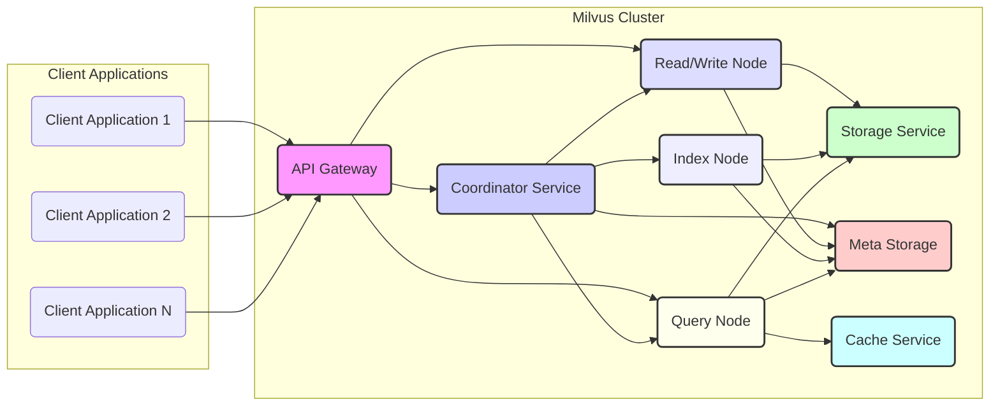
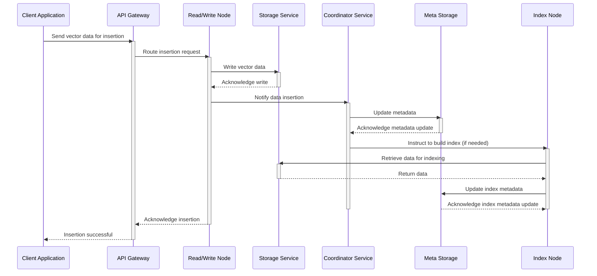
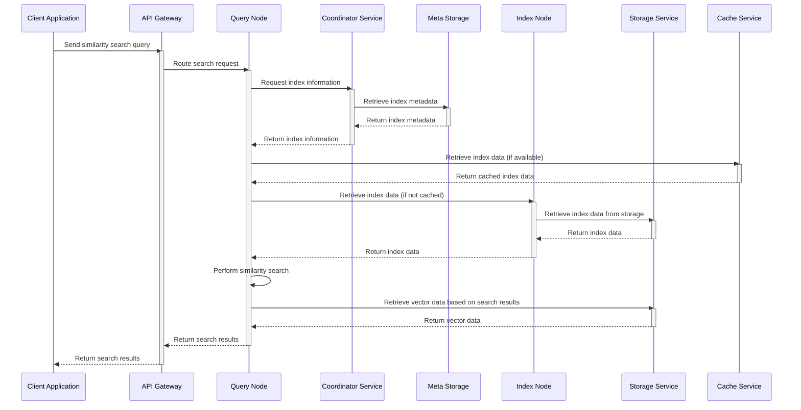

# Project Design Document: Milvus - Vector Database

**Version:** 1.1
**Date:** October 26, 2023
**Author:** AI Software Architect

## 1. Introduction

This document provides an enhanced and more detailed design overview of the Milvus vector database system. It elaborates on the key architectural components, data flows, and deployment considerations, with a stronger focus on aspects relevant to threat modeling. This document serves as a refined foundation for subsequent security analysis and risk assessment.

## 2. Goals and Objectives

The primary goals of Milvus are to:

*   Provide a scalable and reliable platform for storing, indexing, and searching massive-scale vector embeddings.
*   Offer high-performance similarity search capabilities for various applications like recommendation systems, image retrieval, and natural language processing.
*   Support diverse indexing algorithms to optimize search performance for different data characteristics and query requirements.
*   Enable easy integration with existing data pipelines and machine learning workflows through well-defined APIs.
*   Offer flexible deployment options, including standalone, distributed, and cloud-native deployments, while considering the security implications of each.

## 3. Architecture Overview

Milvus employs a distributed architecture to achieve scalability, high availability, and fault tolerance. The core components interact in a coordinated manner to manage the lifecycle of vector data, from ingestion to querying.

## 4. Component Details

This section provides a more granular description of each major component, highlighting their responsibilities, data handled, and key interactions.

*   **API Gateway:**
    *   **Responsibilities:**
        *   Primary entry point for client interactions.
        *   Authentication and authorization of client requests.
        *   Request routing to appropriate internal services.
        *   Rate limiting and request validation to prevent abuse.
        *   TLS termination for secure communication.
    *   **Data Handled:** Client requests (insert, search, delete, etc.), authentication credentials, API keys.
    *   **Key Interactions:** Communicates with all other core components (Coordinator, Read/Write, Query).

*   **Coordinator Service:**
    *   **Responsibilities:**
        *   Central management of the Milvus cluster state.
        *   Metadata management (collections, schemas, indexes, segments).
        *   Load balancing and resource allocation across nodes.
        *   Coordination of data ingestion, indexing, and query operations.
        *   Node health monitoring and failure detection.
        *   Maintaining data consistency through the Meta Storage.
    *   **Data Handled:** Cluster metadata, node status, task assignments, configuration information.
    *   **Key Interactions:** Interacts with all other core components, especially Meta Storage.

*   **Read/Write Node (Data Node):**
    *   **Responsibilities:**
        *   Storage and management of raw vector data.
        *   Handling data ingestion from the API Gateway.
        *   Persistence of vector data to the Storage Service.
        *   Management of data segments and their lifecycle (creation, sealing).
        *   Real-time data updates and deletions.
        *   Potential for initial data processing or transformation.
    *   **Data Handled:** Raw vector embeddings, associated metadata.
    *   **Key Interactions:** Communicates with API Gateway, Coordinator Service, and Storage Service.

*   **Index Node:**
    *   **Responsibilities:**
        *   Building and managing indexes for vector data to accelerate search.
        *   Supporting various indexing algorithms (e.g., IVF, HNSW, Annoy).
        *   Retrieving data from the Storage Service to build indexes.
        *   Storing index data, potentially in a separate optimized storage.
        *   Providing indexed data to Query Nodes for efficient search execution.
    *   **Data Handled:** Index data structures, metadata about indexes.
    *   **Key Interactions:** Communicates with Coordinator Service, Storage Service, and Query Nodes.

*   **Query Node:**
    *   **Responsibilities:**
        *   Processing similarity search queries from the API Gateway.
        *   Retrieving relevant index data from Index Nodes (potentially via Cache Service).
        *   Performing the actual similarity search using the selected indexing algorithm.
        *   Retrieving the corresponding vector data from the Storage Service.
        *   Potentially caching query results for improved performance.
    *   **Data Handled:** Search queries, intermediate search results, final search results.
    *   **Key Interactions:** Communicates with API Gateway, Coordinator Service, Index Nodes, Storage Service, and Cache Service.

*   **Storage Service:**
    *   **Responsibilities:**
        *   Providing persistent storage for vector data and potentially index data.
        *   Ensuring data durability and availability.
        *   Scalable storage capacity to handle large datasets.
        *   Examples: Object storage (AWS S3, Azure Blob Storage, GCS), distributed file systems.
    *   **Data Handled:** Raw vector embeddings, potentially index data.
    *   **Key Interactions:** Accessed by Read/Write Nodes, Index Nodes, and Query Nodes.

*   **Meta Storage:**
    *   **Responsibilities:**
        *   Storing critical metadata about the Milvus cluster.
        *   Ensuring data consistency and fault tolerance for metadata.
        *   Facilitating coordination between different components.
        *   Examples: Etcd, ZooKeeper.
    *   **Data Handled:** Collection schemas, index information, node status, segment metadata, user and permission information.
    *   **Key Interactions:** Primarily accessed by the Coordinator Service, but also by other components for read operations.

*   **Cache Service:**
    *   **Responsibilities:**
        *   Optional component to improve query performance.
        *   Caching frequently accessed index data or query results.
        *   Reducing latency for repeated queries.
        *   Examples: Redis, Memcached.
    *   **Data Handled:** Index data, query results.
    *   **Key Interactions:** Primarily used by Query Nodes.

## 5. Data Flow

This section details the data flow for critical operations, providing a clearer picture for threat analysis.

### 5.1. Data Insertion

### 5.2. Similarity Search

## 6. Deployment Model

Milvus offers several deployment options, each with distinct security considerations.

*   **Standalone Deployment:**
    *   All components run on a single machine.
    *   **Security Considerations:** Limited isolation between components. Vulnerabilities in one component could potentially affect others. Network security is less critical as all communication is local. Not suitable for production environments with sensitive data.

*   **Distributed Deployment (e.g., Kubernetes):**
    *   Components are deployed as separate containers or pods across multiple nodes.
    *   **Security Considerations:** Requires robust network security policies (NetworkPolicies in Kubernetes). Inter-service communication should be secured (e.g., mTLS). Proper role-based access control (RBAC) is crucial for managing access to cluster resources. Secrets management becomes more complex.

*   **Cloud-Native Deployment (Managed Services):**
    *   Leverages cloud provider managed services for components like storage, compute, and potentially even Milvus itself.
    *   **Security Considerations:** Security is a shared responsibility model. Leverage cloud provider security features (e.g., IAM, VPCs, security groups, encryption at rest and in transit). Understand the security posture of the managed services used. Compliance requirements may influence the choice of cloud provider and services.

## 7. Security Considerations

This section expands on the initial security considerations, providing more context for threat modeling.

*   **Authentication and Authorization:**
    *   **API Gateway:** Enforces authentication for all external requests. Consider various authentication methods (API keys, OAuth 2.0). Authorization mechanisms to control access to specific operations and data.
    *   **Internal Communication:** Secure authentication and authorization between internal components are crucial. mTLS can be used to verify the identity of communicating services.
    *   **Meta Storage:** Access to the Meta Storage should be strictly controlled as it contains sensitive metadata.

*   **Data Encryption:**
    *   **At Rest:** Vector data in the Storage Service and metadata in the Meta Storage should be encrypted. Consider using cloud provider managed encryption keys or customer-managed keys.
    *   **In Transit:** All communication between clients and the API Gateway (TLS) and between internal components (mTLS) should be encrypted.

*   **Network Security:**
    *   **Network Segmentation:** Isolate the Milvus cluster within a private network. Use firewalls or security groups to restrict access.
    *   **Service Mesh:** Consider using a service mesh for enhanced security features like traffic encryption, authentication, and authorization.

*   **Input Validation:**
    *   **API Gateway:** Rigorous validation of all client inputs to prevent injection attacks (e.g., SQL injection if metadata is stored in a relational database, command injection).

*   **Access Control:**
    *   Implement fine-grained access control based on roles and permissions. Control who can create collections, insert data, perform searches, and manage the cluster.

*   **Secrets Management:**
    *   Securely store and manage sensitive credentials like database passwords, API keys, and certificates. Use dedicated secrets management tools (e.g., HashiCorp Vault, cloud provider secrets managers).

*   **Auditing and Logging:**
    *   Comprehensive logging of all API requests, internal component interactions, and security-related events. Centralized logging and monitoring for security analysis and incident response.

*   **Dependency Management:**
    *   Regularly scan dependencies for known vulnerabilities and update them promptly.

## 8. Assumptions and Constraints

*   The underlying network infrastructure provides reliable and secure communication channels.
*   The chosen storage service and meta storage offer the required security features and compliance certifications.
*   Security best practices will be followed throughout the development and deployment lifecycle.
*   The deployment environment adheres to security policies and regulations.

## 9. Future Considerations

*   Integration with more advanced authentication and authorization systems.
*   Enhanced data masking and anonymization capabilities.
*   Support for data lineage tracking for security and compliance purposes.
*   Implementation of intrusion detection and prevention systems.

This improved design document provides a more detailed and security-focused overview of the Milvus architecture, making it a more effective foundation for comprehensive threat modeling activities.