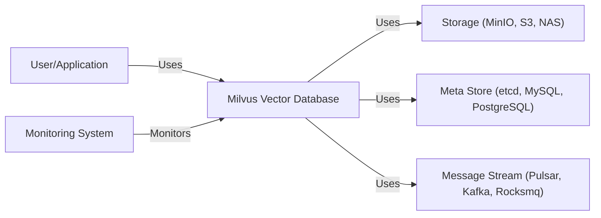
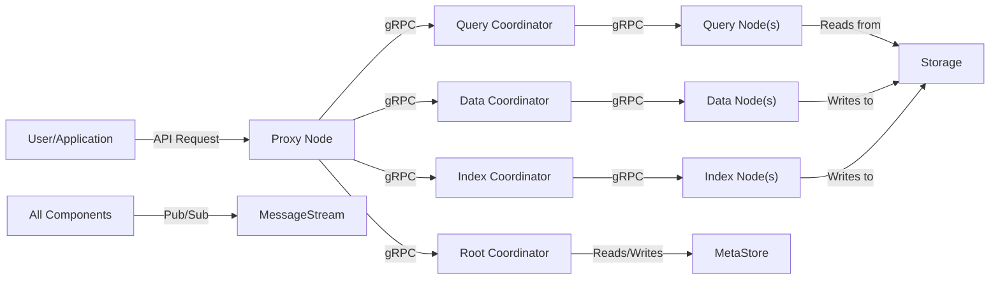
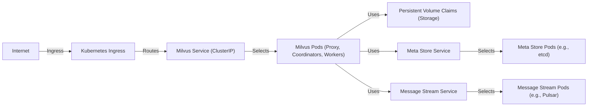
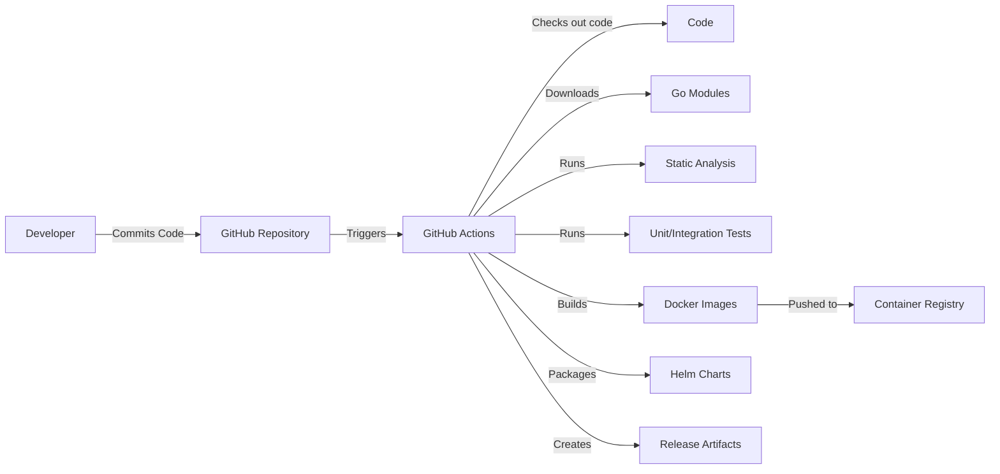

Okay, let's create a design document for the Milvus vector database project, focusing on aspects relevant for threat modeling.

# BUSINESS POSTURE

Milvus is an open-source vector database designed for scalable similarity search and AI applications.  It's used for managing, storing, and querying large-scale vector embeddings generated by deep neural networks and other machine learning models.  The business priorities and goals appear to be:

*   Provide a high-performance, scalable, and reliable vector database solution.
*   Foster a strong open-source community and ecosystem around vector search.
*   Enable a wide range of AI applications, including image search, recommendation systems, and natural language processing.
*   Offer both self-hosted and cloud-based (SaaS) deployment options (implied, but crucial for business).
*   Maintain a competitive edge in the rapidly evolving vector database market.

Based on these, the most important business risks are:

*   Data breaches or unauthorized access to sensitive vector data and associated metadata.  This is paramount, as the data managed by Milvus can represent sensitive information (e.g., biometric data, user preferences, intellectual property).
*   System downtime or performance degradation impacting user applications.  Reliability and performance are core value propositions.
*   Vulnerabilities that could allow attackers to compromise the database or the underlying infrastructure.
*   Failure to keep pace with advancements in vector search technology and competitor offerings.
*   Supply chain attacks that compromise the integrity of the Milvus codebase or its dependencies.
*   Lack of compliance with relevant data privacy regulations (e.g., GDPR, CCPA).

# SECURITY POSTURE

Based on the provided GitHub repository, the following security controls and accepted risks can be identified.  This is an initial assessment and would require deeper investigation for a complete picture.

*   security control: Authentication: Milvus supports username/password authentication. (Mentioned in documentation).
*   security control: Authorization: Milvus has basic Role-Based Access Control (RBAC) (Mentioned in documentation).
*   security control: Encryption in transit: TLS/SSL can be configured for secure communication between clients and the server, and between Milvus components. (Mentioned in documentation).
*   security control: Dependency management: Go modules are used for dependency management.
*   security control: Code scanning: Some static analysis tools appear to be used (from GitHub Actions).
*   security control: Regular releases: The project has a regular release cycle, suggesting ongoing maintenance and patching.
*   accepted risk: Limited auditing capabilities: While logging exists, comprehensive audit trails for all data access and administrative actions may be limited (needs further investigation).
*   accepted risk: Encryption at rest: Encryption at rest is not explicitly enabled by default and relies on underlying storage solutions (needs further investigation).
*   accepted risk: Focus on functionality over advanced security features: As a relatively new and rapidly evolving project, the initial focus might be on core functionality and performance, with advanced security features potentially lagging.
*   accepted risk: Community reliance: Security heavily relies on community contributions and vulnerability reporting.

Recommended Security Controls (High Priority):

*   Implement comprehensive audit logging for all data access, administrative actions, and security-relevant events.
*   Enable encryption at rest by default, or provide clear guidance and tooling for users to easily configure it.
*   Implement robust input validation and sanitization to prevent injection attacks.
*   Conduct regular security assessments and penetration testing.
*   Establish a clear security vulnerability disclosure and response process.
*   Integrate Software Bill of Materials (SBOM) generation and vulnerability scanning into the build process.

Security Requirements:

*   Authentication:
    *   Support for strong authentication mechanisms, including multi-factor authentication (MFA).
    *   Integration with external identity providers (e.g., LDAP, OAuth 2.0).
    *   Secure password storage using strong hashing algorithms.
*   Authorization:
    *   Fine-grained access control at the collection, partition, and field levels.
    *   Support for attribute-based access control (ABAC).
    *   Regular review and auditing of user permissions.
*   Input Validation:
    *   Strict validation of all user-supplied input, including vector data, metadata, and query parameters.
    *   Protection against common injection attacks (e.g., SQL injection, NoSQL injection).
    *   Use of parameterized queries and prepared statements.
*   Cryptography:
    *   Use of strong, industry-standard cryptographic algorithms and libraries.
    *   Secure key management practices.
    *   Regular review and updates of cryptographic configurations.
    *   Support for Hardware Security Modules (HSMs) for sensitive key storage.

# DESIGN

## C4 CONTEXT

*   Elements Description:
    *   Name: User/Application
        *   Type: User
        *   Description: Represents a user or an application that interacts with Milvus to store, manage, and query vector data.
        *   Responsibilities: Sending requests to Milvus, receiving responses, handling data.
        *   Security controls: Authentication, authorization (handled by Milvus).
    *   Name: Milvus Vector Database
        *   Type: System
        *   Description: The core Milvus system responsible for handling vector data operations.
        *   Responsibilities: Managing vector data, performing similarity searches, handling client requests.
        *   Security controls: Authentication, authorization, encryption in transit, input validation.
    *   Name: Storage
        *   Type: System
        *   Description: Persistent storage for vector data.
        *   Responsibilities: Storing and retrieving vector data.
        *   Security controls: Encryption at rest (dependent on the specific storage solution), access controls.
    *   Name: Meta Store
        *   Type: System
        *   Description: Stores metadata about collections, partitions, and indexes.
        *   Responsibilities: Managing metadata, ensuring data consistency.
        *   Security controls: Access controls, data integrity checks.
    *   Name: Message Stream
        *   Type: System
        *   Description: Used for asynchronous communication and data streaming.
        *   Responsibilities: Handling message queues, ensuring reliable message delivery.
        *   Security controls: Access controls, encryption in transit.
    *   Name: Monitoring System
        *   Type: System
        *   Description: Monitors the health and performance of Milvus.
        *   Responsibilities: Collecting metrics, generating alerts.
        *   Security controls: Access controls.

## C4 CONTAINER

*   Elements Description:

    *   Name: User/Application
        *   Type: User
        *   Description: Represents a user or an application interacting with Milvus.
        *   Responsibilities: Sending requests, receiving responses.
        *   Security controls: Authentication, authorization (handled by Milvus).
    *   Name: Proxy Node
        *   Type: Container
        *   Description: Entry point for client requests.  Handles load balancing and request routing.
        *   Responsibilities: Receiving client requests, routing requests to appropriate coordinators, returning responses to clients.
        *   Security controls: Authentication, authorization, TLS termination.
    *   Name: Query Coordinator
        *   Type: Container
        *   Description: Manages query execution and coordinates Query Nodes.
        *   Responsibilities: Planning query execution, distributing queries to Query Nodes, aggregating results.
        *   Security controls: Access controls.
    *   Name: Data Coordinator
        *   Type: Container
        *   Description: Manages data ingestion and persistence. Coordinates Data Nodes.
        *   Responsibilities: Handling data insertion, deletion, and compaction, managing data segments.
        *   Security controls: Access controls.
    *   Name: Index Coordinator
        *   Type: Container
        *   Description: Manages index building and maintenance. Coordinates Index Nodes.
        *   Responsibilities: Building and updating indexes, managing index segments.
        *   Security controls: Access controls.
    *   Name: Root Coordinator
        *   Type: Container
        *   Description: Manages metadata and global state.
        *   Responsibilities: Managing collections, partitions, and indexes metadata, handling DDL operations.
        *   Security controls: Access controls.
    *   Name: Query Node(s)
        *   Type: Container
        *   Description: Executes search queries on vector data.
        *   Responsibilities: Loading data segments, performing similarity searches, returning results.
        *   Security controls: Access controls.
    *   Name: Data Node(s)
        *   Type: Container
        *   Description: Stores and manages vector data segments.
        *   Responsibilities: Storing data segments, handling data ingestion and compaction.
        *   Security controls: Access controls.
    *   Name: Index Node(s)
        *   Type: Container
        *   Description: Builds and stores index data.
        *   Responsibilities: Building indexes, storing index segments.
        *   Security controls: Access controls.
    *   Name: Storage
        *   Type: System
        *   Description: Persistent storage for vector and index data (e.g., MinIO, S3, NAS).
        *   Responsibilities: Storing and retrieving data.
        *   Security controls: Encryption at rest (dependent on the specific storage solution), access controls.
    *   Name: Meta Store
        *   Type: System
        *   Description: Stores metadata (e.g., etcd, MySQL, PostgreSQL).
        *   Responsibilities: Managing metadata.
        *   Security controls: Access controls, data integrity checks.
    *   Name: Message Stream
        *   Type: System
        *   Description: Used for asynchronous communication (e.g., Pulsar, Kafka, Rocksmq).
        *   Responsibilities: Handling message queues.
        *   Security controls: Access controls, encryption in transit.

## DEPLOYMENT

Milvus supports various deployment options, including:

1.  Standalone: Single-node deployment for testing and development.
2.  Cluster: Distributed deployment for production, using Kubernetes or bare-metal servers.
3.  Cloud-based: Managed service on cloud platforms (e.g., Zilliz Cloud).

We'll describe the Kubernetes deployment in detail, as it's the most common for production environments.

*   Elements Description:

    *   Name: Internet
        *   Type: External
        *   Description: The public internet.
        *   Responsibilities: N/A
        *   Security controls: N/A
    *   Name: Kubernetes Ingress
        *   Type: Node
        *   Description: Kubernetes Ingress controller for managing external access to Milvus.
        *   Responsibilities: Routing external traffic to the Milvus service.
        *   Security controls: TLS termination, access controls.
    *   Name: Milvus Service (ClusterIP)
        *   Type: Node
        *   Description: Kubernetes Service for internal access to Milvus pods.
        *   Responsibilities: Providing a stable endpoint for accessing Milvus pods.
        *   Security controls: Network policies.
    *   Name: Milvus Pods (Proxy, Coordinators, Workers)
        *   Type: Node
        *   Description: Kubernetes Pods running Milvus components.
        *   Responsibilities: Running Milvus processes.
        *   Security controls: Pod security policies, resource limits.
    *   Name: Persistent Volume Claims (Storage)
        *   Type: Node
        *   Description: Kubernetes Persistent Volume Claims for accessing persistent storage.
        *   Responsibilities: Providing persistent storage for Milvus data.
        *   Security controls: Storage-level encryption, access controls.
    *   Name: Meta Store Service
        *   Type: Node
        *   Description: Kubernetes Service for accessing the Meta Store.
        *   Responsibilities: Providing a stable endpoint for accessing the Meta Store.
        *   Security controls: Network policies.
    *   Name: Meta Store Pods (e.g., etcd)
        *   Type: Node
        *   Description: Kubernetes Pods running the Meta Store (e.g., etcd).
        *   Responsibilities: Running the Meta Store processes.
        *   Security controls: Pod security policies, resource limits.
    *   Name: Message Stream Service
        *   Type: Node
        *   Description: Kubernetes Service for accessing the Message Stream.
        *   Responsibilities: Providing a stable endpoint for accessing the Message Stream.
        *   Security controls: Network policies.
    *   Name: Message Stream Pods (e.g., Pulsar)
        *   Type: Node
        *   Description: Kubernetes Pods running the Message Stream (e.g., Pulsar).
        *   Responsibilities: Running the Message Stream processes.
        *   Security controls: Pod security policies, resource limits.

## BUILD

Milvus uses GitHub Actions for its CI/CD pipeline. The build process can be summarized as follows:

1.  Developer commits code to the GitHub repository.
2.  GitHub Actions triggers a workflow based on the commit or pull request.
3.  The workflow checks out the code.
4.  Go modules are downloaded and verified.
5.  Static analysis tools (e.g., linters, code scanners) are run.
6.  Unit tests and integration tests are executed.
7.  Docker images are built for each Milvus component.
8.  Docker images are pushed to a container registry (e.g., Docker Hub).
9.  Helm charts are packaged for Kubernetes deployments.
10. Release artifacts are created and published.

Security Controls in Build Process:

*   security control: Dependency management: Go modules with checksum verification.
*   security control: Static analysis: Code linters and scanners (details need to be confirmed from the specific GitHub Actions configuration).
*   security control: Automated testing: Unit and integration tests.
*   security control: Containerization: Docker images for reproducible builds and deployments.
*   security control: Version control: Git for tracking code changes and facilitating rollbacks.

# RISK ASSESSMENT

*   Critical Business Processes:
    *   Storing and managing vector embeddings.
    *   Performing similarity searches.
    *   Providing a reliable and scalable service for AI applications.

*   Data to Protect:
    *   Vector embeddings: These can represent sensitive information, depending on the application (e.g., biometric data, user preferences, intellectual property). Sensitivity: High.
    *   Metadata associated with vectors: This can include information about the data source, creation time, and other relevant details. Sensitivity: Medium to High.
    *   User credentials and access tokens: Used for authentication and authorization. Sensitivity: High.
    *   Configuration data: This includes settings for the database, storage, and other components. Sensitivity: Medium.
    *   Logs: Audit logs and system logs can contain sensitive information about user activity and system events. Sensitivity: Medium.

# QUESTIONS & ASSUMPTIONS

*   Questions:
    *   What are the specific compliance requirements (e.g., GDPR, CCPA) that Milvus needs to adhere to?
    *   What are the threat models and attack scenarios that have been considered during the development of Milvus?
    *   What are the specific static analysis tools and configurations used in the GitHub Actions workflows?
    *   What are the procedures for handling security vulnerabilities and incidents?
    *   What are the plans for implementing more advanced security features, such as fine-grained access control and auditing?
    *   Are there any performance benchmarks related to security features, like encryption?
    *   How are secrets (e.g., API keys, database credentials) managed in different deployment environments?
    *   What is the process for rotating encryption keys?
    *   What level of support is provided for different storage backends in terms of security features like encryption at rest?

*   Assumptions:
    *   BUSINESS POSTURE: The primary goal is to provide a high-performance vector database, with security being a critical but potentially secondary consideration in the early stages of development.
    *   SECURITY POSTURE: Basic security controls are in place, but there is room for improvement, especially in areas like auditing, encryption at rest, and fine-grained access control.
    *   DESIGN: The architecture is designed for scalability and performance, with security considerations integrated into the design but potentially not fully optimized. The Kubernetes deployment is the primary focus for production environments. The build process relies on GitHub Actions and standard security practices, but further hardening may be needed.