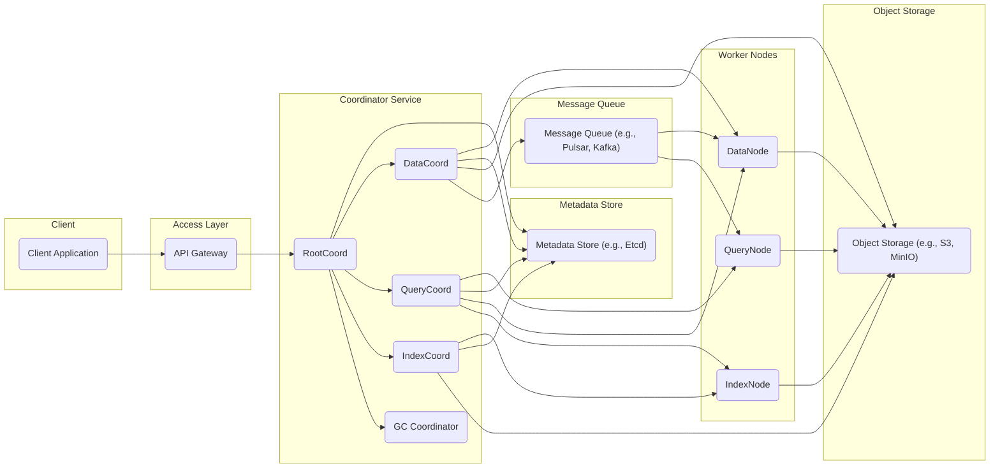
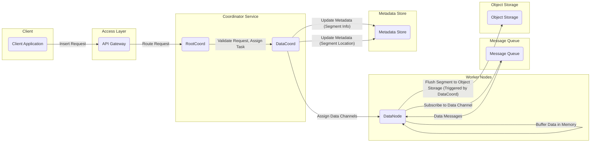
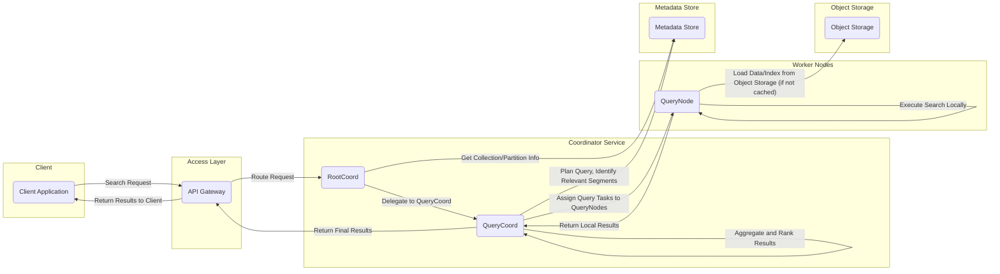

# Project Design Document: Milvus - An Open-Source Vector Database

**Version:** 1.1
**Date:** October 26, 2023
**Author:** AI Software Architect

## 1. Introduction

This document provides a detailed architectural design of the Milvus project, an open-source vector database. This design document is intended to serve as a comprehensive resource for security analysis and threat modeling activities, enabling a thorough evaluation of the system's security posture. It outlines the key components, their responsibilities, interactions, data flow, and deployment considerations.

## 2. Goals and Objectives

The primary goal of this design document is to provide a clear, detailed, and accurate representation of the Milvus architecture specifically for security analysis and threat modeling. Specific objectives include:

*   Clearly identifying all major components within the Milvus system.
*   Precisely describing the responsibilities, functionalities, and key interfaces of each component.
*   Visually illustrating the interactions and data flow between these components using diagrams.
*   Outlining common and significant deployment models for Milvus, highlighting architectural variations.
*   Listing the core technologies and dependencies that are critical for understanding potential vulnerabilities.
*   Providing an initial set of security considerations to guide subsequent threat modeling efforts.

## 3. High-Level Architecture

Milvus employs a distributed, shared-storage architecture. The following diagram provides a high-level overview of its main components and their relationships:

## 4. Detailed Component Description

This section provides a detailed description of each component identified in the high-level architecture, focusing on their responsibilities and key functionalities.

*   **Client Application:**
    *   Represents any external application or service that interacts with Milvus.
    *   Initiates requests to Milvus for various operations, including:
        *   Creating and managing collections and partitions.
        *   Inserting, deleting, and updating vector data.
        *   Performing similarity searches and queries.
        *   Managing indexes.
    *   Receives responses from Milvus, typically containing results or status information.

*   **Access Layer (API Gateway):**
    *   Serves as the single entry point for all client requests to the Milvus cluster.
    *   Key responsibilities include:
        *   **Authentication:** Verifying the identity of the client making the request.
        *   **Authorization:** Ensuring the authenticated client has the necessary permissions to perform the requested operation.
        *   **Request Routing:** Directing incoming requests to the appropriate coordinator service based on the operation type.
        *   **Rate Limiting:** Controlling the rate of incoming requests to prevent overload.
        *   **TLS Termination:** Handling secure connections (HTTPS).

*   **Coordinator Service:**
    *   Manages the global state and coordination of the Milvus cluster. It orchestrates the activities of the worker nodes.
    *   Sub-components include:
        *   **RootCoord:**
            *   Manages cluster topology and metadata at a high level.
            *   Handles requests for creating and dropping collections and partitions.
            *   Assigns data segments to DataNodes and query tasks to QueryNodes.
            *   Maintains global cluster view and manages node health.
        *   **DataCoord:**
            *   Responsible for the lifecycle of data within Milvus.
            *   Manages data ingestion from the message queue.
            *   Organizes data into segments and manages their flushing to object storage.
            *   Handles data compaction and garbage collection.
        *   **QueryCoord:**
            *   Manages query requests and orchestrates their execution.
            *   Determines which QueryNodes hold the relevant data for a given query.
            *   Performs query planning and load balancing across QueryNodes.
            *   Manages query cache.
        *   **IndexCoord:**
            *   Manages the creation and management of indexes.
            *   Receives requests to build indexes on specific data segments.
            *   Assigns index building tasks to IndexNodes.
            *   Tracks the status of index building processes.
        *   **GC Coordinator:**
            *   Performs garbage collection of obsolete data and metadata.
            *   Identifies and removes unused data segments and index files from object storage.
            *   Cleans up metadata entries for deleted entities.

*   **Worker Nodes:**
    *   Perform the core data processing, indexing, and querying tasks.
    *   Consist of:
        *   **DataNode:**
            *   Stores and manages the actual vector data segments in memory and on local disk (before flushing).
            *   Subscribes to data topics in the message queue to receive new data.
            *   Flushes data segments to object storage for persistence.
        *   **QueryNode:**
            *   Executes vector similarity search queries.
            *   Loads necessary data and indexes from object storage into memory.
            *   Caches data and indexes for faster subsequent queries.
            *   Performs the actual vector comparison operations.
        *   **IndexNode:**
            *   Builds indexes for vector data based on instructions from the IndexCoord.
            *   Reads raw data from object storage.
            *   Writes the generated index files back to object storage.

*   **Metadata Store (e.g., Etcd):**
    *   A distributed, consistent key-value store that serves as the source of truth for Milvus cluster metadata.
    *   Stores critical information such as:
        *   Collection and partition definitions.
        *   Schema information.
        *   Segment metadata (location, status).
        *   Index metadata (location, parameters).
        *   Node registration and health status.

*   **Object Storage (e.g., S3, MinIO):**
    *   Provides persistent and scalable storage for large binary data.
    *   Stores:
        *   Raw vector data segments.
        *   Index files.
        *   Log files (potentially).

*   **Message Queue (e.g., Pulsar, Kafka):**
    *   Facilitates asynchronous communication and decoupling between components, primarily for data ingestion.
    *   DataNodes subscribe to specific topics to receive new data to be ingested.

## 5. Data Flow

This section details the typical data flow for two fundamental operations: data insertion and vector search, providing a deeper understanding of component interactions.

### 5.1 Data Insertion

**Detailed Data Insertion Flow:**

1. The client application sends an insert request containing vector data to the API Gateway.
2. The API Gateway authenticates and authorizes the request and routes it to the RootCoord.
3. The RootCoord validates the request and delegates the data ingestion task to the DataCoord.
4. The DataCoord determines which DataNodes are responsible for the target collection/partition and assigns specific data channels (topics in the message queue) to them.
5. The DataCoord updates the metadata store with information about the new data segments being created.
6. The designated DataNodes subscribe to their assigned data channels in the message queue.
7. The message queue delivers the incoming data messages to the subscribed DataNodes.
8. DataNodes buffer the received data in their memory.
9. Based on triggers from the DataCoord (e.g., segment size, time interval), DataNodes flush the buffered data to object storage as immutable segments.
10. The DataCoord updates the metadata store with the location and status of the newly flushed data segments in object storage.

### 5.2 Vector Search

**Detailed Vector Search Flow:**

1. The client application sends a vector search request to the API Gateway.
2. The API Gateway authenticates and authorizes the request and routes it to the RootCoord.
3. The RootCoord retrieves information about the target collection and partitions from the metadata store.
4. The RootCoord delegates the query coordination to the QueryCoord.
5. The QueryCoord consults the metadata store to plan the query and identify the relevant data segments and their locations.
6. The QueryCoord assigns query tasks to specific QueryNodes that are responsible for the identified segments.
7. The assigned QueryNodes load the necessary data and indexes from object storage into their memory if they are not already cached.
8. Each QueryNode executes the vector similarity search algorithm locally on its assigned data.
9. The QueryNodes return their local search results (top-k nearest neighbors for their segments) to the QueryCoord.
10. The QueryCoord aggregates the results from all participating QueryNodes and performs final ranking to determine the overall top-k results.
11. The QueryCoord returns the final ranked search results to the API Gateway.
12. The API Gateway sends the results back to the client application.

## 6. Deployment Model

Milvus offers flexibility in deployment, catering to various needs and scales:

*   **Standalone Mode:**
    *   All Milvus components are deployed and run within a single process on a single machine.
    *   Suitable for development, testing, and small-scale deployments with limited data.
    *   Simpler to set up but lacks scalability and high availability.
*   **Cluster Mode (Containerized - Docker Compose/Kubernetes):**
    *   Each Milvus component is deployed as an independent container (Docker) or pod (Kubernetes).
    *   Enables horizontal scalability by adding more instances of worker nodes.
    *   Provides high availability through redundancy and automated failover (especially with Kubernetes).
    *   Requires a container orchestration platform.
*   **Cloud-Native Deployments (Managed Services):**
    *   Leverages managed services offered by cloud providers (e.g., AWS, Azure, GCP) for underlying infrastructure components.
    *   Examples include using managed object storage (S3, Azure Blob Storage), message queues (Amazon MSK, Azure Event Hubs), and metadata stores (AWS ElastiCache for Redis, Azure Cosmos DB).
    *   Reduces operational overhead and often provides enhanced scalability and reliability.

## 7. Key Technologies

Milvus relies on a set of core technologies for its functionality and performance:

*   **Core Programming Language:** Go (Golang) for the majority of core components due to its performance and concurrency features.
*   **Client SDKs:** Python, Java, Go, and potentially others, providing convenient interfaces for interacting with Milvus.
*   **Vector Indexing Libraries:**  Pluggable support for various indexing algorithms, including:
    *   Faiss (Facebook AI Similarity Search)
    *   Annoy (Approximate Nearest Neighbors Oh Yeah)
    *   HNSW (Hierarchical Navigable Small World)
    *   Other custom or community-developed indexes.
*   **Message Queue:** Apache Pulsar or Apache Kafka are the primary options for asynchronous data ingestion.
*   **Metadata Store:** Etcd is the standard choice for storing cluster metadata due to its consistency and reliability.
*   **Object Storage Interface:** Abstraction layer allowing the use of various object storage solutions like Amazon S3, MinIO, Azure Blob Storage, Google Cloud Storage.
*   **Remote Procedure Call (RPC) Framework:** gRPC is used for efficient inter-component communication within the Milvus cluster.

## 8. Security Considerations (Initial)

This section outlines initial security considerations for Milvus components and interactions, serving as a starting point for detailed threat modeling.

*   **Client to API Gateway Security:**
    *   **Authentication:** Securely verifying client identities (e.g., API keys, OAuth 2.0).
    *   **Authorization:** Implementing fine-grained access control to restrict operations based on user roles or permissions.
    *   **Transport Layer Security (TLS):** Encrypting communication using HTTPS to protect data in transit.
    *   **Input Validation:** Thoroughly validating all client inputs to prevent injection attacks (e.g., SQL injection, command injection).
    *   **Rate Limiting and Throttling:** Protecting against denial-of-service attacks.

*   **API Gateway to Coordinator Services Security:**
    *   **Mutual TLS (mTLS):** Authenticating both the API Gateway and the coordinator services to ensure secure communication.
    *   **Authorization:**  Restricting access to coordinator service APIs based on the API Gateway's identity.

*   **Coordinator Services Security:**
    *   **Authorization:** Internal authorization mechanisms to control access to sensitive operations and metadata.
    *   **Secure Inter-Service Communication:** Using gRPC with appropriate security configurations (e.g., TLS).
    *   **Protection of Metadata:** Ensuring the integrity and confidentiality of data stored in the metadata store (Etcd), including access controls and encryption at rest.

*   **Worker Nodes Security:**
    *   **Secure Communication with Coordinators:** Using gRPC with TLS for communication with coordinator services.
    *   **Data at Rest Encryption:** Encrypting data stored on local disks (if applicable) and in object storage.
    *   **Access Control to Data and Indexes:** Restricting access to data and index files in object storage.

*   **Message Queue Security:**
    *   **Authentication and Authorization:** Configuring the message queue to authenticate and authorize access for Milvus components.
    *   **Encryption in Transit:** Encrypting messages exchanged through the message queue (e.g., using TLS).

*   **Object Storage Security:**
    *   **Access Control Policies:** Implementing robust access control policies (e.g., IAM roles, bucket policies) to restrict access to data and index files.
    *   **Encryption at Rest:** Utilizing server-side or client-side encryption to protect data stored in object storage.
    *   **Secure API Access:** Ensuring secure access to object storage APIs.

*   **Metadata Store (Etcd) Security:**
    *   **Client Authentication:** Requiring authentication for clients connecting to Etcd.
    *   **Access Control:** Implementing access control lists (ACLs) to restrict access to specific keys and operations.
    *   **Encryption at Rest and in Transit:** Encrypting data stored in Etcd and communication between Etcd members and clients.

## 9. Assumptions and Constraints

*   This design document describes the general architecture of Milvus. Specific implementations and configurations may vary depending on the deployment environment and version.
*   The security considerations outlined are initial and will be further elaborated during the threat modeling process.
*   The choice of specific technologies for message queue and object storage is assumed to be configurable and may impact security implementations.

## 10. Future Considerations

*   Detailed analysis of specific API endpoints and their potential vulnerabilities.
*   In-depth examination of authentication and authorization mechanisms at each layer.
*   Evaluation of different deployment scenarios and their specific security challenges.
*   Consideration of security best practices for containerized deployments (if applicable).
*   Regular security audits and penetration testing to identify and address potential vulnerabilities.
