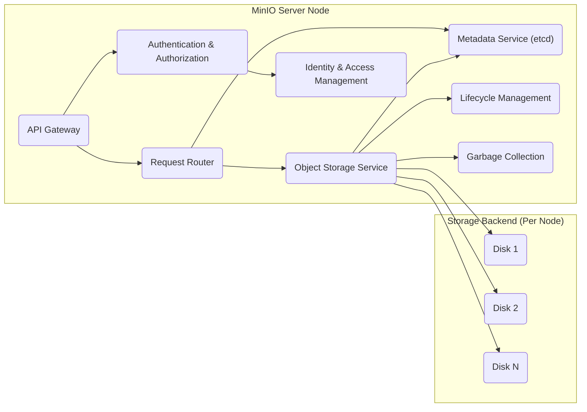
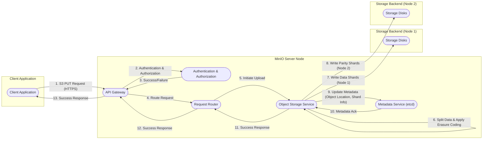
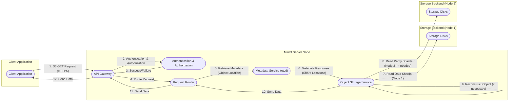

# Project Design Document: MinIO Object Storage

**Version:** 1.1
**Date:** October 26, 2023
**Author:** AI Cloud & Security Architect

## 1. Introduction

This document provides an enhanced and detailed architectural design of the MinIO object storage system. It elaborates on the key components, their interactions, data flow, and security considerations. This document serves as a robust foundation for subsequent threat modeling activities, providing a comprehensive understanding of the system's inner workings.

## 2. Project Goals and Objectives

The primary goal of MinIO is to deliver a high-performance, software-defined object storage solution that is fully compatible with the Amazon S3 API. This allows for seamless integration with existing S3-based workflows and tools. Key objectives include:

* **Unwavering S3 Compatibility:**  Striving for complete compatibility with the Amazon S3 API, ensuring minimal friction for users migrating or integrating with S3 ecosystems.
* **Extreme Performance:**  Optimized for low-latency read and write operations, catering to demanding applications and high-throughput scenarios.
* **Horizontal Scalability:**  Designed for easy horizontal scaling by adding more storage nodes, allowing for petabyte-scale storage without significant architectural changes.
* **Robust Resiliency:**  Implementing advanced data protection mechanisms like erasure coding (specifically Reed-Solomon coding) to ensure data durability and availability even in the face of hardware failures.
* **Comprehensive Security:**  Incorporating a wide range of security features to protect data at rest, in transit, and during access, adhering to industry best practices.
* **Simplified Operations:**  Offering a straightforward deployment and management experience, reducing operational overhead and complexity.

## 3. High-Level Architecture

MinIO functions as a distributed object storage server cluster. Client applications interact with the MinIO server nodes through the S3 API to perform object storage operations. The server cluster intelligently manages the underlying storage, ensuring data integrity, availability, and performance.

```mermaid
graph LR
    subgraph "Client Environment"
        C("Application/User")
    end
    subgraph "MinIO Server Cluster"
        MSN1("MinIO Server Node 1")
        MSN2("MinIO Server Node 2")
        MSNN("MinIO Server Node N")
    end
    subgraph "Storage Backend"
        SD1("Storage Disks")
    end

    C -->|S3 API Requests (HTTPS)| MSN1
    C -->|S3 API Requests (HTTPS)| MSN2
    C -->|S3 API Requests (HTTPS)| MSNN
    MSN1 -->|Read/Write Operations| SD1
    MSN2 -->|Read/Write Operations| SD1
    MSNN -->|Read/Write Operations| SD1
```

## 4. Detailed Architecture

Each MinIO server node within the cluster hosts several interconnected components that collectively provide the object storage functionality.



### 4.1. Key Components

* **API Gateway:**  The initial point of contact for all incoming client requests. It is responsible for:
    * **Request Reception:** Receiving S3 API requests over HTTPS.
    * **Request Parsing:**  Interpreting the incoming S3 API requests.
    * **Basic Validation:** Performing preliminary checks on the request format and parameters.
    * **Routing:** Directing the validated request to the appropriate internal service.
* **Authentication & Authorization:**  A critical security component that handles:
    * **Authentication:** Verifying the identity of the client making the request. This typically involves validating AWS Signature Version 4 signatures or API keys.
    * **Authorization:** Determining if the authenticated client has the necessary permissions to perform the requested action on the specified resource (bucket or object). This is based on IAM policies and bucket policies.
* **Request Router:**  An internal routing mechanism that efficiently directs requests to the specific service responsible for handling that type of operation. This ensures efficient resource utilization within the MinIO server.
* **Object Storage Service:**  The core engine for managing object data. Its responsibilities include:
    * **Data Ingestion:** Receiving object data during upload operations.
    * **Erasure Coding:**  Applying Reed-Solomon erasure coding to split object data into data and parity shards, distributing them across multiple storage devices for redundancy.
    * **Data Placement:**  Strategically placing object shards across available storage nodes and disks based on the erasure coding scheme and available resources.
    * **Data Retrieval:**  Locating and retrieving the necessary data shards to reconstruct the requested object during download operations.
    * **Data Repair:**  Automatically reconstructing lost data shards using parity shards in case of disk failures.
* **Metadata Service (etcd):** MinIO utilizes a distributed key-value store, typically `etcd`, to manage metadata associated with buckets and objects. This includes:
    * **Bucket Metadata:** Information about buckets, such as creation time, region, and policies.
    * **Object Metadata:** Details about objects, including name, size, content type, modification time, and storage locations of its shards.
    * **Namespace Management:** Ensuring consistency and preventing naming conflicts across the object storage system.
* **Lifecycle Management:**  Provides automated rules for managing the lifecycle of objects, such as:
    * **Object Expiration:**  Automatically deleting objects after a specified period.
    * **Transition to Different Storage Tiers (Future):**  Potentially moving objects to different storage classes based on access frequency (a feature under consideration for future enhancements).
* **Identity & Access Management (IAM):**  Provides a comprehensive framework for managing access to MinIO resources:
    * **User Management:** Creating and managing user accounts.
    * **Group Management:** Organizing users into groups for easier permission management.
    * **Role Management:** Defining roles with specific sets of permissions.
    * **Policy Management:** Creating and attaching policies to users, groups, and roles to grant or deny access to specific resources and actions.
* **Garbage Collection:**  An essential background process that reclaims storage space occupied by deleted objects or incomplete uploads. This ensures efficient utilization of storage resources.

### 4.2. Data Flow (Object Upload - Enhanced)

This diagram provides a more detailed view of the data flow during an object upload operation, highlighting the interactions between different components.



**Enhanced Steps:**

1. The client application initiates an object upload by sending an S3 PUT request to the MinIO server's API Gateway over HTTPS.
2. The API Gateway forwards the request to the Authentication & Authorization component for identity verification and permission checks.
3. Authentication & Authorization validates the client's credentials and ensures they are authorized to upload to the specified bucket.
4. Upon successful authentication and authorization, the API Gateway routes the request to the Object Storage Service.
5. The Object Storage Service initiates the upload process.
6. The Object Storage Service splits the incoming object data into multiple data blocks and calculates parity blocks using the configured erasure coding algorithm (e.g., Reed-Solomon).
7. The Object Storage Service writes the data shards to the designated storage disks on one or more MinIO server nodes.
8. The Object Storage Service writes the parity shards to different storage disks, potentially on other MinIO server nodes, ensuring data redundancy.
9. The Object Storage Service updates the Metadata Service (etcd) with the object's metadata, including the location of its data and parity shards across the storage backend.
10. The Metadata Service acknowledges the metadata update.
11. The Object Storage Service sends a success response back to the Request Router.
12. The Request Router forwards the success response to the API Gateway.
13. The API Gateway sends a success response back to the client application, confirming the successful object upload.

### 4.3. Data Flow (Object Download - Enhanced)

This diagram provides a more detailed view of the data flow during an object download operation.



**Enhanced Steps:**

1. The client application initiates an object download by sending an S3 GET request to the MinIO server's API Gateway over HTTPS.
2. The API Gateway forwards the request to the Authentication & Authorization component for verification.
3. Authentication & Authorization validates the client's identity and permissions to access the requested object.
4. Upon successful authentication and authorization, the API Gateway routes the request to the Object Storage Service.
5. The Object Storage Service queries the Metadata Service (etcd) to retrieve the object's metadata, including the locations of its data and parity shards.
6. The Metadata Service returns the object's metadata, including the shard locations.
7. The Object Storage Service reads the necessary data shards from the storage backend.
8. If some data shards are unavailable (due to disk failure, for example), the Object Storage Service reads the corresponding parity shards from other storage locations.
9. The Object Storage Service reconstructs the complete object data using the retrieved data and parity shards if necessary.
10. The Object Storage Service sends the retrieved (or reconstructed) object data back to the Request Router.
11. The Request Router forwards the data to the API Gateway.
12. The API Gateway streams the object data back to the client application over HTTPS.

## 5. Security Considerations

Security is paramount in MinIO's design, with multiple layers of protection implemented. Key security considerations include:

* **Robust Authentication Mechanisms:**
    * **AWS Signature Version 4:**  Mandatory for secure API request signing, preventing unauthorized access.
    * **API Keys:**  Support for static access and secret keys for programmatic access.
    * **Integration with External Identity Providers (IdPs):**  Federated identity management through protocols like OIDC and SAML, allowing integration with existing corporate identity systems.
* **Fine-Grained Authorization Controls:**
    * **Role-Based Access Control (RBAC):**  Defining roles with specific permissions and assigning them to users or groups.
    * **Bucket Policies:**  JSON-based policies attached to buckets, allowing granular control over access to the bucket and its objects.
    * **Access Control Lists (ACLs):**  Legacy access control mechanism for individual objects and buckets.
    * **Temporary Security Credentials (STS):**  Generating temporary, limited-privilege credentials for secure delegation of access.
* **Comprehensive Data Encryption:**
    * **Server-Side Encryption (SSE):**
        * **SSE-S3:**  MinIO manages the encryption keys.
        * **SSE-C:**  Clients provide the encryption keys with each request.
        * **SSE-KMS:**  Integration with Key Management Systems (KMS) for secure key management.
    * **Client-Side Encryption (CSE):**  Clients encrypt data before uploading to MinIO.
    * **Transport Layer Security (TLS):**  Enforced HTTPS for all API communication, ensuring data confidentiality and integrity during transit.
* **Network Security Best Practices:**
    * **Deployment within Private Networks:**  Recommended for enhanced security by limiting network exposure.
    * **Network Segmentation:**  Isolating MinIO deployments within secure network segments.
    * **IP-Based Access Restrictions:**  Configuring firewall rules to restrict access based on source IP addresses.
* **Auditing and Logging Capabilities:**
    * **Detailed Audit Logs:**  Recording all API requests, administrative actions, and security-related events.
    * **Integration with External Logging Systems:**  Forwarding audit logs to centralized logging platforms for analysis and monitoring.
* **Secure Identity and Access Management (IAM):**
    * **Principle of Least Privilege:**  Granting only the necessary permissions to users and applications.
    * **Multi-Factor Authentication (MFA):**  Adding an extra layer of security for user authentication (feature under consideration for future enhancements).
* **Proactive Vulnerability Management:**
    * **Regular Security Audits:**  Independent assessments to identify potential security weaknesses.
    * **Penetration Testing:**  Simulating real-world attacks to evaluate the system's security posture.
    * **Timely Security Patching:**  Promptly applying security updates to address identified vulnerabilities.
* **Data Integrity Verification:**
    * **Checksum Validation:**  Using checksums (e.g., MD5, SHA-256) to verify data integrity during upload, download, and storage.
    * **Erasure Coding for Data Durability:**  Providing resilience against data corruption and hardware failures.

## 6. Deployment Options

MinIO offers flexible deployment options to suit various infrastructure requirements:

* **On-Premises Deployments:**  Installed on physical servers or virtual machines within a private data center, providing full control over the infrastructure.
* **Cloud-Native Deployments:**  Deployed on major cloud platforms like AWS, Azure, and GCP, leveraging their compute, storage, and networking services for scalability and resilience.
* **Kubernetes Orchestration:**  Seamless integration with Kubernetes for automated deployment, scaling, and management of MinIO clusters, ideal for containerized environments.
* **Standalone Mode (Single Node):**  Suitable for development, testing, or small-scale deployments where high availability is not a primary concern.

## 7. Future Considerations

MinIO's development is ongoing, with several potential enhancements under consideration:

* **Advanced Monitoring and Observability Tools:**  Developing more sophisticated dashboards and metrics for real-time monitoring of performance, health, and resource utilization.
* **Tiered Storage Management Policies:**  Implementing more granular lifecycle management rules to automatically transition objects between different storage tiers based on access patterns and cost considerations.
* **Expanded Identity Provider Integrations:**  Adding support for a wider range of authentication and authorization providers to cater to diverse enterprise environments.
* **Data Masking and Tokenization Features:**  Exploring advanced data security features for sensitive data protection.
* **Enhanced Multi-Factor Authentication (MFA) Options:**  Providing more flexible and robust MFA capabilities for user authentication.

This enhanced design document provides a more in-depth understanding of the MinIO architecture, offering valuable insights for comprehensive threat modeling and security analysis. The detailed descriptions of components, data flows, and security mechanisms will aid in identifying potential vulnerabilities and developing effective mitigation strategies.