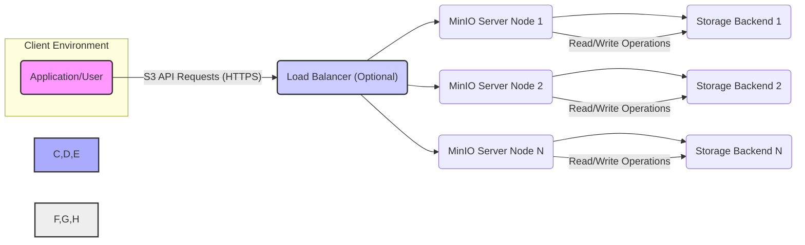
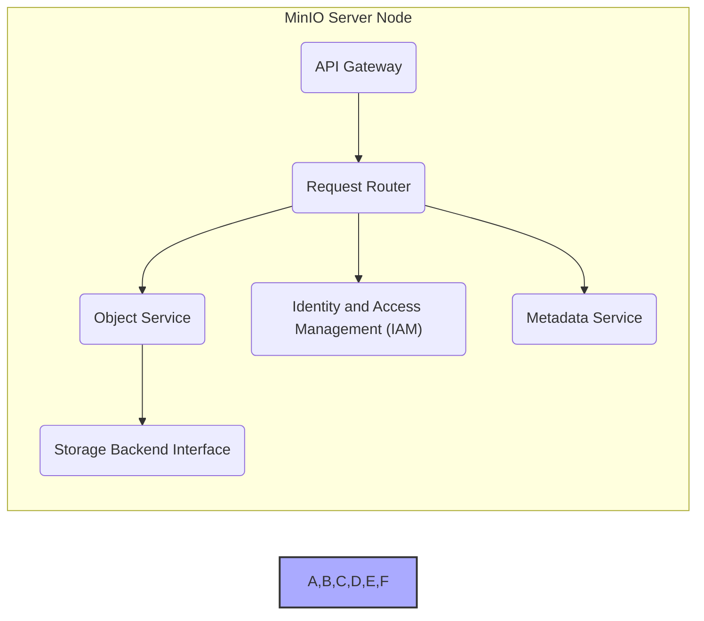
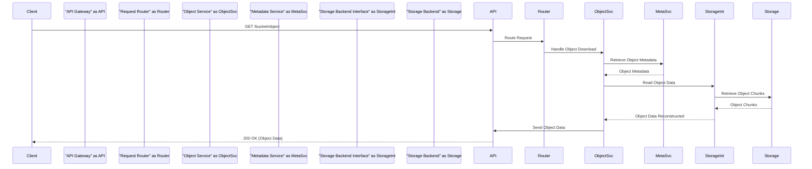

# Project Design Document: MinIO Object Storage

**Version:** 1.1
**Date:** October 26, 2023
**Author:** AI Architecture Expert

## 1. Introduction

This document provides an enhanced architectural design of the MinIO object storage system, building upon the previous version. It aims to provide a clearer and more detailed understanding of the system's components, interactions, and data flow, specifically tailored for subsequent threat modeling activities.

MinIO is a high-performance, S3-compatible object storage server engineered for cloud-native environments. Its design emphasizes scalability, resilience, and simplified deployment. This document elaborates on the core architectural elements of MinIO, with a strong focus on aspects relevant to security vulnerabilities and potential attack vectors.

## 2. Goals and Objectives

The fundamental goals of MinIO are to deliver:

*   **Highly Scalable Object Storage:**  Designed to manage vast quantities of unstructured data, scaling horizontally to meet growing demands.
*   **Full S3 Compatibility:**  Strict adherence to the Amazon S3 API, ensuring seamless interoperability with a wide range of existing tools, libraries, and applications.
*   **Exceptional Performance:**  Optimized for low latency and high throughput in both read and write operations.
*   **Robust Resilience and Availability:**  Incorporates mechanisms to guarantee data durability and continuous system uptime, even in the face of hardware failures.
*   **Simplified Deployment and Management:**  Engineered for straightforward setup and ongoing management across diverse infrastructure landscapes.

This design document is specifically intended to:

*   Clearly define each of the major components that constitute the MinIO system.
*   Illustrate the intricate interactions and data flow pathways between these components.
*   Identify the core technologies and communication protocols employed within the system.
*   Serve as a solid foundation for identifying potential security threats, vulnerabilities, and attack surfaces.

## 3. High-Level Architecture

MinIO employs a distributed architecture where multiple independent server nodes collaborate to present a unified object storage service. This distributed nature enhances both performance and resilience.

**Key Components:**

*   **Client (Application/User):** Any software application or individual user that interacts with the MinIO service by sending requests compliant with the S3 API.
*   **Load Balancer (Optional):** An infrastructure component that distributes incoming client requests evenly across the available MinIO server nodes. This enhances high availability and overall system performance by preventing overload on individual nodes.
*   **MinIO Server Node:**  A fundamental building block of the MinIO cluster. Each node is responsible for:
    *   Receiving and processing client requests.
    *   Managing object metadata.
    *   Interacting with the underlying storage backend to store and retrieve object data.
    Multiple MinIO server nodes work together in a distributed fashion to form a cohesive and scalable storage cluster.
*   **Storage Backend:** The persistent storage layer where the actual object data is physically stored. This can encompass various storage technologies, including:
    *   Directly attached local disks on the server nodes.
    *   Network-attached storage (NAS) devices.
    *   Cloud-based block storage services.

## 4. Detailed Component Design

This section provides a deeper look into the internal components residing within a single MinIO server node.

**Internal Components of a MinIO Server Node:**

*   **API Gateway:** The initial point of contact for all incoming client requests. Its responsibilities include:
    *   **S3 API Handling:**  Interpreting and processing requests conforming to the Amazon S3 API specification.
    *   **Authentication:** Verifying the identity of the requester using mechanisms like AWS Signature Version 4. Potential vulnerabilities here could allow unauthorized access.
    *   **Authorization:**  Determining if the authenticated user has the necessary permissions to perform the requested action, based on configured policies. Bypass vulnerabilities could lead to privilege escalation.
    *   **Request Routing:** Directing validated and authorized requests to the appropriate internal service for further processing.
    *   **TLS Termination:**  Handling the decryption of HTTPS traffic, ensuring secure communication. Weak TLS configurations or vulnerabilities could expose data in transit.
    *   **Rate Limiting (Potential):**  Implementing mechanisms to prevent abuse and ensure fair resource utilization.
*   **Request Router:**  Analyzes incoming requests after they pass through the API Gateway and intelligently routes them to the specific internal service responsible for handling that type of request.
    *   **Service Discovery:**  Determines the correct service endpoint based on the API endpoint and request parameters.
*   **Object Service:**  The core component responsible for managing all object-related operations.
    *   **Object Lifecycle Management:**  Handling operations such as uploading new objects, downloading existing objects, deleting objects, and listing objects within a bucket.
    *   **Data Streaming:**  Efficiently managing the streaming of object data during upload and download operations.
    *   **Erasure Coding and Bit Rot Protection:** Implementing data redundancy and integrity checks to ensure data durability and protect against data corruption. Vulnerabilities in the erasure coding implementation could lead to data loss.
    *   **Metadata Interaction:**  Communicating with the Metadata Service to retrieve and update object metadata.
    *   **Storage Backend Interaction:**  Utilizing the Storage Backend Interface to interact with the underlying storage system for reading and writing object data.
*   **Identity and Access Management (IAM):**  Manages user identities, access policies, and the overall authentication and authorization framework for MinIO.
    *   **User and Group Management:**  Creating, managing, and authenticating user accounts and groups. Weak password policies or insecure credential storage could compromise accounts.
    *   **Policy Enforcement:**  Defining and enforcing access control policies, including bucket policies and IAM policies, to control access to resources. Policy misconfigurations can lead to unintended data exposure.
    *   **Authentication Mechanisms:**  Handling the verification of user credentials, typically using access keys and secret keys. Vulnerabilities in the authentication process could grant unauthorized access.
*   **Metadata Service:**  Responsible for storing and managing metadata about buckets, objects, users, and access policies.
    *   **Metadata Storage:**  Persistently storing metadata information, often using an embedded key-value store (like BadgerDB) or a distributed key-value store in clustered deployments. Compromise of the metadata store could lead to data loss or unauthorized access.
    *   **Indexing:**  Maintaining indexes for efficient retrieval of object metadata.
    *   **Consistency:** Ensuring consistency of metadata across the cluster in distributed deployments.
*   **Storage Backend Interface:**  Provides an abstraction layer that isolates the Object Service from the specifics of the underlying storage backend.
    *   **Storage Abstraction:**  Presents a consistent API to the Object Service, regardless of the type of storage backend being used.
    *   **Data Placement and Retrieval:**  Managing the placement of data on the storage backend and orchestrating data retrieval.

## 5. Data Flow

The following sequence diagram illustrates the typical data flow for an object download operation.

**Data Flow Description (Object Download):**

1. **Client Request:** The client initiates an S3 GET request to download a specific object.
2. **API Gateway:** The API Gateway receives the request and performs authentication and authorization checks to ensure the client has permission to access the requested object.
3. **Request Router:** The Router analyzes the request and directs it to the Object Service.
4. **Object Service:** The Object Service receives the download request.
    *   It queries the Metadata Service to retrieve the metadata associated with the requested object, including the location of its data chunks on the storage backend.
    *   It then uses the Storage Backend Interface to request the retrieval of the object's data chunks from the underlying storage backend.
5. **Storage Backend Interface:** The interface translates the request into commands specific to the storage backend and retrieves the necessary data chunks.
6. **Storage Backend:** The storage backend retrieves the requested object chunks and returns them to the Storage Backend Interface.
7. **Object Service (Reconstruction):** The Object Service receives the data chunks from the Storage Backend Interface and reconstructs the original object data (reversing any erasure coding applied during upload).
8. **API Gateway (Response):** The Object Service sends the reconstructed object data back to the API Gateway. The API Gateway then streams the object data back to the requesting client as part of the HTTP response.

## 6. Key Technologies and Protocols

*   **Primary Programming Language:** Go (offers performance and concurrency benefits).
*   **API Standard:** Amazon S3 API (ensures broad compatibility).
*   **Secure Communication:** HTTPS leveraging Transport Layer Security (TLS) for encrypting data in transit.
*   **Authentication Standard:** AWS Signature Version 4 (industry-standard for secure API authentication).
*   **Authorization Mechanisms:** IAM policies and Bucket policies (fine-grained access control).
*   **Data Redundancy and Integrity:** Erasure coding (e.g., Reed-Solomon) for fault tolerance and protection against data loss.
*   **Metadata Storage Technology:** Embedded key-value store (e.g., BadgerDB for single-node) or distributed key-value store (for clustered deployments, potentially leveraging Raft consensus).

## 7. Security Considerations (Detailed)

This section expands on the initial security considerations, providing more specific examples of potential threats and vulnerabilities.

*   **Authentication and Authorization Vulnerabilities:**
    *   **Threats:** Brute-force attacks against authentication endpoints, exploitation of weaknesses in the AWS Signature Version 4 implementation, insecure storage or transmission of access keys and secret keys, bypassing authentication checks due to flaws in the API Gateway.
    *   **Consequences:** Unauthorized access to buckets and objects, data breaches, malicious manipulation of data.
*   **Data Encryption Weaknesses:**
    *   **Threats:**  Exploitation of vulnerabilities in server-side encryption (SSE) implementations, interception of data in transit if TLS is not properly configured or compromised, unauthorized access to encryption keys.
    *   **Consequences:** Exposure of sensitive data, compliance violations.
*   **Network Security Misconfigurations:**
    *   **Threats:**  Unrestricted network access to MinIO instances, exposing internal services, man-in-the-middle attacks if TLS is not enforced, vulnerabilities in network protocols.
    *   **Consequences:** Unauthorized access, data interception, denial of service.
*   **Input Validation Flaws:**
    *   **Threats:**  Injection attacks (e.g., command injection, path traversal) through maliciously crafted API requests if input validation is insufficient.
    *   **Consequences:**  Remote code execution on MinIO servers, unauthorized file access.
*   **Access Control Policy Misconfigurations:**
    *   **Threats:**  Overly permissive bucket or IAM policies granting unintended access to resources, leading to data leaks or unauthorized modifications.
    *   **Consequences:**  Data breaches, data tampering.
*   **Secrets Management Issues:**
    *   **Threats:**  Storing access keys, secret keys, or other sensitive credentials in insecure locations (e.g., configuration files, environment variables without proper protection).
    *   **Consequences:**  Compromise of credentials, leading to unauthorized access and control.
*   **Denial of Service (DoS) Attack Vectors:**
    *   **Threats:**  Flooding the API Gateway with excessive requests, exploiting resource exhaustion vulnerabilities in the Object Service or Metadata Service.
    *   **Consequences:**  Service unavailability, impacting applications relying on MinIO.
*   **Supply Chain Security Risks:**
    *   **Threats:**  Compromised dependencies or vulnerabilities introduced through the build and deployment pipeline.
    *   **Consequences:**  Introduction of backdoors or vulnerabilities that can be exploited by attackers.

## 8. Deployment Considerations

MinIO offers flexible deployment options to suit various infrastructure needs:

*   **Single Node Deployment:**  A single MinIO instance running on a single server. Suitable for development, testing, or small-scale deployments where high availability is not critical.
*   **Distributed Mode (Erasure Coding):**  Multiple MinIO server nodes working together as a cluster, utilizing erasure coding for data redundancy and high availability. Recommended for production environments.
*   **Kubernetes Deployment:**  Deployment and management within a Kubernetes cluster, often using MinIO Operator or Helm charts for simplified orchestration and scaling.
*   **Cloud Environment Deployment:**  Deployable on major cloud platforms (AWS, Azure, GCP) using virtual machines, container services (like Docker), or managed Kubernetes offerings.

## 9. Future Considerations

*   **Cross-Region Replication:** Implementing asynchronous replication of buckets and objects across different geographical regions for disaster recovery and improved data locality.
*   **Object Versioning Support:**  Enabling the tracking and retrieval of different versions of an object over time, providing protection against accidental deletions or overwrites.
*   **Tiered Storage Management:**  Integrating with different storage tiers (e.g., hot, warm, cold) to optimize storage costs based on data access frequency.
*   **Advanced Monitoring and Logging Capabilities:**  Enhancing the system's observability through more detailed metrics, logs, and tracing capabilities for improved security monitoring and incident response.

## 10. Conclusion

This enhanced design document provides a comprehensive and detailed overview of the MinIO object storage architecture, with a particular emphasis on aspects relevant to security. By clearly outlining the components, data flows, and underlying technologies, this document serves as a robust foundation for conducting thorough threat modeling activities. The detailed security considerations section highlights potential vulnerabilities and attack vectors, enabling proactive identification and mitigation of risks, ultimately contributing to a more secure and resilient MinIO deployment.
