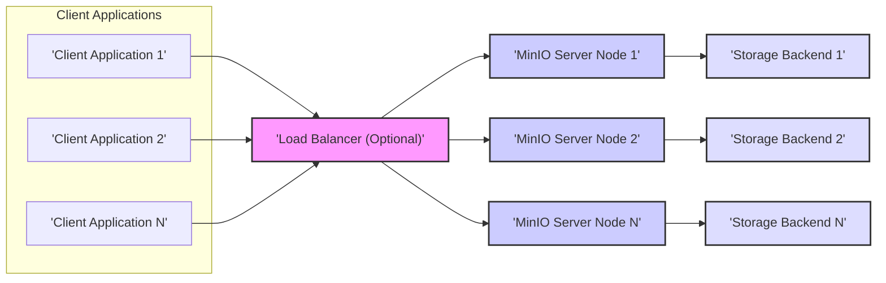
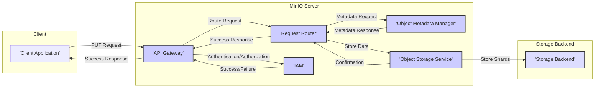
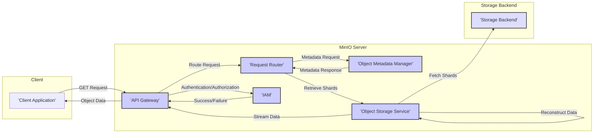

# Project Design Document: MinIO Object Storage

**Version:** 1.1
**Date:** October 26, 2023
**Author:** AI Software Architect

## 1. Introduction

This document provides a detailed design overview of the MinIO object storage system. It outlines the architecture, key components, data flow, and security considerations. This document is specifically intended to serve as the foundation for subsequent threat modeling activities by security architects and engineers.

MinIO is a high-performance, distributed object storage server, designed for cloud-native workloads and data lakes. It is API compatible with Amazon S3, making it easy to integrate with existing tools and applications. Its architecture emphasizes scalability, resilience, and performance, making it a popular choice for various use cases.

## 2. Goals and Objectives

*   Provide a comprehensive and accurate architectural overview of the MinIO object storage system.
*   Clearly identify key components within the MinIO server and their interactions with each other and external entities.
*   Describe the typical data flow for common operations, highlighting potential points of interaction and data transformation.
*   Explicitly highlight important security considerations and potential vulnerabilities relevant for threat modeling exercises.
*   Serve as a definitive reference point for security analysts and engineers to understand the system's design and conduct thorough risk assessments.

## 3. High-Level Architecture

MinIO operates as a distributed system, typically deployed across multiple nodes (servers). Clients interact with the MinIO server (or a load balancer in front of it) to store and retrieve objects. The server manages the underlying storage, ensuring data durability and availability through techniques like erasure coding. Each MinIO server node runs the same software and participates in the distributed cluster.

## 4. Detailed Component Design

The MinIO server comprises several key components that work together to provide object storage functionality. Understanding these components is crucial for identifying potential attack surfaces.

*   **API Gateway:**
    *   Listens for incoming client requests over HTTP/HTTPS.
    *   Handles S3-compatible API calls.
    *   Performs initial request parsing and validation.
    *   Acts as the primary entry point for all external interactions.
*   **Request Router:**
    *   Analyzes incoming requests after they pass through the API Gateway.
    *   Determines the appropriate internal service to handle the request based on the API operation and target resource (bucket, object).
    *   Manages request routing and load balancing across internal services.
*   **Authentication and Authorization (IAM):**
    *   Verifies the identity of clients using configured credentials (access keys, temporary credentials).
    *   Enforces access control policies defined using MinIO's IAM implementation.
    *   Determines if the authenticated user has the necessary permissions to perform the requested action on the specified resource.
    *   Supports various authentication methods and integration with external identity providers.
*   **Object Metadata Manager:**
    *   Responsible for storing and managing metadata associated with buckets and objects.
    *   Includes information like object size, content type, creation time, custom metadata, and access control lists (ACLs).
    *   Provides efficient mechanisms for retrieving and updating metadata.
    *   Often backed by a distributed key-value store for scalability and resilience.
*   **Object Storage Service:**
    *   Manages the actual storage of object data on the underlying storage backend.
    *   Implements erasure coding to provide data redundancy and fault tolerance.
    *   Handles the splitting of objects into data and parity shards and their distribution across storage nodes.
    *   Performs data healing and reconstruction in case of storage failures.
    *   May interact with different storage tiers or backends.
*   **Inter-Node Communication:**
    *   Facilitates communication between different MinIO server nodes within the cluster.
    *   Used for coordination, data replication (if configured), metadata synchronization, and healing operations.
    *   Relies on internal protocols for efficient and reliable communication.
    *   Security of this communication channel is critical.
*   **Background Processes:**
    *   Handles various asynchronous tasks essential for the health and maintenance of the cluster.
    *   Examples include: data healing, garbage collection of deleted objects, monitoring of storage health, and metrics collection.
*   **Monitoring and Logging:**
    *   Collects and exposes metrics about the performance and health of the MinIO cluster.
    *   Generates audit logs of API requests and internal events.
    *   Integrates with external monitoring and logging systems.

## 5. Data Flow

The following outlines the typical data flow for storing and retrieving objects, highlighting key components involved at each stage.

### 5.1. Object Upload

1. A client application initiates an object upload by sending an `PUT` request to the MinIO server's **API Gateway**.
2. The **API Gateway** receives the request and forwards it to the **Authentication and Authorization (IAM)** component for verification.
3. The **IAM** component authenticates the client's credentials and authorizes the request based on configured policies.
4. Upon successful authentication and authorization, the **API Gateway** passes the request to the **Request Router**.
5. The **Request Router** identifies the target bucket and object and directs the request to the **Object Metadata Manager**.
6. The **Object Metadata Manager** creates or updates the metadata for the object, including size, content type, and any custom metadata.
7. The **Request Router** then forwards the object data to the **Object Storage Service**.
8. The **Object Storage Service** receives the object data, applies erasure coding, and splits it into data and parity shards.
9. The **Object Storage Service** distributes these shards across the configured storage backends on different nodes.
10. The **Object Storage Service** confirms successful storage to the **Request Router**.
11. The **Request Router** informs the **API Gateway** of the successful operation.
12. The **API Gateway** sends a success response back to the client application.

### 5.2. Object Download

1. A client application initiates an object download by sending a `GET` request to the MinIO server's **API Gateway**.
2. The **API Gateway** receives the request and forwards it to the **Authentication and Authorization (IAM)** component for verification.
3. The **IAM** component authenticates the client's credentials and authorizes the request.
4. Upon successful authentication and authorization, the **API Gateway** passes the request to the **Request Router**.
5. The **Request Router** identifies the target bucket and object and queries the **Object Metadata Manager** for the object's metadata, including the location of its shards.
6. The **Object Metadata Manager** returns the requested metadata.
7. The **Request Router** directs the **Object Storage Service** to retrieve the object data.
8. The **Object Storage Service** identifies the nodes containing the necessary data shards.
9. The **Object Storage Service** retrieves the required data shards from the storage backends.
10. The **Object Storage Service** reconstructs the complete object data from the retrieved shards.
11. The **Object Storage Service** streams the reconstructed object data back to the **API Gateway**.
12. The **API Gateway** sends the object data to the client application.

## 6. Security Considerations

Understanding the security considerations for each component and the overall system is crucial for effective threat modeling.

*   **Authentication:**
    *   **Threat:** Brute-force attacks against access keys, compromised access keys.
    *   **Mitigation:** Strong password policies for key generation (if applicable), key rotation, multi-factor authentication (if supported via external providers), monitoring for suspicious login attempts.
    *   MinIO supports:
        *   Access Keys (Access Key ID and Secret Access Key).
        *   Temporary Security Credentials (STS).
        *   Integration with external identity providers (e.g., Keycloak, Active Directory) via protocols like OIDC and SAML.
*   **Authorization:**
    *   **Threat:** Privilege escalation, unauthorized access to sensitive data.
    *   **Mitigation:** Principle of least privilege when defining IAM policies, regular review of policies, clear separation of duties.
    *   MinIO uses IAM policies based on actions and resources (buckets, objects).
*   **Data Encryption:**
    *   **Threat:** Unauthorized access to data at rest or in transit.
    *   **Mitigation:** Enforce HTTPS (TLS) for all client communication, enable server-side encryption for data at rest.
    *   MinIO supports:
        *   **At Rest:** Server-Side Encryption with MinIO managed keys (SSE-S3), Server-Side Encryption with Customer Provided Keys (SSE-C), and Server-Side Encryption with KMS (SSE-KMS).
        *   **In Transit:** Requires TLS configuration on the load balancer or MinIO server.
*   **Network Security:**
    *   **Threat:** Unauthorized access to the MinIO service, network sniffing.
    *   **Mitigation:** Firewall rules to restrict access to MinIO ports (typically 9000), network segmentation to isolate the MinIO cluster, use of private networks.
*   **Access Logging and Auditing:**
    *   **Threat:** Lack of visibility into security events, difficulty in investigating incidents.
    *   **Mitigation:** Enable and regularly review access logs, integrate logs with a SIEM system for analysis and alerting.
    *   MinIO provides detailed access logs in various formats.
*   **Input Validation:**
    *   **Threat:** Injection attacks (e.g., command injection, header injection) if input is not properly sanitized.
    *   **Mitigation:** Implement robust input validation on all API endpoints.
*   **Inter-Node Communication Security:**
    *   **Threat:** Man-in-the-middle attacks, eavesdropping on internal communication.
    *   **Mitigation:**  Secure the network infrastructure between MinIO nodes, consider using TLS for inter-node communication (configuration dependent).
*   **Secrets Management:**
    *   **Threat:** Exposure of access keys or other sensitive credentials.
    *   **Mitigation:** Avoid hardcoding credentials, use secure secret management solutions (e.g., HashiCorp Vault) for storing and accessing sensitive information.
*   **Compliance:**
    *   **Threat:** Failure to meet regulatory requirements (e.g., GDPR, HIPAA).
    *   **Mitigation:** Implement appropriate security controls based on compliance requirements, ensure data residency and privacy regulations are met.
*   **Denial of Service (DoS) Protection:**
    *   **Threat:** Service disruption due to resource exhaustion.
    *   **Mitigation:** Implement rate limiting, request size limits, and potentially use a Web Application Firewall (WAF) in front of MinIO.

## 7. Deployment Considerations

The chosen deployment architecture significantly influences the security posture of the MinIO installation.

*   **Single Node vs. Distributed:**
    *   **Single Node:** Simpler to deploy but represents a single point of failure and may have limited scalability. Security is focused on securing the single server.
    *   **Distributed:** Offers high availability and durability but introduces complexity in securing inter-node communication and managing multiple instances.
*   **Containerization (Docker, Kubernetes):**
    *   Requires careful configuration of container security (e.g., least privilege for containers, secure image sources).
    *   Network policies in Kubernetes are crucial for controlling access between pods and external networks.
    *   Secrets management within the container orchestration platform needs careful consideration.
*   **Bare Metal Deployment:**
    *   Requires manual hardening of the operating system and network infrastructure.
    *   Patch management and security updates are the responsibility of the administrator.
*   **Cloud Provider Integration:**
    *   Leveraging cloud provider services for storage (e.g., EBS), networking (VPCs, security groups), and security (IAM, KMS) can simplify deployment and enhance security if configured correctly.
    *   Security responsibilities are shared between the user and the cloud provider.

## 8. Future Considerations

*   Detailed analysis of the security implications of specific S3 API endpoints.
*   Evaluation of third-party integrations (e.g., with analytics platforms, backup solutions) and their potential security risks.
*   Development of specific threat scenarios and attack vectors based on the architecture described in this document.
*   Regular review and updates to this document to reflect changes in the MinIO architecture and security best practices.

This document provides a comprehensive design overview of the MinIO architecture, specifically tailored for threat modeling purposes. The information presented here should enable security professionals to effectively identify potential vulnerabilities and design appropriate security controls.