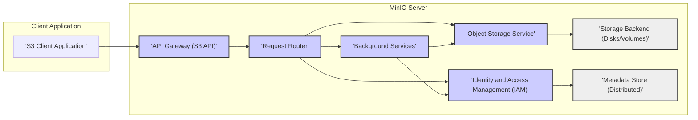

# Project Design Document: MinIO Object Storage System

**Version:** 1.1
**Date:** October 27, 2023
**Author:** Gemini (AI Expert in Software, Cloud, and Cybersecurity Architecture)

## 1. Introduction

This document provides a detailed design overview of the MinIO object storage system, an open-source, Amazon S3-compatible object storage server. This document is intended to serve as a foundation for threat modeling activities and to provide a clear understanding of the system's architecture, components, and data flow.

### 1.1. Project Overview

MinIO is a high-performance, distributed object storage system designed for cloud-native workloads, big data, AI/ML, and modern web applications. It is API-compatible with Amazon S3, ensuring seamless integration with existing S3-compatible tools and libraries. Written in Go, MinIO is engineered for scalability, performance, and resilience. Its deployment versatility spans on-premises, public clouds, and edge environments.

### 1.2. Purpose of this Document

This design document aims to:

*   Provide a comprehensive and refined architectural overview of MinIO.
*   Clearly identify key components and elucidate their interactions.
*   Describe the end-to-end data flow within the system for various operations.
*   Highlight security-relevant aspects of the design with more specific examples.
*   Serve as a robust and actionable input for subsequent threat modeling exercises.

### 1.3. Target Audience

This document is intended for:

*   Security architects and engineers tasked with performing threat modeling and security assessments.
*   Developers and operations teams responsible for deploying, configuring, and managing MinIO instances.
*   Auditors and compliance officers evaluating the security posture of systems utilizing MinIO.
*   Anyone seeking a detailed and improved understanding of MinIO's architecture and security considerations.

## 2. System Architecture

MinIO's architecture is centered around a distributed, microservices-inspired design, prioritizing simplicity and high performance. The core architecture is visualized below:

**Key Components (Improved Descriptions):**

*   **'S3 Client Application':**  Encompasses any application, script, or tool that interacts with MinIO via the standard Amazon S3 API. Examples include `aws-cli`, SDKs in various programming languages, web browsers (for simple operations), and backup/restore utilities.
*   **'API Gateway (S3 API)':** The primary entry point for all external client requests. It acts as a reverse proxy and API facade, implementing the full Amazon S3 API specification. Responsibilities include request reception, authentication, authorization enforcement, request routing, response formatting, and TLS/SSL termination.
*   **'Request Router':**  An internal routing component that analyzes validated and authorized requests from the API Gateway. It intelligently directs these requests to the appropriate internal service (e.g., Object Storage Service for object operations, IAM for policy management) based on the S3 API operation and target resource.
*   **'Object Storage Service':** The core workhorse responsible for all object-related operations. This service manages the complete object lifecycle: upload (PUT), download (GET), deletion (DELETE), metadata retrieval (HEAD), listing (LIST), and more. It implements crucial data durability features like erasure coding and bit rot protection. It also manages object metadata and interacts directly with the 'Storage Backend'.
*   **'Identity and Access Management (IAM)':**  Manages user identities, access credentials (access keys, secret keys), and authorization policies. It provides a robust policy engine for defining granular access control rules. IAM authenticates incoming requests and enforces authorization decisions, ensuring only permitted actions are executed.
*   **'Storage Backend (Disks/Volumes)':**  Represents the persistent storage layer where object data is physically stored. This can be composed of local disks directly attached to MinIO servers, network volumes (NAS/SAN), or cloud-based block storage. MinIO's distributed nature allows it to aggregate and manage storage across multiple drives and nodes.
*   **'Metadata Store (Distributed)':**  A distributed and highly available system for storing metadata about buckets, objects, users, policies, and other system configurations.  It is critical for maintaining consistency and performance in a distributed MinIO cluster.  While often co-located with the storage backend in a distributed manner, it is logically a separate component.
*   **'Background Services':**  Represents a collection of internal background processes that perform maintenance, monitoring, and management tasks. These can include tasks like:
    *   **Garbage Collection:** Reclaiming storage space from deleted objects.
    *   **Data Integrity Checks:** Periodically verifying data integrity using checksums and erasure coding.
    *   **Monitoring and Logging:** Collecting metrics and logs for system health and auditing.
    *   **Rebalancing:**  Distributing data and metadata across nodes in the cluster for optimal performance and resilience.

## 3. Component Details (Enhanced Security Focus)

### 3.1. 'API Gateway (S3 API)'

*   **Functionality:** (No significant changes, already well-described)
*   **Security Considerations:**
    *   **Authentication Bypass:** Vulnerable to authentication bypass if signature verification is flawed or improperly implemented. *Threat Example:* An attacker could craft requests that bypass signature checks, gaining unauthorized access. *Mitigation:* Rigorous testing of signature verification logic, adherence to AWS Signature Version 4 specifications, and regular security audits.
    *   **Authorization Enforcement Weakness:** If authorization checks are not consistently applied or contain logic errors, unauthorized actions could be permitted. *Threat Example:* A user with read-only permissions might be able to perform write operations due to a policy misconfiguration or a bug in policy evaluation. *Mitigation:* Thorough testing of policy enforcement, principle of least privilege in policy design, and automated policy validation tools.
    *   **Input Validation Vulnerabilities:** Susceptible to injection attacks (e.g., command injection, header injection) if input validation is insufficient. *Threat Example:* An attacker could inject malicious commands through object names or metadata fields if not properly sanitized. *Mitigation:* Strict input validation and sanitization for all request parameters, headers, and data. Use of parameterized queries or prepared statements where applicable.
    *   **TLS/SSL Configuration Issues:** Misconfigured TLS/SSL can lead to man-in-the-middle attacks or exposure of data in transit. *Threat Example:* Using weak cipher suites or failing to enforce HTTPS can allow attackers to intercept and decrypt communication. *Mitigation:* Strong TLS/SSL configuration, enforcing HTTPS, using strong cipher suites, and regular certificate management.
    *   **DoS Attacks:**  The API Gateway is a potential target for Denial of Service attacks. *Threat Example:*  Flooding the API Gateway with a large volume of requests can overwhelm the service and make it unavailable. *Mitigation:* Rate limiting, request throttling, connection limits, and robust infrastructure to handle traffic spikes.

### 3.2. 'Request Router'

*   **Functionality:** (No significant changes, already well-described)
*   **Security Considerations:**
    *   **Routing Logic Vulnerabilities:** Flaws in routing logic could lead to requests being misdirected to unintended services, potentially bypassing security controls. *Threat Example:* A request intended for the Object Storage Service might be incorrectly routed to the IAM service, leading to unexpected behavior or information disclosure. *Mitigation:*  Rigorous testing of routing rules, clear separation of service responsibilities, and minimal complexity in routing logic.
    *   **Internal Communication Security (Lack Thereof):** If internal communication is not secured, a compromised component could be used to attack other components. *Threat Example:* If an attacker compromises the Request Router, they could potentially send malicious requests to internal services if communication is unencrypted and unauthenticated. *Mitigation:*  Mutual TLS (mTLS) for internal communication, service authentication, and network segmentation to limit the impact of a compromise.

### 3.3. 'Object Storage Service'

*   **Functionality:** (No significant changes, already well-described)
*   **Security Considerations:**
    *   **Data Integrity Failures:** Erasure coding or bit rot protection mechanisms might fail, leading to data corruption or loss. *Threat Example:*  A bug in the erasure coding implementation or undetected bit rot could result in data corruption that goes unnoticed. *Mitigation:*  Regular integrity checks, robust implementation of erasure coding and bit rot detection, and monitoring for data corruption events.
    *   **SSE Vulnerabilities:** Server-Side Encryption implementation flaws or key management weaknesses could compromise data confidentiality at rest. *Threat Example:*  Weak encryption algorithms, insecure key storage, or vulnerabilities in the SSE implementation could allow attackers to decrypt data at rest. *Mitigation:*  Strong encryption algorithms (e.g., AES-256), secure key management practices (using KMS where appropriate), and regular security assessments of SSE implementation.
    *   **Access Control Bypass:**  If access control checks within the Object Storage Service are bypassed or inconsistent with IAM policies, unauthorized access to objects could occur. *Threat Example:* A bug in the Object Storage Service might allow bypassing authorization checks for certain object operations. *Mitigation:*  Consistent enforcement of authorization decisions from IAM, thorough testing of access control mechanisms within the Object Storage Service, and regular security audits.
    *   **Data Leakage through Metadata:** Object metadata might inadvertently expose sensitive information. *Threat Example:*  Custom metadata fields or object names might contain sensitive data that is not adequately protected. *Mitigation:*  Careful consideration of metadata content, access control for metadata, and data loss prevention (DLP) measures if necessary.
    *   **Object Versioning Vulnerabilities:** If object versioning is enabled, vulnerabilities in versioning logic could lead to data loss or unauthorized access to previous versions. *Threat Example:*  A bug in versioning might allow an attacker to delete all versions of an object, leading to data loss. *Mitigation:*  Thorough testing of versioning implementation, access control for object versions, and regular backups.

### 3.4. 'Identity and Access Management (IAM)'

*   **Functionality:** (No significant changes, already well-described)
*   **Security Considerations:**
    *   **Credential Compromise:**  Compromised access keys and secret keys are a major threat. *Threat Example:*  Users might store access keys insecurely, or attackers could obtain them through phishing or other means. *Mitigation:*  Strong password policies, multi-factor authentication (MFA), access key rotation, and user education on secure credential management.
    *   **Policy Management Vulnerabilities:**  Flaws in policy management APIs or interfaces could allow unauthorized policy modifications or deletions. *Threat Example:*  An attacker might exploit a vulnerability in the policy management API to grant themselves administrative privileges. *Mitigation:*  Secure policy management APIs, role-based access control for policy management, and audit logging of policy changes.
    *   **Authorization Logic Errors:**  Bugs or vulnerabilities in the policy evaluation engine could lead to incorrect authorization decisions. *Threat Example:*  A complex policy might contain logic errors that allow unintended access. *Mitigation:*  Rigorous testing of the policy evaluation engine, formal verification methods if feasible, and regular policy reviews.
    *   **Privilege Escalation:**  Vulnerabilities could allow users to escalate their privileges beyond what is intended. *Threat Example:*  A user with limited permissions might exploit a vulnerability to gain administrative privileges. *Mitigation:*  Principle of least privilege, regular security audits, and penetration testing to identify privilege escalation paths.
    *   **Integration with External Identity Providers (if applicable):**  Vulnerabilities in integration with external identity providers (e.g., LDAP, Active Directory) could be exploited. *Threat Example:*  An attacker might compromise an integrated LDAP server and gain access to MinIO through compromised user accounts. *Mitigation:*  Secure configuration of integration with external identity providers, regular security assessments of integration points, and monitoring for suspicious authentication activity.

### 3.5. 'Storage Backend (Disks/Volumes)'

*   **Functionality:** (No significant changes, already well-described)
*   **Security Considerations:**
    *   **Physical Security Breaches:** Physical access to storage media can lead to data theft or tampering, especially in on-premises deployments. *Threat Example:*  An attacker could physically steal disks containing sensitive data from a data center. *Mitigation:*  Secure data centers, physical access controls, disk encryption, and secure decommissioning procedures.
    *   **Data Breach through Storage Media Disposal:** Improper disposal of storage media can lead to data leaks. *Threat Example:*  Disposing of old disks without proper data wiping could allow attackers to recover sensitive data. *Mitigation:*  Secure data wiping or physical destruction of storage media before disposal.
    *   **Unauthorized Access at Storage Layer:**  If access controls at the storage backend level are weak or misconfigured, attackers could bypass MinIO's access controls. *Threat Example:*  An attacker might gain direct access to the storage backend (e.g., through compromised network credentials) and bypass MinIO's authorization mechanisms. *Mitigation:*  Strong access controls at the storage backend level, network segmentation, and regular security audits of storage configurations.
    *   **Data Corruption due to Storage Failures:** Storage media failures can lead to data loss or corruption if not properly handled by MinIO's resilience mechanisms. *Threat Example:*  Disk failures could lead to data loss if erasure coding is not properly implemented or if there are insufficient redundancy levels. *Mitigation:*  Robust erasure coding implementation, sufficient redundancy levels, disk monitoring, and proactive disk replacement.

### 3.6. 'Metadata Store (Distributed)'

*   **Functionality:** (No significant changes, already well-described)
*   **Security Considerations:**
    *   **Metadata Integrity Compromise:**  Corruption or modification of metadata can lead to data loss, inconsistencies, or service disruptions. *Threat Example:*  An attacker might tamper with metadata to make objects inaccessible or to corrupt data integrity checks. *Mitigation:*  Data integrity checks for metadata, replication and consensus mechanisms for metadata store, and access control for metadata management operations.
    *   **Metadata Confidentiality Breach:**  Unauthorized access to metadata can reveal sensitive information about objects and users. *Threat Example:*  An attacker might gain access to metadata and learn object names, sizes, or user information. *Mitigation:*  Access control for metadata, encryption of sensitive metadata at rest and in transit, and principle of least privilege for metadata access.
    *   **Availability Issues:**  If the metadata store becomes unavailable, it can disrupt the entire MinIO service. *Threat Example:*  A DoS attack on the metadata store or a failure of multiple metadata nodes could lead to service unavailability. *Mitigation:*  High availability architecture for the metadata store (replication, clustering), DoS protection measures, and robust monitoring and alerting.

### 3.7. 'Background Services'

*   **Functionality:** (Added this component in improved architecture)
*   **Security Considerations:**
    *   **Vulnerabilities in Background Processes:**  Bugs or vulnerabilities in background services could be exploited to compromise the system. *Threat Example:*  A vulnerability in the garbage collection process could be exploited to cause a denial of service or data corruption. *Mitigation:*  Secure coding practices for background services, regular security audits, and penetration testing.
    *   **Resource Exhaustion:**  Runaway background processes could consume excessive resources and impact system performance or availability. *Threat Example:*  A malfunctioning background process might consume excessive CPU or memory, leading to performance degradation or service outages. *Mitigation:*  Resource limits for background processes, monitoring of resource usage, and automated restart mechanisms.
    *   **Privilege Escalation through Background Services:**  If background services run with elevated privileges, vulnerabilities could be exploited for privilege escalation. *Threat Example:*  An attacker might exploit a vulnerability in a background service running as root to gain root access to the system. *Mitigation:*  Principle of least privilege for background services, minimizing the privileges required for each service, and regular security audits.

## 4. Data Flow (No significant changes, already well-described and accurate)

The data flow diagram and description for object upload (PUT) remain accurate and well-suited for threat modeling.  No changes are made to this section in this improved version.

## 5. Security Considerations (High-Level) (Enhanced and more specific)

MinIO's security posture is built upon a foundation of several key features and practices:

*   **Strong Authentication:**  Reliance on AWS Signature Version 4, a well-established and robust authentication mechanism.
*   **Granular Authorization:**  Policy-based IAM system enabling fine-grained access control, adhering to the principle of least privilege.
*   **End-to-End Encryption:**  TLS/SSL encryption for data in transit and Server-Side Encryption (SSE) options for data at rest.
*   **Data Durability and Integrity:**  Erasure coding and bit rot protection mechanisms safeguarding data against loss and corruption.
*   **Data Immutability (Optional):** Object locking and retention policies for compliance and data protection.
*   **Auditing and Monitoring:**  Comprehensive logging capabilities for security auditing and proactive threat detection.
*   **Proactive Security Updates:**  Active community and development team dedicated to addressing security vulnerabilities and releasing timely updates.

**Expanded Areas for Threat Modeling (More Specific Examples):**

*   **IAM Policy Engine Vulnerabilities:**  Deep dive into the IAM policy evaluation logic for potential bypasses, logic flaws, or performance bottlenecks under complex policies. *Specific Threat:*  Policy conflict resolution vulnerabilities leading to unintended access grants.
*   **Authentication Mechanism Weaknesses:**  Analyze potential weaknesses in AWS Signature Version 4 implementation within MinIO, including edge cases or deviations from the standard. *Specific Threat:*  Timing attacks or signature replay vulnerabilities.
*   **SSE Key Management Security:**  Thoroughly assess the security of encryption key management for SSE-KMS and SSE-C, focusing on key storage, rotation, and access control. *Specific Threat:*  Key leakage or unauthorized key access leading to data decryption.
*   **Input Validation Gaps:**  Identify potential gaps in input validation across all API endpoints and components, focusing on less common or complex input types. *Specific Threat:*  XML External Entity (XXE) injection or Server-Side Request Forgery (SSRF) through metadata handling.
*   **Internal Communication Channel Security:**  Evaluate the security of internal communication channels between MinIO components, especially in distributed deployments. *Specific Threat:*  Man-in-the-middle attacks or eavesdropping on internal traffic if not properly secured.
*   **DoS Attack Vectors:**  Explore potential DoS attack vectors targeting specific components like the API Gateway, Metadata Store, or Object Storage Service. *Specific Threat:*  Slowloris attacks targeting the API Gateway or resource exhaustion attacks on the Metadata Store.
*   **Metadata Store Resilience and Security:**  In-depth analysis of the distributed metadata store's resilience to failures and security vulnerabilities, including access control and data protection mechanisms. *Specific Threat:*  Metadata corruption due to consensus mechanism failures or unauthorized metadata modification.
*   **Third-Party Dependency Vulnerabilities:**  Continuous monitoring and assessment of third-party libraries and dependencies for known vulnerabilities and timely patching. *Specific Threat:*  Exploitation of vulnerabilities in outdated or unpatched dependencies.
*   **Container Security (if deployed in containers):**  If MinIO is deployed in containers (e.g., Docker, Kubernetes), assess container security configurations, image vulnerabilities, and orchestration platform security. *Specific Threat:*  Container escape vulnerabilities or misconfigured container security settings.

## 6. Deployment Scenarios (No significant changes, already well-described)

The deployment scenarios section remains comprehensive and relevant. No changes are made in this improved version.

## 7. Technology Stack (No significant changes, already well-described)

The technology stack section is accurate and informative. No changes are made in this improved version.

## 8. Conclusion

This improved design document provides a more detailed and security-focused overview of the MinIO object storage system architecture. It clarifies component functionalities, enhances security considerations with specific threat examples, and expands areas for threat modeling. This document serves as a more robust and actionable resource for security professionals to conduct thorough threat modeling and security assessments of MinIO deployments. By leveraging this enhanced understanding of the system's design and potential vulnerabilities, organizations can proactively strengthen their security posture and mitigate risks associated with using MinIO object storage.

This document will be used as a refined basis for subsequent threat modeling exercises to identify specific vulnerabilities and develop more targeted mitigation strategies for the MinIO project.