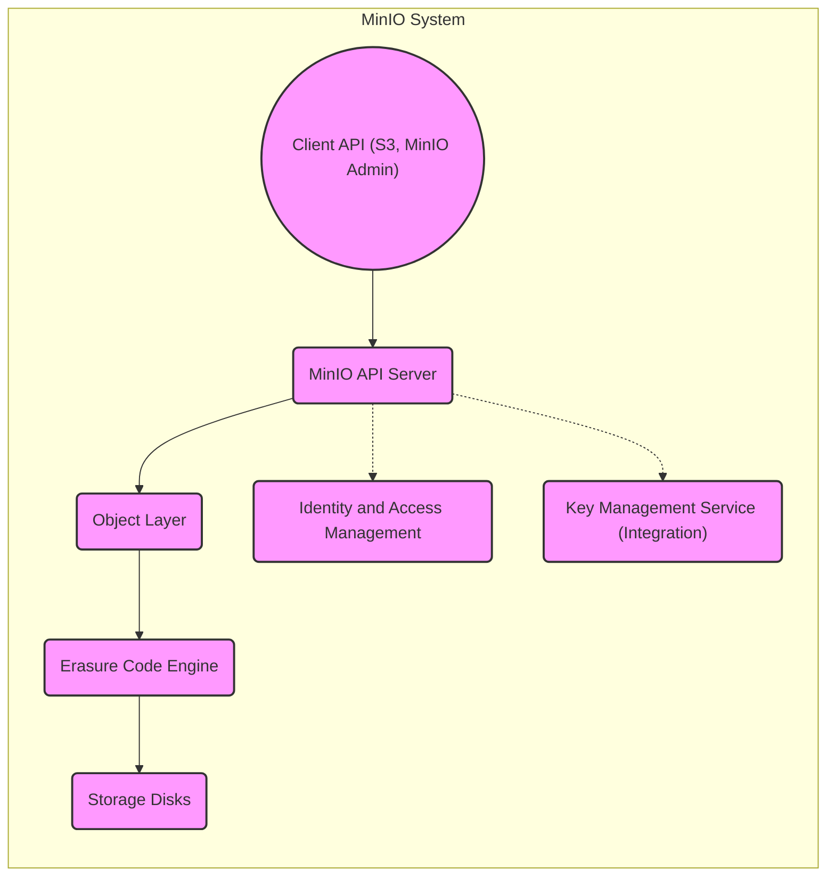
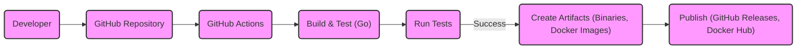

# BUSINESS POSTURE

Business Priorities and Goals:

*   Provide a high-performance, scalable, and S3-compatible object storage solution.
*   Offer a viable open-source alternative to proprietary cloud storage services.
*   Enable self-hosting of object storage, giving users full control over their data.
*   Support a wide range of use cases, from simple file storage to large-scale data lakes.
*   Maintain a vibrant and active open-source community.
*   Ensure data durability and availability.
*   Provide enterprise-grade features and support.

Most Important Business Risks:

*   Data breaches or unauthorized access leading to data loss or exposure.
*   Service downtime or unavailability impacting customer operations.
*   Inability to scale to meet growing customer demands.
*   Competition from established cloud providers and other open-source projects.
*   Reputational damage due to security vulnerabilities or data loss incidents.
*   Failure to comply with relevant data privacy regulations.
*   Supply chain attacks.

# SECURITY POSTURE

Existing Security Controls:

*   security control: Authentication: MinIO supports multiple authentication mechanisms, including AWS Signature Version 4, JWT (JSON Web Token), and LDAP/AD integration. Described in MinIO documentation and source code.
*   security control: Authorization: Access control is managed through policies, similar to AWS IAM, allowing fine-grained control over object and bucket access. Described in MinIO documentation and source code.
*   security control: Encryption: MinIO supports server-side encryption (SSE) with various key management options, including SSE-S3, SSE-C, and SSE-KMS. Data in transit is protected via TLS. Described in MinIO documentation and source code.
*   security control: Data Integrity: MinIO uses erasure coding and bit rot detection to ensure data durability and integrity. Described in MinIO documentation and source code.
*   security control: Auditing: MinIO provides audit logging capabilities to track access and operations. Described in MinIO documentation and source code.
*   security control: Network Security: MinIO can be deployed behind firewalls and configured with network policies to restrict access. Described in MinIO documentation.
*   security control: Regular Security Audits and Penetration Testing: While not explicitly stated in every location, MinIO's commitment to security suggests regular audits and penetration testing.
*   security control: Versioning: MinIO supports object versioning, allowing recovery from accidental deletions or modifications. Described in MinIO documentation and source code.
*   security control: Object Locking: MinIO supports object locking for compliance and data retention purposes. Described in MinIO documentation and source code.

Accepted Risks:

*   accepted risk: The inherent risks associated with self-hosting, such as the responsibility for infrastructure security and maintenance.
*   accepted risk: Potential vulnerabilities in third-party libraries or dependencies.
*   accepted risk: The risk of misconfiguration by users, leading to security vulnerabilities.

Recommended Security Controls:

*   security control: Implement a robust vulnerability management program, including regular scanning and patching of the MinIO deployment and its underlying infrastructure.
*   security control: Enforce strong password policies and multi-factor authentication (MFA) for all users, especially administrative accounts.
*   security control: Implement network segmentation to isolate the MinIO deployment from other systems and networks.
*   security control: Regularly review and update access control policies to ensure least privilege.
*   security control: Enable and monitor security logs, and integrate them with a SIEM (Security Information and Event Management) system.
*   security control: Implement a Web Application Firewall (WAF) to protect against common web attacks.
*   security control: Conduct regular security awareness training for all users and administrators.
*   security control: Implement a robust backup and disaster recovery plan.

Security Requirements:

*   Authentication:
    *   Support for strong authentication mechanisms, including MFA.
    *   Integration with existing identity providers (e.g., LDAP, Active Directory, OIDC).
    *   Secure storage of credentials and secrets.
*   Authorization:
    *   Fine-grained access control based on roles and policies.
    *   Support for least privilege principle.
    *   Regular review and auditing of access permissions.
*   Input Validation:
    *   Validation of all input parameters to prevent injection attacks.
    *   Sanitization of data to prevent cross-site scripting (XSS) vulnerabilities.
*   Cryptography:
    *   Use of strong, industry-standard encryption algorithms.
    *   Secure key management practices.
    *   Protection of data in transit and at rest.
    *   Regular review and update of cryptographic protocols.

# DESIGN

## C4 CONTEXT

```mermaid
graph LR
    subgraph MinIO System
        MinIO("MinIO Object Storage")
    end

    User(("User")) --> MinIO
    S3Client(("S3 Compatible Client")) --> MinIO
    ExistingSystem(("Existing Systems (e.g., LDAP, KMS)")) <..> MinIO

    classDef element fill:#f9f,stroke:#333,stroke-width:2px
    class User,S3Client,ExistingSystem element
```

Element Descriptions:

*   Element:
    *   Name: User
    *   Type: Person
    *   Description: A person interacting with MinIO directly or through applications.
    *   Responsibilities: Accessing and managing data stored in MinIO.
    *   Security controls: Authentication, Authorization, MFA (if enabled).

*   Element:
    *   Name: S3 Compatible Client
    *   Type: Software System
    *   Description: Any application that uses the S3 API to interact with MinIO.
    *   Responsibilities: Sending requests to MinIO to store, retrieve, and manage objects.
    *   Security controls: Authentication (AWS Signature v4), TLS for secure communication.

*   Element:
    *   Name: Existing Systems (e.g., LDAP, KMS)
    *   Type: Software System
    *   Description: External systems that MinIO integrates with for authentication, key management, etc.
    *   Responsibilities: Providing authentication, key management, or other services to MinIO.
    *   Security controls: Depends on the specific system (e.g., LDAP security, KMS security).

*   Element:
    *   Name: MinIO Object Storage
    *   Type: Software System
    *   Description: The MinIO object storage system itself.
    *   Responsibilities: Storing, retrieving, and managing objects; enforcing access control; ensuring data durability.
    *   Security controls: Authentication, Authorization, Encryption, Data Integrity, Auditing, Versioning, Object Locking.

## C4 CONTAINER



Element Descriptions:

*   Element:
    *   Name: Client API (S3, MinIO Admin)
    *   Type: API
    *   Description: The interface through which clients interact with MinIO.
    *   Responsibilities: Handling client requests, performing authentication and authorization checks.
    *   Security controls: Authentication (AWS Signature v4, JWT), TLS.

*   Element:
    *   Name: MinIO API Server
    *   Type: Application Server
    *   Description: The core component of MinIO that processes API requests.
    *   Responsibilities: Routing requests to the appropriate internal components, enforcing access control.
    *   Security controls: Authentication, Authorization, Input Validation.

*   Element:
    *   Name: Object Layer
    *   Type: Component
    *   Description: The component that handles object-level operations.
    *   Responsibilities: Managing object metadata, performing object-level operations (PUT, GET, DELETE).
    *   Security controls: Object Locking, Versioning.

*   Element:
    *   Name: Erasure Code Engine
    *   Type: Component
    *   Description: The component responsible for data durability and integrity.
    *   Responsibilities: Encoding and decoding data using erasure coding, detecting and correcting bit rot.
    *   Security controls: Data Integrity (Erasure Coding, Bit Rot Detection).

*   Element:
    *   Name: Storage Disks
    *   Type: Storage
    *   Description: The physical or virtual disks where data is stored.
    *   Responsibilities: Storing data persistently.
    *   Security controls: Disk Encryption (if enabled).

*   Element:
    *   Name: Identity and Access Management
    *   Type: Component
    *   Description: Manages users, groups, policies, and credentials.
    *   Responsibilities: Authentication and authorization of users and applications.
    *   Security controls: Policy enforcement, credential management.

*   Element:
    *   Name: Key Management Service (Integration)
    *   Type: Component
    *   Description: Integration point with external KMS for encryption key management.
    *   Responsibilities: Securely managing encryption keys.
    *   Security controls: Secure key exchange, key lifecycle management.

## DEPLOYMENT

Possible Deployment Solutions:

1.  Standalone Binary: Single MinIO instance on a single server.
2.  Distributed MinIO: Multiple MinIO instances across multiple servers for high availability and scalability.
3.  Docker Container: MinIO deployed as a Docker container.
4.  Kubernetes: MinIO deployed as a StatefulSet in a Kubernetes cluster.

Chosen Solution (for detailed description): Kubernetes

```mermaid
graph LR
    subgraph Kubernetes Cluster
        subgraph Namespace: minio
            subgraph StatefulSet: minio
                MinIO1("MinIO Pod 1") --> PV1("Persistent Volume 1")
                MinIO2("MinIO Pod 2") --> PV2("Persistent Volume 2")
                MinIO3("MinIO Pod 3") --> PV3("Persistent Volume 3")
                MinIO4("MinIO Pod 4") --> PV4("Persistent Volume 4")
            end
            Service("MinIO Service") --> StatefulSet: minio
        end
        Ingress("Ingress Controller") --> Service
    end
    Client(("Client")) --> Ingress

    classDef element fill:#f9f,stroke:#333,stroke-width:2px
    class Client,Ingress,Service,MinIO1,MinIO2,MinIO3,MinIO4,PV1,PV2,PV3,PV4 element
```

Element Descriptions:

*   Element:
    *   Name: Client
    *   Type: External Entity
    *   Description: An external entity (user or application) accessing MinIO.
    *   Responsibilities: Initiating requests to MinIO.
    *   Security controls: Authentication at the Ingress or MinIO Service level.

*   Element:
    *   Name: Ingress Controller
    *   Type: Kubernetes Ingress
    *   Description: Manages external access to the MinIO service.
    *   Responsibilities: Routing traffic to the MinIO service, potentially handling TLS termination.
    *   Security controls: TLS termination, potentially WAF integration.

*   Element:
    *   Name: MinIO Service
    *   Type: Kubernetes Service
    *   Description: A Kubernetes Service that provides a stable endpoint for accessing the MinIO pods.
    *   Responsibilities: Load balancing traffic across the MinIO pods.
    *   Security controls: Network policies.

*   Element:
    *   Name: MinIO Pod 1/2/3/4
    *   Type: Kubernetes Pod
    *   Description: A pod running a MinIO instance.
    *   Responsibilities: Handling MinIO requests, storing data.
    *   Security controls: All MinIO security controls (Authentication, Authorization, Encryption, etc.).

*   Element:
    *   Name: Persistent Volume 1/2/3/4
    *   Type: Kubernetes Persistent Volume
    *   Description: Persistent storage for each MinIO pod.
    *   Responsibilities: Providing persistent storage for MinIO data.
    *   Security controls: Disk encryption (if enabled at the storage level).

*   Element:
    *   Name: StatefulSet: minio
    *   Type: Kubernetes StatefulSet
    *   Description: Manages the deployment and scaling of the MinIO pods, ensuring ordered and graceful deployment and scaling.
    *   Responsibilities: Maintaining the state and identity of each MinIO pod.
    *   Security controls: None directly, but facilitates the management of stateful applications.

*   Element:
    *   Name: Namespace: minio
    *   Type: Kubernetes Namespace
    *   Description: Provides a logical isolation boundary for the MinIO deployment within the Kubernetes cluster.
    *   Responsibilities: Isolating MinIO resources from other applications in the cluster.
    *   Security controls: Network policies, RBAC.

## BUILD

MinIO's build process is primarily managed through Makefiles and shell scripts, leveraging Go's build system. The process involves compiling the source code, running tests, and creating release artifacts. GitHub Actions are used for Continuous Integration and Continuous Delivery (CI/CD).



Security Controls in Build Process:

*   security control: Code Review: All code changes are reviewed before being merged into the main branch.
*   security control: Static Analysis: Go's built-in tooling and linters (e.g., go vet, golangci-lint) are used to identify potential code quality and security issues.
*   security control: Dependency Management: Go modules are used to manage dependencies, and dependency scanning tools can be integrated into the CI/CD pipeline to identify vulnerabilities in third-party libraries.
*   security control: Automated Testing: Unit tests and integration tests are run as part of the CI/CD pipeline to ensure code quality and prevent regressions.
*   security control: Signed Releases: Release artifacts are likely signed to ensure their integrity and authenticity (though this needs confirmation from MinIO's documentation).
*   security control: Container Image Scanning: If Docker images are built, they should be scanned for vulnerabilities before being published.

# RISK ASSESSMENT

Critical Business Processes to Protect:

*   Data Storage and Retrieval: Ensuring the availability, integrity, and confidentiality of data stored in MinIO.
*   User Authentication and Authorization: Protecting against unauthorized access to data and administrative functions.
*   System Administration: Securely managing and maintaining the MinIO deployment.

Data to Protect and Sensitivity:

*   User Data: This includes any data stored by users in MinIO, which can range from personal files to sensitive business data. Sensitivity varies greatly depending on the user and use case.
*   Metadata: Information about objects, buckets, and users. Sensitivity is moderate, as it can reveal information about the structure and content of user data.
*   Credentials and Secrets: Usernames, passwords, access keys, and encryption keys. Sensitivity is very high.
*   Audit Logs: Records of access and operations performed on MinIO. Sensitivity is moderate to high, as it can contain sensitive information about user activity.
*   Configuration Data: Settings and parameters that control the behavior of MinIO. Sensitivity is moderate, as misconfiguration can lead to security vulnerabilities.

# QUESTIONS & ASSUMPTIONS

Questions:

*   What specific compliance requirements (e.g., GDPR, HIPAA, PCI DSS) must the MinIO deployment adhere to?
*   What is the expected scale of the deployment (number of users, amount of data, request rate)?
*   What are the specific threat models or attack scenarios that are of greatest concern?
*   What is the existing infrastructure and security tooling available?
*   Are there any specific performance or latency requirements?
*   What level of support and maintenance is required?
*   What is the process for handling security incidents and vulnerabilities?
*   Is there a formal process for signing release artifacts?
*   What are the specific procedures for vulnerability scanning of dependencies and container images?

Assumptions:

*   BUSINESS POSTURE: The organization deploying MinIO has a moderate to high risk appetite, as they are choosing to self-host rather than use a managed cloud service. They prioritize data control and cost savings over the convenience of a managed service.
*   SECURITY POSTURE: The organization has a basic understanding of security principles and is willing to invest in security measures. They have some existing security infrastructure, but it may not be fully comprehensive.
*   DESIGN: The deployment will be on Kubernetes. The organization has experience with Kubernetes and containerization. The initial deployment will be relatively small, but with the potential to scale significantly.