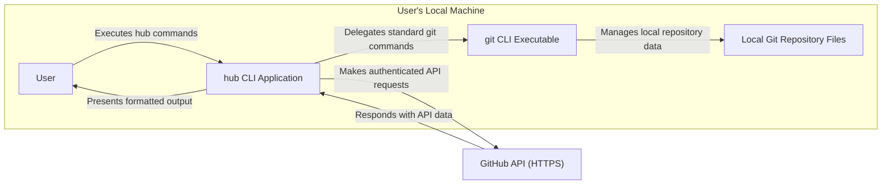
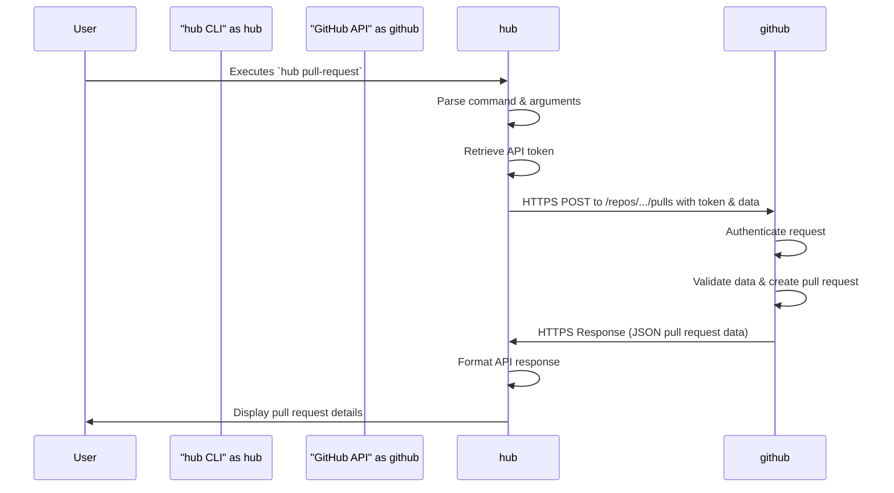

## Project Design Document: hub CLI Tool - Improved

**1. Project Overview**

The `hub` command-line tool enhances the standard `git` experience by providing convenient wrappers and additional functionalities for interacting with GitHub. It streamlines common GitHub workflows directly from the terminal, reducing reliance on the web interface. This document details the design of `hub` to facilitate subsequent threat modeling.

**2. Goals and Objectives**

*   To provide a command-line interface for frequently used GitHub operations.
*   To augment the standard `git` command set with GitHub-specific actions.
*   To simplify interactions with GitHub resources such as repositories, issues, and pull requests.
*   To maintain seamless compatibility with existing `git` workflows and commands.
*   To offer a user-friendly and efficient command-line experience for GitHub users.

**3. Target Audience**

*   Software developers utilizing Git for version control and GitHub for collaborative development.
*   DevOps engineers managing GitHub repositories, workflows, and automation.
*   Technical users who prefer command-line interfaces for interacting with GitHub.

**4. System Architecture**

`hub` operates as a client-side application on the user's machine, interacting with the local Git repository and the remote GitHub API over HTTPS.

**5. Key Components**

*   **Command Parser and Router:**
    *   Receives user input from the command line.
    *   Parses the command and its arguments.
    *   Routes the command to the appropriate internal handler or delegates it to `git`.
*   **Authentication and Authorization Handler:**
    *   Manages user authentication with GitHub, typically using OAuth 2.0 tokens.
    *   Securely retrieves and stores API tokens (e.g., in `~/.config/hub`).
    *   Adds necessary authentication headers to API requests.
*   **GitHub API Client:**
    *   Constructs and sends HTTP requests to specific GitHub API endpoints.
    *   Handles request formatting (e.g., JSON).
    *   Manages API rate limits and error responses.
*   **Git Command Interceptor and Delegator:**
    *   Identifies standard `git` commands within `hub` invocations.
    *   Passes these commands directly to the underlying `git` executable.
    *   May intercept and modify `git` commands to add GitHub-specific functionality.
*   **Output Formatting Engine:**
    *   Processes responses received from the GitHub API.
    *   Formats the data for clear and user-friendly display in the terminal.
    *   Handles different output formats (e.g., plain text, JSON).
*   **Configuration Manager:**
    *   Reads and writes `hub`'s configuration settings.
    *   Manages the storage and retrieval of the GitHub API token and other preferences.
    *   Typically uses a configuration file in the user's home directory.
*   **Error Handling and Logging:**
    *   Manages errors encountered during command execution (e.g., API errors, network issues).
    *   Provides informative error messages to the user.
    *   May include logging capabilities for debugging.

**6. Data Flow (Creating a Pull Request)**

This illustrates the data flow for a common `hub` command interacting with the GitHub API.

1. The user executes the `hub pull-request` command in the terminal.
2. The **Command Parser and Router** identifies the command and its arguments.
3. The **Authentication and Authorization Handler** retrieves the user's GitHub API token from the configuration file.
4. The **GitHub API Client** constructs an HTTPS POST request to the `/repos/{owner}/{repo}/pulls` endpoint.
    *   The request body includes data for the new pull request (title, body, base branch, head branch).
    *   The request headers include the `Authorization: Bearer <token>` header.
5. The request is sent over HTTPS to the **GitHub API**.
6. The **GitHub API** authenticates the request using the provided token.
7. The **GitHub API** validates the request data and creates the pull request.
8. The **GitHub API** sends an HTTPS response back to the `hub` CLI.
    *   The response body contains JSON data representing the newly created pull request.
9. The **Output Formatting Engine** processes the JSON response.
10. The **Output Formatting Engine** formats the pull request details for display in the terminal.
11. The formatted output is displayed to the user.

**7. Security Considerations (For Threat Modeling)**

This section outlines potential security concerns to be addressed during threat modeling.

*   **Authentication and Authorization:**
    *   **Threat:** Compromised API tokens leading to unauthorized access to the user's GitHub account.
    *   **Considerations:** Secure storage of API tokens, token revocation mechanisms, minimizing token scope.
    *   **Threat:**  Insufficient validation of user identity or permissions when interacting with the GitHub API.
    *   **Considerations:** Adherence to GitHub's API security best practices, proper handling of API authentication errors.
*   **Data Security:**
    *   **Threat:** Exposure of sensitive information (API tokens, repository data) during transmission.
    *   **Considerations:** Enforcement of HTTPS for all communication with the GitHub API.
    *   **Threat:**  Accidental logging or storage of sensitive data.
    *   **Considerations:** Careful handling of API responses and user input, avoiding logging of credentials.
*   **Input Validation:**
    *   **Threat:** Command injection vulnerabilities if user input is not properly sanitized before being passed to the underlying `git` command or the shell.
    *   **Considerations:**  Strict validation and sanitization of all user-provided input.
    *   **Threat:**  Exploitation of vulnerabilities in external dependencies.
    *   **Considerations:** Regular updates of dependencies, vulnerability scanning.
*   **Output Handling:**
    *   **Threat:** Displaying malicious content received from the GitHub API that could exploit terminal vulnerabilities.
    *   **Considerations:**  Sanitization of output received from the API before displaying it to the user.
*   **Configuration Security:**
    *   **Threat:**  Unauthorized access to the `hub` configuration file containing the API token.
    *   **Considerations:**  Appropriate file permissions for the configuration file.
*   **Rate Limiting and Abuse:**
    *   **Threat:**  Potential for abuse by making excessive API requests, leading to rate limiting or account suspension.
    *   **Considerations:**  Implementation of rate limiting mechanisms and respectful handling of API rate limit responses.

**8. Deployment Considerations**

*   `hub` is typically deployed as a command-line tool installed directly on the user's operating system.
*   Installation methods include:
    *   Using package managers (e.g., `brew` on macOS, `apt` on Debian/Ubuntu).
    *   Downloading pre-compiled binaries.
    *   Building from source.
*   Configuration usually involves running `hub login` to authenticate with GitHub and store the API token.

**9. Future Considerations**

*   Expanding support for more GitHub API endpoints and functionalities.
*   Improving error handling and providing more detailed error messages.
*   Adding support for different authentication methods.
*   Enhancing the configuration options and management.
*   Exploring potential integrations with other command-line tools or workflows.

This improved design document provides a more detailed and structured overview of the `hub` CLI tool, specifically focusing on aspects relevant to threat modeling. The identified components, data flows, and security considerations offer a solid foundation for analyzing potential vulnerabilities and developing mitigation strategies.