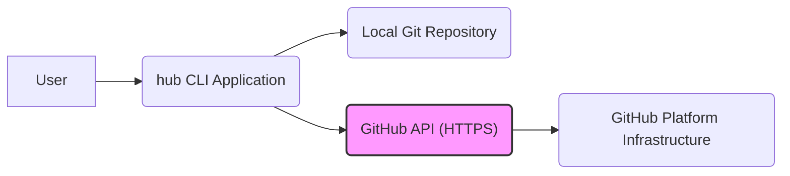

# Project Design Document: hub Command-Line Tool

**Version:** 1.1
**Date:** October 26, 2023
**Author:** AI Software Architect

## 1. Introduction

This document provides a detailed design overview of the `hub` command-line tool, as found in the GitHub repository [https://github.com/mislav/hub](https://github.com/mislav/hub). This document aims to capture the essential architectural elements, components, and data flows of the application to facilitate effective threat modeling.

`hub` is a command-line tool that extends the functionality of the standard `git` command to make interacting with GitHub easier from the terminal. It provides shortcuts and additional commands for common GitHub workflows, streamlining interactions with the GitHub API.

## 2. Goals

*   Provide a user-friendly command-line interface (CLI) for interacting with the GitHub API.
*   Simplify and expedite common GitHub operations such as creating repositories, issuing pull requests, managing issues, and forking repositories.
*   Integrate seamlessly with existing `git` workflows, acting as a wrapper around standard `git` commands.
*   Authenticate with GitHub securely using various methods, including OAuth tokens and personal access tokens.
*   Retrieve and display relevant information from the GitHub API in a clear and concise manner within the terminal.

## 3. Non-Goals

*   Replacing the core functionality of the underlying `git` command-line tool.
*   Providing a graphical user interface (GUI) for interacting with GitHub.
*   Implementing a comprehensive GitHub client covering every single API endpoint offered by GitHub.
*   Directly managing complex Continuous Integration/Continuous Deployment (CI/CD) pipelines, although it may interact with them indirectly through API calls.

## 4. Architecture

`hub` operates as a client-side application executed directly on the user's local machine. It interacts with the GitHub API over secure HTTPS connections. The fundamental architecture can be represented as follows:



**Explanation:**

*   **User:** The individual who interacts with the `hub` tool by entering commands in their terminal.
*   **hub CLI Application:** The `hub` executable binary, responsible for processing user commands, managing configuration, handling authentication, and interacting with the GitHub API.
*   **Local Git Repository:** The Git repository present on the user's local file system where `hub` commands are executed. `hub` often leverages information from the local Git repository context.
*   **GitHub API (HTTPS):** The RESTful Application Programming Interface provided by GitHub. `hub` uses this API to perform actions on GitHub and retrieve data. All communication is encrypted using HTTPS.
*   **GitHub Platform Infrastructure:** The underlying servers, databases, and services that make up the GitHub platform, hosting repositories, issues, pull requests, and other collaborative development data.

## 5. Components

The `hub` application is composed of several distinct functional components:

*   **Command Parser and Router:**
    *   Responsible for receiving and interpreting commands entered by the user in the terminal.
    *   Parses the command and its arguments to determine the intended action.
    *   Routes the execution to the appropriate command handler module.
    *   Handles input validation and error checking for command syntax.
*   **Configuration Management Subsystem:**
    *   Manages the application's configuration settings, including:
        *   GitHub API authentication tokens (OAuth or personal access tokens).
        *   User preferences and default settings.
        *   Aliases for frequently used commands.
    *   Reads configuration data from a local file (typically located in the user's home directory, e.g., `~/.config/hub` or `~/.hub`).
    *   Provides mechanisms for securely storing and retrieving sensitive configuration data.
*   **Authentication and Authorization Handler:**
    *   Manages the process of authenticating with the GitHub API.
    *   Supports various authentication methods as provided by the GitHub API.
    *   Handles the secure storage and retrieval of authentication credentials, potentially using operating system-specific credential storage mechanisms.
    *   Ensures that API requests are authorized correctly using the provided credentials.
*   **GitHub API Client Library:**
    *   Encapsulates the logic for making HTTP requests to the GitHub API endpoints.
    *   Handles tasks such as:
        *   Constructing API request URLs.
        *   Setting appropriate headers (including authentication headers).
        *   Serializing request data (e.g., JSON).
        *   Parsing API responses (typically JSON).
        *   Handling HTTP errors and status codes.
        *   Implementing rate limiting and retry mechanisms to avoid overloading the GitHub API.
*   **Local Git Repository Interaction Layer:**
    *   Provides an interface for interacting with the local Git repository where the `hub` command is executed.
    *   Executes underlying `git` commands as needed to gather information or perform actions related to the repository.
    *   Parses the output of `git` commands to extract relevant data (e.g., repository name, remote URLs, current branch).
*   **Output Formatting and Presentation Engine:**
    *   Responsible for formatting the data retrieved from the GitHub API or local Git repository for display in the terminal.
    *   Presents information in a user-friendly and readable format.
    *   Handles different output formats if supported (e.g., plain text, JSON).
*   **Specific Command Implementation Modules:**
    *   Individual modules that implement the logic for each specific `hub` command (e.g., `hub create`, `hub pull-request`, `hub issue`, `hub fork`).
    *   These modules utilize the other components (API client, configuration manager, Git interaction layer) to perform their designated tasks.

## 6. Data Flow

The following diagram illustrates a typical data flow for a `hub` command that requires interaction with the GitHub API:

```mermaid
graph LR
    A["User Input (Command Line)"] --> B("Command Parser & Router");
    B --> C{ "Authentication Required?" };
    C -- "Yes" --> D["Authentication Handler"];
    D --> E["Configuration Manager (Credential Retrieval)"];
    E --> D;
    D --> F["GitHub API Client (Build & Send Request)"];
    F --> G["GitHub API Endpoint"];
    G --> H["GitHub API Client (Receive & Parse Response)"];
    H --> I["Output Formatting & Presentation"];
    I --> J["User Output (Terminal)"];
    C -- "No" --> K["Local Git Repository Interaction (if applicable)"];
    K --> I;
    style G fill:#ccf,stroke:#333,stroke-width:2px
```

**Detailed Steps:**

1. **User Input (Command Line):** The user enters a `hub` command along with any necessary arguments and options in the terminal.
2. **Command Parser & Router:** The command parser analyzes the input, validates the syntax, and determines which specific command handler module should be invoked.
3. **Authentication Required?:** The system checks if the command being executed requires authentication with the GitHub API to proceed.
4. **Authentication Handler:** If authentication is required, the authentication handler is invoked to retrieve the necessary credentials.
5. **Configuration Manager (Credential Retrieval):** The authentication handler interacts with the configuration manager to securely retrieve the stored authentication token (e.g., OAuth token or personal access token).
6. **GitHub API Client (Build & Send Request):** The API client library constructs an HTTPS request to the appropriate GitHub API endpoint. This includes setting necessary headers, adding authentication information, and serializing any request data.
7. **GitHub API Endpoint:** The request is sent over the network to the relevant GitHub API endpoint.
8. **GitHub API Client (Receive & Parse Response):** The API client receives the response from the GitHub API. It parses the response data (typically JSON) and handles any errors or status codes.
9. **Output Formatting & Presentation:** The output formatting engine takes the data received from the API client (and potentially data from local Git interaction) and formats it for display in the terminal.
10. **User Output (Terminal):** The formatted output is presented to the user in the terminal.
11. **Local Git Repository Interaction (if applicable):** For some commands, `hub` may need to interact with the local Git repository to gather context or perform related actions. This happens before or in parallel with the API interaction in some cases.

## 7. Security Considerations (For Threat Modeling)

The following areas represent key security considerations that should be thoroughly evaluated during threat modeling:

*   **Authentication Credential Management:**
    *   How are user's GitHub authentication tokens (OAuth tokens, personal access tokens) stored locally? Are they encrypted at rest?
    *   What are the access controls on the configuration files where these tokens are stored? Are default permissions secure?
    *   Is there a risk of tokens being exposed through insecure file permissions or other vulnerabilities?
    *   Does the application leverage operating system-specific secure credential storage mechanisms (e.g., macOS Keychain, Windows Credential Manager)?
*   **Secure Communication:**
    *   All communication with the GitHub API *must* occur over HTTPS to ensure confidentiality and integrity of data in transit.
    *   Is the application vulnerable to man-in-the-middle (MITM) attacks if HTTPS is not enforced or if there are issues with certificate validation?
    *   Are there any potential vulnerabilities related to the TLS/SSL configuration used by the underlying HTTP client library?
*   **Input Validation and Sanitization:**
    *   How does `hub` validate user-provided input (command arguments, options) to prevent command injection vulnerabilities?
    *   Are API responses received from GitHub properly validated to prevent unexpected behavior or vulnerabilities due to malicious API responses?
    *   Is there any risk of cross-site scripting (XSS) if `hub` were to display data received from the GitHub API in a web context (unlikely but worth considering)?
*   **Dependency Management and Supply Chain Security:**
    *   Does `hub` rely on any external libraries or dependencies?
    *   Are these dependencies managed securely to prevent the introduction of known vulnerabilities?
    *   Is there a process for regularly updating dependencies to patch security flaws?
    *   Could a compromised dependency introduce malicious code into the `hub` application?
*   **Error Handling and Logging:**
    *   How are errors handled within the application? Does error handling prevent sensitive information from being leaked?
    *   What information is logged by `hub`? Does logging inadvertently expose sensitive data such as API tokens or user information?
    *   Are log files protected with appropriate access controls?
*   **Local File System Interactions:**
    *   Does `hub` write any temporary files or store data in predictable locations on the file system?
    *   Are there any vulnerabilities related to file path manipulation or access control issues when interacting with the local file system?
*   **Authorization and Scope of Access:**
    *   Does `hub` request the minimum necessary permissions (scopes) when authenticating with GitHub?
    *   Could a compromised `hub` application perform actions on GitHub beyond what the user intended due to overly broad permissions?
*   **Code Security Best Practices:**
    *   Are secure coding practices followed throughout the development of `hub` to prevent common vulnerabilities (e.g., buffer overflows, injection flaws)?
    *   Are there mechanisms in place to perform static and dynamic code analysis to identify potential security issues?

## 8. Deployment

`hub` is typically deployed as a standalone executable binary that is installed directly on the user's operating system. Common installation methods include:

*   Downloading pre-compiled binary releases from the GitHub repository or official website.
*   Installation via platform-specific package managers (e.g., `brew` on macOS, `apt` or `yum` on Linux distributions).
*   Compiling the application from source code.

The application executes within the user's shell environment and interacts with the underlying operating system's file system and network stack. The security of the deployment environment (the user's machine) is a factor in the overall security posture of `hub`.

## 9. Future Considerations (Potential Changes Impacting Security)

*   **Introduction of new authentication methods:** Supporting additional authentication flows (e.g., device authorization flow) could introduce new security considerations and potential vulnerabilities if not implemented correctly.
*   **Plugin or extension system:** If `hub` were to introduce a plugin or extension system, ensuring the security and isolation of these extensions would be critical to prevent malicious code from compromising the core application or user credentials.
*   **Enhanced scripting or automation capabilities:** More advanced scripting features or the ability to automate complex workflows could introduce new attack vectors if not carefully designed with security in mind.
*   **Integration with other third-party services:** If `hub` were to integrate with other services beyond GitHub, the security of those integrations and the handling of credentials for those services would need careful consideration.
*   **Changes to GitHub API authentication or authorization mechanisms:**  `hub` would need to adapt to any changes in how GitHub handles authentication and authorization, and these changes could have security implications for the application.

This revised design document provides a more detailed and comprehensive overview of the `hub` command-line tool, with a stronger emphasis on aspects relevant for security threat modeling. The information presented here should enable a more thorough and effective analysis of potential security risks and vulnerabilities.